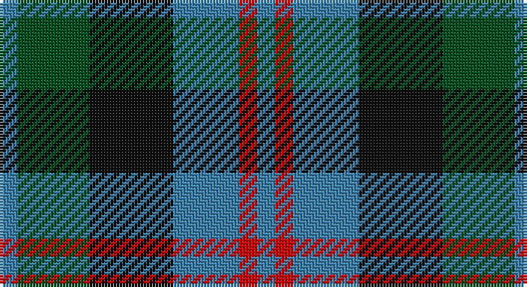

This page is one **sett** — a single exact thread-count. It belongs to the [tartan](/setts/t3dg12k14t11r3t3/)
(the same proportion at any scale), whose colour order is pattern [BGKBRB](/stripes/bgkbrb/).

Part of the [Wellington or Waterloo](/tartans/wellington-or-waterloo/) tartan — the named design grouping this sett with its other cloths.

Sourced from register-of-tartans.  It is a [6 stripe tartan](/stripes/stripes6/).

Original link https://www.tartanregister.gov.uk/tartanDetails.aspx?ref=4590

## Also known as

This cloth is also recorded under:

- Wellington, or Waterloo

## Register references

External register numbers recorded for this tartan.

- Scottish Register of Tartans: [4590](https://www.tartanregister.gov.uk/tartanDetails.aspx?ref=4590)
- Scottish Tartans World Register: 155

## Thread count
B/6 G24 K28 B22 R6 B/6

One full sett is **172 threads**.

## Palette

Palette: <strong>Tartan Register</strong>
<table><thead><tr><th>Colour</th><th>Threads</th><th>Shade</th><th>Base</th><th>OKLCh</th></tr></thead><tbody><tr><td>B/</td><td style="text-align:right;font-variant-numeric:tabular-nums">6</td><td><code style="background-color:#3C82AF;">#3C82AF</code> <small style="color:#888">#3C82AF</small></td><td>B <code style="background-color:#2A418A;">#2A418A</code></td><td><small style="color:#888">oklch(58.1% 0.099 239.8)</small></td></tr><tr><td>G</td><td style="text-align:right;font-variant-numeric:tabular-nums">24</td><td><code style="background-color:#005020;">#005020</code> <small style="color:#888">#005020</small></td><td>G <code style="background-color:#006100;">#006100</code></td><td><small style="color:#888">oklch(37.7% 0.105 149.6)</small></td></tr><tr><td>K</td><td style="text-align:right;font-variant-numeric:tabular-nums">28</td><td><code style="background-color:#101010;">#101010</code> <small style="color:#888">#101010</small></td><td>K <code style="background-color:#000000;">#000000</code></td><td><small style="color:#888">oklch(17.3% 0.000 89.9)</small></td></tr><tr><td>B</td><td style="text-align:right;font-variant-numeric:tabular-nums">22</td><td><code style="background-color:#3C82AF;">#3C82AF</code> <small style="color:#888">#3C82AF</small></td><td>B <code style="background-color:#2A418A;">#2A418A</code></td><td><small style="color:#888">oklch(58.1% 0.099 239.8)</small></td></tr><tr><td>R</td><td style="text-align:right;font-variant-numeric:tabular-nums">6</td><td><code style="background-color:#DC0000;">#DC0000</code> <small style="color:#888">#DC0000</small></td><td>R <code style="background-color:#CC0000;">#CC0000</code></td><td><small style="color:#888">oklch(56.2% 0.230 29.2)</small></td></tr><tr><td>B/</td><td style="text-align:right;font-variant-numeric:tabular-nums">6</td><td><code style="background-color:#3C82AF;">#3C82AF</code> <small style="color:#888">#3C82AF</small></td><td>B <code style="background-color:#2A418A;">#2A418A</code></td><td><small style="color:#888">oklch(58.1% 0.099 239.8)</small></td></tr></tbody></table>

# Sample pattern

## Nearest tartans

The nearest existing variants by ΔTartan distance, with this tartan at the top so the swatches line up against it.

ΔTartan

Tartan

Sett

—

<a href="/ttd/edit/#slug=t3dg12k14t11r3t3~x2">Wellington or Waterloo</a> <a class="nn-out" href="/variants/s6/t3dg12k14t11r3t3~x2/" title="open its dictionary page">↗</a>

0.73

<a href="/ttd/edit/#slug=k2g10t2k9dp8g2~x2&amp;base=t3dg12k14t11r3t3~x2">Lennie Family Tartan</a> <a class="nn-out" href="/variants/s6/k2g10t2k9dp8g2~x2/" title="open its dictionary page">↗</a>

0.75

<a href="/ttd/edit/#slug=y3dg6k6y4r1y1~x2&amp;base=t3dg12k14t11r3t3~x2">Waterloo</a> <a class="nn-out" href="/variants/s6/y3dg6k6y4r1y1~x2/" title="open its dictionary page">↗</a>

0.78

<a href="/ttd/edit/#slug=r4g12k12g2db12g3~x2&amp;base=t3dg12k14t11r3t3~x2">Gunn - 1810 (Clan)</a> <a class="nn-out" href="/variants/s6/r4g12k12g2db12g3~x2/" title="open its dictionary page">↗</a>

0.80

<a href="/ttd/edit/#slug=k3g14k14g2b14r3~x2&amp;base=t3dg12k14t11r3t3~x2">Morrison Society</a> <a class="nn-out" href="/variants/s6/k3g14k14g2b14r3~x2/" title="open its dictionary page">↗</a>

0.83

<a href="/ttd/edit/#slug=b10k3b10k14r2g14r5~x2&amp;base=t3dg12k14t11r3t3~x2">Fletcher of Dunans</a> <a class="nn-out" href="/variants/s7/b10k3b10k14r2g14r5~x2/" title="open its dictionary page">↗</a>

0.94

<a href="/ttd/edit/#slug=w4db4dg22k20db20w3&amp;base=t3dg12k14t11r3t3~x2">Unidentified No 26</a> <a class="nn-out" href="/variants/s6/w4db4dg22k20db20w3/" title="open its dictionary page">↗</a>

0.96

<a href="/ttd/edit/#slug=k4w2g13k13t12k2~x2&amp;base=t3dg12k14t11r3t3~x2">Melville</a> <a class="nn-out" href="/variants/s6/k4w2g13k13t12k2~x2/" title="open its dictionary page">↗</a>

1.02

<a href="/ttd/edit/#slug=g1db6k6g6r1g1~x6&amp;base=t3dg12k14t11r3t3~x2">Callum Beg (Fashion)</a> <a class="nn-out" href="/variants/s6/g1db6k6g6r1g1~x6/" title="open its dictionary page">↗</a>

1.06

<a href="/ttd/edit/#slug=k2ly1dg6k6db6w1~x4&amp;base=t3dg12k14t11r3t3~x2">Dyce #3</a> <a class="nn-out" href="/variants/s6/k2ly1dg6k6db6w1~x4/" title="open its dictionary page">↗</a>

1.08

<a href="/ttd/edit/#slug=db3g12k13w2db13w3~x2&amp;base=t3dg12k14t11r3t3~x2">Herd/Hurd</a> <a class="nn-out" href="/variants/s6/db3g12k13w2db13w3~x2/" title="open its dictionary page">↗</a>

## Neighbour map

Every grey dot is one of 14360 variants placed by the first two principal components of the ΔTartan feature space (44% of its variance). Red is this tartan; blue dots are its nearest — click one to open its page.

<svg viewBox="0 0 640 380" role="img" style="max-width:100%;height:auto;border:1px solid #e0e0e0;border-radius:4px;display:block" xmlns="http://www.w3.org/2000/svg"><image href="/nn/cloud.v1.png" width="640" height="380"/><a href="/variants/s6/k2g10t2k9dp8g2~x2/"><circle cx="165.6" cy="263.1" r="4" fill="#3465a4"><title>Lennie Family Tartan</title></circle></a><a href="/variants/s6/y3dg6k6y4r1y1~x2/"><circle cx="157.3" cy="255.4" r="4" fill="#3465a4"><title>Waterloo</title></circle></a><a href="/variants/s6/r4g12k12g2db12g3~x2/"><circle cx="167.6" cy="264.9" r="4" fill="#3465a4"><title>Gunn - 1810 (Clan)</title></circle></a><a href="/variants/s6/k3g14k14g2b14r3~x2/"><circle cx="163.0" cy="248.5" r="4" fill="#3465a4"><title>Morrison Society</title></circle></a><a href="/variants/s7/b10k3b10k14r2g14r5~x2/"><circle cx="141.7" cy="251.8" r="4" fill="#3465a4"><title>Fletcher of Dunans</title></circle></a><a href="/variants/s6/w4db4dg22k20db20w3/"><circle cx="150.1" cy="240.9" r="4" fill="#3465a4"><title>Unidentified No 26</title></circle></a><a href="/variants/s6/k4w2g13k13t12k2~x2/"><circle cx="166.3" cy="239.3" r="4" fill="#3465a4"><title>Melville</title></circle></a><a href="/variants/s6/g1db6k6g6r1g1~x6/"><circle cx="197.7" cy="261.3" r="4" fill="#3465a4"><title>Callum Beg (Fashion)</title></circle></a><a href="/variants/s6/k2ly1dg6k6db6w1~x4/"><circle cx="135.4" cy="240.4" r="4" fill="#3465a4"><title>Dyce #3</title></circle></a><a href="/variants/s6/db3g12k13w2db13w3~x2/"><circle cx="126.2" cy="237.8" r="4" fill="#3465a4"><title>Herd/Hurd</title></circle></a><circle cx="149.5" cy="265.5" r="5" fill="#c00000"/></svg>

ID: /variants/s6/t3dg12k14t11r3t3~x2/
