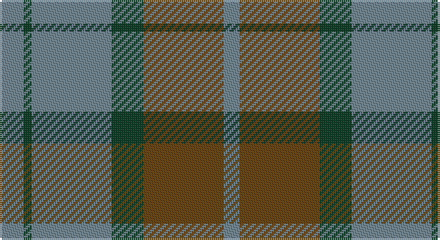

This page is one **sett** — a single exact thread-count. It belongs to the [tartan](/setts/t3dg1t10dg4dy10t2/)
(the same proportion at any scale), whose colour order is pattern [BGBGGB](/stripes/bgbggb/).

Part of the [Rob Roy](/tartans/rob-roy/) tartan — the named design grouping this sett with its other cloths.

Sourced from tartans-authority.  It is a [6 stripe tartan](/stripes/stripes6/).

Original link http://www.tartansauthority.com/tartan-ferret/display/7026/

## Register references

External register numbers recorded for this tartan.

- Scottish Tartans Authority (ITI): 7026

## Thread count
LG/12 DG4 LG40 DG16 T40 LG/8

One full sett is **220 threads**.

## Palette

Palette: <strong>Tartan Register</strong> <small style="color:#888">(2 of 3 colours)</small>
<table><thead><tr><th>Colour</th><th>Threads</th><th>Shade</th><th>Base</th><th>OKLCh</th></tr></thead><tbody><tr><td>LG/</td><td style="text-align:right;font-variant-numeric:tabular-nums">12</td><td><code style="background-color:#708490;">#708490</code> <small style="color:#888">#708490</small></td><td>B <code style="background-color:#2A418A;">#2A418A</code></td><td><small style="color:#888">oklch(60.2% 0.030 234.3)</small></td></tr><tr><td>DG</td><td style="text-align:right;font-variant-numeric:tabular-nums">4</td><td><code style="background-color:#003820;">#003820</code> <small style="color:#888">#003820</small></td><td>G <code style="background-color:#006100;">#006100</code></td><td><small style="color:#888">oklch(30.0% 0.070 158.3)</small></td></tr><tr><td>LG</td><td style="text-align:right;font-variant-numeric:tabular-nums">40</td><td><code style="background-color:#708490;">#708490</code> <small style="color:#888">#708490</small></td><td>B <code style="background-color:#2A418A;">#2A418A</code></td><td><small style="color:#888">oklch(60.2% 0.030 234.3)</small></td></tr><tr><td>DG</td><td style="text-align:right;font-variant-numeric:tabular-nums">16</td><td><code style="background-color:#003820;">#003820</code> <small style="color:#888">#003820</small></td><td>G <code style="background-color:#006100;">#006100</code></td><td><small style="color:#888">oklch(30.0% 0.070 158.3)</small></td></tr><tr><td>T</td><td style="text-align:right;font-variant-numeric:tabular-nums">40</td><td><code style="background-color:#604000;">#604000</code> <small style="color:#888">#604000</small></td><td>G <code style="background-color:#006100;">#006100</code></td><td><small style="color:#888">oklch(39.8% 0.083 76.8)</small></td></tr><tr><td>LG/</td><td style="text-align:right;font-variant-numeric:tabular-nums">8</td><td><code style="background-color:#708490;">#708490</code> <small style="color:#888">#708490</small></td><td>B <code style="background-color:#2A418A;">#2A418A</code></td><td><small style="color:#888">oklch(60.2% 0.030 234.3)</small></td></tr></tbody></table>

# Sample pattern

## Compared to the master

This cloth is one sett of its design; the master sett (the exemplar the design is anchored on) is below for comparison.

<figure style="margin:0"><figcaption style="color:#888;font-size:smaller">this sett</figcaption></figure>
<figure style="margin:0"><figcaption style="color:#888;font-size:smaller"><a href="/setts/t3dg1t10dg4r10t2/">master sett →</a></figcaption></figure>

## Nearest tartans

The nearest existing variants by ΔTartan distance, with this tartan at the top so the swatches line up against it.

ΔTartan

Tartan

Sett

—

<a href="/ttd/edit/#slug=t3dg1t10dg4dy10t2~x4">Rob Roy (Film) (Corporate)</a> <a class="nn-out" href="/variants/s6/t3dg1t10dg4dy10t2~x4/" title="open its dictionary page">↗</a>

1.15

<a href="/ttd/edit/#slug=dg25r4db24r21dg25r3db4~x2&amp;base=t3dg1t10dg4dy10t2~x4">Glasgow #2</a> <a class="nn-out" href="/variants/s7/dg25r4db24r21dg25r3db4~x2/" title="open its dictionary page">↗</a>

1.18

<a href="/ttd/edit/#slug=g25m4db24m21g25m4db2~x2&amp;base=t3dg1t10dg4dy10t2~x4">Glasgow, Rock and Wheel</a> <a class="nn-out" href="/variants/s7/g25m4db24m21g25m4db2~x2/" title="open its dictionary page">↗</a>

1.24

<a href="/ttd/edit/#slug=db5o15dy4o4dy24o4dy4db5&amp;base=t3dg1t10dg4dy10t2~x4">Daks-Simpson (Muted Skye)</a> <a class="nn-out" href="/variants/s8/db5o15dy4o4dy24o4dy4db5/" title="open its dictionary page">↗</a>

1.32

<a href="/ttd/edit/#slug=db3o10g9r1g3~x4&amp;base=t3dg1t10dg4dy10t2~x4">Bethlehem, City of (District)</a> <a class="nn-out" href="/variants/s5/db3o10g9r1g3~x4/" title="open its dictionary page">↗</a>

1.37

<a href="/ttd/edit/#slug=t3dg1t10dg4r10t2~x4&amp;base=t3dg1t10dg4dy10t2~x4">Rob Roy (Film)</a> <a class="nn-out" href="/variants/s6/t3dg1t10dg4r10t2~x4/" title="open its dictionary page">↗</a>

1.41

<a href="/ttd/edit/#slug=dy8o29dy8ly3dy8o8ly3~x2&amp;base=t3dg1t10dg4dy10t2~x4">Lister (Name)</a> <a class="nn-out" href="/variants/s7/dy8o29dy8ly3dy8o8ly3~x2/" title="open its dictionary page">↗</a>

1.44

<a href="/ttd/edit/#slug=dt30r5g30r22dt30r5g4&amp;base=t3dg1t10dg4dy10t2~x4">GS Gaelic School (School)</a> <a class="nn-out" href="/variants/s7/dt30r5g30r22dt30r5g4/" title="open its dictionary page">↗</a>

1.44

<a href="/ttd/edit/#slug=lo6n2lo2n2lo18n13dt13n2~x2&amp;base=t3dg1t10dg4dy10t2~x4">Heil, Rudiger (Personal)</a> <a class="nn-out" href="/variants/s8/lo6n2lo2n2lo18n13dt13n2~x2/" title="open its dictionary page">↗</a>

1.45

<a href="/ttd/edit/#slug=dt6r15g41r15dt20g41db6&amp;base=t3dg1t10dg4dy10t2~x4">Bean of Freeport Htg (Corporate)</a> <a class="nn-out" href="/variants/s7/dt6r15g41r15dt20g41db6/" title="open its dictionary page">↗</a>

1.47

<a href="/variants/s4/g13r2t13~x2/">Wilson's No.161</a>

## Neighbour map

Every grey dot is one of 14360 variants placed by the first two principal components of the ΔTartan feature space (44% of its variance). Red is this tartan; blue dots are its nearest — click one to open its page.

<svg viewBox="0 0 640 380" role="img" style="max-width:100%;height:auto;border:1px solid #e0e0e0;border-radius:4px;display:block" xmlns="http://www.w3.org/2000/svg"><image href="/nn/cloud.v1.png" width="640" height="380"/><a href="/variants/s7/dg25r4db24r21dg25r3db4~x2/"><circle cx="281.5" cy="262.5" r="4" fill="#3465a4"><title>Glasgow #2</title></circle></a><a href="/variants/s7/g25m4db24m21g25m4db2~x2/"><circle cx="291.1" cy="245.9" r="4" fill="#3465a4"><title>Glasgow, Rock and Wheel</title></circle></a><a href="/variants/s8/db5o15dy4o4dy24o4dy4db5/"><circle cx="315.2" cy="254.7" r="4" fill="#3465a4"><title>Daks-Simpson (Muted Skye)</title></circle></a><a href="/variants/s5/db3o10g9r1g3~x4/"><circle cx="279.3" cy="256.1" r="4" fill="#3465a4"><title>Bethlehem, City of (District)</title></circle></a><a href="/variants/s6/t3dg1t10dg4r10t2~x4/"><circle cx="313.9" cy="247.8" r="4" fill="#3465a4"><title>Rob Roy (Film)</title></circle></a><a href="/variants/s7/dy8o29dy8ly3dy8o8ly3~x2/"><circle cx="361.3" cy="234.3" r="4" fill="#3465a4"><title>Lister (Name)</title></circle></a><a href="/variants/s7/dt30r5g30r22dt30r5g4/"><circle cx="270.0" cy="262.9" r="4" fill="#3465a4"><title>GS Gaelic School (School)</title></circle></a><a href="/variants/s8/lo6n2lo2n2lo18n13dt13n2~x2/"><circle cx="279.0" cy="228.3" r="4" fill="#3465a4"><title>Heil, Rudiger (Personal)</title></circle></a><a href="/variants/s7/dt6r15g41r15dt20g41db6/"><circle cx="304.7" cy="259.1" r="4" fill="#3465a4"><title>Bean of Freeport Htg (Corporate)</title></circle></a><a href="/variants/s4/g13r2t13~x2/"><circle cx="289.5" cy="291.6" r="4" fill="#3465a4"><title>Wilson's No.161</title></circle></a><circle cx="334.1" cy="266.3" r="5" fill="#c00000"/></svg>

ID: /variants/s6/t3dg1t10dg4dy10t2~x4/
