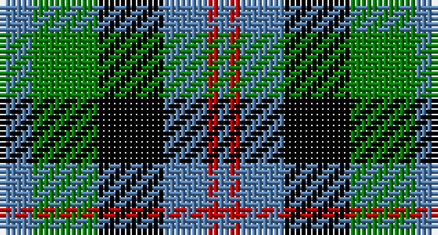

This page is one **sett** — a single exact thread-count. It belongs to the [tartan](/setts/t3g6k6t4r1t1/)
(the same proportion at any scale), whose colour order is pattern [BGKBRB](/stripes/bgkbrb/).

Sourced from weddslist.  It is a [6 stripe tartan](/stripes/stripes6/).

Original link http://www.weddslist.com/cgi-bin/tartans/pg.pl?source=sts

## Provenance

Earliest known date: pre 2003 Name derived from Wilson letters 1821 and 1824

## Also known as

This cloth is also recorded under:

- Wellington, or Waterloo

2 attestations — the source records this cloth was collapsed from (oldest owns this page)

<ul>
<li>undated — Wellington, or Waterloo (weddslist, <a href="http://www.weddslist.com/cgi-bin/tartans/pg.pl?source=sts">record</a>)</li>
<li>undated — Wellington or Waterloo Commemorative Tartan (house-of-tartan, <a href="http://www.house-of-tartan.scotland.net/house/TartanViewjs.asp?colr=Def&tnam=154">record</a>)</li>
</ul>

## Thread count
B/6 G12 K12 B8 R2 B/2

One full sett is **76 threads**.

## Palette

Palette: <strong>Ingles Buchan</strong> <small style="color:#888">(1 of 4 colours)</small>
<table><thead><tr><th>Colour</th><th>Threads</th><th>Shade</th><th>Base</th><th>OKLCh</th></tr></thead><tbody><tr><td>B/</td><td style="text-align:right;font-variant-numeric:tabular-nums">6</td><td><code style="background-color:#5480B0;">#5480B0</code> <small style="color:#888">#5480B0</small></td><td>B <code style="background-color:#2A418A;">#2A418A</code></td><td><small style="color:#888">oklch(58.8% 0.089 251.5)</small></td></tr><tr><td>G</td><td style="text-align:right;font-variant-numeric:tabular-nums">12</td><td><code style="background-color:#008000;">#008000</code> <small style="color:#888">#008000</small></td><td>G <code style="background-color:#006100;">#006100</code></td><td><small style="color:#888">oklch(52.0% 0.177 142.5)</small></td></tr><tr><td>K</td><td style="text-align:right;font-variant-numeric:tabular-nums">12</td><td><code style="background-color:#000000;">#000000</code> <small style="color:#888">#000000</small></td><td>K <code style="background-color:#000000;">#000000</code></td><td><small style="color:#888">oklch(0.0% 0.000 0.0)</small></td></tr><tr><td>B</td><td style="text-align:right;font-variant-numeric:tabular-nums">8</td><td><code style="background-color:#5480B0;">#5480B0</code> <small style="color:#888">#5480B0</small></td><td>B <code style="background-color:#2A418A;">#2A418A</code></td><td><small style="color:#888">oklch(58.8% 0.089 251.5)</small></td></tr><tr><td>R</td><td style="text-align:right;font-variant-numeric:tabular-nums">2</td><td><code style="background-color:#C00000;">#C00000</code> <small style="color:#888">#C00000</small></td><td>R <code style="background-color:#CC0000;">#CC0000</code></td><td><small style="color:#888">oklch(50.7% 0.208 29.2)</small></td></tr><tr><td>B/</td><td style="text-align:right;font-variant-numeric:tabular-nums">2</td><td><code style="background-color:#5480B0;">#5480B0</code> <small style="color:#888">#5480B0</small></td><td>B <code style="background-color:#2A418A;">#2A418A</code></td><td><small style="color:#888">oklch(58.8% 0.089 251.5)</small></td></tr></tbody></table>

# Sample pattern

## Nearest tartans

The nearest existing variants by ΔTartan distance, with this tartan at the top so the swatches line up against it.

ΔTartan

Tartan

Sett

—

<a href="/ttd/edit/#slug=t3g6k6t4r1t1~x2">Wellington, or Waterloo</a> <a class="nn-out" href="/variants/s6/t3g6k6t4r1t1~x2/" title="open its dictionary page">↗</a>

0.46

<a href="/ttd/edit/#slug=t3g12k14t11r3t3~x2&amp;base=t3g6k6t4r1t1~x2">Wellington, or Waterloo</a> <a class="nn-out" href="/variants/s6/t3g12k14t11r3t3~x2/" title="open its dictionary page">↗</a>

0.74

<a href="/ttd/edit/#slug=k4w2g13k13t12k2~x2&amp;base=t3g6k6t4r1t1~x2">Melville</a> <a class="nn-out" href="/variants/s6/k4w2g13k13t12k2~x2/" title="open its dictionary page">↗</a>

0.78

<a href="/ttd/edit/#slug=b10k3b10k14r2g14k4~x2&amp;base=t3g6k6t4r1t1~x2">Fletcher #2</a> <a class="nn-out" href="/variants/s7/b10k3b10k14r2g14k4~x2/" title="open its dictionary page">↗</a>

0.79

<a href="/ttd/edit/#slug=w4db4g22k20db20w3&amp;base=t3g6k6t4r1t1~x2">Unnamed, No 26</a> <a class="nn-out" href="/variants/s6/w4db4g22k20db20w3/" title="open its dictionary page">↗</a>

0.83

<a href="/ttd/edit/#slug=k2g13k11t4w9k2~x2&amp;base=t3g6k6t4r1t1~x2">Loch Leven, Check</a> <a class="nn-out" href="/variants/s6/k2g13k11t4w9k2~x2/" title="open its dictionary page">↗</a>

0.84

<a href="/ttd/edit/#slug=db2k2db12k11g12w2~x2&amp;base=t3g6k6t4r1t1~x2">Campbell, The White Stripe</a> <a class="nn-out" href="/variants/s6/db2k2db12k11g12w2~x2/" title="open its dictionary page">↗</a>

0.84

<a href="/ttd/edit/#slug=g1db5g1k5g6ly1~x2&amp;base=t3g6k6t4r1t1~x2">MacKay</a> <a class="nn-out" href="/variants/s6/g1db5g1k5g6ly1~x2/" title="open its dictionary page">↗</a>

0.86

<a href="/ttd/edit/#slug=db2k2db12k8g11r2~x2&amp;base=t3g6k6t4r1t1~x2">Murray</a> <a class="nn-out" href="/variants/s6/db2k2db12k8g11r2~x2/" title="open its dictionary page">↗</a>

0.89

<a href="/ttd/edit/#slug=db8g8db1g8k8db8ly2~x2&amp;base=t3g6k6t4r1t1~x2">MacKay</a> <a class="nn-out" href="/variants/s7/db8g8db1g8k8db8ly2~x2/" title="open its dictionary page">↗</a>

0.90

<a href="/ttd/edit/#slug=db4g6w1g6k6db6k2~x4&amp;base=t3g6k6t4r1t1~x2">MacNeil of Colonsay</a> <a class="nn-out" href="/variants/s7/db4g6w1g6k6db6k2~x4/" title="open its dictionary page">↗</a>

## Neighbour map

Every grey dot is one of 14360 variants placed by the first two principal components of the ΔTartan feature space (44% of its variance). Red is this tartan; blue dots are its nearest — click one to open its page.

<svg viewBox="0 0 640 380" role="img" style="max-width:100%;height:auto;border:1px solid #e0e0e0;border-radius:4px;display:block" xmlns="http://www.w3.org/2000/svg"><image href="/nn/cloud.v1.png" width="640" height="380"/><a href="/variants/s6/t3g12k14t11r3t3~x2/"><circle cx="115.5" cy="249.6" r="4" fill="#3465a4"><title>Wellington, or Waterloo</title></circle></a><a href="/variants/s6/k4w2g13k13t12k2~x2/"><circle cx="166.3" cy="239.3" r="4" fill="#3465a4"><title>Melville</title></circle></a><a href="/variants/s7/b10k3b10k14r2g14k4~x2/"><circle cx="131.7" cy="239.8" r="4" fill="#3465a4"><title>Fletcher #2</title></circle></a><a href="/variants/s6/w4db4g22k20db20w3/"><circle cx="118.1" cy="225.8" r="4" fill="#3465a4"><title>Unnamed, No 26</title></circle></a><a href="/variants/s6/k2g13k11t4w9k2~x2/"><circle cx="112.8" cy="229.2" r="4" fill="#3465a4"><title>Loch Leven, Check</title></circle></a><a href="/variants/s6/db2k2db12k11g12w2~x2/"><circle cx="129.6" cy="237.4" r="4" fill="#3465a4"><title>Campbell, The White Stripe</title></circle></a><a href="/variants/s6/g1db5g1k5g6ly1~x2/"><circle cx="156.9" cy="239.0" r="4" fill="#3465a4"><title>MacKay</title></circle></a><a href="/variants/s6/db2k2db12k8g11r2~x2/"><circle cx="152.3" cy="241.4" r="4" fill="#3465a4"><title>Murray</title></circle></a><a href="/variants/s7/db8g8db1g8k8db8ly2~x2/"><circle cx="145.0" cy="249.4" r="4" fill="#3465a4"><title>MacKay</title></circle></a><a href="/variants/s7/db4g6w1g6k6db6k2~x4/"><circle cx="119.8" cy="262.7" r="4" fill="#3465a4"><title>MacNeil of Colonsay</title></circle></a><circle cx="128.4" cy="245.2" r="5" fill="#c00000"/></svg>

ID: /variants/s6/t3g6k6t4r1t1~x2/
