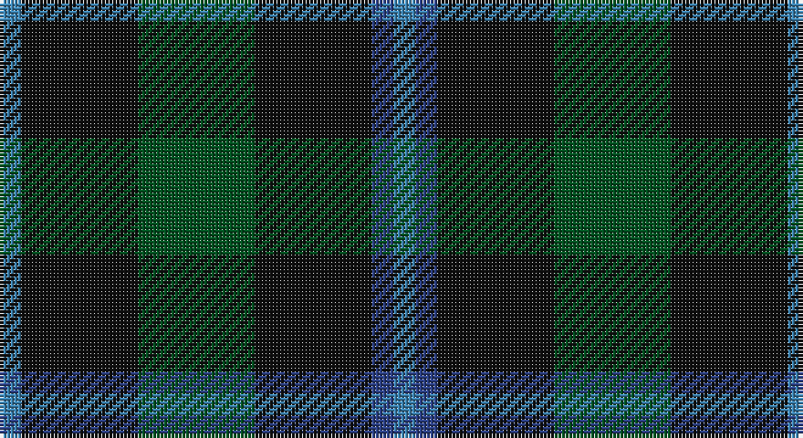

This page is one **sett** — a single exact thread-count. It belongs to the [tartan](/setts/t3k16dg16k16db3t3/)
(the same proportion at any scale), whose colour order is pattern [BBKGKB](/stripes/bbkgkb/).

Part of the [Murray](/tartans/murray/) tartan — the named design grouping this sett with its other cloths.

Sourced from register-of-tartans.  It is a [6 stripe tartan](/stripes/stripes6/).

Original link https://www.tartanregister.gov.uk/tartanDetails.aspx?ref=3056

## Also known as

This cloth is also recorded under:

- Murray #2
- Murray #3
- NSW Scottish Rifles
- New South Wales Scottish Rifle Regimental
- New South Wales Scottish Rifles
- New South Wales, Scottish Rifles

## Register references

External register numbers recorded for this tartan.

- Scottish Register of Tartans: [3056](https://www.tartanregister.gov.uk/tartanDetails.aspx?ref=3056)
- Scottish Tartans World Register: 52

## Thread count
B/6 K32 G32 K32 Ba6 B/6

One full sett is **216 threads**.

## Palette

Palette: <strong>Tartan Register</strong>
<table><thead><tr><th>Colour</th><th>Threads</th><th>Shade</th><th>Base</th><th>OKLCh</th></tr></thead><tbody><tr><td>B/</td><td style="text-align:right;font-variant-numeric:tabular-nums">6</td><td><code style="background-color:#3C82AF;">#3C82AF</code> <small style="color:#888">#3C82AF</small></td><td>B <code style="background-color:#2A418A;">#2A418A</code></td><td><small style="color:#888">oklch(58.1% 0.099 239.8)</small></td></tr><tr><td>K</td><td style="text-align:right;font-variant-numeric:tabular-nums">32</td><td><code style="background-color:#101010;">#101010</code> <small style="color:#888">#101010</small></td><td>K <code style="background-color:#000000;">#000000</code></td><td><small style="color:#888">oklch(17.3% 0.000 89.9)</small></td></tr><tr><td>G</td><td style="text-align:right;font-variant-numeric:tabular-nums">32</td><td><code style="background-color:#005020;">#005020</code> <small style="color:#888">#005020</small></td><td>G <code style="background-color:#006100;">#006100</code></td><td><small style="color:#888">oklch(37.7% 0.105 149.6)</small></td></tr><tr><td>K</td><td style="text-align:right;font-variant-numeric:tabular-nums">32</td><td><code style="background-color:#101010;">#101010</code> <small style="color:#888">#101010</small></td><td>K <code style="background-color:#000000;">#000000</code></td><td><small style="color:#888">oklch(17.3% 0.000 89.9)</small></td></tr><tr><td>Ba</td><td style="text-align:right;font-variant-numeric:tabular-nums">6</td><td><code style="background-color:#2C4084;">#2C4084</code> <small style="color:#888">#2C4084</small></td><td>B <code style="background-color:#2A418A;">#2A418A</code></td><td><small style="color:#888">oklch(39.4% 0.117 268.3)</small></td></tr><tr><td>B/</td><td style="text-align:right;font-variant-numeric:tabular-nums">6</td><td><code style="background-color:#3C82AF;">#3C82AF</code> <small style="color:#888">#3C82AF</small></td><td>B <code style="background-color:#2A418A;">#2A418A</code></td><td><small style="color:#888">oklch(58.1% 0.099 239.8)</small></td></tr></tbody></table>

# Sample pattern

## Compared to the master

This cloth is one sett of its design; the master sett (the exemplar the design is anchored on) is below for comparison.

<figure style="margin:0"><figcaption style="color:#888;font-size:smaller">this sett</figcaption></figure>
<figure style="margin:0"><figcaption style="color:#888;font-size:smaller"><a href="/setts/db6k1db1k1db1k6g6r2g6k6db6k1db2/">master sett →</a></figcaption></figure>

## Nearest tartans

The nearest existing variants by ΔTartan distance, with this tartan at the top so the swatches line up against it.

ΔTartan

Tartan

Sett

—

<a href="/ttd/edit/#slug=t3k16dg16k16db3t3~x2">Murray</a> <a class="nn-out" href="/variants/s6/t3k16dg16k16db3t3~x2/" title="open its dictionary page">↗</a>

1.00

<a href="/ttd/edit/#slug=dg8r2dg2r3dg8db12dg2lo2~x2&amp;base=t3k16dg16k16db3t3~x2">Glen Nevis #1</a> <a class="nn-out" href="/variants/s8/dg8r2dg2r3dg8db12dg2lo2~x2/" title="open its dictionary page">↗</a>

1.05

<a href="/ttd/edit/#slug=dt6r15dg41r15dt20dg41db6&amp;base=t3k16dg16k16db3t3~x2">Bean of Freeport (Personal)</a> <a class="nn-out" href="/variants/s7/dt6r15dg41r15dt20dg41db6/" title="open its dictionary page">↗</a>

1.06

<a href="/ttd/edit/#slug=r3dg10r3dg14db16dg3ly2~x2&amp;base=t3k16dg16k16db3t3~x2">Cameron Hunting</a> <a class="nn-out" href="/variants/s7/r3dg10r3dg14db16dg3ly2~x2/" title="open its dictionary page">↗</a>

1.09

<a href="/ttd/edit/#slug=db6r15dg41r15db20dg41dbi6&amp;base=t3k16dg16k16db3t3~x2">Bean Hunting Clan Tartan</a> <a class="nn-out" href="/variants/s7/db6r15dg41r15db20dg41dbi6/" title="open its dictionary page">↗</a>

1.13

<a href="/ttd/edit/#slug=dg2n8dg2k3dg12r2~x2&amp;base=t3k16dg16k16db3t3~x2">Wcwm 1045</a> <a class="nn-out" href="/variants/s6/dg2n8dg2k3dg12r2~x2/" title="open its dictionary page">↗</a>

1.18

<a href="/ttd/edit/#slug=dg8r2dg2r3dg8db12dg2ly2~x2&amp;base=t3k16dg16k16db3t3~x2">Glen Nevis #1 (Fashion)</a> <a class="nn-out" href="/variants/s8/dg8r2dg2r3dg8db12dg2ly2~x2/" title="open its dictionary page">↗</a>

1.18

<a href="/ttd/edit/#slug=k4dg21lr3dg21db21r4~x2&amp;base=t3k16dg16k16db3t3~x2">Duncan</a> <a class="nn-out" href="/variants/s6/k4dg21lr3dg21db21r4~x2/" title="open its dictionary page">↗</a>

1.18

<a href="/ttd/edit/#slug=k4dg21lr3dg21db21r4&amp;base=t3k16dg16k16db3t3~x2">Duncan</a> <a class="nn-out" href="/variants/s6/k4dg21lr3dg21db21r4/" title="open its dictionary page">↗</a>

1.25

<a href="/ttd/edit/#slug=db5dg8k1ly2k1dg8db4~x4&amp;base=t3k16dg16k16db3t3~x2">Salvation Army Htg (Corporate)</a> <a class="nn-out" href="/variants/s7/db5dg8k1ly2k1dg8db4~x4/" title="open its dictionary page">↗</a>

1.37

<a href="/ttd/edit/#slug=dg15r3db11t2~x2&amp;base=t3k16dg16k16db3t3~x2">MacNab</a> <a class="nn-out" href="/variants/s4/dg15r3db11t2~x2/" title="open its dictionary page">↗</a>

## Neighbour map

Every grey dot is one of 14360 variants placed by the first two principal components of the ΔTartan feature space (44% of its variance). Red is this tartan; blue dots are its nearest — click one to open its page.

<svg viewBox="0 0 640 380" role="img" style="max-width:100%;height:auto;border:1px solid #e0e0e0;border-radius:4px;display:block" xmlns="http://www.w3.org/2000/svg"><image href="/nn/cloud.v1.png" width="640" height="380"/><a href="/variants/s8/dg8r2dg2r3dg8db12dg2lo2~x2/"><circle cx="276.0" cy="256.3" r="4" fill="#3465a4"><title>Glen Nevis #1</title></circle></a><a href="/variants/s7/dt6r15dg41r15dt20dg41db6/"><circle cx="311.0" cy="263.3" r="4" fill="#3465a4"><title>Bean of Freeport (Personal)</title></circle></a><a href="/variants/s7/r3dg10r3dg14db16dg3ly2~x2/"><circle cx="285.2" cy="242.4" r="4" fill="#3465a4"><title>Cameron Hunting</title></circle></a><a href="/variants/s7/db6r15dg41r15db20dg41dbi6/"><circle cx="306.2" cy="259.4" r="4" fill="#3465a4"><title>Bean Hunting Clan Tartan</title></circle></a><a href="/variants/s6/dg2n8dg2k3dg12r2~x2/"><circle cx="294.2" cy="260.3" r="4" fill="#3465a4"><title>Wcwm 1045</title></circle></a><a href="/variants/s8/dg8r2dg2r3dg8db12dg2ly2~x2/"><circle cx="263.8" cy="247.2" r="4" fill="#3465a4"><title>Glen Nevis #1 (Fashion)</title></circle></a><a href="/variants/s6/k4dg21lr3dg21db21r4~x2/"><circle cx="277.8" cy="245.7" r="4" fill="#3465a4"><title>Duncan</title></circle></a><a href="/variants/s6/k4dg21lr3dg21db21r4/"><circle cx="277.8" cy="245.7" r="4" fill="#3465a4"><title>Duncan</title></circle></a><a href="/variants/s7/db5dg8k1ly2k1dg8db4~x4/"><circle cx="295.3" cy="252.9" r="4" fill="#3465a4"><title>Salvation Army Htg (Corporate)</title></circle></a><a href="/variants/s4/dg15r3db11t2~x2/"><circle cx="282.6" cy="278.9" r="4" fill="#3465a4"><title>MacNab</title></circle></a><circle cx="300.9" cy="282.5" r="5" fill="#c00000"/></svg>

ID: /variants/s6/t3k16dg16k16db3t3~x2/
