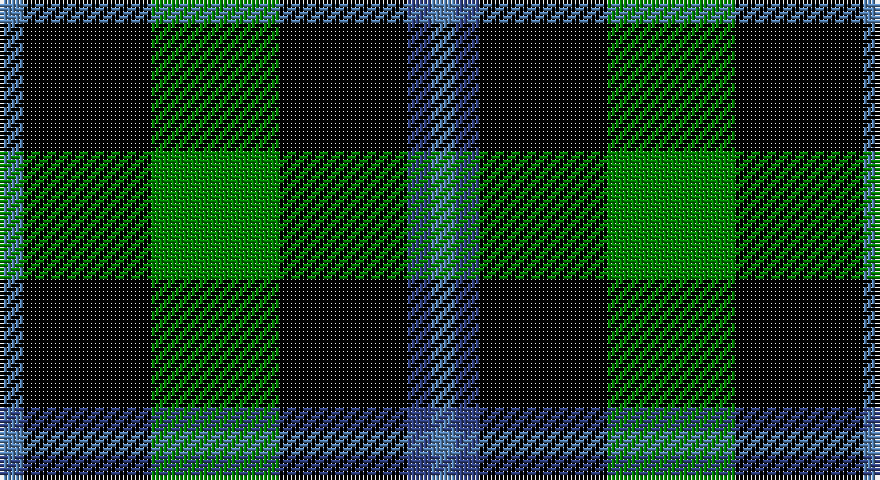

This page is one **sett** — a single exact thread-count. It belongs to the [tartan](/setts/t3k16g16k16db3t3/)
(the same proportion at any scale), whose colour order is pattern [BBKGKB](/stripes/bbkgkb/).

Part of the [Murray](/tartans/murray/) tartan — the named design grouping this sett with its other cloths.

Sourced from weddslist.  It is a [6 stripe tartan](/stripes/stripes6/).

Original link http://www.weddslist.com/cgi-bin/tartans/pg.pl?source=sts

## Also known as

This cloth is also recorded under:

- Murray #2
- Murray #3
- NSW Scottish Rifles
- New South Wales Scottish Rifle Regimental
- New South Wales Scottish Rifles
- New South Wales, Scottish Rifles

## Thread count
Ba/6 K32 G32 K32 B6 Ba/6

One full sett is **216 threads**.

## Palette

Palette: <strong>Ingles Buchan</strong> <small style="color:#888">(1 of 4 colours)</small>
<table><thead><tr><th>Colour</th><th>Threads</th><th>Shade</th><th>Base</th><th>OKLCh</th></tr></thead><tbody><tr><td>Ba/</td><td style="text-align:right;font-variant-numeric:tabular-nums">6</td><td><code style="background-color:#5480B0;">#5480B0</code> <small style="color:#888">#5480B0</small></td><td>B <code style="background-color:#2A418A;">#2A418A</code></td><td><small style="color:#888">oklch(58.8% 0.089 251.5)</small></td></tr><tr><td>K</td><td style="text-align:right;font-variant-numeric:tabular-nums">32</td><td><code style="background-color:#000000;">#000000</code> <small style="color:#888">#000000</small></td><td>K <code style="background-color:#000000;">#000000</code></td><td><small style="color:#888">oklch(0.0% 0.000 0.0)</small></td></tr><tr><td>G</td><td style="text-align:right;font-variant-numeric:tabular-nums">32</td><td><code style="background-color:#008000;">#008000</code> <small style="color:#888">#008000</small></td><td>G <code style="background-color:#006100;">#006100</code></td><td><small style="color:#888">oklch(52.0% 0.177 142.5)</small></td></tr><tr><td>K</td><td style="text-align:right;font-variant-numeric:tabular-nums">32</td><td><code style="background-color:#000000;">#000000</code> <small style="color:#888">#000000</small></td><td>K <code style="background-color:#000000;">#000000</code></td><td><small style="color:#888">oklch(0.0% 0.000 0.0)</small></td></tr><tr><td>B</td><td style="text-align:right;font-variant-numeric:tabular-nums">6</td><td><code style="background-color:#304080;">#304080</code> <small style="color:#888">#304080</small></td><td>B <code style="background-color:#2A418A;">#2A418A</code></td><td><small style="color:#888">oklch(39.4% 0.109 270.2)</small></td></tr><tr><td>Ba/</td><td style="text-align:right;font-variant-numeric:tabular-nums">6</td><td><code style="background-color:#5480B0;">#5480B0</code> <small style="color:#888">#5480B0</small></td><td>B <code style="background-color:#2A418A;">#2A418A</code></td><td><small style="color:#888">oklch(58.8% 0.089 251.5)</small></td></tr></tbody></table>

# Sample pattern

## Compared to the master

This cloth is one sett of its design; the master sett (the exemplar the design is anchored on) is below for comparison.

<figure style="margin:0"><figcaption style="color:#888;font-size:smaller">this sett</figcaption></figure>
<figure style="margin:0"><figcaption style="color:#888;font-size:smaller"><a href="/setts/db6k1db1k1db1k6g6r2g6k6db6k1db2/">master sett →</a></figcaption></figure>

## Nearest tartans

The nearest existing variants by ΔTartan distance, with this tartan at the top so the swatches line up against it.

ΔTartan

Tartan

Sett

—

<a href="/ttd/edit/#slug=t3k16g16k16db3t3~x2">Murray</a> <a class="nn-out" href="/variants/s6/t3k16g16k16db3t3~x2/" title="open its dictionary page">↗</a>

0.85

<a href="/ttd/edit/#slug=k12db3g23k23r3~x2&amp;base=t3k16g16k16db3t3~x2">Douglas, (Black)</a> <a class="nn-out" href="/variants/s5/k12db3g23k23r3~x2/" title="open its dictionary page">↗</a>

1.05

<a href="/ttd/edit/#slug=db1k6db6k6g6k1w1~x2&amp;base=t3k16g16k16db3t3~x2">Forbes Ancient</a> <a class="nn-out" href="/variants/s7/db1k6db6k6g6k1w1~x2/" title="open its dictionary page">↗</a>

1.22

<a href="/ttd/edit/#slug=k20t2k6g16p4k9~x2&amp;base=t3k16g16k16db3t3~x2">Wilson's, No 167</a> <a class="nn-out" href="/variants/s6/k20t2k6g16p4k9~x2/" title="open its dictionary page">↗</a>

1.25

<a href="/ttd/edit/#slug=db1k4r1k4dg5lr1~x4&amp;base=t3k16g16k16db3t3~x2">Unidentified Dance</a> <a class="nn-out" href="/variants/s6/db1k4r1k4dg5lr1~x4/" title="open its dictionary page">↗</a>

1.39

<a href="/ttd/edit/#slug=g6r2g13k6w2k16r3~x2&amp;base=t3k16g16k16db3t3~x2">Sinclair, hunting</a> <a class="nn-out" href="/variants/s7/g6r2g13k6w2k16r3~x2/" title="open its dictionary page">↗</a>

1.39

<a href="/ttd/edit/#slug=k1db5k4g3k1g3k6g1~x4&amp;base=t3k16g16k16db3t3~x2">Keith McCormick (Personal)</a> <a class="nn-out" href="/variants/s8/k1db5k4g3k1g3k6g1~x4/" title="open its dictionary page">↗</a>

1.42

<a href="/ttd/edit/#slug=k8b5g44k40r6&amp;base=t3k16g16k16db3t3~x2">Douglas, Black</a> <a class="nn-out" href="/variants/s5/k8b5g44k40r6/" title="open its dictionary page">↗</a>

1.52

<a href="/ttd/edit/#slug=g8k8ly1k8g8k1~x4&amp;base=t3k16g16k16db3t3~x2">Wallace Hunting</a> <a class="nn-out" href="/variants/s6/g8k8ly1k8g8k1~x4/" title="open its dictionary page">↗</a>

1.58

<a href="/ttd/edit/#slug=db1k6db6k6dg6k1lb1&amp;base=t3k16g16k16db3t3~x2">Forbes LC</a> <a class="nn-out" href="/variants/s7/db1k6db6k6dg6k1lb1/" title="open its dictionary page">↗</a>

1.59

<a href="/ttd/edit/#slug=k7g7k1g7k7t1p7k1~x4&amp;base=t3k16g16k16db3t3~x2">Wilson's, No 108</a> <a class="nn-out" href="/variants/s8/k7g7k1g7k7t1p7k1~x4/" title="open its dictionary page">↗</a>

## Neighbour map

Every grey dot is one of 14360 variants placed by the first two principal components of the ΔTartan feature space (44% of its variance). Red is this tartan; blue dots are its nearest — click one to open its page.

<svg viewBox="0 0 640 380" role="img" style="max-width:100%;height:auto;border:1px solid #e0e0e0;border-radius:4px;display:block" xmlns="http://www.w3.org/2000/svg"><image href="/nn/cloud.v1.png" width="640" height="380"/><a href="/variants/s5/k12db3g23k23r3~x2/"><circle cx="258.6" cy="245.8" r="4" fill="#3465a4"><title>Douglas, (Black)</title></circle></a><a href="/variants/s7/db1k6db6k6g6k1w1~x2/"><circle cx="184.2" cy="242.3" r="4" fill="#3465a4"><title>Forbes Ancient</title></circle></a><a href="/variants/s6/k20t2k6g16p4k9~x2/"><circle cx="298.8" cy="233.3" r="4" fill="#3465a4"><title>Wilson's, No 167</title></circle></a><a href="/variants/s6/db1k4r1k4dg5lr1~x4/"><circle cx="187.0" cy="247.1" r="4" fill="#3465a4"><title>Unidentified Dance</title></circle></a><a href="/variants/s7/g6r2g13k6w2k16r3~x2/"><circle cx="202.9" cy="217.0" r="4" fill="#3465a4"><title>Sinclair, hunting</title></circle></a><a href="/variants/s8/k1db5k4g3k1g3k6g1~x4/"><circle cx="226.2" cy="265.3" r="4" fill="#3465a4"><title>Keith McCormick (Personal)</title></circle></a><a href="/variants/s5/k8b5g44k40r6/"><circle cx="237.4" cy="223.9" r="4" fill="#3465a4"><title>Douglas, Black</title></circle></a><a href="/variants/s6/g8k8ly1k8g8k1~x4/"><circle cx="265.1" cy="269.4" r="4" fill="#3465a4"><title>Wallace Hunting</title></circle></a><a href="/variants/s7/db1k6db6k6dg6k1lb1/"><circle cx="212.7" cy="260.3" r="4" fill="#3465a4"><title>Forbes LC</title></circle></a><a href="/variants/s8/k7g7k1g7k7t1p7k1~x4/"><circle cx="163.6" cy="229.8" r="4" fill="#3465a4"><title>Wilson's, No 108</title></circle></a><circle cx="234.1" cy="252.3" r="5" fill="#c00000"/></svg>

ID: /variants/s6/t3k16g16k16db3t3~x2/
