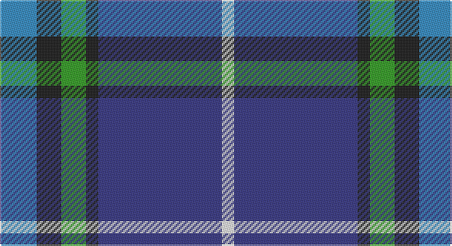

This page is one **sett** — a single exact thread-count. It belongs to the [tartan](/setts/t3k2g2k1db10w1/)
(the same proportion at any scale), whose colour order is pattern [BKGKBW](/stripes/bkgkbw/).

Part of the [Isle of Harris](/tartans/isle-of-harris/) tartan — the named design grouping this sett with its other cloths.

Sourced from tartans-authority.  It is a [6 stripe tartan](/stripes/stripes6/).

Original link http://www.tartansauthority.com/tartan-ferret/display/6198/

## Register references

External register numbers recorded for this tartan.

- Scottish Tartans Authority (ITI): 6198

## Thread count
B/24 K16 G16 K8 DB80 W/8

One full sett is **272 threads**.

## Palette

Palette: <strong>Tartan Register</strong>
<table><thead><tr><th>Colour</th><th>Threads</th><th>Shade</th><th>Base</th><th>OKLCh</th></tr></thead><tbody><tr><td>B/</td><td style="text-align:right;font-variant-numeric:tabular-nums">24</td><td><code style="background-color:#2888C4;">#2888C4</code> <small style="color:#888">#2888C4</small></td><td>B <code style="background-color:#2A418A;">#2A418A</code></td><td><small style="color:#888">oklch(60.1% 0.125 241.5)</small></td></tr><tr><td>K</td><td style="text-align:right;font-variant-numeric:tabular-nums">16</td><td><code style="background-color:#101010;">#101010</code> <small style="color:#888">#101010</small></td><td>K <code style="background-color:#000000;">#000000</code></td><td><small style="color:#888">oklch(17.3% 0.000 89.9)</small></td></tr><tr><td>G</td><td style="text-align:right;font-variant-numeric:tabular-nums">16</td><td><code style="background-color:#289C18;">#289C18</code> <small style="color:#888">#289C18</small></td><td>G <code style="background-color:#006100;">#006100</code></td><td><small style="color:#888">oklch(60.6% 0.191 141.6)</small></td></tr><tr><td>K</td><td style="text-align:right;font-variant-numeric:tabular-nums">8</td><td><code style="background-color:#101010;">#101010</code> <small style="color:#888">#101010</small></td><td>K <code style="background-color:#000000;">#000000</code></td><td><small style="color:#888">oklch(17.3% 0.000 89.9)</small></td></tr><tr><td>DB</td><td style="text-align:right;font-variant-numeric:tabular-nums">80</td><td><code style="background-color:#2C2C80;">#2C2C80</code> <small style="color:#888">#2C2C80</small></td><td>B <code style="background-color:#2A418A;">#2A418A</code></td><td><small style="color:#888">oklch(35.0% 0.138 276.6)</small></td></tr><tr><td>W/</td><td style="text-align:right;font-variant-numeric:tabular-nums">8</td><td><code style="background-color:#FCFCFC;">#FCFCFC</code> <small style="color:#888">#FCFCFC</small></td><td>W <code style="background-color:#F7F7F7;">#F7F7F7</code></td><td><small style="color:#888">oklch(99.1% 0.000 89.9)</small></td></tr></tbody></table>

# Sample pattern

## Compared to the master

This cloth is one sett of its design; the master sett (the exemplar the design is anchored on) is below for comparison.

<figure style="margin:0"><figcaption style="color:#888;font-size:smaller">this sett</figcaption></figure>
<figure style="margin:0"><figcaption style="color:#888;font-size:smaller"><a href="/setts/db10k1g2k2t3k2g2k1db10w1/">master sett →</a></figcaption></figure>

## Nearest tartans

The nearest existing variants by ΔTartan distance, with this tartan at the top so the swatches line up against it.

ΔTartan

Tartan

Sett

—

<a href="/ttd/edit/#slug=t3k2g2k1db10w1~x8">Isle of Harris (District)</a> <a class="nn-out" href="/variants/s6/t3k2g2k1db10w1~x8/" title="open its dictionary page">↗</a>

0.93

<a href="/ttd/edit/#slug=db4p2dp3db24b24w3~x2&amp;base=t3k2g2k1db10w1~x8">Aberdeen Academy of Performing Arts</a> <a class="nn-out" href="/variants/s6/db4p2dp3db24b24w3~x2/" title="open its dictionary page">↗</a>

1.09

<a href="/ttd/edit/#slug=b12dt35lb4w3k11r5~x2&amp;base=t3k2g2k1db10w1~x8">Ferster, James Carney (Personal)</a> <a class="nn-out" href="/variants/s6/b12dt35lb4w3k11r5~x2/" title="open its dictionary page">↗</a>

1.11

<a href="/ttd/edit/#slug=g2db14lg6lr1g1lr6r1~x4&amp;base=t3k2g2k1db10w1~x8">Loch Ness in Scotland</a> <a class="nn-out" href="/variants/s7/g2db14lg6lr1g1lr6r1~x4/" title="open its dictionary page">↗</a>

1.16

<a href="/ttd/edit/#slug=db30b10lb10db5m3ly3g3~x2&amp;base=t3k2g2k1db10w1~x8">Wrigglesworth (Name)</a> <a class="nn-out" href="/variants/s7/db30b10lb10db5m3ly3g3~x2/" title="open its dictionary page">↗</a>

1.18

<a href="/ttd/edit/#slug=w4k24ly2n24t5k4ly4~x2&amp;base=t3k2g2k1db10w1~x8">Mina Perhonen</a> <a class="nn-out" href="/variants/s7/w4k24ly2n24t5k4ly4~x2/" title="open its dictionary page">↗</a>

1.19

<a href="/ttd/edit/#slug=db4dpi2dp3db24t24w3~x2&amp;base=t3k2g2k1db10w1~x8">Aberdeen Academy of Performing Art</a> <a class="nn-out" href="/variants/s6/db4dpi2dp3db24t24w3~x2/" title="open its dictionary page">↗</a>

1.22

<a href="/ttd/edit/#slug=w4db24ly2dbi24t5db4ly4~x2&amp;base=t3k2g2k1db10w1~x8">Mina Perhonen Japanese Corporate Tartan</a> <a class="nn-out" href="/variants/s7/w4db24ly2dbi24t5db4ly4~x2/" title="open its dictionary page">↗</a>

1.23

<a href="/ttd/edit/#slug=k3lb10db2g6db18g2~x2&amp;base=t3k2g2k1db10w1~x8">Crombie House Check</a> <a class="nn-out" href="/variants/s6/k3lb10db2g6db18g2~x2/" title="open its dictionary page">↗</a>

1.23

<a href="/ttd/edit/#slug=k8ly2b21w3r2~x4&amp;base=t3k2g2k1db10w1~x8">Oklahoma</a> <a class="nn-out" href="/variants/s5/k8ly2b21w3r2~x4/" title="open its dictionary page">↗</a>

1.25

<a href="/ttd/edit/#slug=m1g2t10r1db15w1~x4&amp;base=t3k2g2k1db10w1~x8">Oren Peterson</a> <a class="nn-out" href="/variants/s6/m1g2t10r1db15w1~x4/" title="open its dictionary page">↗</a>

## Neighbour map

Every grey dot is one of 14360 variants placed by the first two principal components of the ΔTartan feature space (44% of its variance). Red is this tartan; blue dots are its nearest — click one to open its page.

<svg viewBox="0 0 640 380" role="img" style="max-width:100%;height:auto;border:1px solid #e0e0e0;border-radius:4px;display:block" xmlns="http://www.w3.org/2000/svg"><image href="/nn/cloud.v1.png" width="640" height="380"/><a href="/variants/s6/db4p2dp3db24b24w3~x2/"><circle cx="264.3" cy="188.9" r="4" fill="#3465a4"><title>Aberdeen Academy of Performing Arts</title></circle></a><a href="/variants/s6/b12dt35lb4w3k11r5~x2/"><circle cx="220.1" cy="173.4" r="4" fill="#3465a4"><title>Ferster, James Carney (Personal)</title></circle></a><a href="/variants/s7/g2db14lg6lr1g1lr6r1~x4/"><circle cx="199.8" cy="157.5" r="4" fill="#3465a4"><title>Loch Ness in Scotland</title></circle></a><a href="/variants/s7/db30b10lb10db5m3ly3g3~x2/"><circle cx="238.1" cy="160.4" r="4" fill="#3465a4"><title>Wrigglesworth (Name)</title></circle></a><a href="/variants/s7/w4k24ly2n24t5k4ly4~x2/"><circle cx="187.2" cy="169.3" r="4" fill="#3465a4"><title>Mina Perhonen</title></circle></a><a href="/variants/s6/db4dpi2dp3db24t24w3~x2/"><circle cx="265.6" cy="184.4" r="4" fill="#3465a4"><title>Aberdeen Academy of Performing Art</title></circle></a><a href="/variants/s7/w4db24ly2dbi24t5db4ly4~x2/"><circle cx="212.6" cy="177.3" r="4" fill="#3465a4"><title>Mina Perhonen Japanese Corporate Tartan</title></circle></a><a href="/variants/s6/k3lb10db2g6db18g2~x2/"><circle cx="226.8" cy="209.5" r="4" fill="#3465a4"><title>Crombie House Check</title></circle></a><a href="/variants/s5/k8ly2b21w3r2~x4/"><circle cx="279.0" cy="182.1" r="4" fill="#3465a4"><title>Oklahoma</title></circle></a><a href="/variants/s6/m1g2t10r1db15w1~x4/"><circle cx="245.7" cy="144.8" r="4" fill="#3465a4"><title>Oren Peterson</title></circle></a><circle cx="243.1" cy="185.7" r="5" fill="#c00000"/></svg>

ID: /variants/s6/t3k2g2k1db10w1~x8/
