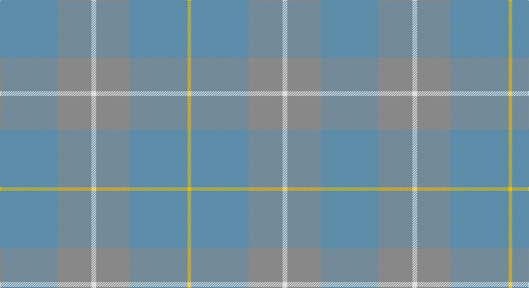

This page is one **sett** — a single exact thread-count. It belongs to the [tartan](/setts/t48o28w4o28t48ly3/)
(the same proportion at any scale), whose colour order is pattern [BRWRBY](/stripes/brwrby/).

Sourced from register-of-tartans.  It is a [6 stripe tartan](/stripes/stripes6/).

Original link https://www.tartanregister.gov.uk/tartanDetails.aspx?ref=2890

## Register references

External register numbers recorded for this tartan.

- Scottish Register of Tartans: [2890](https://www.tartanregister.gov.uk/tartanDetails.aspx?ref=2890)
- Scottish Tartans Authority (ITI): 6041

## Thread count
B/96 N56 LN8 N56 B96 Y/6

One full sett is **534 threads**.

## Palette

Palette: <strong>Tartan Register</strong>
<table><thead><tr><th>Colour</th><th>Threads</th><th>Shade</th><th>Base</th><th>OKLCh</th></tr></thead><tbody><tr><td>B/</td><td style="text-align:right;font-variant-numeric:tabular-nums">96</td><td><code style="background-color:#5C8CA8;">#5C8CA8</code> <small style="color:#888">#5C8CA8</small></td><td>B <code style="background-color:#2A418A;">#2A418A</code></td><td><small style="color:#888">oklch(61.7% 0.067 235.0)</small></td></tr><tr><td>N</td><td style="text-align:right;font-variant-numeric:tabular-nums">56</td><td><code style="background-color:#888888;">#888888</code> <small style="color:#888">#888888</small></td><td>R <code style="background-color:#CC0000;">#CC0000</code></td><td><small style="color:#888">oklch(62.7% 0.000 89.9)</small></td></tr><tr><td>LN</td><td style="text-align:right;font-variant-numeric:tabular-nums">8</td><td><code style="background-color:#E0E0E0;">#E0E0E0</code> <small style="color:#888">#E0E0E0</small></td><td>W <code style="background-color:#F7F7F7;">#F7F7F7</code></td><td><small style="color:#888">oklch(90.7% 0.000 89.9)</small></td></tr><tr><td>N</td><td style="text-align:right;font-variant-numeric:tabular-nums">56</td><td><code style="background-color:#888888;">#888888</code> <small style="color:#888">#888888</small></td><td>R <code style="background-color:#CC0000;">#CC0000</code></td><td><small style="color:#888">oklch(62.7% 0.000 89.9)</small></td></tr><tr><td>B</td><td style="text-align:right;font-variant-numeric:tabular-nums">96</td><td><code style="background-color:#5C8CA8;">#5C8CA8</code> <small style="color:#888">#5C8CA8</small></td><td>B <code style="background-color:#2A418A;">#2A418A</code></td><td><small style="color:#888">oklch(61.7% 0.067 235.0)</small></td></tr><tr><td>Y/</td><td style="text-align:right;font-variant-numeric:tabular-nums">6</td><td><code style="background-color:#E8C000;">#E8C000</code> <small style="color:#888">#E8C000</small></td><td>Y <code style="background-color:#F2BF00;">#F2BF00</code></td><td><small style="color:#888">oklch(81.9% 0.168 93.7)</small></td></tr></tbody></table>

# Sample pattern

## Nearest tartans

The nearest existing variants by ΔTartan distance, with this tartan at the top so the swatches line up against it.

ΔTartan

Tartan

Sett

—

<a href="/ttd/edit/#slug=t48o28w4o28t48ly3~x2">McKerrell of Hillhouse Dress</a> <a class="nn-out" href="/variants/s6/t48o28w4o28t48ly3~x2/" title="open its dictionary page">↗</a>

1.81

<a href="/ttd/edit/#slug=y34n27r3n27y34w3~x2&amp;base=t48o28w4o28t48ly3~x2">London Regiment (Military)</a> <a class="nn-out" href="/variants/s6/y34n27r3n27y34w3~x2/" title="open its dictionary page">↗</a>

1.92

<a href="/ttd/edit/#slug=lo5n2y8n1y8n4y4n6y18lr1lo5~x2&amp;base=t48o28w4o28t48ly3~x2">Bute Heather, Ancient Wth'd (Fashion</a> <a class="nn-out" href="/variants/s11/lo5n2y8n1y8n4y4n6y18lr1lo5~x2/" title="open its dictionary page">↗</a>

2.38

<a href="/ttd/edit/#slug=t10y1t1y10t18y5~x2&amp;base=t48o28w4o28t48ly3~x2">Harmony 13</a> <a class="nn-out" href="/variants/s6/t10y1t1y10t18y5~x2/" title="open its dictionary page">↗</a>

2.44

<a href="/ttd/edit/#slug=w4o28t48ly3~x2&amp;base=t48o28w4o28t48ly3~x2">McKerrell of Hillhouse Dress (Clan)</a> <a class="nn-out" href="/variants/s4/w4o28t48ly3~x2/" title="open its dictionary page">↗</a>

2.55

<a href="/ttd/edit/#slug=dy2n4y12n3dy6t2n24dy2n2y2~x2&amp;base=t48o28w4o28t48ly3~x2">Wicklow Irish County Tartan</a> <a class="nn-out" href="/variants/s10/dy2n4y12n3dy6t2n24dy2n2y2~x2/" title="open its dictionary page">↗</a>

2.76

<a href="/ttd/edit/#slug=oi12o6oi2ly1~x4&amp;base=t48o28w4o28t48ly3~x2">Loch Garth</a> <a class="nn-out" href="/variants/s4/oi12o6oi2ly1~x4/" title="open its dictionary page">↗</a>

2.87

<a href="/ttd/edit/#slug=y14n7lo6n2~x8&amp;base=t48o28w4o28t48ly3~x2">Outlander #3</a> <a class="nn-out" href="/variants/s4/y14n7lo6n2~x8/" title="open its dictionary page">↗</a>

2.91

<a href="/ttd/edit/#slug=o32w2o9ly2o12lo21r1~x2&amp;base=t48o28w4o28t48ly3~x2">Weathered Cyclist (Corporate)</a> <a class="nn-out" href="/variants/s7/o32w2o9ly2o12lo21r1~x2/" title="open its dictionary page">↗</a>

2.97

<a href="/ttd/edit/#slug=o6y2o29y29o2y6~x2&amp;base=t48o28w4o28t48ly3~x2">Harmony, 12</a> <a class="nn-out" href="/variants/s6/o6y2o29y29o2y6~x2/" title="open its dictionary page">↗</a>

3.29

<a href="/ttd/edit/#slug=o14n7lo7n2~x8&amp;base=t48o28w4o28t48ly3~x2">Outlander #3</a> <a class="nn-out" href="/variants/s4/o14n7lo7n2~x8/" title="open its dictionary page">↗</a>

## Neighbour map

Every grey dot is one of 14360 variants placed by the first two principal components of the ΔTartan feature space (44% of its variance). Red is this tartan; blue dots are its nearest — click one to open its page.

<svg viewBox="0 0 640 380" role="img" style="max-width:100%;height:auto;border:1px solid #e0e0e0;border-radius:4px;display:block" xmlns="http://www.w3.org/2000/svg"><image href="/nn/cloud.v1.png" width="640" height="380"/><a href="/variants/s6/y34n27r3n27y34w3~x2/"><circle cx="468.5" cy="328.4" r="4" fill="#3465a4"><title>London Regiment (Military)</title></circle></a><a href="/variants/s11/lo5n2y8n1y8n4y4n6y18lr1lo5~x2/"><circle cx="560.0" cy="292.2" r="4" fill="#3465a4"><title>Bute Heather, Ancient Wth'd (Fashion</title></circle></a><a href="/variants/s6/t10y1t1y10t18y5~x2/"><circle cx="626.0" cy="366.0" r="4" fill="#3465a4"><title>Harmony 13</title></circle></a><a href="/variants/s4/w4o28t48ly3~x2/"><circle cx="501.7" cy="294.2" r="4" fill="#3465a4"><title>McKerrell of Hillhouse Dress (Clan)</title></circle></a><a href="/variants/s10/dy2n4y12n3dy6t2n24dy2n2y2~x2/"><circle cx="552.4" cy="298.8" r="4" fill="#3465a4"><title>Wicklow Irish County Tartan</title></circle></a><a href="/variants/s4/oi12o6oi2ly1~x4/"><circle cx="620.0" cy="354.7" r="4" fill="#3465a4"><title>Loch Garth</title></circle></a><a href="/variants/s4/y14n7lo6n2~x8/"><circle cx="437.4" cy="366.0" r="4" fill="#3465a4"><title>Outlander #3</title></circle></a><a href="/variants/s7/o32w2o9ly2o12lo21r1~x2/"><circle cx="609.4" cy="248.6" r="4" fill="#3465a4"><title>Weathered Cyclist (Corporate)</title></circle></a><a href="/variants/s6/o6y2o29y29o2y6~x2/"><circle cx="626.0" cy="359.7" r="4" fill="#3465a4"><title>Harmony, 12</title></circle></a><a href="/variants/s4/o14n7lo7n2~x8/"><circle cx="407.3" cy="366.0" r="4" fill="#3465a4"><title>Outlander #3</title></circle></a><circle cx="550.9" cy="328.9" r="5" fill="#c00000"/></svg>

ID: /variants/s6/t48o28w4o28t48ly3~x2/
