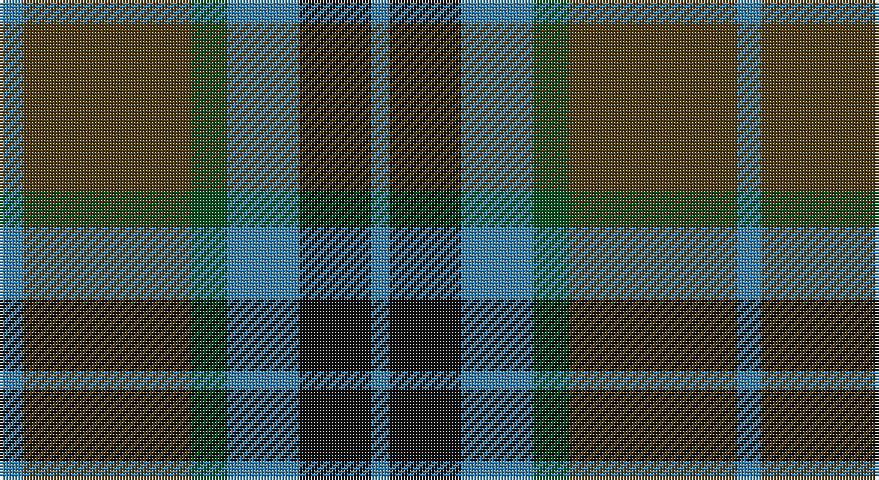

This page is one **sett** — a single exact thread-count. It belongs to the [tartan](/setts/t4dy28dg6t12k12t3/)
(the same proportion at any scale), whose colour order is pattern [BGGBKB](/stripes/bggbkb/).

Sourced from register-of-tartans.  It is a [6 stripe tartan](/stripes/stripes6/).

Original link https://www.tartanregister.gov.uk/tartanDetails.aspx?ref=4118

## Register references

External register numbers recorded for this tartan.

- Scottish Register of Tartans: [4118](https://www.tartanregister.gov.uk/tartanDetails.aspx?ref=4118)
- Scottish Tartans World Register: 2093

## Thread count
B/8 T56 G12 B24 K24 B/6

One full sett is **246 threads**.

## Palette

Palette: <strong>Tartan Register</strong>
<table><thead><tr><th>Colour</th><th>Threads</th><th>Shade</th><th>Base</th><th>OKLCh</th></tr></thead><tbody><tr><td>B/</td><td style="text-align:right;font-variant-numeric:tabular-nums">8</td><td><code style="background-color:#3C82AF;">#3C82AF</code> <small style="color:#888">#3C82AF</small></td><td>B <code style="background-color:#2A418A;">#2A418A</code></td><td><small style="color:#888">oklch(58.1% 0.099 239.8)</small></td></tr><tr><td>T</td><td style="text-align:right;font-variant-numeric:tabular-nums">56</td><td><code style="background-color:#503C14;">#503C14</code> <small style="color:#888">#503C14</small></td><td>G <code style="background-color:#006100;">#006100</code></td><td><small style="color:#888">oklch(37.0% 0.062 81.8)</small></td></tr><tr><td>G</td><td style="text-align:right;font-variant-numeric:tabular-nums">12</td><td><code style="background-color:#005020;">#005020</code> <small style="color:#888">#005020</small></td><td>G <code style="background-color:#006100;">#006100</code></td><td><small style="color:#888">oklch(37.7% 0.105 149.6)</small></td></tr><tr><td>B</td><td style="text-align:right;font-variant-numeric:tabular-nums">24</td><td><code style="background-color:#3C82AF;">#3C82AF</code> <small style="color:#888">#3C82AF</small></td><td>B <code style="background-color:#2A418A;">#2A418A</code></td><td><small style="color:#888">oklch(58.1% 0.099 239.8)</small></td></tr><tr><td>K</td><td style="text-align:right;font-variant-numeric:tabular-nums">24</td><td><code style="background-color:#101010;">#101010</code> <small style="color:#888">#101010</small></td><td>K <code style="background-color:#000000;">#000000</code></td><td><small style="color:#888">oklch(17.3% 0.000 89.9)</small></td></tr><tr><td>B/</td><td style="text-align:right;font-variant-numeric:tabular-nums">6</td><td><code style="background-color:#3C82AF;">#3C82AF</code> <small style="color:#888">#3C82AF</small></td><td>B <code style="background-color:#2A418A;">#2A418A</code></td><td><small style="color:#888">oklch(58.1% 0.099 239.8)</small></td></tr></tbody></table>

# Sample pattern

## Nearest tartans

The nearest existing variants by ΔTartan distance, with this tartan at the top so the swatches line up against it.

ΔTartan

Tartan

Sett

—

<a href="/ttd/edit/#slug=t4dy28dg6t12k12t3~x2">Thompson/Thomson/MacTavish Hunting</a> <a class="nn-out" href="/variants/s6/t4dy28dg6t12k12t3~x2/" title="open its dictionary page">↗</a>

0.69

<a href="/ttd/edit/#slug=t4dy28g6t12k12t3~x2&amp;base=t4dy28dg6t12k12t3~x2">MacTavish Hunting</a> <a class="nn-out" href="/variants/s6/t4dy28g6t12k12t3~x2/" title="open its dictionary page">↗</a>

0.87

<a href="/ttd/edit/#slug=o1b7k4b1g7b1~x4&amp;base=t4dy28dg6t12k12t3~x2">Flower of Scotland Commemorative Tartan</a> <a class="nn-out" href="/variants/s6/o1b7k4b1g7b1~x4/" title="open its dictionary page">↗</a>

0.87

<a href="/ttd/edit/#slug=o1b7k4b1g7b1~x2&amp;base=t4dy28dg6t12k12t3~x2">Flower of Scotland MINI Tartan</a> <a class="nn-out" href="/variants/s6/o1b7k4b1g7b1~x2/" title="open its dictionary page">↗</a>

0.88

<a href="/ttd/edit/#slug=g32dy7g7dy16db32ly3dy8~x2&amp;base=t4dy28dg6t12k12t3~x2">Strange of Balcaskie (Clan)</a> <a class="nn-out" href="/variants/s7/g32dy7g7dy16db32ly3dy8~x2/" title="open its dictionary page">↗</a>

0.89

<a href="/ttd/edit/#slug=g7db1g1k4dp4k1~x4&amp;base=t4dy28dg6t12k12t3~x2">MacArthur of Milton (Clan)</a> <a class="nn-out" href="/variants/s6/g7db1g1k4dp4k1~x4/" title="open its dictionary page">↗</a>

0.89

<a href="/ttd/edit/#slug=t3dy26g4t13k13t2~x2&amp;base=t4dy28dg6t12k12t3~x2">MacTavish Hunting Clan Tartan</a> <a class="nn-out" href="/variants/s6/t3dy26g4t13k13t2~x2/" title="open its dictionary page">↗</a>

0.93

<a href="/ttd/edit/#slug=g18t2g4k14dp12k3~x2&amp;base=t4dy28dg6t12k12t3~x2">Coburg</a> <a class="nn-out" href="/variants/s6/g18t2g4k14dp12k3~x2/" title="open its dictionary page">↗</a>

0.93

<a href="/ttd/edit/#slug=k4dg19k16w2db15dg4~x2&amp;base=t4dy28dg6t12k12t3~x2">Graham of Montrose</a> <a class="nn-out" href="/variants/s6/k4dg19k16w2db15dg4~x2/" title="open its dictionary page">↗</a>

0.94

<a href="/ttd/edit/#slug=g8t1g1k6db6k1~x4&amp;base=t4dy28dg6t12k12t3~x2">Graham of Menteith (Clan)</a> <a class="nn-out" href="/variants/s6/g8t1g1k6db6k1~x4/" title="open its dictionary page">↗</a>

0.98

<a href="/ttd/edit/#slug=dg5b2dg9dt19r9ly2~x2&amp;base=t4dy28dg6t12k12t3~x2">Lyle and Scott</a> <a class="nn-out" href="/variants/s6/dg5b2dg9dt19r9ly2~x2/" title="open its dictionary page">↗</a>

## Neighbour map

Every grey dot is one of 14360 variants placed by the first two principal components of the ΔTartan feature space (44% of its variance). Red is this tartan; blue dots are its nearest — click one to open its page.

<svg viewBox="0 0 640 380" role="img" style="max-width:100%;height:auto;border:1px solid #e0e0e0;border-radius:4px;display:block" xmlns="http://www.w3.org/2000/svg"><image href="/nn/cloud.v1.png" width="640" height="380"/><a href="/variants/s6/t4dy28g6t12k12t3~x2/"><circle cx="237.6" cy="231.6" r="4" fill="#3465a4"><title>MacTavish Hunting</title></circle></a><a href="/variants/s6/o1b7k4b1g7b1~x4/"><circle cx="238.7" cy="253.6" r="4" fill="#3465a4"><title>Flower of Scotland Commemorative Tartan</title></circle></a><a href="/variants/s6/o1b7k4b1g7b1~x2/"><circle cx="238.7" cy="253.6" r="4" fill="#3465a4"><title>Flower of Scotland MINI Tartan</title></circle></a><a href="/variants/s7/g32dy7g7dy16db32ly3dy8~x2/"><circle cx="243.8" cy="241.3" r="4" fill="#3465a4"><title>Strange of Balcaskie (Clan)</title></circle></a><a href="/variants/s6/g7db1g1k4dp4k1~x4/"><circle cx="233.2" cy="249.7" r="4" fill="#3465a4"><title>MacArthur of Milton (Clan)</title></circle></a><a href="/variants/s6/t3dy26g4t13k13t2~x2/"><circle cx="251.6" cy="215.6" r="4" fill="#3465a4"><title>MacTavish Hunting Clan Tartan</title></circle></a><a href="/variants/s6/g18t2g4k14dp12k3~x2/"><circle cx="229.4" cy="249.4" r="4" fill="#3465a4"><title>Coburg</title></circle></a><a href="/variants/s6/k4dg19k16w2db15dg4~x2/"><circle cx="223.0" cy="255.2" r="4" fill="#3465a4"><title>Graham of Montrose</title></circle></a><a href="/variants/s6/g8t1g1k6db6k1~x4/"><circle cx="218.0" cy="249.8" r="4" fill="#3465a4"><title>Graham of Menteith (Clan)</title></circle></a><a href="/variants/s6/dg5b2dg9dt19r9ly2~x2/"><circle cx="220.3" cy="226.4" r="4" fill="#3465a4"><title>Lyle and Scott</title></circle></a><circle cx="249.8" cy="242.4" r="5" fill="#c00000"/></svg>

ID: /variants/s6/t4dy28dg6t12k12t3~x2/
