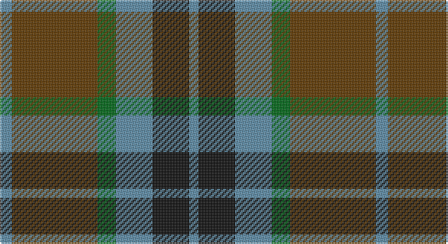

This page is one **sett** — a single exact thread-count. It belongs to the [tartan](/setts/t4dy28g6t12k12t3/)
(the same proportion at any scale), whose colour order is pattern [BGGBKB](/stripes/bggbkb/).

Sourced from register-of-tartans.  It is a [6 stripe tartan](/stripes/stripes6/).

Original link https://www.tartanregister.gov.uk/tartanDetails.aspx?ref=2770

## Provenance

Earliest known date: 1958 Designed for Lord Thomson of Fleet in 1958 based on a sample in the Moy Hall collection dating from the mid 19th century. The tartan is also suitable for MacTavishs and Thompsons, who claim descent from the Clan MacIntosh.

## Also known as

This cloth is also recorded under:

- MacTavish Htg
- Thompson Hunting
- Thompson/Thomson/MacTavish Hunting
- Thomson
- Thomson Lord.. Personal

6 attestations — the source records this cloth was collapsed from (oldest owns this page)

<ul>
<li>01/01/1850 — MacTavish Hunting (register-of-tartans, <a href="https://www.tartanregister.gov.uk/tartanDetails.aspx?ref=2770">record</a>)</li>
<li>1958 — MacTavish Htg (tartans-authority, <a href="http://www.tartansauthority.com/tartan-ferret/display/232/">record</a>)</li>
<li>01/01/1965 — Thomson (Personal) (register-of-tartans, <a href="https://www.tartanregister.gov.uk/tartanDetails.aspx?ref=4120">record</a>)</li>
<li>1965 — Thomson (Clan) (tartans-authority, <a href="http://www.tartansauthority.com/tartan-ferret/display/231/">record</a>)</li>
<li>undated — Thompson Hunting Family Tartan (house-of-tartan, <a href="http://www.house-of-tartan.scotland.net/house/TartanViewjs.asp?colr=Def&tnam=2093">record</a>)</li>
<li>undated — Thomson Lord.. (Hunting) Personal Tartan (house-of-tartan, <a href="http://www.house-of-tartan.scotland.net/house/TartanViewjs.asp?colr=Def&tnam=231">record</a>)</li>
</ul>

## Register references

External register numbers recorded for this tartan.

- Scottish Register of Tartans: [4120](https://www.tartanregister.gov.uk/tartanDetails.aspx?ref=4120)
- Scottish Tartans Authority (ITI): 232
- Scottish Tartans World Register: 231

## Thread count
B/8 T56 G12 B24 K24 B/6

One full sett is **246 threads**.

## Palette

Palette: <strong>Tartan Register</strong>
<table><thead><tr><th>Colour</th><th>Threads</th><th>Shade</th><th>Base</th><th>OKLCh</th></tr></thead><tbody><tr><td>B/</td><td style="text-align:right;font-variant-numeric:tabular-nums">8</td><td><code style="background-color:#5C8CA8;">#5C8CA8</code> <small style="color:#888">#5C8CA8</small></td><td>B <code style="background-color:#2A418A;">#2A418A</code></td><td><small style="color:#888">oklch(61.7% 0.067 235.0)</small></td></tr><tr><td>T</td><td style="text-align:right;font-variant-numeric:tabular-nums">56</td><td><code style="background-color:#603800;">#603800</code> <small style="color:#888">#603800</small></td><td>G <code style="background-color:#006100;">#006100</code></td><td><small style="color:#888">oklch(38.1% 0.084 66.7)</small></td></tr><tr><td>G</td><td style="text-align:right;font-variant-numeric:tabular-nums">12</td><td><code style="background-color:#006818;">#006818</code> <small style="color:#888">#006818</small></td><td>G <code style="background-color:#006100;">#006100</code></td><td><small style="color:#888">oklch(45.0% 0.142 145.0)</small></td></tr><tr><td>B</td><td style="text-align:right;font-variant-numeric:tabular-nums">24</td><td><code style="background-color:#5C8CA8;">#5C8CA8</code> <small style="color:#888">#5C8CA8</small></td><td>B <code style="background-color:#2A418A;">#2A418A</code></td><td><small style="color:#888">oklch(61.7% 0.067 235.0)</small></td></tr><tr><td>K</td><td style="text-align:right;font-variant-numeric:tabular-nums">24</td><td><code style="background-color:#101010;">#101010</code> <small style="color:#888">#101010</small></td><td>K <code style="background-color:#000000;">#000000</code></td><td><small style="color:#888">oklch(17.3% 0.000 89.9)</small></td></tr><tr><td>B/</td><td style="text-align:right;font-variant-numeric:tabular-nums">6</td><td><code style="background-color:#5C8CA8;">#5C8CA8</code> <small style="color:#888">#5C8CA8</small></td><td>B <code style="background-color:#2A418A;">#2A418A</code></td><td><small style="color:#888">oklch(61.7% 0.067 235.0)</small></td></tr></tbody></table>

# Sample pattern

## Nearest tartans

The nearest existing variants by ΔTartan distance, with this tartan at the top so the swatches line up against it.

ΔTartan

Tartan

Sett

—

<a href="/ttd/edit/#slug=t4dy28g6t12k12t3~x2">MacTavish Hunting</a> <a class="nn-out" href="/variants/s6/t4dy28g6t12k12t3~x2/" title="open its dictionary page">↗</a>

0.54

<a href="/ttd/edit/#slug=t3dy26g4t13k13t2~x2&amp;base=t4dy28g6t12k12t3~x2">MacTavish Hunting Clan Tartan</a> <a class="nn-out" href="/variants/s6/t3dy26g4t13k13t2~x2/" title="open its dictionary page">↗</a>

0.69

<a href="/ttd/edit/#slug=t4dy28dg6t12k12t3~x2&amp;base=t4dy28g6t12k12t3~x2">Thompson/Thomson/MacTavish Hunting</a> <a class="nn-out" href="/variants/s6/t4dy28dg6t12k12t3~x2/" title="open its dictionary page">↗</a>

0.73

<a href="/ttd/edit/#slug=r3db12r4g18r6k2~x2&amp;base=t4dy28g6t12k12t3~x2">Eyre (Personal)</a> <a class="nn-out" href="/variants/s6/r3db12r4g18r6k2~x2/" title="open its dictionary page">↗</a>

0.88

<a href="/ttd/edit/#slug=g14db2g2k8dp9k2~x2&amp;base=t4dy28g6t12k12t3~x2">MacArthur of Milton Hunting Clan Tartan</a> <a class="nn-out" href="/variants/s6/g14db2g2k8dp9k2~x2/" title="open its dictionary page">↗</a>

0.96

<a href="/ttd/edit/#slug=g18t2g4k14dp12k3~x2&amp;base=t4dy28g6t12k12t3~x2">Coburg</a> <a class="nn-out" href="/variants/s6/g18t2g4k14dp12k3~x2/" title="open its dictionary page">↗</a>

0.96

<a href="/ttd/edit/#slug=g7db1g1k4dp4k1~x4&amp;base=t4dy28g6t12k12t3~x2">MacArthur of Milton (Clan)</a> <a class="nn-out" href="/variants/s6/g7db1g1k4dp4k1~x4/" title="open its dictionary page">↗</a>

0.97

<a href="/ttd/edit/#slug=r1g7r3db7t1~x2&amp;base=t4dy28g6t12k12t3~x2">Hebridean 4</a> <a class="nn-out" href="/variants/s5/r1g7r3db7t1~x2/" title="open its dictionary page">↗</a>

0.98

<a href="/ttd/edit/#slug=g3r22t5g10k10g2~x2&amp;base=t4dy28g6t12k12t3~x2">Strathspey (Fashion)</a> <a class="nn-out" href="/variants/s6/g3r22t5g10k10g2~x2/" title="open its dictionary page">↗</a>

0.98

<a href="/ttd/edit/#slug=db6k1g3k1db3k1g10r3~x2&amp;base=t4dy28g6t12k12t3~x2">AIton - 1979 (Clan)</a> <a class="nn-out" href="/variants/s8/db6k1g3k1db3k1g10r3~x2/" title="open its dictionary page">↗</a>

0.99

<a href="/ttd/edit/#slug=r5dt12g3db4g20dt3g3r5~x4&amp;base=t4dy28g6t12k12t3~x2">Daks (0600150)</a> <a class="nn-out" href="/variants/s8/r5dt12g3db4g20dt3g3r5~x4/" title="open its dictionary page">↗</a>

## Neighbour map

Every grey dot is one of 14360 variants placed by the first two principal components of the ΔTartan feature space (44% of its variance). Red is this tartan; blue dots are its nearest — click one to open its page.

<svg viewBox="0 0 640 380" role="img" style="max-width:100%;height:auto;border:1px solid #e0e0e0;border-radius:4px;display:block" xmlns="http://www.w3.org/2000/svg"><image href="/nn/cloud.v1.png" width="640" height="380"/><a href="/variants/s6/t3dy26g4t13k13t2~x2/"><circle cx="251.6" cy="215.6" r="4" fill="#3465a4"><title>MacTavish Hunting Clan Tartan</title></circle></a><a href="/variants/s6/t4dy28dg6t12k12t3~x2/"><circle cx="249.8" cy="242.4" r="4" fill="#3465a4"><title>Thompson/Thomson/MacTavish Hunting</title></circle></a><a href="/variants/s6/r3db12r4g18r6k2~x2/"><circle cx="215.3" cy="224.8" r="4" fill="#3465a4"><title>Eyre (Personal)</title></circle></a><a href="/variants/s6/g14db2g2k8dp9k2~x2/"><circle cx="221.2" cy="246.3" r="4" fill="#3465a4"><title>MacArthur of Milton Hunting Clan Tartan</title></circle></a><a href="/variants/s6/g18t2g4k14dp12k3~x2/"><circle cx="229.4" cy="249.4" r="4" fill="#3465a4"><title>Coburg</title></circle></a><a href="/variants/s6/g7db1g1k4dp4k1~x4/"><circle cx="233.2" cy="249.7" r="4" fill="#3465a4"><title>MacArthur of Milton (Clan)</title></circle></a><a href="/variants/s5/r1g7r3db7t1~x2/"><circle cx="200.8" cy="251.5" r="4" fill="#3465a4"><title>Hebridean 4</title></circle></a><a href="/variants/s6/g3r22t5g10k10g2~x2/"><circle cx="251.6" cy="226.8" r="4" fill="#3465a4"><title>Strathspey (Fashion)</title></circle></a><a href="/variants/s8/db6k1g3k1db3k1g10r3~x2/"><circle cx="255.9" cy="216.8" r="4" fill="#3465a4"><title>AIton - 1979 (Clan)</title></circle></a><a href="/variants/s8/r5dt12g3db4g20dt3g3r5~x4/"><circle cx="248.2" cy="232.3" r="4" fill="#3465a4"><title>Daks (0600150)</title></circle></a><circle cx="237.6" cy="231.6" r="5" fill="#c00000"/></svg>

ID: /variants/s6/t4dy28g6t12k12t3~x2/
