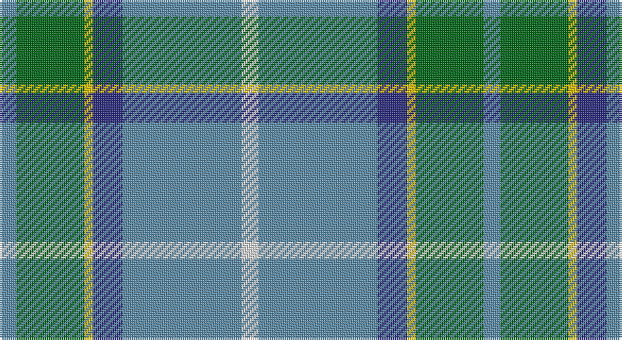

This page is one **sett** — a single exact thread-count. It belongs to the [tartan](/setts/t4g16ly2db7t28w4/)
(the same proportion at any scale), whose colour order is pattern [BGYBBW](/stripes/bgybbw/).

Sourced from tartans-authority.  It is a [6 stripe tartan](/stripes/stripes6/).

Original link http://www.tartansauthority.com/tartan-ferret/display/3032/

2 attestations — the source records this cloth was collapsed from (oldest owns this page)

<ul>
<li>1980-81 — Allanton (Fashion) (tartans-authority, <a href="http://www.tartansauthority.com/tartan-ferret/display/3032/">record</a>)</li>
<li>undated — Allanton (register-of-tartans, <a href="https://www.tartanregister.gov.uk/tartanDetails.aspx?ref=5397">record</a>)</li>
</ul>

## Register references

External register numbers recorded for this tartan.

- Scottish Register of Tartans: [5397](https://www.tartanregister.gov.uk/tartanDetails.aspx?ref=5397)
- Scottish Tartans Authority (ITI): 3032

## Thread count
B/8 G32 Y4 DB14 B56 LN/8

One full sett is **228 threads**.

## Palette

Palette: <strong>Tartan Register</strong>
<table><thead><tr><th>Colour</th><th>Threads</th><th>Shade</th><th>Base</th><th>OKLCh</th></tr></thead><tbody><tr><td>B/</td><td style="text-align:right;font-variant-numeric:tabular-nums">8</td><td><code style="background-color:#5C8CA8;">#5C8CA8</code> <small style="color:#888">#5C8CA8</small></td><td>B <code style="background-color:#2A418A;">#2A418A</code></td><td><small style="color:#888">oklch(61.7% 0.067 235.0)</small></td></tr><tr><td>G</td><td style="text-align:right;font-variant-numeric:tabular-nums">32</td><td><code style="background-color:#006818;">#006818</code> <small style="color:#888">#006818</small></td><td>G <code style="background-color:#006100;">#006100</code></td><td><small style="color:#888">oklch(45.0% 0.142 145.0)</small></td></tr><tr><td>Y</td><td style="text-align:right;font-variant-numeric:tabular-nums">4</td><td><code style="background-color:#E8C000;">#E8C000</code> <small style="color:#888">#E8C000</small></td><td>Y <code style="background-color:#F2BF00;">#F2BF00</code></td><td><small style="color:#888">oklch(81.9% 0.168 93.7)</small></td></tr><tr><td>DB</td><td style="text-align:right;font-variant-numeric:tabular-nums">14</td><td><code style="background-color:#2C2C80;">#2C2C80</code> <small style="color:#888">#2C2C80</small></td><td>B <code style="background-color:#2A418A;">#2A418A</code></td><td><small style="color:#888">oklch(35.0% 0.138 276.6)</small></td></tr><tr><td>B</td><td style="text-align:right;font-variant-numeric:tabular-nums">56</td><td><code style="background-color:#5C8CA8;">#5C8CA8</code> <small style="color:#888">#5C8CA8</small></td><td>B <code style="background-color:#2A418A;">#2A418A</code></td><td><small style="color:#888">oklch(61.7% 0.067 235.0)</small></td></tr><tr><td>LN/</td><td style="text-align:right;font-variant-numeric:tabular-nums">8</td><td><code style="background-color:#E0E0E0;">#E0E0E0</code> <small style="color:#888">#E0E0E0</small></td><td>W <code style="background-color:#F7F7F7;">#F7F7F7</code></td><td><small style="color:#888">oklch(90.7% 0.000 89.9)</small></td></tr></tbody></table>

# Sample pattern

## Nearest tartans

The nearest existing variants by ΔTartan distance, with this tartan at the top so the swatches line up against it.

ΔTartan

Tartan

Sett

—

<a href="/ttd/edit/#slug=t4g16ly2db7t28w4~x2">Allanton (Fashion)</a> <a class="nn-out" href="/variants/s6/t4g16ly2db7t28w4~x2/" title="open its dictionary page">↗</a>

0.59

<a href="/ttd/edit/#slug=t4dg16ly2dp7t28w4~x2&amp;base=t4g16ly2db7t28w4~x2">Manx Laxey (Blue)</a> <a class="nn-out" href="/variants/s6/t4dg16ly2dp7t28w4~x2/" title="open its dictionary page">↗</a>

0.87

<a href="/ttd/edit/#slug=k3t2g13w2t24r3~x4&amp;base=t4g16ly2db7t28w4~x2">Vance</a> <a class="nn-out" href="/variants/s6/k3t2g13w2t24r3~x4/" title="open its dictionary page">↗</a>

1.02

<a href="/ttd/edit/#slug=g11lo10dp11b33w3~x2&amp;base=t4g16ly2db7t28w4~x2">Sterling, Rob (Florida) (Personal)</a> <a class="nn-out" href="/variants/s5/g11lo10dp11b33w3~x2/" title="open its dictionary page">↗</a>

1.06

<a href="/ttd/edit/#slug=g13dp1g1dp1g3b5k4ly2~x4&amp;base=t4g16ly2db7t28w4~x2">Carrick Hunting (Personal)</a> <a class="nn-out" href="/variants/s8/g13dp1g1dp1g3b5k4ly2~x4/" title="open its dictionary page">↗</a>

1.07

<a href="/ttd/edit/#slug=g11lo10dt11b33w3~x2&amp;base=t4g16ly2db7t28w4~x2">Sterling (Name)</a> <a class="nn-out" href="/variants/s5/g11lo10dt11b33w3~x2/" title="open its dictionary page">↗</a>

1.09

<a href="/ttd/edit/#slug=n8ly2n22g6r2lb10g12n3~x2&amp;base=t4g16ly2db7t28w4~x2">Bahamas (District)</a> <a class="nn-out" href="/variants/s8/n8ly2n22g6r2lb10g12n3~x2/" title="open its dictionary page">↗</a>

1.11

<a href="/ttd/edit/#slug=n8ly2n22dg6r2lb10dg12n3~x2&amp;base=t4g16ly2db7t28w4~x2">Bahamas</a> <a class="nn-out" href="/variants/s8/n8ly2n22dg6r2lb10dg12n3~x2/" title="open its dictionary page">↗</a>

1.15

<a href="/ttd/edit/#slug=db10k3t65g56ly6&amp;base=t4g16ly2db7t28w4~x2">Phoenix Police Honor Guard (Corp.)</a> <a class="nn-out" href="/variants/s5/db10k3t65g56ly6/" title="open its dictionary page">↗</a>

1.20

<a href="/ttd/edit/#slug=b4g16ly2p7b28w4~x2&amp;base=t4g16ly2db7t28w4~x2">Manx Laxey</a> <a class="nn-out" href="/variants/s6/b4g16ly2p7b28w4~x2/" title="open its dictionary page">↗</a>

1.25

<a href="/ttd/edit/#slug=w15ly2dt5lr3t40dt10&amp;base=t4g16ly2db7t28w4~x2">Herriot (New Zealand) (Name)</a> <a class="nn-out" href="/variants/s6/w15ly2dt5lr3t40dt10/" title="open its dictionary page">↗</a>

## Neighbour map

Every grey dot is one of 14360 variants placed by the first two principal components of the ΔTartan feature space (44% of its variance). Red is this tartan; blue dots are its nearest — click one to open its page.

<svg viewBox="0 0 640 380" role="img" style="max-width:100%;height:auto;border:1px solid #e0e0e0;border-radius:4px;display:block" xmlns="http://www.w3.org/2000/svg"><image href="/nn/cloud.v1.png" width="640" height="380"/><a href="/variants/s6/t4dg16ly2dp7t28w4~x2/"><circle cx="273.2" cy="182.3" r="4" fill="#3465a4"><title>Manx Laxey (Blue)</title></circle></a><a href="/variants/s6/k3t2g13w2t24r3~x4/"><circle cx="289.6" cy="180.8" r="4" fill="#3465a4"><title>Vance</title></circle></a><a href="/variants/s5/g11lo10dp11b33w3~x2/"><circle cx="229.1" cy="214.4" r="4" fill="#3465a4"><title>Sterling, Rob (Florida) (Personal)</title></circle></a><a href="/variants/s8/g13dp1g1dp1g3b5k4ly2~x4/"><circle cx="292.8" cy="172.0" r="4" fill="#3465a4"><title>Carrick Hunting (Personal)</title></circle></a><a href="/variants/s5/g11lo10dt11b33w3~x2/"><circle cx="228.7" cy="219.6" r="4" fill="#3465a4"><title>Sterling (Name)</title></circle></a><a href="/variants/s8/n8ly2n22g6r2lb10g12n3~x2/"><circle cx="260.6" cy="202.4" r="4" fill="#3465a4"><title>Bahamas (District)</title></circle></a><a href="/variants/s8/n8ly2n22dg6r2lb10dg12n3~x2/"><circle cx="248.8" cy="196.4" r="4" fill="#3465a4"><title>Bahamas</title></circle></a><a href="/variants/s5/db10k3t65g56ly6/"><circle cx="294.0" cy="186.3" r="4" fill="#3465a4"><title>Phoenix Police Honor Guard (Corp.)</title></circle></a><a href="/variants/s6/b4g16ly2p7b28w4~x2/"><circle cx="271.5" cy="176.2" r="4" fill="#3465a4"><title>Manx Laxey</title></circle></a><a href="/variants/s6/w15ly2dt5lr3t40dt10/"><circle cx="294.2" cy="153.3" r="4" fill="#3465a4"><title>Herriot (New Zealand) (Name)</title></circle></a><circle cx="281.0" cy="190.4" r="5" fill="#c00000"/></svg>

ID: /variants/s6/t4g16ly2db7t28w4~x2/
