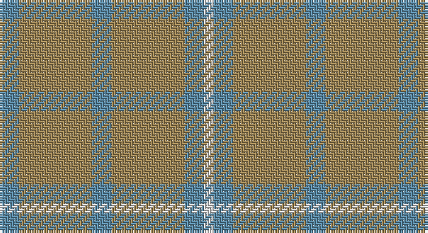

This page is one **sett** — a single exact thread-count. It belongs to the [tartan](/setts/t4lo15t4lo15t4w2/)
(the same proportion at any scale), whose colour order is pattern [BYBYBW](/stripes/bybybw/).

Part of the [Takla Makan](/tartans/takla-makan/) tartan — the named design grouping this sett with its other cloths.

Sourced from register-of-tartans.  It is a [6 stripe tartan](/stripes/stripes6/).

Original link https://www.tartanregister.gov.uk/tartanDetails.aspx?ref=4066

## Also known as

This cloth is also recorded under:

- Takla Makan #2

## Register references

External register numbers recorded for this tartan.

- Scottish Register of Tartans: [4066](https://www.tartanregister.gov.uk/tartanDetails.aspx?ref=4066)
- Scottish Tartans Authority (ITI): 5775

## Thread count
B/8 LT30 B8 LT30 B8 LN/4

One full sett is **164 threads**.

## Palette

Palette: <strong>Tartan Register</strong>
<table><thead><tr><th>Colour</th><th>Threads</th><th>Shade</th><th>Base</th><th>OKLCh</th></tr></thead><tbody><tr><td>B/</td><td style="text-align:right;font-variant-numeric:tabular-nums">8</td><td><code style="background-color:#5C8CA8;">#5C8CA8</code> <small style="color:#888">#5C8CA8</small></td><td>B <code style="background-color:#2A418A;">#2A418A</code></td><td><small style="color:#888">oklch(61.7% 0.067 235.0)</small></td></tr><tr><td>LT</td><td style="text-align:right;font-variant-numeric:tabular-nums">30</td><td><code style="background-color:#A08858;">#A08858</code> <small style="color:#888">#A08858</small></td><td>Y <code style="background-color:#F2BF00;">#F2BF00</code></td><td><small style="color:#888">oklch(63.7% 0.071 84.0)</small></td></tr><tr><td>B</td><td style="text-align:right;font-variant-numeric:tabular-nums">8</td><td><code style="background-color:#5C8CA8;">#5C8CA8</code> <small style="color:#888">#5C8CA8</small></td><td>B <code style="background-color:#2A418A;">#2A418A</code></td><td><small style="color:#888">oklch(61.7% 0.067 235.0)</small></td></tr><tr><td>LT</td><td style="text-align:right;font-variant-numeric:tabular-nums">30</td><td><code style="background-color:#A08858;">#A08858</code> <small style="color:#888">#A08858</small></td><td>Y <code style="background-color:#F2BF00;">#F2BF00</code></td><td><small style="color:#888">oklch(63.7% 0.071 84.0)</small></td></tr><tr><td>B</td><td style="text-align:right;font-variant-numeric:tabular-nums">8</td><td><code style="background-color:#5C8CA8;">#5C8CA8</code> <small style="color:#888">#5C8CA8</small></td><td>B <code style="background-color:#2A418A;">#2A418A</code></td><td><small style="color:#888">oklch(61.7% 0.067 235.0)</small></td></tr><tr><td>LN/</td><td style="text-align:right;font-variant-numeric:tabular-nums">4</td><td><code style="background-color:#E0E0E0;">#E0E0E0</code> <small style="color:#888">#E0E0E0</small></td><td>W <code style="background-color:#F7F7F7;">#F7F7F7</code></td><td><small style="color:#888">oklch(90.7% 0.000 89.9)</small></td></tr></tbody></table>

# Sample pattern

## Compared to the master

This cloth is one sett of its design; the master sett (the exemplar the design is anchored on) is below for comparison.

<figure style="margin:0"><figcaption style="color:#888;font-size:smaller">this sett</figcaption></figure>
<figure style="margin:0"><figcaption style="color:#888;font-size:smaller"><a href="/setts/db1r1w2r12db1r2db1r12w1db1r1db1lb1db1r1db1w1r6k2r7dr4r7k2r6w1db1r1db1lb1db1r1db1w1r12db1r2db1r12w2r1/">master sett →</a></figcaption></figure>

## Nearest tartans

The nearest existing variants by ΔTartan distance, with this tartan at the top so the swatches line up against it.

ΔTartan

Tartan

Sett

—

<a href="/ttd/edit/#slug=t4lo15t4lo15t4w2~x2">Takla Makan #2</a> <a class="nn-out" href="/variants/s6/t4lo15t4lo15t4w2~x2/" title="open its dictionary page">↗</a>

1.60

<a href="/ttd/edit/#slug=n11o1n4o8r1~x8&amp;base=t4lo15t4lo15t4w2~x2">Cairns, David (Personal)</a> <a class="nn-out" href="/variants/s5/n11o1n4o8r1~x8/" title="open its dictionary page">↗</a>

1.85

<a href="/ttd/edit/#slug=t48g25t13ly5~x2&amp;base=t4lo15t4lo15t4w2~x2">Laurel Park</a> <a class="nn-out" href="/variants/s4/t48g25t13ly5~x2/" title="open its dictionary page">↗</a>

2.43

<a href="/variants/s6/y3lo3y20lo20y20lo3~x2/">Barbie's Moss Plaid (Yellow &amp; Green)</a>

2.44

<a href="/ttd/edit/#slug=y37dy9y3do9dy3~x2&amp;base=t4lo15t4lo15t4w2~x2">Glen Boig Trade Tartan</a> <a class="nn-out" href="/variants/s5/y37dy9y3do9dy3~x2/" title="open its dictionary page">↗</a>

2.62

<a href="/ttd/edit/#slug=g6t8o2t2ly2t16g18t4g4t3~x2&amp;base=t4lo15t4lo15t4w2~x2">Blue Ridge</a> <a class="nn-out" href="/variants/s10/g6t8o2t2ly2t16g18t4g4t3~x2/" title="open its dictionary page">↗</a>

2.62

<a href="/ttd/edit/#slug=g6t8o2t2ly2t16g18t4g4t3~x4&amp;base=t4lo15t4lo15t4w2~x2">Blue Ridge (District)</a> <a class="nn-out" href="/variants/s10/g6t8o2t2ly2t16g18t4g4t3~x4/" title="open its dictionary page">↗</a>

2.65

<a href="/ttd/edit/#slug=y9g9lo1g9y9g1~x4&amp;base=t4lo15t4lo15t4w2~x2">Spring Morning</a> <a class="nn-out" href="/variants/s6/y9g9lo1g9y9g1~x4/" title="open its dictionary page">↗</a>

2.69

<a href="/ttd/edit/#slug=db5y15o4y4o24y4o4db5&amp;base=t4lo15t4lo15t4w2~x2">Daks, (Muted Skye)</a> <a class="nn-out" href="/variants/s8/db5y15o4y4o24y4o4db5/" title="open its dictionary page">↗</a>

2.74

<a href="/ttd/edit/#slug=y9yi52dy15ly4~x2&amp;base=t4lo15t4lo15t4w2~x2">McGuigan, Julia (St Monans, Fife) (Personal)</a> <a class="nn-out" href="/variants/s4/y9yi52dy15ly4~x2/" title="open its dictionary page">↗</a>

2.86

<a href="/ttd/edit/#slug=do11n1do4n8r1~x8&amp;base=t4lo15t4lo15t4w2~x2">Cairns, David (Personal)</a> <a class="nn-out" href="/variants/s5/do11n1do4n8r1~x8/" title="open its dictionary page">↗</a>

## Neighbour map

Every grey dot is one of 14360 variants placed by the first two principal components of the ΔTartan feature space (44% of its variance). Red is this tartan; blue dots are its nearest — click one to open its page.

<svg viewBox="0 0 640 380" role="img" style="max-width:100%;height:auto;border:1px solid #e0e0e0;border-radius:4px;display:block" xmlns="http://www.w3.org/2000/svg"><image href="/nn/cloud.v1.png" width="640" height="380"/><a href="/variants/s5/n11o1n4o8r1~x8/"><circle cx="504.6" cy="311.7" r="4" fill="#3465a4"><title>Cairns, David (Personal)</title></circle></a><a href="/variants/s4/t48g25t13ly5~x2/"><circle cx="514.8" cy="334.4" r="4" fill="#3465a4"><title>Laurel Park</title></circle></a><a href="/variants/s6/y3lo3y20lo20y20lo3~x2/"><circle cx="476.6" cy="317.7" r="4" fill="#3465a4"><title>Barbie's Moss Plaid (Yellow &amp; Green)</title></circle></a><a href="/variants/s5/y37dy9y3do9dy3~x2/"><circle cx="554.6" cy="298.1" r="4" fill="#3465a4"><title>Glen Boig Trade Tartan</title></circle></a><a href="/variants/s10/g6t8o2t2ly2t16g18t4g4t3~x2/"><circle cx="417.0" cy="273.4" r="4" fill="#3465a4"><title>Blue Ridge</title></circle></a><a href="/variants/s10/g6t8o2t2ly2t16g18t4g4t3~x4/"><circle cx="417.0" cy="273.4" r="4" fill="#3465a4"><title>Blue Ridge (District)</title></circle></a><a href="/variants/s6/y9g9lo1g9y9g1~x4/"><circle cx="402.3" cy="322.7" r="4" fill="#3465a4"><title>Spring Morning</title></circle></a><a href="/variants/s8/db5y15o4y4o24y4o4db5/"><circle cx="415.1" cy="309.6" r="4" fill="#3465a4"><title>Daks, (Muted Skye)</title></circle></a><a href="/variants/s4/y9yi52dy15ly4~x2/"><circle cx="537.9" cy="304.1" r="4" fill="#3465a4"><title>McGuigan, Julia (St Monans, Fife) (Personal)</title></circle></a><a href="/variants/s5/do11n1do4n8r1~x8/"><circle cx="545.4" cy="340.3" r="4" fill="#3465a4"><title>Cairns, David (Personal)</title></circle></a><circle cx="521.0" cy="315.2" r="5" fill="#c00000"/></svg>

ID: /variants/s6/t4lo15t4lo15t4w2~x2/
