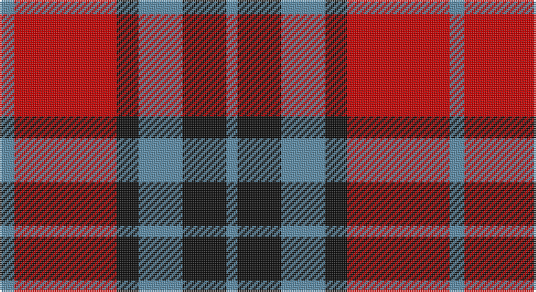

This page is one **sett** — a single exact thread-count. It belongs to the [tartan](/setts/t4r28k6t12k12t3/)
(the same proportion at any scale), whose colour order is pattern [BKBKRB](/stripes/bkbkrb/).

Part of the [Thomson](/tartans/thomson/) tartan — the named design grouping this sett with its other cloths.

Sourced from tartans-authority.  It is a [6 stripe tartan](/stripes/stripes6/).

Original link http://www.tartansauthority.com/tartan-ferret/display/6155/

## Also known as

This cloth is also recorded under:

- Thomson, Grey
- Thomson, Red

## Register references

External register numbers recorded for this tartan.

- Scottish Tartans Authority (ITI): 6155

## Thread count
B/8 R56 K12 B24 K24 B/6

One full sett is **246 threads**.

## Palette

Palette: <strong>Tartan Register</strong>
<table><thead><tr><th>Colour</th><th>Threads</th><th>Shade</th><th>Base</th><th>OKLCh</th></tr></thead><tbody><tr><td>B/</td><td style="text-align:right;font-variant-numeric:tabular-nums">8</td><td><code style="background-color:#5C8CA8;">#5C8CA8</code> <small style="color:#888">#5C8CA8</small></td><td>B <code style="background-color:#2A418A;">#2A418A</code></td><td><small style="color:#888">oklch(61.7% 0.067 235.0)</small></td></tr><tr><td>R</td><td style="text-align:right;font-variant-numeric:tabular-nums">56</td><td><code style="background-color:#C80000;">#C80000</code> <small style="color:#888">#C80000</small></td><td>R <code style="background-color:#CC0000;">#CC0000</code></td><td><small style="color:#888">oklch(52.3% 0.215 29.2)</small></td></tr><tr><td>K</td><td style="text-align:right;font-variant-numeric:tabular-nums">12</td><td><code style="background-color:#101010;">#101010</code> <small style="color:#888">#101010</small></td><td>K <code style="background-color:#000000;">#000000</code></td><td><small style="color:#888">oklch(17.3% 0.000 89.9)</small></td></tr><tr><td>B</td><td style="text-align:right;font-variant-numeric:tabular-nums">24</td><td><code style="background-color:#5C8CA8;">#5C8CA8</code> <small style="color:#888">#5C8CA8</small></td><td>B <code style="background-color:#2A418A;">#2A418A</code></td><td><small style="color:#888">oklch(61.7% 0.067 235.0)</small></td></tr><tr><td>K</td><td style="text-align:right;font-variant-numeric:tabular-nums">24</td><td><code style="background-color:#101010;">#101010</code> <small style="color:#888">#101010</small></td><td>K <code style="background-color:#000000;">#000000</code></td><td><small style="color:#888">oklch(17.3% 0.000 89.9)</small></td></tr><tr><td>B/</td><td style="text-align:right;font-variant-numeric:tabular-nums">6</td><td><code style="background-color:#5C8CA8;">#5C8CA8</code> <small style="color:#888">#5C8CA8</small></td><td>B <code style="background-color:#2A418A;">#2A418A</code></td><td><small style="color:#888">oklch(61.7% 0.067 235.0)</small></td></tr></tbody></table>

# Sample pattern

## Compared to the master

This cloth is one sett of its design; the master sett (the exemplar the design is anchored on) is below for comparison.

<figure style="margin:0"><figcaption style="color:#888;font-size:smaller">this sett</figcaption></figure>
<figure style="margin:0"><figcaption style="color:#888;font-size:smaller"><a href="/setts/r1k1w2k2w2k1w4k1db9ly1/">master sett →</a></figcaption></figure>

## Nearest tartans

The nearest existing variants by ΔTartan distance, with this tartan at the top so the swatches line up against it.

ΔTartan

Tartan

Sett

—

<a href="/ttd/edit/#slug=t4r28k6t12k12t3~x2">Thomson, Red (Name)</a> <a class="nn-out" href="/variants/s6/t4r28k6t12k12t3~x2/" title="open its dictionary page">↗</a>

0.47

<a href="/ttd/edit/#slug=t2r12k2t6k6t1~x2&amp;base=t4r28k6t12k12t3~x2">Thompson/Thomson/MacTavish #2</a> <a class="nn-out" href="/variants/s6/t2r12k2t6k6t1~x2/" title="open its dictionary page">↗</a>

0.64

<a href="/ttd/edit/#slug=db4r30k6db13k13db3~x2&amp;base=t4r28k6t12k12t3~x2">Thompson/Thomson/MacTavish (Bonner)</a> <a class="nn-out" href="/variants/s6/db4r30k6db13k13db3~x2/" title="open its dictionary page">↗</a>

0.95

<a href="/ttd/edit/#slug=db3r25db17r5g22r9db3~x2&amp;base=t4r28k6t12k12t3~x2">MacFadyan (MacGregor Hastie)</a> <a class="nn-out" href="/variants/s7/db3r25db17r5g22r9db3~x2/" title="open its dictionary page">↗</a>

0.96

<a href="/ttd/edit/#slug=dp4r3dp26r26dg26r4~x2&amp;base=t4r28k6t12k12t3~x2">Unidentified #21</a> <a class="nn-out" href="/variants/s6/dp4r3dp26r26dg26r4~x2/" title="open its dictionary page">↗</a>

1.02

<a href="/ttd/edit/#slug=dp3r19dp18g19dp3g3~x2&amp;base=t4r28k6t12k12t3~x2">MacNab 1</a> <a class="nn-out" href="/variants/s6/dp3r19dp18g19dp3g3~x2/" title="open its dictionary page">↗</a>

1.04

<a href="/ttd/edit/#slug=t2r12db2t6k6t1~x2&amp;base=t4r28k6t12k12t3~x2">MacTavish Thomson Clan Tartan</a> <a class="nn-out" href="/variants/s6/t2r12db2t6k6t1~x2/" title="open its dictionary page">↗</a>

1.06

<a href="/ttd/edit/#slug=t2r12db2t6k6t1~x4&amp;base=t4r28k6t12k12t3~x2">Thompson/Thomson/MacTavish</a> <a class="nn-out" href="/variants/s6/t2r12db2t6k6t1~x4/" title="open its dictionary page">↗</a>

1.07

<a href="/ttd/edit/#slug=r4g26r26p26r3p4~x2&amp;base=t4r28k6t12k12t3~x2">Unidentified 16</a> <a class="nn-out" href="/variants/s6/r4g26r26p26r3p4~x2/" title="open its dictionary page">↗</a>

1.08

<a href="/ttd/edit/#slug=k3y28k3r22k8w3~x2&amp;base=t4r28k6t12k12t3~x2">Henkel (Corporate)</a> <a class="nn-out" href="/variants/s6/k3y28k3r22k8w3~x2/" title="open its dictionary page">↗</a>

1.12

<a href="/ttd/edit/#slug=db8r8dg17w3r35db10dg15w3~x2&amp;base=t4r28k6t12k12t3~x2">James of Glencarr (Personal)</a> <a class="nn-out" href="/variants/s8/db8r8dg17w3r35db10dg15w3~x2/" title="open its dictionary page">↗</a>

## Neighbour map

Every grey dot is one of 14360 variants placed by the first two principal components of the ΔTartan feature space (44% of its variance). Red is this tartan; blue dots are its nearest — click one to open its page.

<svg viewBox="0 0 640 380" role="img" style="max-width:100%;height:auto;border:1px solid #e0e0e0;border-radius:4px;display:block" xmlns="http://www.w3.org/2000/svg"><image href="/nn/cloud.v1.png" width="640" height="380"/><a href="/variants/s6/t2r12k2t6k6t1~x2/"><circle cx="239.3" cy="207.3" r="4" fill="#3465a4"><title>Thompson/Thomson/MacTavish #2</title></circle></a><a href="/variants/s6/db4r30k6db13k13db3~x2/"><circle cx="255.2" cy="217.3" r="4" fill="#3465a4"><title>Thompson/Thomson/MacTavish (Bonner)</title></circle></a><a href="/variants/s7/db3r25db17r5g22r9db3~x2/"><circle cx="265.4" cy="234.3" r="4" fill="#3465a4"><title>MacFadyan (MacGregor Hastie)</title></circle></a><a href="/variants/s6/dp4r3dp26r26dg26r4~x2/"><circle cx="232.0" cy="230.5" r="4" fill="#3465a4"><title>Unidentified #21</title></circle></a><a href="/variants/s6/dp3r19dp18g19dp3g3~x2/"><circle cx="210.1" cy="246.7" r="4" fill="#3465a4"><title>MacNab 1</title></circle></a><a href="/variants/s6/t2r12db2t6k6t1~x2/"><circle cx="220.0" cy="195.5" r="4" fill="#3465a4"><title>MacTavish Thomson Clan Tartan</title></circle></a><a href="/variants/s6/t2r12db2t6k6t1~x4/"><circle cx="215.9" cy="193.1" r="4" fill="#3465a4"><title>Thompson/Thomson/MacTavish</title></circle></a><a href="/variants/s6/r4g26r26p26r3p4~x2/"><circle cx="239.6" cy="232.4" r="4" fill="#3465a4"><title>Unidentified 16</title></circle></a><a href="/variants/s6/k3y28k3r22k8w3~x2/"><circle cx="222.1" cy="190.4" r="4" fill="#3465a4"><title>Henkel (Corporate)</title></circle></a><a href="/variants/s8/db8r8dg17w3r35db10dg15w3~x2/"><circle cx="227.4" cy="186.0" r="4" fill="#3465a4"><title>James of Glencarr (Personal)</title></circle></a><circle cx="242.5" cy="218.2" r="5" fill="#c00000"/></svg>

ID: /variants/s6/t4r28k6t12k12t3~x2/
