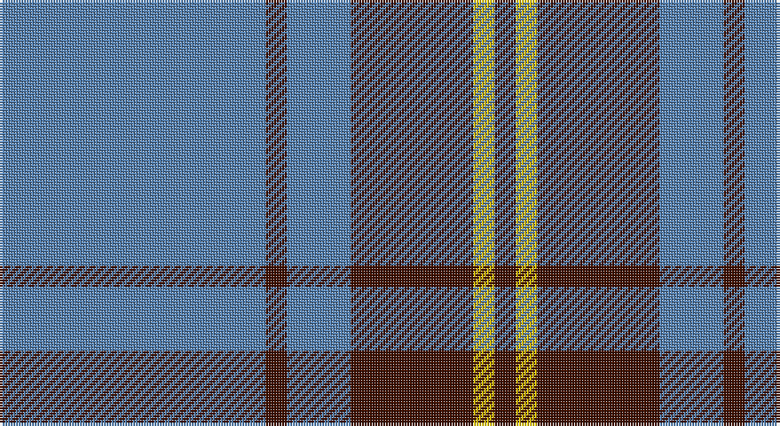

This page is one **sett** — a single exact thread-count. It belongs to the [tartan](/setts/t50dr4t12dr23ly4dr4/)
(the same proportion at any scale), whose colour order is pattern [BBBBYB](/stripes/bbbbyb/).

Sourced from weddslist.  It is a [6 stripe tartan](/stripes/stripes6/).

Original link http://www.weddslist.com/cgi-bin/tartans/pg.pl?source=sts

## Thread count
B/100 DR8 B24 DR46 Y8 DR/8

One full sett is **280 threads**.

## Palette

Palette: <strong>custom</strong>
<table><thead><tr><th>Colour</th><th>Threads</th><th>Shade</th><th>Base</th><th>OKLCh</th></tr></thead><tbody><tr><td>B/</td><td style="text-align:right;font-variant-numeric:tabular-nums">100</td><td><code style="background-color:#5480B0;">#5480B0</code> <small style="color:#888">#5480B0</small></td><td>B <code style="background-color:#2A418A;">#2A418A</code></td><td><small style="color:#888">oklch(58.8% 0.089 251.5)</small></td></tr><tr><td>DR</td><td style="text-align:right;font-variant-numeric:tabular-nums">8</td><td><code style="background-color:#401000;">#401000</code> <small style="color:#888">#401000</small></td><td>B <code style="background-color:#2A418A;">#2A418A</code></td><td><small style="color:#888">oklch(25.3% 0.079 39.9)</small></td></tr><tr><td>B</td><td style="text-align:right;font-variant-numeric:tabular-nums">24</td><td><code style="background-color:#5480B0;">#5480B0</code> <small style="color:#888">#5480B0</small></td><td>B <code style="background-color:#2A418A;">#2A418A</code></td><td><small style="color:#888">oklch(58.8% 0.089 251.5)</small></td></tr><tr><td>DR</td><td style="text-align:right;font-variant-numeric:tabular-nums">46</td><td><code style="background-color:#401000;">#401000</code> <small style="color:#888">#401000</small></td><td>B <code style="background-color:#2A418A;">#2A418A</code></td><td><small style="color:#888">oklch(25.3% 0.079 39.9)</small></td></tr><tr><td>Y</td><td style="text-align:right;font-variant-numeric:tabular-nums">8</td><td><code style="background-color:#F0C000;">#F0C000</code> <small style="color:#888">#F0C000</small></td><td>Y <code style="background-color:#F2BF00;">#F2BF00</code></td><td><small style="color:#888">oklch(82.7% 0.169 90.5)</small></td></tr><tr><td>DR/</td><td style="text-align:right;font-variant-numeric:tabular-nums">8</td><td><code style="background-color:#401000;">#401000</code> <small style="color:#888">#401000</small></td><td>B <code style="background-color:#2A418A;">#2A418A</code></td><td><small style="color:#888">oklch(25.3% 0.079 39.9)</small></td></tr></tbody></table>

# Sample pattern

## Nearest tartans

The nearest existing variants by ΔTartan distance, with this tartan at the top so the swatches line up against it.

ΔTartan

Tartan

Sett

—

<a href="/ttd/edit/#slug=t50dr4t12dr23ly4dr4~x2">Sligo</a> <a class="nn-out" href="/variants/s6/t50dr4t12dr23ly4dr4~x2/" title="open its dictionary page">↗</a>

1.35

<a href="/ttd/edit/#slug=t12ly2t1k5t4k2~x4&amp;base=t50dr4t12dr23ly4dr4~x2">Rea</a> <a class="nn-out" href="/variants/s6/t12ly2t1k5t4k2~x4/" title="open its dictionary page">↗</a>

1.36

<a href="/ttd/edit/#slug=k3t10lo5t29k10r6k2~x2&amp;base=t50dr4t12dr23ly4dr4~x2">Perkins (2015)</a> <a class="nn-out" href="/variants/s7/k3t10lo5t29k10r6k2~x2/" title="open its dictionary page">↗</a>

1.40

<a href="/variants/s6/db60ly6db11r25~x2/">South Australian Pipes &amp; Drums (Corp</a>

1.40

<a href="/ttd/edit/#slug=b11lo2r1lo2r1~x4&amp;base=t50dr4t12dr23ly4dr4~x2">Carlisle Ancient</a> <a class="nn-out" href="/variants/s5/b11lo2r1lo2r1~x4/" title="open its dictionary page">↗</a>

1.40

<a href="/ttd/edit/#slug=k10t30g3t3g3t3r6~x2&amp;base=t50dr4t12dr23ly4dr4~x2">Kinding (Personal)</a> <a class="nn-out" href="/variants/s7/k10t30g3t3g3t3r6~x2/" title="open its dictionary page">↗</a>

1.41

<a href="/ttd/edit/#slug=db2r7db2r7db22ly2~x2&amp;base=t50dr4t12dr23ly4dr4~x2">MacQueen variant</a> <a class="nn-out" href="/variants/s6/db2r7db2r7db22ly2~x2/" title="open its dictionary page">↗</a>

1.41

<a href="/ttd/edit/#slug=t50k4t12k23lo4k4~x2&amp;base=t50dr4t12dr23ly4dr4~x2">Sligo Irish County Tartan</a> <a class="nn-out" href="/variants/s6/t50k4t12k23lo4k4~x2/" title="open its dictionary page">↗</a>

1.44

<a href="/ttd/edit/#slug=db3lo30db40r3~x2&amp;base=t50dr4t12dr23ly4dr4~x2">Sanix Large Muted</a> <a class="nn-out" href="/variants/s4/db3lo30db40r3~x2/" title="open its dictionary page">↗</a>

1.46

<a href="/ttd/edit/#slug=n1k3n1k3n8r1~x8&amp;base=t50dr4t12dr23ly4dr4~x2">Mackay (Blue)</a> <a class="nn-out" href="/variants/s6/n1k3n1k3n8r1~x8/" title="open its dictionary page">↗</a>

1.46

<a href="/ttd/edit/#slug=t37w9t3db9w3~x2&amp;base=t50dr4t12dr23ly4dr4~x2">Loch Lomond</a> <a class="nn-out" href="/variants/s5/t37w9t3db9w3~x2/" title="open its dictionary page">↗</a>

## Neighbour map

Every grey dot is one of 14360 variants placed by the first two principal components of the ΔTartan feature space (44% of its variance). Red is this tartan; blue dots are its nearest — click one to open its page.

<svg viewBox="0 0 640 380" role="img" style="max-width:100%;height:auto;border:1px solid #e0e0e0;border-radius:4px;display:block" xmlns="http://www.w3.org/2000/svg"><image href="/nn/cloud.v1.png" width="640" height="380"/><a href="/variants/s6/t12ly2t1k5t4k2~x4/"><circle cx="363.3" cy="219.2" r="4" fill="#3465a4"><title>Rea</title></circle></a><a href="/variants/s7/k3t10lo5t29k10r6k2~x2/"><circle cx="333.0" cy="183.2" r="4" fill="#3465a4"><title>Perkins (2015)</title></circle></a><a href="/variants/s6/db60ly6db11r25~x2/"><circle cx="409.5" cy="215.7" r="4" fill="#3465a4"><title>South Australian Pipes &amp; Drums (Corp</title></circle></a><a href="/variants/s5/b11lo2r1lo2r1~x4/"><circle cx="395.7" cy="210.1" r="4" fill="#3465a4"><title>Carlisle Ancient</title></circle></a><a href="/variants/s7/k10t30g3t3g3t3r6~x2/"><circle cx="339.2" cy="186.0" r="4" fill="#3465a4"><title>Kinding (Personal)</title></circle></a><a href="/variants/s6/db2r7db2r7db22ly2~x2/"><circle cx="393.5" cy="207.5" r="4" fill="#3465a4"><title>MacQueen variant</title></circle></a><a href="/variants/s6/t50k4t12k23lo4k4~x2/"><circle cx="369.2" cy="198.3" r="4" fill="#3465a4"><title>Sligo Irish County Tartan</title></circle></a><a href="/variants/s4/db3lo30db40r3~x2/"><circle cx="370.8" cy="230.5" r="4" fill="#3465a4"><title>Sanix Large Muted</title></circle></a><a href="/variants/s6/n1k3n1k3n8r1~x8/"><circle cx="361.7" cy="247.5" r="4" fill="#3465a4"><title>Mackay (Blue)</title></circle></a><a href="/variants/s5/t37w9t3db9w3~x2/"><circle cx="381.7" cy="206.8" r="4" fill="#3465a4"><title>Loch Lomond</title></circle></a><circle cx="399.6" cy="207.5" r="5" fill="#c00000"/></svg>

ID: /variants/s6/t50dr4t12dr23ly4dr4~x2/
