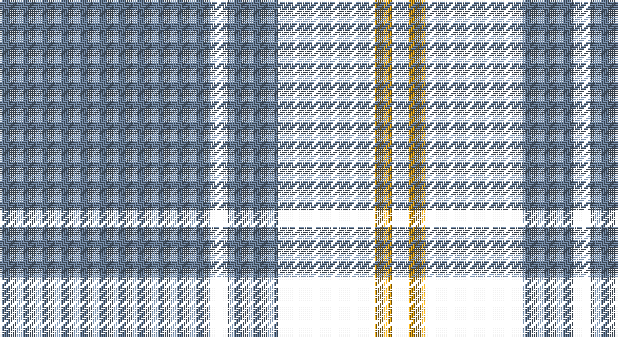

This page is one **sett** — a single exact thread-count. It belongs to the [tartan](/setts/t50k4t12k23lo4k4/)
(the same proportion at any scale), whose colour order is pattern [BKBKYK](/stripes/bkbkyk/).

Sourced from house-of-tartan.  It is a [6 stripe tartan](/stripes/stripes6/).

Original link http://www.house-of-tartan.scotland.net/house/TartanViewjs.asp?colr=Def&tnam=2256

## Provenance

Earliest known date: 1995 One of a series of Irish District tartans designed by Polly Wittering of the House of Edgar, with colours reminiscent of the Country with soft warm colours dominating.

## Thread count
B/100 T8 B24 T46 Y8 T/8

One full sett is **280 threads**.

## Palette

Palette: <strong>custom</strong>
<table><thead><tr><th>Colour</th><th>Threads</th><th>Shade</th><th>Base</th><th>OKLCh</th></tr></thead><tbody><tr><td>B/</td><td style="text-align:right;font-variant-numeric:tabular-nums">100</td><td><code style="background-color:#687C94;">#687C94</code> <small style="color:#888">#687C94</small></td><td>B <code style="background-color:#2A418A;">#2A418A</code></td><td><small style="color:#888">oklch(57.9% 0.044 253.2)</small></td></tr><tr><td></td><td style="text-align:right;font-variant-numeric:tabular-nums">8</td><td><code style="background-color:;"></code> <small style="color:#888"></small></td><td> <code style="background-color:;"></code></td><td><small style="color:#888"></small></td></tr><tr><td>B</td><td style="text-align:right;font-variant-numeric:tabular-nums">24</td><td><code style="background-color:#687C94;">#687C94</code> <small style="color:#888">#687C94</small></td><td>B <code style="background-color:#2A418A;">#2A418A</code></td><td><small style="color:#888">oklch(57.9% 0.044 253.2)</small></td></tr><tr><td></td><td style="text-align:right;font-variant-numeric:tabular-nums">46</td><td><code style="background-color:;"></code> <small style="color:#888"></small></td><td> <code style="background-color:;"></code></td><td><small style="color:#888"></small></td></tr><tr><td>Y</td><td style="text-align:right;font-variant-numeric:tabular-nums">8</td><td><code style="background-color:#D49C1C;">#D49C1C</code> <small style="color:#888">#D49C1C</small></td><td>Y <code style="background-color:#F2BF00;">#F2BF00</code></td><td><small style="color:#888">oklch(72.7% 0.144 81.4)</small></td></tr><tr><td>/</td><td style="text-align:right;font-variant-numeric:tabular-nums">8</td><td><code style="background-color:;"></code> <small style="color:#888"></small></td><td> <code style="background-color:;"></code></td><td><small style="color:#888"></small></td></tr></tbody></table>

# Sample pattern

## Nearest tartans

The nearest existing variants by ΔTartan distance, with this tartan at the top so the swatches line up against it.

ΔTartan

Tartan

Sett

—

<a href="/ttd/edit/#slug=t50k4t12k23lo4k4~x2">Sligo Irish County Tartan</a> <a class="nn-out" href="/variants/s6/t50k4t12k23lo4k4~x2/" title="open its dictionary page">↗</a>

0.87

<a href="/ttd/edit/#slug=k2lb5k1lb1k10r1k1~x4&amp;base=t50k4t12k23lo4k4~x2">Lundy Reform</a> <a class="nn-out" href="/variants/s7/k2lb5k1lb1k10r1k1~x4/" title="open its dictionary page">↗</a>

0.87

<a href="/ttd/edit/#slug=k37w9k3dg9w3~x2&amp;base=t50k4t12k23lo4k4~x2">Glen Coe Trade Tartan</a> <a class="nn-out" href="/variants/s5/k37w9k3dg9w3~x2/" title="open its dictionary page">↗</a>

0.91

<a href="/ttd/edit/#slug=k37w9k3g9w3~x2&amp;base=t50k4t12k23lo4k4~x2">Glen Coe #1 (Fashion)</a> <a class="nn-out" href="/variants/s5/k37w9k3g9w3~x2/" title="open its dictionary page">↗</a>

1.04

<a href="/ttd/edit/#slug=k39o3k3o3k14o28r3~x2&amp;base=t50k4t12k23lo4k4~x2">Moffat (1984)</a> <a class="nn-out" href="/variants/s7/k39o3k3o3k14o28r3~x2/" title="open its dictionary page">↗</a>

1.09

<a href="/ttd/edit/#slug=k1o2k7o11k18ly2k1~x2&amp;base=t50k4t12k23lo4k4~x2">DDB Canada (Fashion)</a> <a class="nn-out" href="/variants/s7/k1o2k7o11k18ly2k1~x2/" title="open its dictionary page">↗</a>

1.18

<a href="/ttd/edit/#slug=k13o1k1o1k4o10ly1o1~x6&amp;base=t50k4t12k23lo4k4~x2">West Point</a> <a class="nn-out" href="/variants/s8/k13o1k1o1k4o10ly1o1~x6/" title="open its dictionary page">↗</a>

1.27

<a href="/ttd/edit/#slug=k16w30lb36k10lb10k83lb6&amp;base=t50k4t12k23lo4k4~x2">Glasgow Warriors</a> <a class="nn-out" href="/variants/s7/k16w30lb36k10lb10k83lb6/" title="open its dictionary page">↗</a>

1.30

<a href="/ttd/edit/#slug=db37w9db3r9w3~x2&amp;base=t50k4t12k23lo4k4~x2">Glen Moy</a> <a class="nn-out" href="/variants/s5/db37w9db3r9w3~x2/" title="open its dictionary page">↗</a>

1.32

<a href="/ttd/edit/#slug=w8k16w2db2w1k1~x4&amp;base=t50k4t12k23lo4k4~x2">Ikelman No 1</a> <a class="nn-out" href="/variants/s6/w8k16w2db2w1k1~x4/" title="open its dictionary page">↗</a>

1.33

<a href="/ttd/edit/#slug=k5w25r6k45w4~x2&amp;base=t50k4t12k23lo4k4~x2">Shembe Zulu Church</a> <a class="nn-out" href="/variants/s5/k5w25r6k45w4~x2/" title="open its dictionary page">↗</a>

## Neighbour map

Every grey dot is one of 14360 variants placed by the first two principal components of the ΔTartan feature space (44% of its variance). Red is this tartan; blue dots are its nearest — click one to open its page.

<svg viewBox="0 0 640 380" role="img" style="max-width:100%;height:auto;border:1px solid #e0e0e0;border-radius:4px;display:block" xmlns="http://www.w3.org/2000/svg"><image href="/nn/cloud.v1.png" width="640" height="380"/><a href="/variants/s7/k2lb5k1lb1k10r1k1~x4/"><circle cx="376.1" cy="196.2" r="4" fill="#3465a4"><title>Lundy Reform</title></circle></a><a href="/variants/s5/k37w9k3dg9w3~x2/"><circle cx="372.6" cy="208.0" r="4" fill="#3465a4"><title>Glen Coe Trade Tartan</title></circle></a><a href="/variants/s5/k37w9k3g9w3~x2/"><circle cx="363.1" cy="202.8" r="4" fill="#3465a4"><title>Glen Coe #1 (Fashion)</title></circle></a><a href="/variants/s7/k39o3k3o3k14o28r3~x2/"><circle cx="372.2" cy="198.8" r="4" fill="#3465a4"><title>Moffat (1984)</title></circle></a><a href="/variants/s7/k1o2k7o11k18ly2k1~x2/"><circle cx="394.7" cy="188.2" r="4" fill="#3465a4"><title>DDB Canada (Fashion)</title></circle></a><a href="/variants/s8/k13o1k1o1k4o10ly1o1~x6/"><circle cx="350.9" cy="183.3" r="4" fill="#3465a4"><title>West Point</title></circle></a><a href="/variants/s7/k16w30lb36k10lb10k83lb6/"><circle cx="290.5" cy="187.1" r="4" fill="#3465a4"><title>Glasgow Warriors</title></circle></a><a href="/variants/s5/db37w9db3r9w3~x2/"><circle cx="368.2" cy="202.6" r="4" fill="#3465a4"><title>Glen Moy</title></circle></a><a href="/variants/s6/w8k16w2db2w1k1~x4/"><circle cx="325.0" cy="176.5" r="4" fill="#3465a4"><title>Ikelman No 1</title></circle></a><a href="/variants/s5/k5w25r6k45w4~x2/"><circle cx="315.9" cy="199.2" r="4" fill="#3465a4"><title>Shembe Zulu Church</title></circle></a><circle cx="369.2" cy="198.3" r="5" fill="#c00000"/></svg>

ID: /variants/s6/t50k4t12k23lo4k4~x2/
