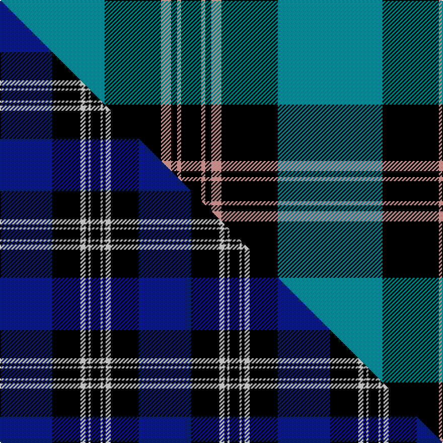

This is one **variant** — a specific cloth: this exact thread count and colourway, with its own
provenance below. It is one weaving of the [sett](/tartans/s/st/st-andrews-earl-of/) (the scale-free proportion — the
same cloth at any scale or shade), whose colour order is pattern [BKYKYK](/stripes/bkykyk/).

Part of the [St Andrews, Earl of](/tartans/s/st/st-andrews-earl-of/) tartan — the named design grouping this sett with its other cloths.

Sourced from tartans-authority.  It is a [6 stripe tartan](/stripes/stripes6/).

Original link <code>http://www.tartansauthority.com/tartan-ferret/display/85/</code> — retired · [Internet Archive copy](https://web.archive.org/web/*/http://www.tartansauthority.com/tartan-ferret/display/85/*)

Dataset <small>— provenance for this record, inherited from the source manifest</small>

<dl class="dataset-prov">
<dt>source</dt><dd><a href="/sources/tartans-authority/">Scottish Tartans Authority</a></dd>
<dt>data captured from</dt><dd><a href="https://github.com/thetartan/tartan-database/blob/master/data/tartans-authority/data.csv">https://github.com/thetartan/tartan-database/blob/master/data/tartans-authority/data.csv</a></dd>
<dt>data date</dt><dd>1930 <small>(this record)</small></dd>
<dt>licence</dt><dd><a href="https://creativecommons.org/licenses/by-nc-nd/4.0/">CC BY-NC-ND 4.0</a></dd>
</dl>

Capture chain <small>— the hands this data passed through, oldest first; each capture carries its own licence</small>

<ol class="capture-chain">
<li><a href="https://www.tartansauthority.com/">Scottish Tartans Authority</a> <small>the heritage body’s archive — its tartan-ferret record browser is retired; dead record links are shown unlinked, with an Internet Archive copy (ITI numbers are not SRT references)</small></li>
<li><a href="https://github.com/thetartan/tartan-database">thetartan/tartan-database</a> <small>2016-2017</small> · <a href="https://creativecommons.org/licenses/by-nc-nd/4.0/">CC BY-NC-ND 4.0</a> <small>Levko Kravets's frozen compilation — the capture we vendored, and where its CC licence text came from</small></li>
<li>this dictionary <small>captured 2026-06-10 · commit 5bf86c7566</small> <small>each re-capture is a git commit to data/sources</small></li>
</ol>

## Register references

External register numbers recorded for this tartan.

- Scottish Tartans Authority (ITI): 85

## Thread count
T/104 K56 LR10 K6 LR4 K/20

One full sett is **276 threads**.

## Palette
<table><thead><tr><th>Colour</th><th>Shade</th><th>OKLCh</th></tr></thead><tbody><tr><td>T</td><td><code style="background-color:#00879F;">#00879F</code> <small style="color:#888">#00879F</small></td><td><small style="color:#888">oklch(57.4% 0.102 216.1)</small></td></tr><tr><td>K</td><td><code style="background-color:#000000;">#000000</code> <small style="color:#888">#000000</small></td><td><small style="color:#888">oklch(0.0% 0.000 0.0)</small></td></tr><tr><td>LR</td><td><code style="background-color:#FF9C97;">#FF9C97</code> <small style="color:#888">#FF9C97</small></td><td><small style="color:#888">oklch(79.3% 0.119 23.2)</small></td></tr></tbody></table>

# Sample pattern

[Sample sheet (PDF)](swatch.pdf) — the woven sample, thread count and palette on one printable A4, rendered on demand (the same sheet the TTD print page downloads).

## Compared to the master

This cloth is one sett of its design; the master sett (the exemplar the design is anchored on) is below for comparison.

Its **ΔTartan distance** from the master is **0.68** — the same measure the nearest-tartans table ranks by (0 is identical; a re-scale of the same cloth is near 0, a recolour or a different proportion further).

<figure class="master-compare" style="margin:0">

this sett
master sett ★

<figcaption style="color:#888;font-size:smaller">One weave of this sett against the <a href="/setts/db52k28w5k3w2k10/">master sett ★</a>, split on the diagonal: a shared proportion runs seamlessly across it with only the shades shifting; a different proportion breaks on it.</figcaption>
</figure>

## Nearest tartan variants

The nearest existing variants by ΔTartan distance, with this cloth at the top so the swatches line up against it.

ΔTartan

Threads

Variant

Sett

—

276

<a href="/variants/s6/t52k28lr5k3lr2k10~x2/">St. Andrews, Earl of (District)</a>

<a href="/ttd/edit/#slug=db52k28w5k3w2k10&amp;base=t52k28lr5k3lr2k10~x2" title="compare in the TTD">0.68</a>

138

<a href="/variants/s6/db52k28w5k3w2k10/">St Andrews, Earl of</a>

<a href="/ttd/edit/#slug=k3db30k8w8k2r3~x2&amp;base=t52k28lr5k3lr2k10~x2" title="compare in the TTD">1.11</a>

204

<a href="/variants/s6/k3db30k8w8k2r3~x2/">Hydro-Electric</a>

<a href="/ttd/edit/#slug=k1ly2k3db12k18w1~x2&amp;base=t52k28lr5k3lr2k10~x2" title="compare in the TTD">1.56</a>

144

<a href="/variants/s6/k1ly2k3db12k18w1~x2/">Jon's Theme (Fashion)</a>

<a href="/ttd/edit/#slug=k4ly4lb32ly1k32ly4k2~x4&amp;base=t52k28lr5k3lr2k10~x2" title="compare in the TTD">1.81</a>

608

<a href="/variants/s7/k4ly4lb32ly1k32ly4k2~x4/">Gleneagles Gold (Dalgleish)</a>

<a href="/ttd/edit/#slug=dr3k1t27k27w3~x2&amp;base=t52k28lr5k3lr2k10~x2" title="compare in the TTD">1.82</a>

232

<a href="/variants/s5/dr3k1t27k27w3~x2/">Bro-Spirit of Northmen (Corporate)</a>

<a href="/ttd/edit/#slug=k4lb2k28t30k1t3~x2&amp;base=t52k28lr5k3lr2k10~x2" title="compare in the TTD">2.00</a>

258

<a href="/variants/s6/k4lb2k28t30k1t3~x2/">Ramsay Blue Hunting</a>

<a href="/ttd/edit/#slug=k36r3k3r3k9t36g3t2~x2&amp;base=t52k28lr5k3lr2k10~x2" title="compare in the TTD">2.01</a>

304

<a href="/variants/s8/k36r3k3r3k9t36g3t2~x2/">Home (Clan)</a>

<a href="/ttd/edit/#slug=k4y1k20t20k1t4~x4&amp;base=t52k28lr5k3lr2k10~x2" title="compare in the TTD">2.02</a>

368

<a href="/variants/s6/k4y1k20t20k1t4~x4/">Oakleigh (Corporate)</a>

<a href="/ttd/edit/#slug=k3w2k18t18k2t3~x4&amp;base=t52k28lr5k3lr2k10~x2" title="compare in the TTD">2.06</a>

344

<a href="/variants/s6/k3w2k18t18k2t3~x4/">Swan (Name)</a>

<a href="/ttd/edit/#slug=k3w2k18b18k2b3~x4&amp;base=t52k28lr5k3lr2k10~x2" title="compare in the TTD">2.06</a>

344

<a href="/variants/s6/k3w2k18b18k2b3~x4/">Swan</a>

## Neighbour map

Every grey dot is one of 13662 variants placed by the first two principal components of the ΔTartan feature space (42% of its variance). Red is this tartan; blue dots are its nearest — click one to open its page. The map is a flat projection of a many-dimensional space — [how to read it](/posts/neighbourhood-maps/).

<svg viewBox="0 0 640 380" role="img" style="max-width:100%;height:auto;border:1px solid #e0e0e0;border-radius:4px;display:block" xmlns="http://www.w3.org/2000/svg"><image href="/nn/cloud.v1.png" width="640" height="380"/><a href="/variants/s6/db52k28w5k3w2k10/"><circle cx="323.2" cy="152.0" r="4" fill="#3465a4"><title>St Andrews, Earl of</title></circle></a><a href="/variants/s6/k3db30k8w8k2r3~x2/"><circle cx="259.6" cy="148.4" r="4" fill="#3465a4"><title>Hydro-Electric</title></circle></a><a href="/variants/s6/k1ly2k3db12k18w1~x2/"><circle cx="322.2" cy="150.7" r="4" fill="#3465a4"><title>Jon's Theme (Fashion)</title></circle></a><a href="/variants/s7/k4ly4lb32ly1k32ly4k2~x4/"><circle cx="270.0" cy="120.2" r="4" fill="#3465a4"><title>Gleneagles Gold (Dalgleish)</title></circle></a><a href="/variants/s5/dr3k1t27k27w3~x2/"><circle cx="258.6" cy="149.5" r="4" fill="#3465a4"><title>Bro-Spirit of Northmen (Corporate)</title></circle></a><a href="/variants/s6/k4lb2k28t30k1t3~x2/"><circle cx="311.6" cy="145.2" r="4" fill="#3465a4"><title>Ramsay Blue Hunting</title></circle></a><a href="/variants/s8/k36r3k3r3k9t36g3t2~x2/"><circle cx="259.6" cy="127.6" r="4" fill="#3465a4"><title>Home (Clan)</title></circle></a><a href="/variants/s6/k4y1k20t20k1t4~x4/"><circle cx="299.4" cy="165.0" r="4" fill="#3465a4"><title>Oakleigh (Corporate)</title></circle></a><a href="/variants/s6/k3w2k18t18k2t3~x4/"><circle cx="262.7" cy="198.0" r="4" fill="#3465a4"><title>Swan (Name)</title></circle></a><a href="/variants/s6/k3w2k18b18k2b3~x4/"><circle cx="266.7" cy="195.6" r="4" fill="#3465a4"><title>Swan</title></circle></a><circle cx="305.1" cy="150.5" r="5" fill="#c00000"/><text x="320" y="376" text-anchor="middle" font-size="11" fill="#999">ground</text><text x="11" y="190" text-anchor="middle" font-size="11" fill="#999" transform="rotate(-90 11 190)">complexity</text></svg>

ID: /variants/s6/t52k28lr5k3lr2k10~x2/
