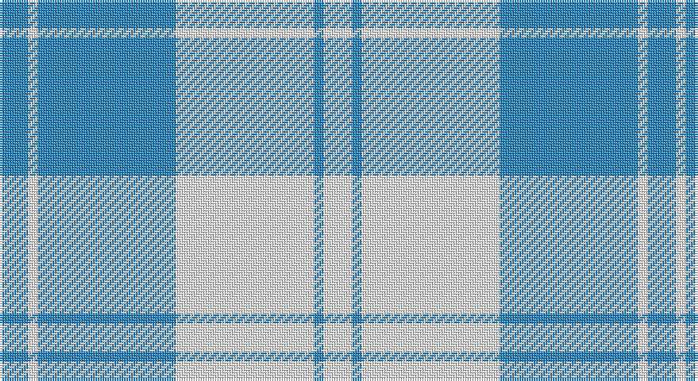

This page is one **sett** — a single exact thread-count. It belongs to the [tartan](/setts/t6w2t29w29t2w6/)
(the same proportion at any scale), whose colour order is pattern [BWBWBW](/stripes/bwbwbw/).

Sourced from tartans-authority.  It is a [6 stripe tartan](/stripes/stripes6/).

Original link http://www.tartansauthority.com/tartan-ferret/display/4820/

## Also known as

This cloth is also recorded under:

- Erskine, Lt Blue

## Register references

External register numbers recorded for this tartan.

- Scottish Tartans Authority (ITI): 4820

## Thread count
B/12 W4 B58 W58 B4 W/12

One full sett is **272 threads**.

## Palette

Palette: <strong>Tartan Register</strong>
<table><thead><tr><th>Colour</th><th>Threads</th><th>Shade</th><th>Base</th><th>OKLCh</th></tr></thead><tbody><tr><td>B/</td><td style="text-align:right;font-variant-numeric:tabular-nums">12</td><td><code style="background-color:#2888C4;">#2888C4</code> <small style="color:#888">#2888C4</small></td><td>B <code style="background-color:#2A418A;">#2A418A</code></td><td><small style="color:#888">oklch(60.1% 0.125 241.5)</small></td></tr><tr><td>W</td><td style="text-align:right;font-variant-numeric:tabular-nums">4</td><td><code style="background-color:#FCFCFC;">#FCFCFC</code> <small style="color:#888">#FCFCFC</small></td><td>W <code style="background-color:#F7F7F7;">#F7F7F7</code></td><td><small style="color:#888">oklch(99.1% 0.000 89.9)</small></td></tr><tr><td>B</td><td style="text-align:right;font-variant-numeric:tabular-nums">58</td><td><code style="background-color:#2888C4;">#2888C4</code> <small style="color:#888">#2888C4</small></td><td>B <code style="background-color:#2A418A;">#2A418A</code></td><td><small style="color:#888">oklch(60.1% 0.125 241.5)</small></td></tr><tr><td>W</td><td style="text-align:right;font-variant-numeric:tabular-nums">58</td><td><code style="background-color:#FCFCFC;">#FCFCFC</code> <small style="color:#888">#FCFCFC</small></td><td>W <code style="background-color:#F7F7F7;">#F7F7F7</code></td><td><small style="color:#888">oklch(99.1% 0.000 89.9)</small></td></tr><tr><td>B</td><td style="text-align:right;font-variant-numeric:tabular-nums">4</td><td><code style="background-color:#2888C4;">#2888C4</code> <small style="color:#888">#2888C4</small></td><td>B <code style="background-color:#2A418A;">#2A418A</code></td><td><small style="color:#888">oklch(60.1% 0.125 241.5)</small></td></tr><tr><td>W/</td><td style="text-align:right;font-variant-numeric:tabular-nums">12</td><td><code style="background-color:#FCFCFC;">#FCFCFC</code> <small style="color:#888">#FCFCFC</small></td><td>W <code style="background-color:#F7F7F7;">#F7F7F7</code></td><td><small style="color:#888">oklch(99.1% 0.000 89.9)</small></td></tr></tbody></table>

# Sample pattern

## Nearest tartans

The nearest existing variants by ΔTartan distance, with this tartan at the top so the swatches line up against it.

ΔTartan

Tartan

Sett

—

<a href="/ttd/edit/#slug=t6w2t29w29t2w6~x2">Erskine, Lt Blue (Dance)</a> <a class="nn-out" href="/variants/s6/t6w2t29w29t2w6~x2/" title="open its dictionary page">↗</a>

0.99

<a href="/ttd/edit/#slug=t5w2t25w25t2w5~x2&amp;base=t6w2t29w29t2w6~x2">Erskine Blue Dress Clan Tartan</a> <a class="nn-out" href="/variants/s6/t5w2t25w25t2w5~x2/" title="open its dictionary page">↗</a>

1.79

<a href="/ttd/edit/#slug=db6w2db29w29db2w6~x2&amp;base=t6w2t29w29t2w6~x2">Erskine Blue (Dance)</a> <a class="nn-out" href="/variants/s6/db6w2db29w29db2w6~x2/" title="open its dictionary page">↗</a>

1.81

<a href="/ttd/edit/#slug=b6ly2b21ly2b6ly24b2ly6~x2&amp;base=t6w2t29w29t2w6~x2">MacLachlan (Chief's Dress) Blue</a> <a class="nn-out" href="/variants/s8/b6ly2b21ly2b6ly24b2ly6~x2/" title="open its dictionary page">↗</a>

1.90

<a href="/ttd/edit/#slug=ly5db15lb5db5lb40ly3~x2&amp;base=t6w2t29w29t2w6~x2">Legary</a> <a class="nn-out" href="/variants/s6/ly5db15lb5db5lb40ly3~x2/" title="open its dictionary page">↗</a>

1.93

<a href="/ttd/edit/#slug=lb40w25dt16lb8dt4~x2&amp;base=t6w2t29w29t2w6~x2">Louise Beveridge (Personal)</a> <a class="nn-out" href="/variants/s5/lb40w25dt16lb8dt4~x2/" title="open its dictionary page">↗</a>

1.95

<a href="/ttd/edit/#slug=w4k2w26t23w3t8p3~x2&amp;base=t6w2t29w29t2w6~x2">MacPherson Turquoise Dress Tartan</a> <a class="nn-out" href="/variants/s7/w4k2w26t23w3t8p3~x2/" title="open its dictionary page">↗</a>

2.03

<a href="/ttd/edit/#slug=n6lb2n25lb25n2lb6~x2&amp;base=t6w2t29w29t2w6~x2">Erskine, Grey</a> <a class="nn-out" href="/variants/s6/n6lb2n25lb25n2lb6~x2/" title="open its dictionary page">↗</a>

2.07

<a href="/ttd/edit/#slug=w7db16w20db3w3ly3~x2&amp;base=t6w2t29w29t2w6~x2">Unidentified (Shirt)</a> <a class="nn-out" href="/variants/s6/w7db16w20db3w3ly3~x2/" title="open its dictionary page">↗</a>

2.10

<a href="/ttd/edit/#slug=dt3w16dt4w3dt12w2~x3&amp;base=t6w2t29w29t2w6~x2">MacMugen</a> <a class="nn-out" href="/variants/s6/dt3w16dt4w3dt12w2~x3/" title="open its dictionary page">↗</a>

2.13

<a href="/ttd/edit/#slug=w2db1w15t12w1ly3db1~x6&amp;base=t6w2t29w29t2w6~x2">St. John's (Corporate)</a> <a class="nn-out" href="/variants/s7/w2db1w15t12w1ly3db1~x6/" title="open its dictionary page">↗</a>

## Neighbour map

Every grey dot is one of 14360 variants placed by the first two principal components of the ΔTartan feature space (44% of its variance). Red is this tartan; blue dots are its nearest — click one to open its page.

<svg viewBox="0 0 640 380" role="img" style="max-width:100%;height:auto;border:1px solid #e0e0e0;border-radius:4px;display:block" xmlns="http://www.w3.org/2000/svg"><image href="/nn/cloud.v1.png" width="640" height="380"/><a href="/variants/s6/t5w2t25w25t2w5~x2/"><circle cx="364.4" cy="224.1" r="4" fill="#3465a4"><title>Erskine Blue Dress Clan Tartan</title></circle></a><a href="/variants/s6/db6w2db29w29db2w6~x2/"><circle cx="319.0" cy="191.0" r="4" fill="#3465a4"><title>Erskine Blue (Dance)</title></circle></a><a href="/variants/s8/b6ly2b21ly2b6ly24b2ly6~x2/"><circle cx="325.2" cy="189.6" r="4" fill="#3465a4"><title>MacLachlan (Chief's Dress) Blue</title></circle></a><a href="/variants/s6/ly5db15lb5db5lb40ly3~x2/"><circle cx="332.9" cy="176.2" r="4" fill="#3465a4"><title>Legary</title></circle></a><a href="/variants/s5/lb40w25dt16lb8dt4~x2/"><circle cx="261.2" cy="233.2" r="4" fill="#3465a4"><title>Louise Beveridge (Personal)</title></circle></a><a href="/variants/s7/w4k2w26t23w3t8p3~x2/"><circle cx="277.7" cy="173.1" r="4" fill="#3465a4"><title>MacPherson Turquoise Dress Tartan</title></circle></a><a href="/variants/s6/n6lb2n25lb25n2lb6~x2/"><circle cx="355.8" cy="222.2" r="4" fill="#3465a4"><title>Erskine, Grey</title></circle></a><a href="/variants/s6/w7db16w20db3w3ly3~x2/"><circle cx="285.1" cy="219.6" r="4" fill="#3465a4"><title>Unidentified (Shirt)</title></circle></a><a href="/variants/s6/dt3w16dt4w3dt12w2~x3/"><circle cx="293.2" cy="227.3" r="4" fill="#3465a4"><title>MacMugen</title></circle></a><a href="/variants/s7/w2db1w15t12w1ly3db1~x6/"><circle cx="286.3" cy="154.5" r="4" fill="#3465a4"><title>St. John's (Corporate)</title></circle></a><circle cx="342.4" cy="202.6" r="5" fill="#c00000"/></svg>

ID: /variants/s6/t6w2t29w29t2w6~x2/
