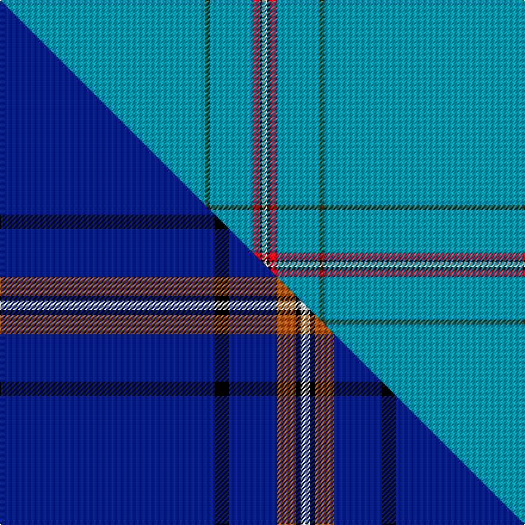

This is one **variant** — a specific cloth: this exact thread count and colourway, with its own
provenance below. It is one weaving of the [sett](/setts/t86dy2t18r3k1w2/) (the scale-free proportion — the
same cloth at any scale or shade), whose colour order is pattern [BGBRKW](/stripes/bgbrkw/).

Part of the [Wylie](/tartans/w/wy/wylie/) tartan — the named design grouping this sett with its other cloths.

Sourced from register-of-tartans.  It is a [6 stripe tartan](/stripes/stripes6/).

Original link [https://www.tartanregister.gov.uk/tartanDetails.aspx?ref=4789](https://www.tartanregister.gov.uk/tartanDetails.aspx?ref=4789)

Dataset <small>— provenance for this record, inherited from the source manifest</small>

<dl class="dataset-prov">
<dt>source</dt><dd><a href="/sources/register-of-tartans/">Scottish Register of Tartans</a></dd>
<dt>data captured from</dt><dd><a href="https://github.com/thetartan/tartan-database/blob/master/data/register-of-tartans/data.csv">https://github.com/thetartan/tartan-database/blob/master/data/register-of-tartans/data.csv</a></dd>
<dt>data date</dt><dd>1999 <small>(this record)</small></dd>
<dt>licence</dt><dd><a href="https://www.tartanregister.gov.uk/copyright">Crown copyright</a></dd>
</dl>

Capture chain <small>— the hands this data passed through, oldest first; each capture carries its own licence</small>

<ol class="capture-chain">
<li><a href="https://www.tartanregister.gov.uk/">Scottish Register of Tartans</a> · <a href="https://www.tartanregister.gov.uk/copyright">Crown copyright</a> <small>the living register — still published by National Records of Scotland</small></li>
<li><a href="https://github.com/thetartan/tartan-database">thetartan/tartan-database</a> <small>2016-2017</small> · <a href="https://creativecommons.org/licenses/by-nc-nd/4.0/">CC BY-NC-ND 4.0</a> <small>Levko Kravets's frozen compilation — the capture we vendored, and where its CC licence text came from</small></li>
<li>this dictionary <small>captured 2026-06-10 · commit 5bf86c7566</small> <small>each re-capture is a git commit to data/sources</small></li>
</ol>

## Register references

External register numbers recorded for this tartan.

- Scottish Register of Tartans: [4789](https://www.tartanregister.gov.uk/tartanDetails.aspx?ref=4789)
- Scottish Tartans Authority (ITI): 4035

## Thread count
T/172 DY4 T36 R6 K2 W/4

One full sett is **272 threads**.

## Palette
<table><thead><tr><th>Colour</th><th>Shade</th><th>OKLCh</th></tr></thead><tbody><tr><td>T</td><td><code style="background-color:#00879F;">#00879F</code> <small style="color:#888">#00879F</small></td><td><small style="color:#888">oklch(57.4% 0.102 216.1)</small></td></tr><tr><td>K</td><td><code style="background-color:#000000;">#000000</code> <small style="color:#888">#000000</small></td><td><small style="color:#888">oklch(0.0% 0.000 0.0)</small></td></tr><tr><td>W</td><td><code style="background-color:#F7F7F7;">#F7F7F7</code> <small style="color:#888">#F7F7F7</small></td><td><small style="color:#888">oklch(97.6% 0.000 89.9)</small></td></tr><tr><td>R</td><td><code style="background-color:#D60020;">#D60020</code> <small style="color:#888">#D60020</small></td><td><small style="color:#888">oklch(55.2% 0.224 25.5)</small></td></tr><tr><td>DY</td><td><code style="background-color:#3A2B0D;">#3A2B0D</code> <small style="color:#888">#3A2B0D</small></td><td><small style="color:#888">oklch(30.0% 0.049 82.0)</small></td></tr></tbody></table>

# Sample pattern

## Compared to the master

This cloth is one sett of its design; the master sett (the exemplar the design is anchored on) is below for comparison.

Its **ΔTartan distance** from the master is **1.07** — the same measure the nearest-tartans table ranks by (0 is identical; a re-scale of the same cloth is near 0, a recolour or a different proportion further).

<figure class="master-compare" style="margin:0">

this sett
master sett ★

<figcaption style="color:#888;font-size:smaller">One weave of this sett against the <a href="/setts/db45k3db10o4k1w2/">master sett ★</a>, split on the diagonal: a shared proportion runs seamlessly across it with only the shades shifting; a different proportion breaks on it.</figcaption>
</figure>

## Nearest tartan variants

The nearest existing variants by ΔTartan distance, with this cloth at the top so the swatches line up against it.

ΔTartan

Threads

Variant

Sett

—

272

<a href="/variants/s6/t86dy2t18r3k1w2~x2/">Wylie (Ancient)</a>

<a href="/ttd/edit/#slug=db45y3db10dg4k1w2~x2&amp;base=t86dy2t18r3k1w2~x2" title="compare in the TTD">0.82</a>

166

<a href="/variants/s6/db45y3db10dg4k1w2~x2/">Wylie</a>

<a href="/ttd/edit/#slug=db45ly3db10o4k1w2~x4&amp;base=t86dy2t18r3k1w2~x2" title="compare in the TTD">0.82</a>

332

<a href="/variants/s6/db45ly3db10o4k1w2~x4/">Wylie (Name)</a>

<a href="/ttd/edit/#slug=db140r11db14y11&amp;base=t86dy2t18r3k1w2~x2" title="compare in the TTD">1.15</a>

201

<a href="/variants/s4/db140r11db14y11/">Gem</a>

<a href="/ttd/edit/#slug=db32r3db4y3~x2&amp;base=t86dy2t18r3k1w2~x2" title="compare in the TTD">1.17</a>

98

<a href="/variants/s4/db32r3db4y3~x2/">MacLaine of Lochbuie</a>

<a href="/ttd/edit/#slug=r5db40w1db13dg8k4~x2&amp;base=t86dy2t18r3k1w2~x2" title="compare in the TTD">1.17</a>

266

<a href="/variants/s6/r5db40w1db13dg8k4~x2/">London Caledonian Rugby Club</a>

<a href="/ttd/edit/#slug=db32r3db4k1y3&amp;base=t86dy2t18r3k1w2~x2" title="compare in the TTD">1.46</a>

51

<a href="/variants/s5/db32r3db4k1y3/">MacLaine of Lochbuie Hunting</a>

<a href="/ttd/edit/#slug=db32r3db4k1y3~x2&amp;base=t86dy2t18r3k1w2~x2" title="compare in the TTD">1.46</a>

102

<a href="/variants/s5/db32r3db4k1y3~x2/">MacLaine of Lochbuie Hunting Clan Tartan</a>

<a href="/ttd/edit/#slug=y6b38k3b38y6~x2&amp;base=t86dy2t18r3k1w2~x2" title="compare in the TTD">1.47</a>

340

<a href="/variants/s5/y6b38k3b38y6~x2/">The Poulain League</a>

<a href="/ttd/edit/#slug=db45k3db10o4k1w2~x4&amp;base=t86dy2t18r3k1w2~x2" title="compare in the TTD">1.68</a>

332

<a href="/variants/s6/db45k3db10o4k1w2~x4/">Wylie</a>

<a href="/ttd/edit/#slug=w2db4r2db90w2db4r1~x2~r2109032&amp;base=t86dy2t18r3k1w2~x2" title="compare in the TTD">1.85</a>

414

<a href="/variants/s7/w2db4r2db90w2db4r1~x2~r2109032/">Spirit of Ulster</a>

## Neighbour map

Every grey dot is one of 13656 variants placed by the first two principal components of the ΔTartan feature space (42% of its variance). Red is this tartan; blue dots are its nearest — click one to open its page. The map is a flat projection of a many-dimensional space — [how to read it](/posts/neighbourhood-maps/).

<svg viewBox="0 0 640 380" role="img" style="max-width:100%;height:auto;border:1px solid #e0e0e0;border-radius:4px;display:block" xmlns="http://www.w3.org/2000/svg"><image href="/nn/cloud.v1.png" width="640" height="380"/><a href="/variants/s6/db45y3db10dg4k1w2~x2/"><circle cx="582.6" cy="99.5" r="4" fill="#3465a4"><title>Wylie</title></circle></a><a href="/variants/s6/db45ly3db10o4k1w2~x4/"><circle cx="542.6" cy="84.6" r="4" fill="#3465a4"><title>Wylie (Name)</title></circle></a><a href="/variants/s4/db140r11db14y11/"><circle cx="626.0" cy="216.2" r="4" fill="#3465a4"><title>Gem</title></circle></a><a href="/variants/s4/db32r3db4y3~x2/"><circle cx="618.8" cy="225.0" r="4" fill="#3465a4"><title>MacLaine of Lochbuie</title></circle></a><a href="/variants/s6/r5db40w1db13dg8k4~x2/"><circle cx="478.2" cy="120.5" r="4" fill="#3465a4"><title>London Caledonian Rugby Club</title></circle></a><a href="/variants/s5/db32r3db4k1y3/"><circle cx="589.3" cy="135.1" r="4" fill="#3465a4"><title>MacLaine of Lochbuie Hunting</title></circle></a><a href="/variants/s5/db32r3db4k1y3~x2/"><circle cx="589.3" cy="135.1" r="4" fill="#3465a4"><title>MacLaine of Lochbuie Hunting Clan Tartan</title></circle></a><a href="/variants/s5/y6b38k3b38y6~x2/"><circle cx="573.7" cy="225.0" r="4" fill="#3465a4"><title>The Poulain League</title></circle></a><a href="/variants/s6/db45k3db10o4k1w2~x4/"><circle cx="559.3" cy="89.4" r="4" fill="#3465a4"><title>Wylie</title></circle></a><a href="/variants/s7/w2db4r2db90w2db4r1~x2~r2109032/"><circle cx="626.0" cy="103.3" r="4" fill="#3465a4"><title>Spirit of Ulster</title></circle></a><circle cx="626.0" cy="105.0" r="5" fill="#c00000"/><text x="320" y="376" text-anchor="middle" font-size="11" fill="#999">ground</text><text x="11" y="190" text-anchor="middle" font-size="11" fill="#999" transform="rotate(-90 11 190)">complexity</text></svg>

ID: /variants/s6/t86dy2t18r3k1w2~x2/
