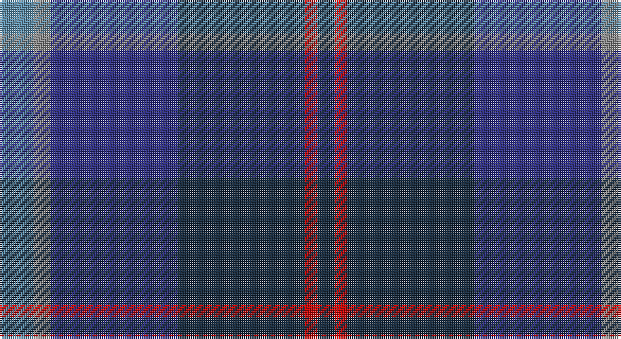

This page is one **sett** — a single exact thread-count. It belongs to the [tartan](/setts/t8o4db30dt30r3dt4/)
(the same proportion at any scale), whose colour order is pattern [BRBBRB](/stripes/brbbrb/).

Sourced from tartans-authority.  It is a [6 stripe tartan](/stripes/stripes6/).

Original link http://www.tartansauthority.com/tartan-ferret/display/6518/

## Also known as

This cloth is also recorded under:

- Hutchesons' Grammar
- Hutchesons' Grammar School

## Register references

External register numbers recorded for this tartan.

- Scottish Tartans Authority (ITI): 6518

## Thread count
B/16 N8 DB60 DN60 R6 DN/8

One full sett is **292 threads**.

## Palette

Palette: <strong>Tartan Register</strong>
<table><thead><tr><th>Colour</th><th>Threads</th><th>Shade</th><th>Base</th><th>OKLCh</th></tr></thead><tbody><tr><td>B/</td><td style="text-align:right;font-variant-numeric:tabular-nums">16</td><td><code style="background-color:#5C8CA8;">#5C8CA8</code> <small style="color:#888">#5C8CA8</small></td><td>B <code style="background-color:#2A418A;">#2A418A</code></td><td><small style="color:#888">oklch(61.7% 0.067 235.0)</small></td></tr><tr><td>N</td><td style="text-align:right;font-variant-numeric:tabular-nums">8</td><td><code style="background-color:#888888;">#888888</code> <small style="color:#888">#888888</small></td><td>R <code style="background-color:#CC0000;">#CC0000</code></td><td><small style="color:#888">oklch(62.7% 0.000 89.9)</small></td></tr><tr><td>DB</td><td style="text-align:right;font-variant-numeric:tabular-nums">60</td><td><code style="background-color:#2C2C80;">#2C2C80</code> <small style="color:#888">#2C2C80</small></td><td>B <code style="background-color:#2A418A;">#2A418A</code></td><td><small style="color:#888">oklch(35.0% 0.138 276.6)</small></td></tr><tr><td>DN</td><td style="text-align:right;font-variant-numeric:tabular-nums">60</td><td><code style="background-color:#14283C;">#14283C</code> <small style="color:#888">#14283C</small></td><td>B <code style="background-color:#2A418A;">#2A418A</code></td><td><small style="color:#888">oklch(27.1% 0.046 249.9)</small></td></tr><tr><td>R</td><td style="text-align:right;font-variant-numeric:tabular-nums">6</td><td><code style="background-color:#C80000;">#C80000</code> <small style="color:#888">#C80000</small></td><td>R <code style="background-color:#CC0000;">#CC0000</code></td><td><small style="color:#888">oklch(52.3% 0.215 29.2)</small></td></tr><tr><td>DN/</td><td style="text-align:right;font-variant-numeric:tabular-nums">8</td><td><code style="background-color:#14283C;">#14283C</code> <small style="color:#888">#14283C</small></td><td>B <code style="background-color:#2A418A;">#2A418A</code></td><td><small style="color:#888">oklch(27.1% 0.046 249.9)</small></td></tr></tbody></table>

# Sample pattern

## Nearest tartans

The nearest existing variants by ΔTartan distance, with this tartan at the top so the swatches line up against it.

ΔTartan

Tartan

Sett

—

<a href="/ttd/edit/#slug=t8o4db30dt30r3dt4~x2">Hutchesons' Grammar (Corporate)</a> <a class="nn-out" href="/variants/s6/t8o4db30dt30r3dt4~x2/" title="open its dictionary page">↗</a>

0.99

<a href="/ttd/edit/#slug=db15dp3db30k22dg18dp3dg3w3~x2&amp;base=t8o4db30dt30r3dt4~x2">Moray (Corporate)</a> <a class="nn-out" href="/variants/s8/db15dp3db30k22dg18dp3dg3w3~x2/" title="open its dictionary page">↗</a>

1.07

<a href="/ttd/edit/#slug=t8r3dbi29db29t4~x2&amp;base=t8o4db30dt30r3dt4~x2">Bryson</a> <a class="nn-out" href="/variants/s5/t8r3dbi29db29t4~x2/" title="open its dictionary page">↗</a>

1.15

<a href="/variants/s10/t8o4db30dt30r3dt4~x2/">Hutchesons' Grammar School</a>

1.31

<a href="/ttd/edit/#slug=db12t6db52dt41m12dp6m12&amp;base=t8o4db30dt30r3dt4~x2">Great Scot (Fashion)</a> <a class="nn-out" href="/variants/s7/db12t6db52dt41m12dp6m12/" title="open its dictionary page">↗</a>

1.32

<a href="/ttd/edit/#slug=db20k4g5dp14w1db2~x2&amp;base=t8o4db30dt30r3dt4~x2">Riley's Theme (Fashion)</a> <a class="nn-out" href="/variants/s6/db20k4g5dp14w1db2~x2/" title="open its dictionary page">↗</a>

1.34

<a href="/variants/s6/db19ki4dr1ki4dg9k1~x4/">Monarchs Corporate Sport Tartan</a>

1.34

<a href="/ttd/edit/#slug=k6dg11w2db22r2k4~x2&amp;base=t8o4db30dt30r3dt4~x2">Leslie Hebridean Artifact Tartan</a> <a class="nn-out" href="/variants/s6/k6dg11w2db22r2k4~x2/" title="open its dictionary page">↗</a>

1.37

<a href="/ttd/edit/#slug=dt3db4dt24db6r3db4g3db8w3~x2&amp;base=t8o4db30dt30r3dt4~x2">Scozia (Fashion)</a> <a class="nn-out" href="/variants/s9/dt3db4dt24db6r3db4g3db8w3~x2/" title="open its dictionary page">↗</a>

1.38

<a href="/ttd/edit/#slug=n9db1n1db1n1db7dg7r2~x4&amp;base=t8o4db30dt30r3dt4~x2">Caledonian Hotel (Corporate)</a> <a class="nn-out" href="/variants/s8/n9db1n1db1n1db7dg7r2~x4/" title="open its dictionary page">↗</a>

1.38

<a href="/ttd/edit/#slug=db38w3db8dbi36dg9r3~x2&amp;base=t8o4db30dt30r3dt4~x2">Waters of Georgian Bay (District)</a> <a class="nn-out" href="/variants/s6/db38w3db8dbi36dg9r3~x2/" title="open its dictionary page">↗</a>

## Neighbour map

Every grey dot is one of 14360 variants placed by the first two principal components of the ΔTartan feature space (44% of its variance). Red is this tartan; blue dots are its nearest — click one to open its page.

<svg viewBox="0 0 640 380" role="img" style="max-width:100%;height:auto;border:1px solid #e0e0e0;border-radius:4px;display:block" xmlns="http://www.w3.org/2000/svg"><image href="/nn/cloud.v1.png" width="640" height="380"/><a href="/variants/s8/db15dp3db30k22dg18dp3dg3w3~x2/"><circle cx="255.2" cy="218.0" r="4" fill="#3465a4"><title>Moray (Corporate)</title></circle></a><a href="/variants/s5/t8r3dbi29db29t4~x2/"><circle cx="283.8" cy="263.1" r="4" fill="#3465a4"><title>Bryson</title></circle></a><a href="/variants/s10/t8o4db30dt30r3dt4~x2/"><circle cx="290.2" cy="218.6" r="4" fill="#3465a4"><title>Hutchesons' Grammar School</title></circle></a><a href="/variants/s7/db12t6db52dt41m12dp6m12/"><circle cx="285.5" cy="239.3" r="4" fill="#3465a4"><title>Great Scot (Fashion)</title></circle></a><a href="/variants/s6/db20k4g5dp14w1db2~x2/"><circle cx="311.3" cy="197.8" r="4" fill="#3465a4"><title>Riley's Theme (Fashion)</title></circle></a><a href="/variants/s6/db19ki4dr1ki4dg9k1~x4/"><circle cx="351.2" cy="212.4" r="4" fill="#3465a4"><title>Monarchs Corporate Sport Tartan</title></circle></a><a href="/variants/s6/k6dg11w2db22r2k4~x2/"><circle cx="261.4" cy="208.8" r="4" fill="#3465a4"><title>Leslie Hebridean Artifact Tartan</title></circle></a><a href="/variants/s9/dt3db4dt24db6r3db4g3db8w3~x2/"><circle cx="263.9" cy="200.8" r="4" fill="#3465a4"><title>Scozia (Fashion)</title></circle></a><a href="/variants/s8/n9db1n1db1n1db7dg7r2~x4/"><circle cx="256.3" cy="236.1" r="4" fill="#3465a4"><title>Caledonian Hotel (Corporate)</title></circle></a><a href="/variants/s6/db38w3db8dbi36dg9r3~x2/"><circle cx="307.7" cy="221.4" r="4" fill="#3465a4"><title>Waters of Georgian Bay (District)</title></circle></a><circle cx="279.9" cy="228.8" r="5" fill="#c00000"/></svg>

ID: /variants/s6/t8o4db30dt30r3dt4~x2/
