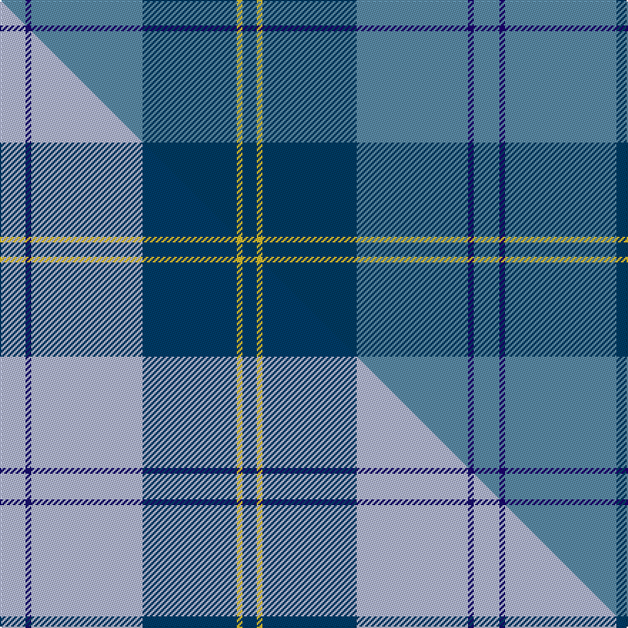

This is one **variant** — a specific cloth: this exact thread count and colourway, with its own
provenance below. It is one weaving of the [sett](/tartans/p/po/port-authority-of-ny-nj/) (the scale-free proportion — the
same cloth at any scale or shade), whose colour order is pattern [BBBBYB](/stripes/bbbbyb/).

Part of the [Port Authority of NY & NJ](/tartans/p/po/port-authority-of-ny-nj/) tartan — the named design grouping this sett with its other cloths.

Sourced from house-of-tartan.  It is a [6 stripe tartan](/stripes/stripes6/).

Original link [http://www.house-of-tartan.scotland.net/house/TartanViewjs.asp?colr=Def&tnam=6793](http://www.house-of-tartan.scotland.net/house/TartanViewjs.asp?colr=Def&tnam=6793)

## Provenance

Earliest known date: 2005, October Designed by Clair Hunter (ne Donaldson) of The House of Edgar for The Pipers Cove - a Highland dress shop in Kearney, New Jersey for use by the Pipers' Cove Pipe Band.

Dataset <small>— provenance for this record, inherited from the source manifest</small>

<dl class="dataset-prov">
<dt>source</dt><dd><a href="/sources/house-of-tartan/">House of Tartan</a></dd>
<dt>data captured from</dt><dd><a href="https://github.com/thetartan/tartan-database/blob/master/data/house-of-tartan/data.csv">https://github.com/thetartan/tartan-database/blob/master/data/house-of-tartan/data.csv</a></dd>
<dt>data date</dt><dd>2005 <small>(this record)</small></dd>
<dt>licence</dt><dd><a href="https://creativecommons.org/licenses/by-nc-nd/4.0/">CC BY-NC-ND 4.0</a></dd>
</dl>

Capture chain <small>— the hands this data passed through, oldest first; each capture carries its own licence</small>

<ol class="capture-chain">
<li><a href="http://www.house-of-tartan.scotland.net/">House of Tartan</a> <small>the weaver/retailer's database — the site is now offline; the URL is kept as the ultimate source's identity</small></li>
<li><a href="https://github.com/thetartan/tartan-database">thetartan/tartan-database</a> <small>2016-2017</small> · <a href="https://creativecommons.org/licenses/by-nc-nd/4.0/">CC BY-NC-ND 4.0</a> <small>Levko Kravets's frozen compilation — the capture we vendored, and where its CC licence text came from</small></li>
<li>this dictionary <small>captured 2026-06-10 · commit 5bf86c7566</small> <small>each re-capture is a git commit to data/sources</small></li>
</ol>

## Thread count
T/18 DB4 T78 DBi66 LY4 DBi/10

One full sett is **332 threads**.

## Palette
<table><thead><tr><th>Colour</th><th>Shade</th><th>OKLCh</th></tr></thead><tbody><tr><td>T</td><td><code style="background-color:#5C8CA8;">#5C8CA8</code> <small style="color:#888">#5C8CA8</small></td><td><small style="color:#888">oklch(61.7% 0.067 235.0)</small></td></tr><tr><td>T</td><td><code style="background-color:#2888C4;">#2888C4</code> <small style="color:#888">#2888C4</small></td><td><small style="color:#888">oklch(60.1% 0.125 241.5)</small></td></tr><tr><td>DB</td><td><code style="background-color:#1C0070;">#1C0070</code> <small style="color:#888">#1C0070</small></td><td><small style="color:#888">oklch(26.3% 0.162 277.1)</small></td></tr><tr><td>DB</td><td><code style="background-color:#003C64;">#003C64</code> <small style="color:#888">#003C64</small></td><td><small style="color:#888">oklch(34.5% 0.089 246.0)</small></td></tr><tr><td>LY</td><td><code style="background-color:#DCBC32;">#DCBC32</code> <small style="color:#888">#DCBC32</small></td><td><small style="color:#888">oklch(80.0% 0.150 95.2)</small></td></tr></tbody></table>

# Sample pattern

## Compared to the master

This cloth is one sett of its design; the master sett (the exemplar the design is anchored on) is below for comparison.

Its **ΔTartan distance** from the master is **0.16** — the same measure the nearest-tartans table ranks by (0 is identical; a re-scale of the same cloth is near 0, a recolour or a different proportion further).

<figure class="master-compare" style="margin:0">

this sett
master sett ★

<figcaption style="color:#888;font-size:smaller">One weave of this sett against the <a href="/setts/lb9db2lb39dbi33ly2dbi5/">master sett ★</a>, split on the diagonal: a shared proportion runs seamlessly across it with only the shades shifting; a different proportion breaks on it.</figcaption>
</figure>

## Nearest tartan variants

The nearest existing variants by ΔTartan distance, with this cloth at the top so the swatches line up against it.

ΔTartan

Threads

Variant

Sett

—

332

<a href="/variants/s6/t9db2t39dbi33ly2dbi5~x2~t2503227-db1106275-dbi1404245/">Port Authority of NY &amp; NJ American Corporate Tartan</a>

<a href="/ttd/edit/#slug=lb9db2lb39dbi33ly2dbi5~x2~db1106275-dbi1404245&amp;base=t9db2t39dbi33ly2dbi5~x2~t2503227-db1106275-dbi1404245" title="compare in the TTD">0.16</a>

332

<a href="/variants/s6/lb9db2lb39dbi33ly2dbi5~x2~db1106275-dbi1404245/">Port Authority of NY &amp; NJ</a>

<a href="/ttd/edit/#slug=w1lb4t4db3w3t20lb1~x4&amp;base=t9db2t39dbi33ly2dbi5~x2~t2503227-db1106275-dbi1404245" title="compare in the TTD">1.69</a>

280

<a href="/variants/s7/w1lb4t4db3w3t20lb1~x4/">Starr (Name)</a>

<a href="/ttd/edit/#slug=w1lb4t4db3w3t20lb1~x4~t2205244-db1406275&amp;base=t9db2t39dbi33ly2dbi5~x2~t2503227-db1106275-dbi1404245" title="compare in the TTD">1.69</a>

280

<a href="/variants/s7/w1lb4t4db3w3t20lb1~x4~t2205244-db1406275/">Starr</a>

<a href="/ttd/edit/#slug=lb3n11dt8n10lb6dp1~x2~lb3203246-n2203265-dt1204274&amp;base=t9db2t39dbi33ly2dbi5~x2~t2503227-db1106275-dbi1404245" title="compare in the TTD">2.38</a>

148

<a href="/variants/s6/lb3n11db8n10lb6dp1~x2~lb3203246-n2203265-db1204274/">Loch Ness Water</a>

<a href="/ttd/edit/#slug=lb37t9lb3db9w3~x2&amp;base=t9db2t39dbi33ly2dbi5~x2~t2503227-db1106275-dbi1404245" title="compare in the TTD">2.41</a>

164

<a href="/variants/s5/lb37t9lb3db9w3~x2/">Loch Lomond Trade Tartan</a>

<a href="/ttd/edit/#slug=db6lb2db2lb3db16t26dr2~x2&amp;base=t9db2t39dbi33ly2dbi5~x2~t2503227-db1106275-dbi1404245" title="compare in the TTD">3.34</a>

212

<a href="/variants/s7/db6lb2db2lb3db16t26dr2~x2/">Federal Bureau of Investigation</a>

<a href="/ttd/edit/#slug=lg3db1b16db16b2lb2~x4&amp;base=t9db2t39dbi33ly2dbi5~x2~t2503227-db1106275-dbi1404245" title="compare in the TTD">3.42</a>

300

<a href="/variants/s6/lg3db1b16db16b2lb2~x4/">U.S.S. John Paul Jones #1</a>

<a href="/ttd/edit/#slug=n37db4n7db4n9db40lb2db4n2&amp;base=t9db2t39dbi33ly2dbi5~x2~t2503227-db1106275-dbi1404245" title="compare in the TTD">3.60</a>

179

<a href="/variants/s9/n37db4n7db4n9db40lb2db4n2/">Edwards</a>

<a href="/ttd/edit/#slug=t52db28w3db2w2db10~x2&amp;base=t9db2t39dbi33ly2dbi5~x2~t2503227-db1106275-dbi1404245" title="compare in the TTD">3.64</a>

264

<a href="/variants/s6/t52db28w3db2w2db10~x2/">St Andrews Earl of Royal family Tartan</a>

<a href="/ttd/edit/#slug=n42db2n2db17lo8y4~x2~db1208266-lo2706076&amp;base=t9db2t39dbi33ly2dbi5~x2~t2503227-db1106275-dbi1404245" title="compare in the TTD">3.65</a>

208

<a href="/variants/s6/n42db2n2db17lo8y4~x2~db1208266-lo2706076/">Connecticut State Police PB (Cor.)</a>

## Neighbour map

Every grey dot is one of 13657 variants placed by the first two principal components of the ΔTartan feature space (42% of its variance). Red is this tartan; blue dots are its nearest — click one to open its page. The map is a flat projection of a many-dimensional space — [how to read it](/posts/neighbourhood-maps/).

<svg viewBox="0 0 640 380" role="img" style="max-width:100%;height:auto;border:1px solid #e0e0e0;border-radius:4px;display:block" xmlns="http://www.w3.org/2000/svg"><image href="/nn/cloud.v1.png" width="640" height="380"/><a href="/variants/s6/lb9db2lb39dbi33ly2dbi5~x2~db1106275-dbi1404245/"><circle cx="380.7" cy="205.1" r="4" fill="#3465a4"><title>Port Authority of NY &amp; NJ</title></circle></a><a href="/variants/s7/w1lb4t4db3w3t20lb1~x4/"><circle cx="470.1" cy="199.5" r="4" fill="#3465a4"><title>Starr (Name)</title></circle></a><a href="/variants/s7/w1lb4t4db3w3t20lb1~x4~t2205244-db1406275/"><circle cx="471.8" cy="197.6" r="4" fill="#3465a4"><title>Starr</title></circle></a><a href="/variants/s6/lb3n11db8n10lb6dp1~x2~lb3203246-n2203265-db1204274/"><circle cx="323.5" cy="268.5" r="4" fill="#3465a4"><title>Loch Ness Water</title></circle></a><a href="/variants/s5/lb37t9lb3db9w3~x2/"><circle cx="441.9" cy="235.4" r="4" fill="#3465a4"><title>Loch Lomond Trade Tartan</title></circle></a><a href="/variants/s7/db6lb2db2lb3db16t26dr2~x2/"><circle cx="357.7" cy="226.0" r="4" fill="#3465a4"><title>Federal Bureau of Investigation</title></circle></a><a href="/variants/s6/lg3db1b16db16b2lb2~x4/"><circle cx="360.2" cy="227.2" r="4" fill="#3465a4"><title>U.S.S. John Paul Jones #1</title></circle></a><a href="/variants/s9/n37db4n7db4n9db40lb2db4n2/"><circle cx="490.8" cy="220.2" r="4" fill="#3465a4"><title>Edwards</title></circle></a><a href="/variants/s6/t52db28w3db2w2db10~x2/"><circle cx="440.5" cy="211.2" r="4" fill="#3465a4"><title>St Andrews Earl of Royal family Tartan</title></circle></a><a href="/variants/s6/n42db2n2db17lo8y4~x2~db1208266-lo2706076/"><circle cx="432.2" cy="196.5" r="4" fill="#3465a4"><title>Connecticut State Police PB (Cor.)</title></circle></a><circle cx="451.5" cy="230.0" r="5" fill="#c00000"/><text x="320" y="376" text-anchor="middle" font-size="11" fill="#999">ground</text><text x="11" y="190" text-anchor="middle" font-size="11" fill="#999" transform="rotate(-90 11 190)">complexity</text></svg>

ID: /variants/s6/t9db2t39dbi33ly2dbi5~x2~t2503227-db1106275-dbi1404245/
