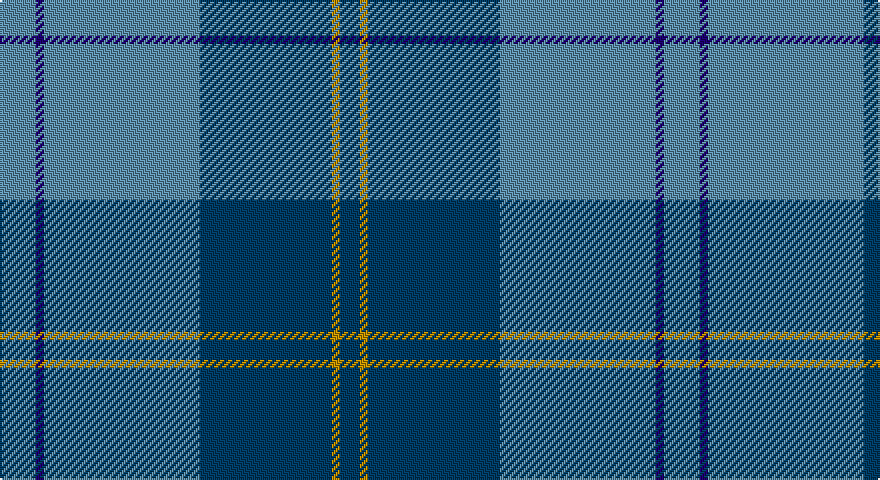

This page is one **sett** — a single exact thread-count. It belongs to the [tartan](/setts/t9db2t39dt33lo2dt5/)
(the same proportion at any scale), whose colour order is pattern [BBBBYB](/stripes/bbbbyb/).

Sourced from register-of-tartans.  It is a [6 stripe tartan](/stripes/stripes6/).

Original link https://www.tartanregister.gov.uk/tartanDetails.aspx?ref=3357

## Provenance

Earliest known date: 2005, October Designed by Clair Hunter (ne Donaldson) of The House of Edgar for The Pipers Cove - a Highland dress shop in Kearney, New Jersey for use by the Pipers' Cove Pipe Band.

## Also known as

This cloth is also recorded under:

- Port Authority of NY & NJ (Corporate

3 attestations — the source records this cloth was collapsed from (oldest owns this page)

<ul>
<li>01/10/2005 — Port Authority of NY & NJ (register-of-tartans, <a href="https://www.tartanregister.gov.uk/tartanDetails.aspx?ref=3357">record</a>)</li>
<li>2005, October — Port Authority of NY & NJ (Corporate (tartans-authority, <a href="http://www.tartansauthority.com/tartan-ferret/display/6793/">record</a>)</li>
<li>undated — Port Authority of NY & NJ American Corporate Tartan (house-of-tartan, <a href="http://www.house-of-tartan.scotland.net/house/TartanViewjs.asp?colr=Def&tnam=6793">record</a>)</li>
</ul>

## Register references

External register numbers recorded for this tartan.

- Scottish Register of Tartans: [3357](https://www.tartanregister.gov.uk/tartanDetails.aspx?ref=3357)
- Scottish Tartans Authority (ITI): 6793

## Thread count
B/18 DB4 B78 DBa66 DY4 DBa/10

One full sett is **332 threads**.

## Palette

Palette: <strong>Tartan Register</strong>
<table><thead><tr><th>Colour</th><th>Threads</th><th>Shade</th><th>Base</th><th>OKLCh</th></tr></thead><tbody><tr><td>B/</td><td style="text-align:right;font-variant-numeric:tabular-nums">18</td><td><code style="background-color:#5C8CA8;">#5C8CA8</code> <small style="color:#888">#5C8CA8</small></td><td>B <code style="background-color:#2A418A;">#2A418A</code></td><td><small style="color:#888">oklch(61.7% 0.067 235.0)</small></td></tr><tr><td>DB</td><td style="text-align:right;font-variant-numeric:tabular-nums">4</td><td><code style="background-color:#1C0070;">#1C0070</code> <small style="color:#888">#1C0070</small></td><td>B <code style="background-color:#2A418A;">#2A418A</code></td><td><small style="color:#888">oklch(26.3% 0.162 277.1)</small></td></tr><tr><td>B</td><td style="text-align:right;font-variant-numeric:tabular-nums">78</td><td><code style="background-color:#5C8CA8;">#5C8CA8</code> <small style="color:#888">#5C8CA8</small></td><td>B <code style="background-color:#2A418A;">#2A418A</code></td><td><small style="color:#888">oklch(61.7% 0.067 235.0)</small></td></tr><tr><td>DBa</td><td style="text-align:right;font-variant-numeric:tabular-nums">66</td><td><code style="background-color:#003C64;">#003C64</code> <small style="color:#888">#003C64</small></td><td>B <code style="background-color:#2A418A;">#2A418A</code></td><td><small style="color:#888">oklch(34.5% 0.089 246.0)</small></td></tr><tr><td>DY</td><td style="text-align:right;font-variant-numeric:tabular-nums">4</td><td><code style="background-color:#BC8C00;">#BC8C00</code> <small style="color:#888">#BC8C00</small></td><td>Y <code style="background-color:#F2BF00;">#F2BF00</code></td><td><small style="color:#888">oklch(66.8% 0.137 84.1)</small></td></tr><tr><td>DBa/</td><td style="text-align:right;font-variant-numeric:tabular-nums">10</td><td><code style="background-color:#003C64;">#003C64</code> <small style="color:#888">#003C64</small></td><td>B <code style="background-color:#2A418A;">#2A418A</code></td><td><small style="color:#888">oklch(34.5% 0.089 246.0)</small></td></tr></tbody></table>

# Sample pattern

## Nearest tartans

The nearest existing variants by ΔTartan distance, with this tartan at the top so the swatches line up against it.

ΔTartan

Tartan

Sett

—

<a href="/ttd/edit/#slug=t9db2t39dt33lo2dt5~x2">Port Authority of NY &amp; NJ</a> <a class="nn-out" href="/variants/s6/t9db2t39dt33lo2dt5~x2/" title="open its dictionary page">↗</a>

0.71

<a href="/ttd/edit/#slug=t28dt15r2dt2w1dt6~x2&amp;base=t9db2t39dt33lo2dt5~x2">Corries</a> <a class="nn-out" href="/variants/s6/t28dt15r2dt2w1dt6~x2/" title="open its dictionary page">↗</a>

1.16

<a href="/ttd/edit/#slug=db16w1db1w1db8dg16r1db2~x2&amp;base=t9db2t39dt33lo2dt5~x2">Roxburgh</a> <a class="nn-out" href="/variants/s8/db16w1db1w1db8dg16r1db2~x2/" title="open its dictionary page">↗</a>

1.25

<a href="/ttd/edit/#slug=n42db2n2db17lo8db4~x2&amp;base=t9db2t39dt33lo2dt5~x2">Connecticut State Police PB (Cor.)</a> <a class="nn-out" href="/variants/s6/n42db2n2db17lo8db4~x2/" title="open its dictionary page">↗</a>

1.25

<a href="/ttd/edit/#slug=r2g5db27g11o2~x2&amp;base=t9db2t39dt33lo2dt5~x2">Hector James</a> <a class="nn-out" href="/variants/s5/r2g5db27g11o2~x2/" title="open its dictionary page">↗</a>

1.27

<a href="/ttd/edit/#slug=dt3t14dt3o16dt34r3~x2&amp;base=t9db2t39dt33lo2dt5~x2">Thorburn (Lochcarron)</a> <a class="nn-out" href="/variants/s6/dt3t14dt3o16dt34r3~x2/" title="open its dictionary page">↗</a>

1.31

<a href="/ttd/edit/#slug=db4r1db18b18w1b4~x4&amp;base=t9db2t39dt33lo2dt5~x2">Ewell Castle School</a> <a class="nn-out" href="/variants/s6/db4r1db18b18w1b4~x4/" title="open its dictionary page">↗</a>

1.36

<a href="/ttd/edit/#slug=b46r2b3r2b14g38k3g4~x2&amp;base=t9db2t39dt33lo2dt5~x2">Greenlaw, American (Name)</a> <a class="nn-out" href="/variants/s8/b46r2b3r2b14g38k3g4~x2/" title="open its dictionary page">↗</a>

1.37

<a href="/ttd/edit/#slug=t33r8db12g12t8db2t8~x2&amp;base=t9db2t39dt33lo2dt5~x2">Bermuda Plaid (1947) (District)</a> <a class="nn-out" href="/variants/s7/t33r8db12g12t8db2t8~x2/" title="open its dictionary page">↗</a>

1.39

<a href="/ttd/edit/#slug=dg4w1dg26b26k2b4~x4&amp;base=t9db2t39dt33lo2dt5~x2">Melville (Two black lines)</a> <a class="nn-out" href="/variants/s6/dg4w1dg26b26k2b4~x4/" title="open its dictionary page">↗</a>

1.42

<a href="/ttd/edit/#slug=b36db6b5r3k2r3b5db18~x2&amp;base=t9db2t39dt33lo2dt5~x2">Leonard (Name)</a> <a class="nn-out" href="/variants/s8/b36db6b5r3k2r3b5db18~x2/" title="open its dictionary page">↗</a>

## Neighbour map

Every grey dot is one of 14360 variants placed by the first two principal components of the ΔTartan feature space (44% of its variance). Red is this tartan; blue dots are its nearest — click one to open its page.

<svg viewBox="0 0 640 380" role="img" style="max-width:100%;height:auto;border:1px solid #e0e0e0;border-radius:4px;display:block" xmlns="http://www.w3.org/2000/svg"><image href="/nn/cloud.v1.png" width="640" height="380"/><a href="/variants/s6/t28dt15r2dt2w1dt6~x2/"><circle cx="381.3" cy="178.9" r="4" fill="#3465a4"><title>Corries</title></circle></a><a href="/variants/s8/db16w1db1w1db8dg16r1db2~x2/"><circle cx="398.6" cy="197.9" r="4" fill="#3465a4"><title>Roxburgh</title></circle></a><a href="/variants/s6/n42db2n2db17lo8db4~x2/"><circle cx="380.8" cy="179.7" r="4" fill="#3465a4"><title>Connecticut State Police PB (Cor.)</title></circle></a><a href="/variants/s5/r2g5db27g11o2~x2/"><circle cx="378.7" cy="224.5" r="4" fill="#3465a4"><title>Hector James</title></circle></a><a href="/variants/s6/dt3t14dt3o16dt34r3~x2/"><circle cx="332.7" cy="226.1" r="4" fill="#3465a4"><title>Thorburn (Lochcarron)</title></circle></a><a href="/variants/s6/db4r1db18b18w1b4~x4/"><circle cx="345.4" cy="205.1" r="4" fill="#3465a4"><title>Ewell Castle School</title></circle></a><a href="/variants/s8/b46r2b3r2b14g38k3g4~x2/"><circle cx="410.3" cy="183.3" r="4" fill="#3465a4"><title>Greenlaw, American (Name)</title></circle></a><a href="/variants/s7/t33r8db12g12t8db2t8~x2/"><circle cx="346.4" cy="211.1" r="4" fill="#3465a4"><title>Bermuda Plaid (1947) (District)</title></circle></a><a href="/variants/s6/dg4w1dg26b26k2b4~x4/"><circle cx="370.1" cy="193.7" r="4" fill="#3465a4"><title>Melville (Two black lines)</title></circle></a><a href="/variants/s8/b36db6b5r3k2r3b5db18~x2/"><circle cx="417.4" cy="198.1" r="4" fill="#3465a4"><title>Leonard (Name)</title></circle></a><circle cx="381.2" cy="203.2" r="5" fill="#c00000"/></svg>

ID: /variants/s6/t9db2t39dt33lo2dt5~x2/
