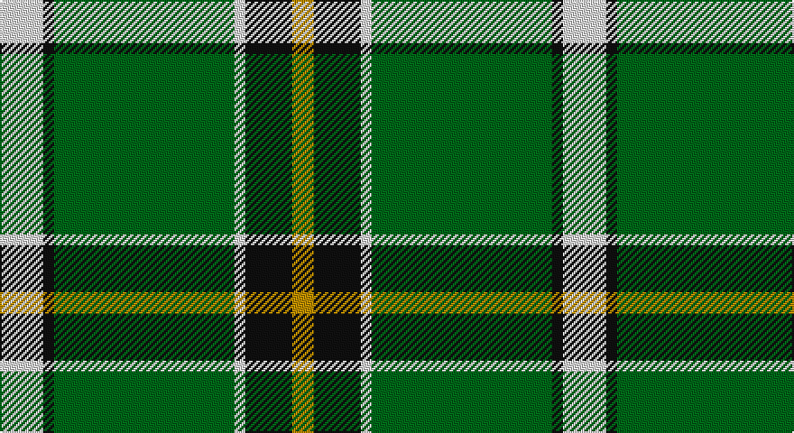

This page is one **sett** — a single exact thread-count. It belongs to the [tartan](/setts/w12k3g50w3k13lo6/)
(the same proportion at any scale), whose colour order is pattern [WKGWKY](/stripes/wkgwky/).

Sourced from tartans-authority.  It is a [6 stripe tartan](/stripes/stripes6/).

Original link http://www.tartansauthority.com/tartan-ferret/display/7407/

## Also known as

This cloth is also recorded under:

- Limerick County, Crest Range

2 attestations — the source records this cloth was collapsed from (oldest owns this page)

<ul>
<li>2004 — Limerick County Crest (Fashion) (tartans-authority, <a href="http://www.tartansauthority.com/tartan-ferret/display/7407/">record</a>)</li>
<li>01/05/2005 — Limerick County, Crest Range (register-of-tartans, <a href="https://www.tartanregister.gov.uk/tartanDetails.aspx?ref=5362">record</a>)</li>
</ul>

## Register references

External register numbers recorded for this tartan.

- Scottish Register of Tartans: [5362](https://www.tartanregister.gov.uk/tartanDetails.aspx?ref=5362)
- Scottish Tartans Authority (ITI): 7407
- Scottish Tartans World Register: 3091

## Thread count
LN/24 K6 G100 LN6 K26 DY/12

One full sett is **312 threads**.

## Palette

Palette: <strong>Tartan Register</strong>
<table><thead><tr><th>Colour</th><th>Threads</th><th>Shade</th><th>Base</th><th>OKLCh</th></tr></thead><tbody><tr><td>LN/</td><td style="text-align:right;font-variant-numeric:tabular-nums">24</td><td><code style="background-color:#E0E0E0;">#E0E0E0</code> <small style="color:#888">#E0E0E0</small></td><td>W <code style="background-color:#F7F7F7;">#F7F7F7</code></td><td><small style="color:#888">oklch(90.7% 0.000 89.9)</small></td></tr><tr><td>K</td><td style="text-align:right;font-variant-numeric:tabular-nums">6</td><td><code style="background-color:#101010;">#101010</code> <small style="color:#888">#101010</small></td><td>K <code style="background-color:#000000;">#000000</code></td><td><small style="color:#888">oklch(17.3% 0.000 89.9)</small></td></tr><tr><td>G</td><td style="text-align:right;font-variant-numeric:tabular-nums">100</td><td><code style="background-color:#006818;">#006818</code> <small style="color:#888">#006818</small></td><td>G <code style="background-color:#006100;">#006100</code></td><td><small style="color:#888">oklch(45.0% 0.142 145.0)</small></td></tr><tr><td>LN</td><td style="text-align:right;font-variant-numeric:tabular-nums">6</td><td><code style="background-color:#E0E0E0;">#E0E0E0</code> <small style="color:#888">#E0E0E0</small></td><td>W <code style="background-color:#F7F7F7;">#F7F7F7</code></td><td><small style="color:#888">oklch(90.7% 0.000 89.9)</small></td></tr><tr><td>K</td><td style="text-align:right;font-variant-numeric:tabular-nums">26</td><td><code style="background-color:#101010;">#101010</code> <small style="color:#888">#101010</small></td><td>K <code style="background-color:#000000;">#000000</code></td><td><small style="color:#888">oklch(17.3% 0.000 89.9)</small></td></tr><tr><td>DY/</td><td style="text-align:right;font-variant-numeric:tabular-nums">12</td><td><code style="background-color:#BC8C00;">#BC8C00</code> <small style="color:#888">#BC8C00</small></td><td>Y <code style="background-color:#F2BF00;">#F2BF00</code></td><td><small style="color:#888">oklch(66.8% 0.137 84.1)</small></td></tr></tbody></table>

# Sample pattern

## Nearest tartans

The nearest existing variants by ΔTartan distance, with this tartan at the top so the swatches line up against it.

ΔTartan

Tartan

Sett

—

<a href="/ttd/edit/#slug=w12k3g50w3k13lo6~x2">Limerick County Crest (Fashion)</a> <a class="nn-out" href="/variants/s6/w12k3g50w3k13lo6~x2/" title="open its dictionary page">↗</a>

1.11

<a href="/ttd/edit/#slug=g25k8y10r1y3~x4&amp;base=w12k3g50w3k13lo6~x2">Herbage</a> <a class="nn-out" href="/variants/s5/g25k8y10r1y3~x4/" title="open its dictionary page">↗</a>

1.12

<a href="/ttd/edit/#slug=k5g2k5g2db8g25w4~x2&amp;base=w12k3g50w3k13lo6~x2">Keppoch</a> <a class="nn-out" href="/variants/s7/k5g2k5g2db8g25w4~x2/" title="open its dictionary page">↗</a>

1.16

<a href="/ttd/edit/#slug=g13k1r1k1b2k1ly4~x8&amp;base=w12k3g50w3k13lo6~x2">Alberta (Province)</a> <a class="nn-out" href="/variants/s7/g13k1r1k1b2k1ly4~x8/" title="open its dictionary page">↗</a>

1.18

<a href="/ttd/edit/#slug=dg60w3k12o5dg9o6k4w10&amp;base=w12k3g50w3k13lo6~x2">New York Jets</a> <a class="nn-out" href="/variants/s8/dg60w3k12o5dg9o6k4w10/" title="open its dictionary page">↗</a>

1.21

<a href="/ttd/edit/#slug=g12k1r1k1b2k1ly4~x8&amp;base=w12k3g50w3k13lo6~x2">Alberta (District)</a> <a class="nn-out" href="/variants/s7/g12k1r1k1b2k1ly4~x8/" title="open its dictionary page">↗</a>

1.24

<a href="/ttd/edit/#slug=gi42g2w2g2gi5dg12w32gi4~x2&amp;base=w12k3g50w3k13lo6~x2">Longniddry Green District Tartan</a> <a class="nn-out" href="/variants/s8/gi42g2w2g2gi5dg12w32gi4~x2/" title="open its dictionary page">↗</a>

1.25

<a href="/ttd/edit/#slug=g37w2g6db23ly6db2ly3db2~x2&amp;base=w12k3g50w3k13lo6~x2">MacAuliffe (Name)</a> <a class="nn-out" href="/variants/s8/g37w2g6db23ly6db2ly3db2~x2/" title="open its dictionary page">↗</a>

1.25

<a href="/ttd/edit/#slug=g13p1g1p1g3db5k4ly2~x2&amp;base=w12k3g50w3k13lo6~x2">Carrick, hunting</a> <a class="nn-out" href="/variants/s8/g13p1g1p1g3db5k4ly2~x2/" title="open its dictionary page">↗</a>

1.26

<a href="/ttd/edit/#slug=g12k1r1k1t2k1ly4~x2&amp;base=w12k3g50w3k13lo6~x2">Alberta District Tartan</a> <a class="nn-out" href="/variants/s7/g12k1r1k1t2k1ly4~x2/" title="open its dictionary page">↗</a>

1.33

<a href="/ttd/edit/#slug=g8w4g50k12g4k15lo5~x2&amp;base=w12k3g50w3k13lo6~x2">Instakilt, Green (Fashion)</a> <a class="nn-out" href="/variants/s7/g8w4g50k12g4k15lo5~x2/" title="open its dictionary page">↗</a>

## Neighbour map

Every grey dot is one of 14360 variants placed by the first two principal components of the ΔTartan feature space (44% of its variance). Red is this tartan; blue dots are its nearest — click one to open its page.

<svg viewBox="0 0 640 380" role="img" style="max-width:100%;height:auto;border:1px solid #e0e0e0;border-radius:4px;display:block" xmlns="http://www.w3.org/2000/svg"><image href="/nn/cloud.v1.png" width="640" height="380"/><a href="/variants/s5/g25k8y10r1y3~x4/"><circle cx="301.3" cy="182.1" r="4" fill="#3465a4"><title>Herbage</title></circle></a><a href="/variants/s7/k5g2k5g2db8g25w4~x2/"><circle cx="296.9" cy="187.5" r="4" fill="#3465a4"><title>Keppoch</title></circle></a><a href="/variants/s7/g13k1r1k1b2k1ly4~x8/"><circle cx="290.2" cy="153.1" r="4" fill="#3465a4"><title>Alberta (Province)</title></circle></a><a href="/variants/s8/dg60w3k12o5dg9o6k4w10/"><circle cx="359.7" cy="143.3" r="4" fill="#3465a4"><title>New York Jets</title></circle></a><a href="/variants/s7/g12k1r1k1b2k1ly4~x8/"><circle cx="270.2" cy="157.0" r="4" fill="#3465a4"><title>Alberta (District)</title></circle></a><a href="/variants/s8/gi42g2w2g2gi5dg12w32gi4~x2/"><circle cx="279.7" cy="138.8" r="4" fill="#3465a4"><title>Longniddry Green District Tartan</title></circle></a><a href="/variants/s8/g37w2g6db23ly6db2ly3db2~x2/"><circle cx="317.0" cy="157.4" r="4" fill="#3465a4"><title>MacAuliffe (Name)</title></circle></a><a href="/variants/s8/g13p1g1p1g3db5k4ly2~x2/"><circle cx="259.6" cy="159.7" r="4" fill="#3465a4"><title>Carrick, hunting</title></circle></a><a href="/variants/s7/g12k1r1k1t2k1ly4~x2/"><circle cx="269.8" cy="155.8" r="4" fill="#3465a4"><title>Alberta District Tartan</title></circle></a><a href="/variants/s7/g8w4g50k12g4k15lo5~x2/"><circle cx="337.8" cy="177.2" r="4" fill="#3465a4"><title>Instakilt, Green (Fashion)</title></circle></a><circle cx="308.9" cy="166.7" r="5" fill="#c00000"/></svg>

ID: /variants/s6/w12k3g50w3k13lo6~x2/
