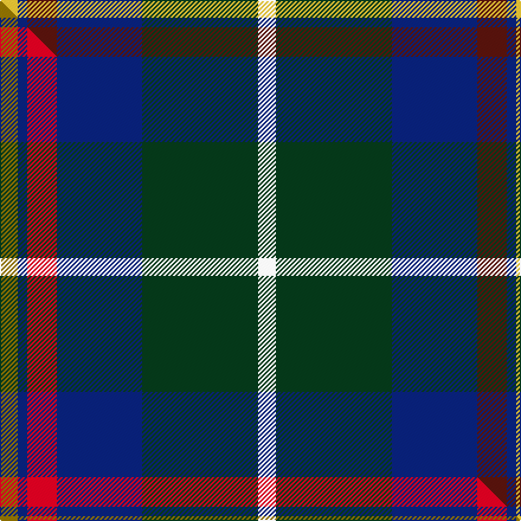

This is one **variant** — a specific cloth: this exact thread count and colourway, with its own
provenance below. It is one weaving of the [sett](/tartans/a/af/afternoon-tea-darjeeling/) (the scale-free proportion — the
same cloth at any scale or shade), whose colour order is pattern [WGBBBY](/stripes/wgbbby/).

Part of the [Afternoon Tea / Darjeeling](/tartans/a/af/afternoon-tea-darjeeling/) tartan — the named design grouping this sett with its other cloths.

Sourced from tartans-authority.  It is a [6 stripe tartan](/stripes/stripes6/).

Original link <code>http://www.tartansauthority.com/tartan-ferret/display/11278/</code> — retired · [Internet Archive copy](https://web.archive.org/web/*/http://www.tartansauthority.com/tartan-ferret/display/11278/*)

Dataset <small>— provenance for this record, inherited from the source manifest</small>

<dl class="dataset-prov">
<dt>source</dt><dd><a href="/sources/tartans-authority/">Scottish Tartans Authority</a></dd>
<dt>data captured from</dt><dd><a href="https://github.com/thetartan/tartan-database/blob/master/data/tartans-authority/data.csv">https://github.com/thetartan/tartan-database/blob/master/data/tartans-authority/data.csv</a></dd>
<dt>data date</dt><dd>2015 <small>(this record)</small></dd>
<dt>licence</dt><dd><a href="https://creativecommons.org/licenses/by-nc-nd/4.0/">CC BY-NC-ND 4.0</a></dd>
</dl>

Capture chain <small>— the hands this data passed through, oldest first; each capture carries its own licence</small>

<ol class="capture-chain">
<li><a href="https://www.tartansauthority.com/">Scottish Tartans Authority</a> <small>the heritage body’s archive — its tartan-ferret record browser is retired; dead record links are shown unlinked, with an Internet Archive copy (ITI numbers are not SRT references)</small></li>
<li><a href="https://github.com/thetartan/tartan-database">thetartan/tartan-database</a> <small>2016-2017</small> · <a href="https://creativecommons.org/licenses/by-nc-nd/4.0/">CC BY-NC-ND 4.0</a> <small>Levko Kravets's frozen compilation — the capture we vendored, and where its CC licence text came from</small></li>
<li>this dictionary <small>captured 2026-06-10 · commit 5bf86c7566</small> <small>each re-capture is a git commit to data/sources</small></li>
</ol>

## Register references

External register numbers recorded for this tartan.

- Scottish Register of Tartans: [11278](https://www.tartanregister.gov.uk/tartanDetails?ref=11278)
- Scottish Tartans Authority (ITI): 11278

## Thread count
LY/15 DB8 DR25 DB72 DG98 W/15

One full sett is **436 threads**.

## Palette
<table><thead><tr><th>Colour</th><th>Shade</th><th>OKLCh</th></tr></thead><tbody><tr><td>DB</td><td><code style="background-color:#082077;">#082077</code> <small style="color:#888">#082077</small></td><td><small style="color:#888">oklch(30.0% 0.149 265.1)</small></td></tr><tr><td>DR</td><td><code style="background-color:#55120C;">#55120C</code> <small style="color:#888">#55120C</small></td><td><small style="color:#888">oklch(30.0% 0.099 29.3)</small></td></tr><tr><td>DG</td><td><code style="background-color:#053819;">#053819</code> <small style="color:#888">#053819</small></td><td><small style="color:#888">oklch(30.0% 0.075 151.3)</small></td></tr><tr><td>W</td><td><code style="background-color:#F7F7F7;">#F7F7F7</code> <small style="color:#888">#F7F7F7</small></td><td><small style="color:#888">oklch(97.6% 0.000 89.9)</small></td></tr><tr><td>LY</td><td><code style="background-color:#DCBC32;">#DCBC32</code> <small style="color:#888">#DCBC32</small></td><td><small style="color:#888">oklch(80.0% 0.150 95.2)</small></td></tr></tbody></table>

# Sample pattern

## Compared to the master

This cloth is one sett of its design; the master sett (the exemplar the design is anchored on) is below for comparison.

Its **ΔTartan distance** from the master is **0.09** — the same measure the nearest-tartans table ranks by (0 is identical; a re-scale of the same cloth is near 0, a recolour or a different proportion further).

<figure class="master-compare" style="margin:0">

this sett
master sett ★

<figcaption style="color:#888;font-size:smaller">One weave of this sett against the <a href="/setts/y15db8r25db72dg98w15/">master sett ★</a>, split on the diagonal: a shared proportion runs seamlessly across it with only the shades shifting; a different proportion breaks on it.</figcaption>
</figure>

## Nearest tartan variants

The nearest existing variants by ΔTartan distance, with this cloth at the top so the swatches line up against it.

ΔTartan

Threads

Variant

Sett

—

436

<a href="/variants/s6/w15dg98db72dr25db8ly15/">Afternoon Tea / Darjeeling</a>

<a href="/ttd/edit/#slug=y15db8r25db72dg98w15&amp;base=w15dg98db72dr25db8ly15" title="compare in the TTD">0.09</a>

436

<a href="/variants/s6/y15db8r25db72dg98w15/">Afternoon Tea / Darjeeling</a>

<a href="/ttd/edit/#slug=w4g28db18r4db18y3~x2&amp;base=w15dg98db72dr25db8ly15" title="compare in the TTD">0.74</a>

286

<a href="/variants/s6/w4g28db18r4db18y3~x2/">Inglis Family Tartan</a>

<a href="/ttd/edit/#slug=lr4g24db10r3db12lo4~x2&amp;base=w15dg98db72dr25db8ly15" title="compare in the TTD">1.17</a>

212

<a href="/variants/s6/lr4g24db10r3db12lo4~x2/">Inglis (Name)</a>

<a href="/ttd/edit/#slug=g11dy4w1db10dr1db2~x4&amp;base=w15dg98db72dr25db8ly15" title="compare in the TTD">1.29</a>

180

<a href="/variants/s6/g11dy4w1db10dr1db2~x4/">Ayrshire</a>

<a href="/ttd/edit/#slug=dp10db10g10w1dy1~x6&amp;base=w15dg98db72dr25db8ly15" title="compare in the TTD">1.80</a>

318

<a href="/variants/s5/dp10db10g10w1dy1~x6/">Edelstein (Personal)</a>

<a href="/ttd/edit/#slug=db3g13lb1r3lb1db10y1~x2&amp;base=w15dg98db72dr25db8ly15" title="compare in the TTD">1.81</a>

120

<a href="/variants/s7/db3g13lb1r3lb1db10y1~x2/">Graeme Heckenberg Hunting</a>

<a href="/ttd/edit/#slug=db3g13lb1r3lb1db10ly1~x2&amp;base=w15dg98db72dr25db8ly15" title="compare in the TTD">1.81</a>

120

<a href="/variants/s7/db3g13lb1r3lb1db10ly1~x2/">Heckenberg Htg (Personal)</a>

<a href="/ttd/edit/#slug=db22n5dr9g14db10lo2~x2~dr0904014&amp;base=w15dg98db72dr25db8ly15" title="compare in the TTD">1.83</a>

200

<a href="/variants/s6/db22n5dp9g14db10lo2~x2~dp0904014/">Belfrage</a>

<a href="/ttd/edit/#slug=db22n5dp9g14db10lo2~x2&amp;base=w15dg98db72dr25db8ly15" title="compare in the TTD">1.83</a>

200

<a href="/variants/s6/db22n5dp9g14db10lo2~x2/">Belfrage (Name)</a>

<a href="/ttd/edit/#slug=db2b9dr1db9dg9w2~x4&amp;base=w15dg98db72dr25db8ly15" title="compare in the TTD">1.89</a>

240

<a href="/variants/s6/db2b9dr1db9dg9w2~x4/">American Express</a>

## Neighbour map

Every grey dot is one of 13656 variants placed by the first two principal components of the ΔTartan feature space (42% of its variance). Red is this tartan; blue dots are its nearest — click one to open its page. The map is a flat projection of a many-dimensional space — [how to read it](/posts/neighbourhood-maps/).

<svg viewBox="0 0 640 380" role="img" style="max-width:100%;height:auto;border:1px solid #e0e0e0;border-radius:4px;display:block" xmlns="http://www.w3.org/2000/svg"><image href="/nn/cloud.v1.png" width="640" height="380"/><a href="/variants/s6/y15db8r25db72dg98w15/"><circle cx="227.3" cy="195.7" r="4" fill="#3465a4"><title>Afternoon Tea / Darjeeling</title></circle></a><a href="/variants/s6/w4g28db18r4db18y3~x2/"><circle cx="235.7" cy="214.4" r="4" fill="#3465a4"><title>Inglis Family Tartan</title></circle></a><a href="/variants/s6/lr4g24db10r3db12lo4~x2/"><circle cx="201.5" cy="219.6" r="4" fill="#3465a4"><title>Inglis (Name)</title></circle></a><a href="/variants/s6/g11dy4w1db10dr1db2~x4/"><circle cx="246.7" cy="218.3" r="4" fill="#3465a4"><title>Ayrshire</title></circle></a><a href="/variants/s5/dp10db10g10w1dy1~x6/"><circle cx="202.4" cy="247.2" r="4" fill="#3465a4"><title>Edelstein (Personal)</title></circle></a><a href="/variants/s7/db3g13lb1r3lb1db10y1~x2/"><circle cx="240.1" cy="185.5" r="4" fill="#3465a4"><title>Graeme Heckenberg Hunting</title></circle></a><a href="/variants/s7/db3g13lb1r3lb1db10ly1~x2/"><circle cx="234.7" cy="183.8" r="4" fill="#3465a4"><title>Heckenberg Htg (Personal)</title></circle></a><a href="/variants/s6/db22n5dp9g14db10lo2~x2~dp0904014/"><circle cx="282.1" cy="241.7" r="4" fill="#3465a4"><title>Belfrage</title></circle></a><a href="/variants/s6/db22n5dp9g14db10lo2~x2/"><circle cx="291.2" cy="245.1" r="4" fill="#3465a4"><title>Belfrage (Name)</title></circle></a><a href="/variants/s6/db2b9dr1db9dg9w2~x4/"><circle cx="203.3" cy="246.1" r="4" fill="#3465a4"><title>American Express</title></circle></a><circle cx="245.6" cy="210.5" r="5" fill="#c00000"/><text x="320" y="376" text-anchor="middle" font-size="11" fill="#999">ground</text><text x="11" y="190" text-anchor="middle" font-size="11" fill="#999" transform="rotate(-90 11 190)">complexity</text></svg>

ID: /variants/s6/w15dg98db72dr25db8ly15/
