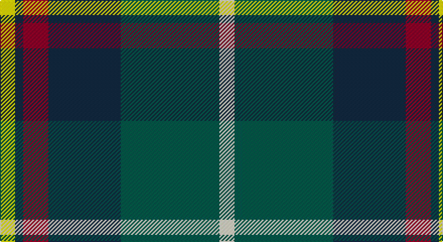

This page is one **sett** — a single exact thread-count. It belongs to the [tartan](/setts/w15dg98dt72r25dt8ly15/)
(the same proportion at any scale), whose colour order is pattern [WGBRBY](/stripes/wgbrby/).

Sourced from register-of-tartans.  It is a [6 stripe tartan](/stripes/stripes6/).

Original link https://www.tartanregister.gov.uk/tartanDetails.aspx?ref=11278

## Register references

External register numbers recorded for this tartan.

- Scottish Register of Tartans: [11278](https://www.tartanregister.gov.uk/tartanDetails.aspx?ref=11278)

## Thread count
Y/15 DN8 DR25 DN72 G98 W/15

One full sett is **436 threads**.

## Palette

Palette: <strong>Tartan Register</strong>
<table><thead><tr><th>Colour</th><th>Threads</th><th>Shade</th><th>Base</th><th>OKLCh</th></tr></thead><tbody><tr><td>Y/</td><td style="text-align:right;font-variant-numeric:tabular-nums">15</td><td><code style="background-color:#FFE600;">#FFE600</code> <small style="color:#888">#FFE600</small></td><td>Y <code style="background-color:#F2BF00;">#F2BF00</code></td><td><small style="color:#888">oklch(91.7% 0.192 101.4)</small></td></tr><tr><td>DN</td><td style="text-align:right;font-variant-numeric:tabular-nums">8</td><td><code style="background-color:#14283C;">#14283C</code> <small style="color:#888">#14283C</small></td><td>B <code style="background-color:#2A418A;">#2A418A</code></td><td><small style="color:#888">oklch(27.1% 0.046 249.9)</small></td></tr><tr><td>DR</td><td style="text-align:right;font-variant-numeric:tabular-nums">25</td><td><code style="background-color:#800028;">#800028</code> <small style="color:#888">#800028</small></td><td>R <code style="background-color:#CC0000;">#CC0000</code></td><td><small style="color:#888">oklch(38.2% 0.152 14.5)</small></td></tr><tr><td>DN</td><td style="text-align:right;font-variant-numeric:tabular-nums">72</td><td><code style="background-color:#14283C;">#14283C</code> <small style="color:#888">#14283C</small></td><td>B <code style="background-color:#2A418A;">#2A418A</code></td><td><small style="color:#888">oklch(27.1% 0.046 249.9)</small></td></tr><tr><td>G</td><td style="text-align:right;font-variant-numeric:tabular-nums">98</td><td><code style="background-color:#005448;">#005448</code> <small style="color:#888">#005448</small></td><td>G <code style="background-color:#006100;">#006100</code></td><td><small style="color:#888">oklch(39.9% 0.073 178.8)</small></td></tr><tr><td>W/</td><td style="text-align:right;font-variant-numeric:tabular-nums">15</td><td><code style="background-color:#F0E0C8;">#F0E0C8</code> <small style="color:#888">#F0E0C8</small></td><td>W <code style="background-color:#F7F7F7;">#F7F7F7</code></td><td><small style="color:#888">oklch(91.3% 0.036 78.1)</small></td></tr></tbody></table>

# Sample pattern

## Nearest tartans

The nearest existing variants by ΔTartan distance, with this tartan at the top so the swatches line up against it.

ΔTartan

Tartan

Sett

—

<a href="/ttd/edit/#slug=w15dg98dt72r25dt8ly15">Afternoon Tea / Darjeeling</a> <a class="nn-out" href="/variants/s6/w15dg98dt72r25dt8ly15/" title="open its dictionary page">↗</a>

0.61

<a href="/ttd/edit/#slug=w15k8m25k72g98ly15&amp;base=w15dg98dt72r25dt8ly15">Afternoon Tea / Afternoon Tea</a> <a class="nn-out" href="/variants/s6/w15k8m25k72g98ly15/" title="open its dictionary page">↗</a>

0.72

<a href="/ttd/edit/#slug=m15dt8y25dt72n98w15&amp;base=w15dg98dt72r25dt8ly15">Afternoon Tea / Black Tea</a> <a class="nn-out" href="/variants/s6/m15dt8y25dt72n98w15/" title="open its dictionary page">↗</a>

0.75

<a href="/ttd/edit/#slug=w15y98db72r25db8ly15&amp;base=w15dg98dt72r25dt8ly15">Afternoon Tea / Darjeeling</a> <a class="nn-out" href="/variants/s6/w15y98db72r25db8ly15/" title="open its dictionary page">↗</a>

0.75

<a href="/ttd/edit/#slug=g3db12w1k12g13r2g2~x4&amp;base=w15dg98dt72r25dt8ly15">MacFadzean/MacPhedran</a> <a class="nn-out" href="/variants/s7/g3db12w1k12g13r2g2~x4/" title="open its dictionary page">↗</a>

0.75

<a href="/ttd/edit/#slug=r5t3g24db24r4ly2~x2&amp;base=w15dg98dt72r25dt8ly15">Canine All Dogs</a> <a class="nn-out" href="/variants/s6/r5t3g24db24r4ly2~x2/" title="open its dictionary page">↗</a>

0.78

<a href="/variants/s8/dp19w2g12t3k4~x2/">Wilson's No.111</a>

0.81

<a href="/ttd/edit/#slug=g3db12w1k12g13r2g2~x2&amp;base=w15dg98dt72r25dt8ly15">Paterson (Personal)</a> <a class="nn-out" href="/variants/s7/g3db12w1k12g13r2g2~x2/" title="open its dictionary page">↗</a>

0.81

<a href="/ttd/edit/#slug=r2ly1g10db10w1~x6&amp;base=w15dg98dt72r25dt8ly15">Turnbull Hunting (Name)</a> <a class="nn-out" href="/variants/s5/r2ly1g10db10w1~x6/" title="open its dictionary page">↗</a>

0.82

<a href="/ttd/edit/#slug=r12db68w7k39g75r6g6&amp;base=w15dg98dt72r25dt8ly15">Rhun (Fashion)</a> <a class="nn-out" href="/variants/s7/r12db68w7k39g75r6g6/" title="open its dictionary page">↗</a>

0.87

<a href="/ttd/edit/#slug=b5dy28lb5k20lo5b47lo4~x2&amp;base=w15dg98dt72r25dt8ly15">State Seal of Washington (Fashion)</a> <a class="nn-out" href="/variants/s7/b5dy28lb5k20lo5b47lo4~x2/" title="open its dictionary page">↗</a>

## Neighbour map

Every grey dot is one of 14360 variants placed by the first two principal components of the ΔTartan feature space (44% of its variance). Red is this tartan; blue dots are its nearest — click one to open its page.

<svg viewBox="0 0 640 380" role="img" style="max-width:100%;height:auto;border:1px solid #e0e0e0;border-radius:4px;display:block" xmlns="http://www.w3.org/2000/svg"><image href="/nn/cloud.v1.png" width="640" height="380"/><a href="/variants/s6/w15k8m25k72g98ly15/"><circle cx="201.0" cy="181.5" r="4" fill="#3465a4"><title>Afternoon Tea / Afternoon Tea</title></circle></a><a href="/variants/s6/m15dt8y25dt72n98w15/"><circle cx="211.2" cy="183.6" r="4" fill="#3465a4"><title>Afternoon Tea / Black Tea</title></circle></a><a href="/variants/s6/w15y98db72r25db8ly15/"><circle cx="202.7" cy="181.2" r="4" fill="#3465a4"><title>Afternoon Tea / Darjeeling</title></circle></a><a href="/variants/s7/g3db12w1k12g13r2g2~x4/"><circle cx="193.7" cy="188.3" r="4" fill="#3465a4"><title>MacFadzean/MacPhedran</title></circle></a><a href="/variants/s6/r5t3g24db24r4ly2~x2/"><circle cx="218.5" cy="189.0" r="4" fill="#3465a4"><title>Canine All Dogs</title></circle></a><a href="/variants/s8/dp19w2g12t3k4~x2/"><circle cx="183.0" cy="184.3" r="4" fill="#3465a4"><title>Wilson's No.111</title></circle></a><a href="/variants/s7/g3db12w1k12g13r2g2~x2/"><circle cx="200.7" cy="195.4" r="4" fill="#3465a4"><title>Paterson (Personal)</title></circle></a><a href="/variants/s5/r2ly1g10db10w1~x6/"><circle cx="220.5" cy="203.4" r="4" fill="#3465a4"><title>Turnbull Hunting (Name)</title></circle></a><a href="/variants/s7/r12db68w7k39g75r6g6/"><circle cx="196.7" cy="184.1" r="4" fill="#3465a4"><title>Rhun (Fashion)</title></circle></a><a href="/variants/s7/b5dy28lb5k20lo5b47lo4~x2/"><circle cx="218.6" cy="177.7" r="4" fill="#3465a4"><title>State Seal of Washington (Fashion)</title></circle></a><circle cx="205.8" cy="188.4" r="5" fill="#c00000"/></svg>

ID: /variants/s6/w15dg98dt72r25dt8ly15/
