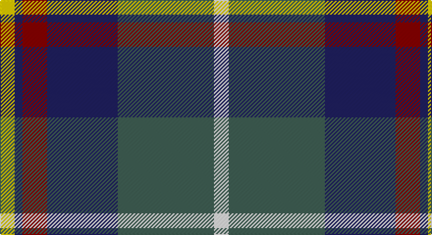

This page is one **sett** — a single exact thread-count. It belongs to the [tartan](/setts/w15y98db72r25db8ly15/)
(the same proportion at any scale), whose colour order is pattern [WGBRBY](/stripes/wgbrby/).

Sourced from tartans-authority.  It is a [6 stripe tartan](/stripes/stripes6/).

Original link http://www.tartansauthority.com/tartan-ferret/display/11278/

## Register references

External register numbers recorded for this tartan.

- Scottish Register of Tartans: [11278](https://www.tartanregister.gov.uk/tartanDetails?ref=11278)
- Scottish Tartans Authority (ITI): 11278

## Thread count
Y/15 DB8 DR25 DB72 N98 W/15

One full sett is **436 threads**.

## Palette

Palette: <strong>Tartan Register</strong> <small style="color:#888">(4 of 5 colours)</small>
<table><thead><tr><th>Colour</th><th>Threads</th><th>Shade</th><th>Base</th><th>OKLCh</th></tr></thead><tbody><tr><td>Y/</td><td style="text-align:right;font-variant-numeric:tabular-nums">15</td><td><code style="background-color:#FCCC00;">#FCCC00</code> <small style="color:#888">#FCCC00</small></td><td>Y <code style="background-color:#F2BF00;">#F2BF00</code></td><td><small style="color:#888">oklch(86.2% 0.176 91.5)</small></td></tr><tr><td>DB</td><td style="text-align:right;font-variant-numeric:tabular-nums">8</td><td><code style="background-color:#202060;">#202060</code> <small style="color:#888">#202060</small></td><td>B <code style="background-color:#2A418A;">#2A418A</code></td><td><small style="color:#888">oklch(28.9% 0.111 276.9)</small></td></tr><tr><td>DR</td><td style="text-align:right;font-variant-numeric:tabular-nums">25</td><td><code style="background-color:#880000;">#880000</code> <small style="color:#888">#880000</small></td><td>R <code style="background-color:#CC0000;">#CC0000</code></td><td><small style="color:#888">oklch(39.4% 0.162 29.2)</small></td></tr><tr><td>DB</td><td style="text-align:right;font-variant-numeric:tabular-nums">72</td><td><code style="background-color:#202060;">#202060</code> <small style="color:#888">#202060</small></td><td>B <code style="background-color:#2A418A;">#2A418A</code></td><td><small style="color:#888">oklch(28.9% 0.111 276.9)</small></td></tr><tr><td>N</td><td style="text-align:right;font-variant-numeric:tabular-nums">98</td><td><code style="background-color:#406054;">#406054</code> <small style="color:#888">#406054</small></td><td>G <code style="background-color:#006100;">#006100</code></td><td><small style="color:#888">oklch(46.0% 0.042 169.0)</small></td></tr><tr><td>W/</td><td style="text-align:right;font-variant-numeric:tabular-nums">15</td><td><code style="background-color:#FCFCFC;">#FCFCFC</code> <small style="color:#888">#FCFCFC</small></td><td>W <code style="background-color:#F7F7F7;">#F7F7F7</code></td><td><small style="color:#888">oklch(99.1% 0.000 89.9)</small></td></tr></tbody></table>

# Sample pattern

## Nearest tartans

The nearest existing variants by ΔTartan distance, with this tartan at the top so the swatches line up against it.

ΔTartan

Tartan

Sett

—

<a href="/ttd/edit/#slug=w15y98db72r25db8ly15">Afternoon Tea / Darjeeling</a> <a class="nn-out" href="/variants/s6/w15y98db72r25db8ly15/" title="open its dictionary page">↗</a>

0.45

<a href="/ttd/edit/#slug=m15dt8y25dt72n98w15&amp;base=w15y98db72r25db8ly15">Afternoon Tea / Black Tea</a> <a class="nn-out" href="/variants/s6/m15dt8y25dt72n98w15/" title="open its dictionary page">↗</a>

0.70

<a href="/ttd/edit/#slug=t4n19lr2k19n2lr25lb2~x2&amp;base=w15y98db72r25db8ly15">Ritchie, Stephen James (Personal)</a> <a class="nn-out" href="/variants/s7/t4n19lr2k19n2lr25lb2~x2/" title="open its dictionary page">↗</a>

0.73

<a href="/ttd/edit/#slug=m3k17n11m2o20w2~x2&amp;base=w15y98db72r25db8ly15">Commonwealth Games Council (Corp.)</a> <a class="nn-out" href="/variants/s6/m3k17n11m2o20w2~x2/" title="open its dictionary page">↗</a>

0.75

<a href="/ttd/edit/#slug=w15dg98dt72r25dt8ly15&amp;base=w15y98db72r25db8ly15">Afternoon Tea / Darjeeling</a> <a class="nn-out" href="/variants/s6/w15dg98dt72r25dt8ly15/" title="open its dictionary page">↗</a>

0.76

<a href="/ttd/edit/#slug=b5dy28lb5k20lo5b47lo4~x2&amp;base=w15y98db72r25db8ly15">State Seal of Washington (Fashion)</a> <a class="nn-out" href="/variants/s7/b5dy28lb5k20lo5b47lo4~x2/" title="open its dictionary page">↗</a>

0.79

<a href="/ttd/edit/#slug=db34dy9ly3dy9y30r3y11r5&amp;base=w15y98db72r25db8ly15">Ballantyne (Personal) STWR</a> <a class="nn-out" href="/variants/s8/db34dy9ly3dy9y30r3y11r5/" title="open its dictionary page">↗</a>

0.83

<a href="/ttd/edit/#slug=g3db12w1k12g13r2g2~x4&amp;base=w15y98db72r25db8ly15">MacFadzean/MacPhedran</a> <a class="nn-out" href="/variants/s7/g3db12w1k12g13r2g2~x4/" title="open its dictionary page">↗</a>

0.86

<a href="/ttd/edit/#slug=w6k29o29dp7k3r3~x2&amp;base=w15y98db72r25db8ly15">Jewell of Kernow (Personal)</a> <a class="nn-out" href="/variants/s6/w6k29o29dp7k3r3~x2/" title="open its dictionary page">↗</a>

0.87

<a href="/ttd/edit/#slug=r5t3g24db24r4ly2~x2&amp;base=w15y98db72r25db8ly15">Canine All Dogs</a> <a class="nn-out" href="/variants/s6/r5t3g24db24r4ly2~x2/" title="open its dictionary page">↗</a>

0.90

<a href="/ttd/edit/#slug=r4t28k6lb12k12lo3~x2&amp;base=w15y98db72r25db8ly15">MacTavish Dress</a> <a class="nn-out" href="/variants/s6/r4t28k6lb12k12lo3~x2/" title="open its dictionary page">↗</a>

## Neighbour map

Every grey dot is one of 14360 variants placed by the first two principal components of the ΔTartan feature space (44% of its variance). Red is this tartan; blue dots are its nearest — click one to open its page.

<svg viewBox="0 0 640 380" role="img" style="max-width:100%;height:auto;border:1px solid #e0e0e0;border-radius:4px;display:block" xmlns="http://www.w3.org/2000/svg"><image href="/nn/cloud.v1.png" width="640" height="380"/><a href="/variants/s6/m15dt8y25dt72n98w15/"><circle cx="211.2" cy="183.6" r="4" fill="#3465a4"><title>Afternoon Tea / Black Tea</title></circle></a><a href="/variants/s7/t4n19lr2k19n2lr25lb2~x2/"><circle cx="175.1" cy="168.5" r="4" fill="#3465a4"><title>Ritchie, Stephen James (Personal)</title></circle></a><a href="/variants/s6/m3k17n11m2o20w2~x2/"><circle cx="159.8" cy="192.2" r="4" fill="#3465a4"><title>Commonwealth Games Council (Corp.)</title></circle></a><a href="/variants/s6/w15dg98dt72r25dt8ly15/"><circle cx="205.8" cy="188.4" r="4" fill="#3465a4"><title>Afternoon Tea / Darjeeling</title></circle></a><a href="/variants/s7/b5dy28lb5k20lo5b47lo4~x2/"><circle cx="218.6" cy="177.7" r="4" fill="#3465a4"><title>State Seal of Washington (Fashion)</title></circle></a><a href="/variants/s8/db34dy9ly3dy9y30r3y11r5/"><circle cx="186.8" cy="175.0" r="4" fill="#3465a4"><title>Ballantyne (Personal) STWR</title></circle></a><a href="/variants/s7/g3db12w1k12g13r2g2~x4/"><circle cx="193.7" cy="188.3" r="4" fill="#3465a4"><title>MacFadzean/MacPhedran</title></circle></a><a href="/variants/s6/w6k29o29dp7k3r3~x2/"><circle cx="188.2" cy="178.3" r="4" fill="#3465a4"><title>Jewell of Kernow (Personal)</title></circle></a><a href="/variants/s6/r5t3g24db24r4ly2~x2/"><circle cx="218.5" cy="189.0" r="4" fill="#3465a4"><title>Canine All Dogs</title></circle></a><a href="/variants/s6/r4t28k6lb12k12lo3~x2/"><circle cx="167.8" cy="188.3" r="4" fill="#3465a4"><title>MacTavish Dress</title></circle></a><circle cx="202.7" cy="181.2" r="5" fill="#c00000"/></svg>

ID: /variants/s6/w15y98db72r25db8ly15/
