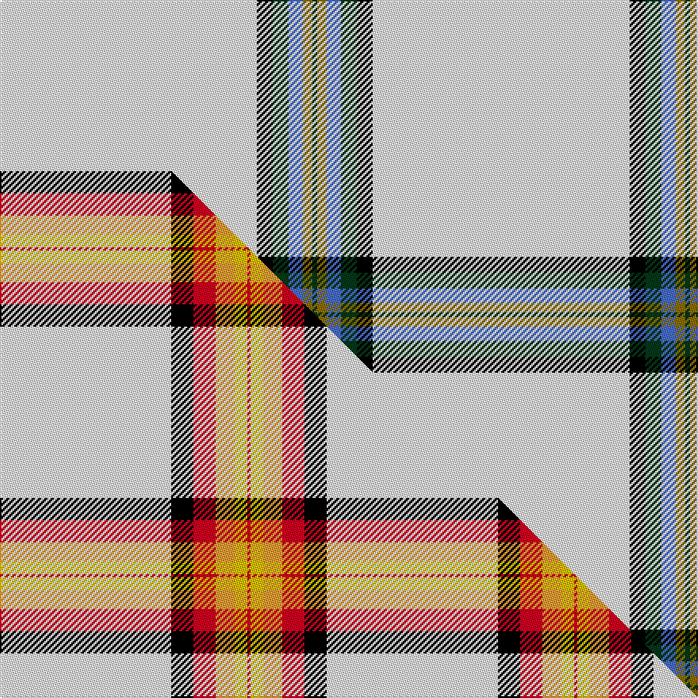

This is one **variant** — a specific cloth: this exact thread count and colourway, with its own
provenance below. It is one weaving of the [sett](/setts/w162k10dg10b9y6dg3/) (the scale-free proportion — the
same cloth at any scale or shade), whose colour order is pattern [GGBGKW](/stripes/ggbgkw/).

Part of the [Young, Christina](/tartans/young-christina/) tartan — the named design grouping this sett with its other cloths.

Sourced from weddslist.  It is a [6 stripe tartan](/stripes/stripes6/).

Original link [http://www.weddslist.com/cgi-bin/tartans/pg.pl?source=sts](http://www.weddslist.com/cgi-bin/tartans/pg.pl?source=sts)

Dataset <small>— provenance for this record, inherited from the source manifest</small>

<dl class="dataset-prov">
<dt>source</dt><dd><a href="/sources/weddslist/">Weddslist</a></dd>
<dt>data captured from</dt><dd><a href="https://github.com/thetartan/tartan-database/blob/master/data/weddslist/data.csv">https://github.com/thetartan/tartan-database/blob/master/data/weddslist/data.csv</a></dd>
<dt>data date</dt><dd>2016-11-17 <small>(dataset default)</small></dd>
<dt>licence</dt><dd><a href="https://creativecommons.org/licenses/by-nc-nd/4.0/">CC BY-NC-ND 4.0</a></dd>
</dl>

Capture chain <small>— the hands this data passed through, oldest first; each capture carries its own licence</small>

<ol class="capture-chain">
<li><a href="https://www.weddslist.com/tartans/">Weddslist</a> <small>the living privately compiled reference</small></li>
<li><a href="https://github.com/thetartan/tartan-database">thetartan/tartan-database</a> <small>2016-2017</small> · <a href="https://creativecommons.org/licenses/by-nc-nd/4.0/">CC BY-NC-ND 4.0</a> <small>Levko Kravets's frozen compilation — the capture we vendored, and where its CC licence text came from</small></li>
<li>this dictionary <small>captured 2026-06-10 · commit 5bf86c7566</small> <small>each re-capture is a git commit to data/sources</small></li>
</ol>

## Thread count
W/162 K10 DG10 B9 Y6 DG/3

One full sett is **235 threads**.

## Palette
<table><thead><tr><th>Colour</th><th>Shade</th><th>OKLCh</th></tr></thead><tbody><tr><td>K</td><td><code style="background-color:#000000;">#000000</code> <small style="color:#888">#000000</small></td><td><small style="color:#888">oklch(0.0% 0.000 0.0)</small></td></tr><tr><td>Y</td><td><code style="background-color:#8B6E00;">#8B6E00</code> <small style="color:#888">#8B6E00</small></td><td><small style="color:#888">oklch(55.1% 0.113 90.4)</small></td></tr><tr><td>W</td><td><code style="background-color:#F7F7F7;">#F7F7F7</code> <small style="color:#888">#F7F7F7</small></td><td><small style="color:#888">oklch(97.6% 0.000 89.9)</small></td></tr><tr><td>B</td><td><code style="background-color:#466CC8;">#466CC8</code> <small style="color:#888">#466CC8</small></td><td><small style="color:#888">oklch(55.1% 0.149 265.0)</small></td></tr><tr><td>DG</td><td><code style="background-color:#053819;">#053819</code> <small style="color:#888">#053819</small></td><td><small style="color:#888">oklch(30.0% 0.075 151.3)</small></td></tr></tbody></table>

# Sample pattern

## Compared to the master

This cloth is one sett of its design; the master sett (the exemplar the design is anchored on) is below for comparison.

Its **ΔTartan distance** from the master is **1.02** — the same measure the nearest-tartans table ranks by (0 is identical; a re-scale of the same cloth is near 0, a recolour or a different proportion further).

<figure class="master-compare" style="margin:0">

this sett
master sett ★

<figcaption style="color:#888;font-size:smaller">One weave of this sett against the <a href="/setts/w54k7r7lo6ly4r1/">master sett ★</a>, split on the diagonal: a shared proportion runs seamlessly across it with only the shades shifting; a different proportion breaks on it.</figcaption>
</figure>

## Nearest tartan variants

The nearest existing variants by ΔTartan distance, with this cloth at the top so the swatches line up against it.

ΔTartan

Threads

Variant

Sett

—

235

<a href="/variants/s6/w162k10dg10b9y6dg3/">Young, Christina</a>

<a href="/ttd/edit/#slug=w54k7r7lo6ly4r1~x2~ly3307090&amp;base=w162k10dg10b9y6dg3" title="compare in the TTD">1.02</a>

206

<a href="/variants/s6/w54k7r7lo6ly4r1~x2~ly3307090/">Young, Christina</a>

<a href="/ttd/edit/#slug=k2w1g5dr1lb18dr2~x2&amp;base=w162k10dg10b9y6dg3" title="compare in the TTD">1.40</a>

108

<a href="/variants/s6/k2w1g5dr1lb18dr2~x2/">Norris (1998) (Name)</a>

<a href="/ttd/edit/#slug=k2w1g5dr1lb18r2~x2&amp;base=w162k10dg10b9y6dg3" title="compare in the TTD">1.40</a>

108

<a href="/variants/s6/k2w1g5dr1lb18r2~x2/">Norris (1998)</a>

<a href="/ttd/edit/#slug=w35db12r2n2~x2&amp;base=w162k10dg10b9y6dg3" title="compare in the TTD">1.66</a>

130

<a href="/variants/s4/w35db12r2n2~x2/">Triplett, Jack Arnold</a>

<a href="/ttd/edit/#slug=k2lb28g7w3r2~x2&amp;base=w162k10dg10b9y6dg3" title="compare in the TTD">1.69</a>

160

<a href="/variants/s5/k2lb28g7w3r2~x2/">Cleland Corporate Tartan</a>

<a href="/ttd/edit/#slug=k2lb36g12w3r2~x2&amp;base=w162k10dg10b9y6dg3" title="compare in the TTD">1.70</a>

212

<a href="/variants/s5/k2lb36g12w3r2~x2/">Cleland</a>

<a href="/ttd/edit/#slug=k2w1n8dr1lb28dr2~x2&amp;base=w162k10dg10b9y6dg3" title="compare in the TTD">2.00</a>

160

<a href="/variants/s6/k2w1n8dr1lb28dr2~x2/">Norris Hunting</a>

<a href="/ttd/edit/#slug=dy6lb38k3~x2&amp;base=w162k10dg10b9y6dg3" title="compare in the TTD">2.27</a>

170

<a href="/variants/s3/dy6lb38k3~x2/">Poulain League (Corporate)</a>

<a href="/ttd/edit/#slug=w52g22w6g8k1r3~x2&amp;base=w162k10dg10b9y6dg3" title="compare in the TTD">2.28</a>

258

<a href="/variants/s6/w52g22w6g8k1r3~x2/">MacGregor Dress Green (Dance)</a>

<a href="/ttd/edit/#slug=ly12w1k2ly1r1~x8&amp;base=w162k10dg10b9y6dg3" title="compare in the TTD">2.35</a>

168

<a href="/variants/s5/ly12w1k2ly1r1~x8/">Lochcarron Camel</a>

## Neighbour map

Every grey dot is one of 13621 variants placed by the first two principal components of the ΔTartan feature space (42% of its variance). Red is this tartan; blue dots are its nearest — click one to open its page.

<svg viewBox="0 0 640 380" role="img" style="max-width:100%;height:auto;border:1px solid #e0e0e0;border-radius:4px;display:block" xmlns="http://www.w3.org/2000/svg"><image href="/nn/cloud.v1.png" width="640" height="380"/><a href="/variants/s6/w54k7r7lo6ly4r1~x2~ly3307090/"><circle cx="374.1" cy="74.6" r="4" fill="#3465a4"><title>Young, Christina</title></circle></a><a href="/variants/s6/k2w1g5dr1lb18dr2~x2/"><circle cx="313.4" cy="132.1" r="4" fill="#3465a4"><title>Norris (1998) (Name)</title></circle></a><a href="/variants/s6/k2w1g5dr1lb18r2~x2/"><circle cx="294.0" cy="115.1" r="4" fill="#3465a4"><title>Norris (1998)</title></circle></a><a href="/variants/s4/w35db12r2n2~x2/"><circle cx="390.0" cy="181.9" r="4" fill="#3465a4"><title>Triplett, Jack Arnold</title></circle></a><a href="/variants/s5/k2lb28g7w3r2~x2/"><circle cx="352.4" cy="153.9" r="4" fill="#3465a4"><title>Cleland Corporate Tartan</title></circle></a><a href="/variants/s5/k2lb36g12w3r2~x2/"><circle cx="363.2" cy="148.3" r="4" fill="#3465a4"><title>Cleland</title></circle></a><a href="/variants/s6/k2w1n8dr1lb28dr2~x2/"><circle cx="383.9" cy="110.8" r="4" fill="#3465a4"><title>Norris Hunting</title></circle></a><a href="/variants/s3/dy6lb38k3~x2/"><circle cx="479.9" cy="206.8" r="4" fill="#3465a4"><title>Poulain League (Corporate)</title></circle></a><a href="/variants/s6/w52g22w6g8k1r3~x2/"><circle cx="382.7" cy="115.0" r="4" fill="#3465a4"><title>MacGregor Dress Green (Dance)</title></circle></a><a href="/variants/s5/ly12w1k2ly1r1~x8/"><circle cx="420.0" cy="160.0" r="4" fill="#3465a4"><title>Lochcarron Camel</title></circle></a><circle cx="487.5" cy="63.4" r="5" fill="#c00000"/><text x="320" y="376" text-anchor="middle" font-size="11" fill="#999">ground</text><text x="11" y="190" text-anchor="middle" font-size="11" fill="#999" transform="rotate(-90 11 190)">complexity</text></svg>

ID: /variants/s6/w162k10dg10b9y6dg3/
