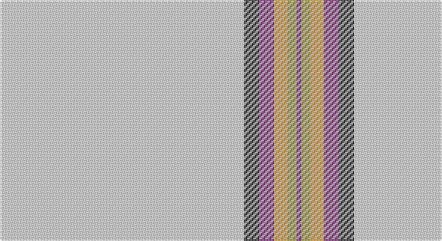

This page is one **sett** — a single exact thread-count. It belongs to the [tartan](/setts/w162k10dp10lo9y6dp3/)
(the same proportion at any scale), whose colour order is pattern [BGYBKW](/stripes/bgybkw/).

Part of the [Young, Christina](/tartans/young-christina/) tartan — the named design grouping this sett with its other cloths.

Sourced from weddslist.  It is a [6 stripe tartan](/stripes/stripes6/).

Original link http://www.weddslist.com/cgi-bin/tartans/pg.pl?source=sts

## Thread count
LN/162 K10 P10 O9 LG6 P/3

One full sett is **235 threads**.

## Palette

Palette: <strong>Tartan Register</strong> <small style="color:#888">(2 of 5 colours)</small>
<table><thead><tr><th>Colour</th><th>Threads</th><th>Shade</th><th>Base</th><th>OKLCh</th></tr></thead><tbody><tr><td>LN/</td><td style="text-align:right;font-variant-numeric:tabular-nums">162</td><td><code style="background-color:#E0E0E0;">#E0E0E0</code> <small style="color:#888">#E0E0E0</small></td><td>W <code style="background-color:#F7F7F7;">#F7F7F7</code></td><td><small style="color:#888">oklch(90.7% 0.000 89.9)</small></td></tr><tr><td>K</td><td style="text-align:right;font-variant-numeric:tabular-nums">10</td><td><code style="background-color:#000000;">#000000</code> <small style="color:#888">#000000</small></td><td>K <code style="background-color:#000000;">#000000</code></td><td><small style="color:#888">oklch(0.0% 0.000 0.0)</small></td></tr><tr><td>P</td><td style="text-align:right;font-variant-numeric:tabular-nums">10</td><td><code style="background-color:#800070;">#800070</code> <small style="color:#888">#800070</small></td><td>B <code style="background-color:#2A418A;">#2A418A</code></td><td><small style="color:#888">oklch(41.1% 0.183 335.2)</small></td></tr><tr><td>O</td><td style="text-align:right;font-variant-numeric:tabular-nums">9</td><td><code style="background-color:#FF8500;">#FF8500</code> <small style="color:#888">#FF8500</small></td><td>Y <code style="background-color:#F2BF00;">#F2BF00</code></td><td><small style="color:#888">oklch(74.0% 0.183 55.1)</small></td></tr><tr><td>LG</td><td style="text-align:right;font-variant-numeric:tabular-nums">6</td><td><code style="background-color:#908000;">#908000</code> <small style="color:#888">#908000</small></td><td>G <code style="background-color:#006100;">#006100</code></td><td><small style="color:#888">oklch(59.6% 0.124 100.6)</small></td></tr><tr><td>P/</td><td style="text-align:right;font-variant-numeric:tabular-nums">3</td><td><code style="background-color:#800070;">#800070</code> <small style="color:#888">#800070</small></td><td>B <code style="background-color:#2A418A;">#2A418A</code></td><td><small style="color:#888">oklch(41.1% 0.183 335.2)</small></td></tr></tbody></table>

# Sample pattern

## Compared to the master

This cloth is one sett of its design; the master sett (the exemplar the design is anchored on) is below for comparison.

<figure style="margin:0"><figcaption style="color:#888;font-size:smaller">this sett</figcaption></figure>
<figure style="margin:0"><figcaption style="color:#888;font-size:smaller"><a href="/setts/w54k7r7lo6ly4r1/">master sett →</a></figcaption></figure>

## Nearest tartans

The nearest existing variants by ΔTartan distance, with this tartan at the top so the swatches line up against it.

ΔTartan

Tartan

Sett

—

<a href="/ttd/edit/#slug=w162k10dp10lo9y6dp3">Young, Christina</a> <a class="nn-out" href="/variants/s6/w162k10dp10lo9y6dp3/" title="open its dictionary page">↗</a>

1.31

<a href="/ttd/edit/#slug=w83k6w3k9r2k5w2ly2~x2&amp;base=w162k10dp10lo9y6dp3">Crane of Cluny Dress (Personal)</a> <a class="nn-out" href="/variants/s8/w83k6w3k9r2k5w2ly2~x2/" title="open its dictionary page">↗</a>

1.65

<a href="/ttd/edit/#slug=w120k2db4g3w2k2r8w2r3~x2&amp;base=w162k10dp10lo9y6dp3">Unnamed C18th - Blanket Pattern</a> <a class="nn-out" href="/variants/s9/w120k2db4g3w2k2r8w2r3~x2/" title="open its dictionary page">↗</a>

1.66

<a href="/ttd/edit/#slug=w168r2w2lo2w2loi3g26~x2&amp;base=w162k10dp10lo9y6dp3">Whisky Kilt (Fashion)</a> <a class="nn-out" href="/variants/s7/w168r2w2lo2w2loi3g26~x2/" title="open its dictionary page">↗</a>

1.92

<a href="/ttd/edit/#slug=w46o9w4k8w9r4w9dy2w2dy2w2dy1~x2&amp;base=w162k10dp10lo9y6dp3">Old England House Check</a> <a class="nn-out" href="/variants/s12/w46o9w4k8w9r4w9dy2w2dy2w2dy1~x2/" title="open its dictionary page">↗</a>

1.94

<a href="/ttd/edit/#slug=lr10k2w5k4lr50b2~x2&amp;base=w162k10dp10lo9y6dp3">London Fog Safari (Fashion)</a> <a class="nn-out" href="/variants/s6/lr10k2w5k4lr50b2~x2/" title="open its dictionary page">↗</a>

2.07

<a href="/ttd/edit/#slug=w54k7r7lo6ly4r1~x2&amp;base=w162k10dp10lo9y6dp3">Young, Christina</a> <a class="nn-out" href="/variants/s6/w54k7r7lo6ly4r1~x2/" title="open its dictionary page">↗</a>

2.11

<a href="/ttd/edit/#slug=w100r14w13g13w13k1r14k1w13g13w13r12w100~x2&amp;base=w162k10dp10lo9y6dp3">Wilson's Blanket Sett - Border</a> <a class="nn-out" href="/variants/s13/w100r14w13g13w13k1r14k1w13g13w13r12w100~x2/" title="open its dictionary page">↗</a>

2.15

<a href="/ttd/edit/#slug=w46lr4w9k8w9r4w9do2w2do2w2do2~x2&amp;base=w162k10dp10lo9y6dp3">Old England House Check</a> <a class="nn-out" href="/variants/s12/w46lr4w9k8w9r4w9do2w2do2w2do2~x2/" title="open its dictionary page">↗</a>

2.15

<a href="/ttd/edit/#slug=r2w2k2w28k8w9k1ly2~x2&amp;base=w162k10dp10lo9y6dp3">Summer Spirit (Fashion)</a> <a class="nn-out" href="/variants/s8/r2w2k2w28k8w9k1ly2~x2/" title="open its dictionary page">↗</a>

2.16

<a href="/ttd/edit/#slug=lb7w2m7w4lb50w2k2r2~x2&amp;base=w162k10dp10lo9y6dp3">MacDonald from Rawtenstall (Personal)</a> <a class="nn-out" href="/variants/s8/lb7w2m7w4lb50w2k2r2~x2/" title="open its dictionary page">↗</a>

## Neighbour map

Every grey dot is one of 14360 variants placed by the first two principal components of the ΔTartan feature space (44% of its variance). Red is this tartan; blue dots are its nearest — click one to open its page.

<svg viewBox="0 0 640 380" role="img" style="max-width:100%;height:auto;border:1px solid #e0e0e0;border-radius:4px;display:block" xmlns="http://www.w3.org/2000/svg"><image href="/nn/cloud.v1.png" width="640" height="380"/><a href="/variants/s8/w83k6w3k9r2k5w2ly2~x2/"><circle cx="504.9" cy="59.1" r="4" fill="#3465a4"><title>Crane of Cluny Dress (Personal)</title></circle></a><a href="/variants/s9/w120k2db4g3w2k2r8w2r3~x2/"><circle cx="585.0" cy="32.1" r="4" fill="#3465a4"><title>Unnamed C18th - Blanket Pattern</title></circle></a><a href="/variants/s7/w168r2w2lo2w2loi3g26~x2/"><circle cx="596.3" cy="64.3" r="4" fill="#3465a4"><title>Whisky Kilt (Fashion)</title></circle></a><a href="/variants/s12/w46o9w4k8w9r4w9dy2w2dy2w2dy1~x2/"><circle cx="438.1" cy="48.5" r="4" fill="#3465a4"><title>Old England House Check</title></circle></a><a href="/variants/s6/lr10k2w5k4lr50b2~x2/"><circle cx="550.4" cy="138.7" r="4" fill="#3465a4"><title>London Fog Safari (Fashion)</title></circle></a><a href="/variants/s6/w54k7r7lo6ly4r1~x2/"><circle cx="414.3" cy="72.0" r="4" fill="#3465a4"><title>Young, Christina</title></circle></a><a href="/variants/s13/w100r14w13g13w13k1r14k1w13g13w13r12w100~x2/"><circle cx="504.6" cy="62.5" r="4" fill="#3465a4"><title>Wilson's Blanket Sett - Border</title></circle></a><a href="/variants/s12/w46lr4w9k8w9r4w9do2w2do2w2do2~x2/"><circle cx="437.6" cy="68.3" r="4" fill="#3465a4"><title>Old England House Check</title></circle></a><a href="/variants/s8/r2w2k2w28k8w9k1ly2~x2/"><circle cx="412.5" cy="97.2" r="4" fill="#3465a4"><title>Summer Spirit (Fashion)</title></circle></a><a href="/variants/s8/lb7w2m7w4lb50w2k2r2~x2/"><circle cx="469.5" cy="98.9" r="4" fill="#3465a4"><title>MacDonald from Rawtenstall (Personal)</title></circle></a><circle cx="529.6" cy="63.1" r="5" fill="#c00000"/></svg>

ID: /variants/s6/w162k10dp10lo9y6dp3/
