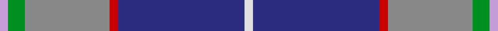
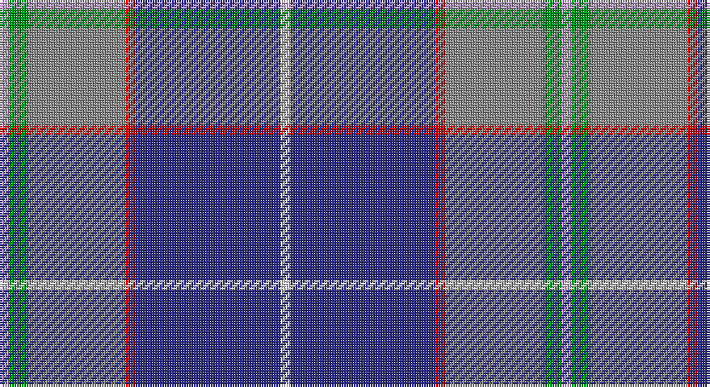

This page is one **sett** — a single exact thread-count. It belongs to the [tartan](/setts/w1db15r1o10g2lp1/)
(the same proportion at any scale), whose colour order is pattern [WBRRGW](/stripes/wbrrgw/).

Sourced from tartans-authority.  It is a [6 stripe tartan](/stripes/stripes6/).

Original link http://www.tartansauthority.com/tartan-ferret/display/10127/

## Register references

External register numbers recorded for this tartan.

- Scottish Register of Tartans: [10127](https://www.tartanregister.gov.uk/tartanDetails?ref=10127)
- Scottish Tartans Authority (ITI): 10127

## Thread count
LP/4 G8 N40 R4 DB60 LN/4

One full sett is **232 threads**.

## Palette

Palette: <strong>Tartan Register</strong> <small style="color:#888">(5 of 6 colours)</small>
<table><thead><tr><th>Colour</th><th>Threads</th><th>Shade</th><th>Base</th><th>OKLCh</th></tr></thead><tbody><tr><td>LP/</td><td style="text-align:right;font-variant-numeric:tabular-nums">4</td><td><code style="background-color:#C49CD8;">#C49CD8</code> <small style="color:#888">#C49CD8</small></td><td>W <code style="background-color:#F7F7F7;">#F7F7F7</code></td><td><small style="color:#888">oklch(75.0% 0.095 314.2)</small></td></tr><tr><td>G</td><td style="text-align:right;font-variant-numeric:tabular-nums">8</td><td><code style="background-color:#009020;">#009020</code> <small style="color:#888">#009020</small></td><td>G <code style="background-color:#006100;">#006100</code></td><td><small style="color:#888">oklch(56.7% 0.182 144.4)</small></td></tr><tr><td>N</td><td style="text-align:right;font-variant-numeric:tabular-nums">40</td><td><code style="background-color:#888888;">#888888</code> <small style="color:#888">#888888</small></td><td>R <code style="background-color:#CC0000;">#CC0000</code></td><td><small style="color:#888">oklch(62.7% 0.000 89.9)</small></td></tr><tr><td>R</td><td style="text-align:right;font-variant-numeric:tabular-nums">4</td><td><code style="background-color:#C80000;">#C80000</code> <small style="color:#888">#C80000</small></td><td>R <code style="background-color:#CC0000;">#CC0000</code></td><td><small style="color:#888">oklch(52.3% 0.215 29.2)</small></td></tr><tr><td>DB</td><td style="text-align:right;font-variant-numeric:tabular-nums">60</td><td><code style="background-color:#2C2C80;">#2C2C80</code> <small style="color:#888">#2C2C80</small></td><td>B <code style="background-color:#2A418A;">#2A418A</code></td><td><small style="color:#888">oklch(35.0% 0.138 276.6)</small></td></tr><tr><td>LN/</td><td style="text-align:right;font-variant-numeric:tabular-nums">4</td><td><code style="background-color:#E0E0E0;">#E0E0E0</code> <small style="color:#888">#E0E0E0</small></td><td>W <code style="background-color:#F7F7F7;">#F7F7F7</code></td><td><small style="color:#888">oklch(90.7% 0.000 89.9)</small></td></tr></tbody></table>

# Sample pattern

## Nearest tartans

The nearest existing variants by ΔTartan distance, with this tartan at the top so the swatches line up against it.

ΔTartan

Tartan

Sett

—

<a href="/ttd/edit/#slug=w1db15r1o10g2lp1~x4">Peterson, Oren (Name)</a> <a class="nn-out" href="/variants/s6/w1db15r1o10g2lp1~x4/" title="open its dictionary page">↗</a>

0.75

<a href="/ttd/edit/#slug=k4n4dt32r4t17w2~x2&amp;base=w1db15r1o10g2lp1~x4">Shearer (2016)</a> <a class="nn-out" href="/variants/s6/k4n4dt32r4t17w2~x2/" title="open its dictionary page">↗</a>

0.88

<a href="/ttd/edit/#slug=ly4db24t5g2db3k5t33r2~x2&amp;base=w1db15r1o10g2lp1~x4">Los Angeles</a> <a class="nn-out" href="/variants/s8/ly4db24t5g2db3k5t33r2~x2/" title="open its dictionary page">↗</a>

0.95

<a href="/ttd/edit/#slug=t27db9lb3g6db33lb3dr3ly2~x2&amp;base=w1db15r1o10g2lp1~x4">Blue Ridge Highlands Heritage</a> <a class="nn-out" href="/variants/s8/t27db9lb3g6db33lb3dr3ly2~x2/" title="open its dictionary page">↗</a>

1.03

<a href="/ttd/edit/#slug=m4k3b18r3dt34w3~x2&amp;base=w1db15r1o10g2lp1~x4">Margach, William (Personal)</a> <a class="nn-out" href="/variants/s6/m4k3b18r3dt34w3~x2/" title="open its dictionary page">↗</a>

1.05

<a href="/ttd/edit/#slug=db30b10lb10db5m3ly3g3~x2&amp;base=w1db15r1o10g2lp1~x4">Wrigglesworth (Name)</a> <a class="nn-out" href="/variants/s7/db30b10lb10db5m3ly3g3~x2/" title="open its dictionary page">↗</a>

1.06

<a href="/ttd/edit/#slug=t4lo2t34db10lr4db4dp4db23w3~x2&amp;base=w1db15r1o10g2lp1~x4">Heirloom Blue Alba (Fashion)</a> <a class="nn-out" href="/variants/s9/t4lo2t34db10lr4db4dp4db23w3~x2/" title="open its dictionary page">↗</a>

1.08

<a href="/ttd/edit/#slug=t12db6t50dbi39p12dp6p6w4&amp;base=w1db15r1o10g2lp1~x4">Pride of the Nation (Fashion)</a> <a class="nn-out" href="/variants/s8/t12db6t50dbi39p12dp6p6w4/" title="open its dictionary page">↗</a>

1.09

<a href="/ttd/edit/#slug=t2g13r2k6db23w1~x4&amp;base=w1db15r1o10g2lp1~x4">Gamblin Thompson (Personal)</a> <a class="nn-out" href="/variants/s6/t2g13r2k6db23w1~x4/" title="open its dictionary page">↗</a>

1.19

<a href="/ttd/edit/#slug=m1g2t10r1db15w1~x4&amp;base=w1db15r1o10g2lp1~x4">Oren Peterson</a> <a class="nn-out" href="/variants/s6/m1g2t10r1db15w1~x4/" title="open its dictionary page">↗</a>

1.20

<a href="/ttd/edit/#slug=w1dp3g6k1db12ly1db2ly1~x4&amp;base=w1db15r1o10g2lp1~x4">Lambert, Patrice (Personal)</a> <a class="nn-out" href="/variants/s8/w1dp3g6k1db12ly1db2ly1~x4/" title="open its dictionary page">↗</a>

## Neighbour map

Every grey dot is one of 14360 variants placed by the first two principal components of the ΔTartan feature space (44% of its variance). Red is this tartan; blue dots are its nearest — click one to open its page.

<svg viewBox="0 0 640 380" role="img" style="max-width:100%;height:auto;border:1px solid #e0e0e0;border-radius:4px;display:block" xmlns="http://www.w3.org/2000/svg"><image href="/nn/cloud.v1.png" width="640" height="380"/><a href="/variants/s6/k4n4dt32r4t17w2~x2/"><circle cx="249.0" cy="151.0" r="4" fill="#3465a4"><title>Shearer (2016)</title></circle></a><a href="/variants/s8/ly4db24t5g2db3k5t33r2~x2/"><circle cx="250.6" cy="128.9" r="4" fill="#3465a4"><title>Los Angeles</title></circle></a><a href="/variants/s8/t27db9lb3g6db33lb3dr3ly2~x2/"><circle cx="263.2" cy="146.6" r="4" fill="#3465a4"><title>Blue Ridge Highlands Heritage</title></circle></a><a href="/variants/s6/m4k3b18r3dt34w3~x2/"><circle cx="275.8" cy="176.3" r="4" fill="#3465a4"><title>Margach, William (Personal)</title></circle></a><a href="/variants/s7/db30b10lb10db5m3ly3g3~x2/"><circle cx="238.1" cy="160.4" r="4" fill="#3465a4"><title>Wrigglesworth (Name)</title></circle></a><a href="/variants/s9/t4lo2t34db10lr4db4dp4db23w3~x2/"><circle cx="237.5" cy="131.0" r="4" fill="#3465a4"><title>Heirloom Blue Alba (Fashion)</title></circle></a><a href="/variants/s8/t12db6t50dbi39p12dp6p6w4/"><circle cx="217.0" cy="153.8" r="4" fill="#3465a4"><title>Pride of the Nation (Fashion)</title></circle></a><a href="/variants/s6/t2g13r2k6db23w1~x4/"><circle cx="268.1" cy="149.6" r="4" fill="#3465a4"><title>Gamblin Thompson (Personal)</title></circle></a><a href="/variants/s6/m1g2t10r1db15w1~x4/"><circle cx="245.7" cy="144.8" r="4" fill="#3465a4"><title>Oren Peterson</title></circle></a><a href="/variants/s8/w1dp3g6k1db12ly1db2ly1~x4/"><circle cx="235.0" cy="145.6" r="4" fill="#3465a4"><title>Lambert, Patrice (Personal)</title></circle></a><circle cx="269.5" cy="150.4" r="5" fill="#c00000"/></svg>

ID: /variants/s6/w1db15r1o10g2lp1~x4/
