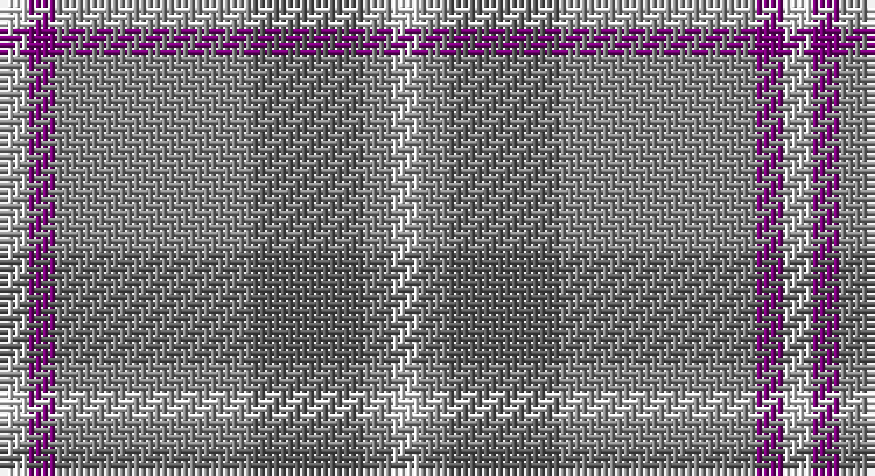

This page is one **sett** — a single exact thread-count. It belongs to the [tartan](/setts/w1dp1o7n4o1w1/)
(the same proportion at any scale), whose colour order is pattern [WBRBRW](/stripes/wbrbrw/).

Part of the [Lochnagar](/tartans/lochnagar/) tartan — the named design grouping this sett with its other cloths.

Sourced from tartans-authority.  It is a [6 stripe tartan](/stripes/stripes6/).

Original link http://www.tartansauthority.com/tartan-ferret/display/1771/

## Also known as

This cloth is also recorded under:

- Lochnagar Plaid

2 attestations — the source records this cloth was collapsed from (oldest owns this page)

<ul>
<li>pre 1974 — Lochnagar Plaid (District) (tartans-authority, <a href="http://www.tartansauthority.com/tartan-ferret/display/1771/">record</a>)</li>
<li>01/01/2002 — Lochnagar (register-of-tartans, <a href="https://www.tartanregister.gov.uk/tartanDetails.aspx?ref=2176">record</a>)</li>
</ul>

## Register references

External register numbers recorded for this tartan.

- Scottish Register of Tartans: [2176](https://www.tartanregister.gov.uk/tartanDetails.aspx?ref=2176)
- Scottish Tartans Authority (ITI): 1771
- Scottish Tartans World Register: 1771

## Thread count
LN/4 P4 Na28 N16 Na4 LN/4

One full sett is **112 threads**.

## Palette

Palette: <strong>Tartan Register</strong> <small style="color:#888">(3 of 4 colours)</small>
<table><thead><tr><th>Colour</th><th>Threads</th><th>Shade</th><th>Base</th><th>OKLCh</th></tr></thead><tbody><tr><td>LN/</td><td style="text-align:right;font-variant-numeric:tabular-nums">4</td><td><code style="background-color:#E0E0E0;">#E0E0E0</code> <small style="color:#888">#E0E0E0</small></td><td>W <code style="background-color:#F7F7F7;">#F7F7F7</code></td><td><small style="color:#888">oklch(90.7% 0.000 89.9)</small></td></tr><tr><td>P</td><td style="text-align:right;font-variant-numeric:tabular-nums">4</td><td><code style="background-color:#780078;">#780078</code> <small style="color:#888">#780078</small></td><td>B <code style="background-color:#2A418A;">#2A418A</code></td><td><small style="color:#888">oklch(40.2% 0.185 328.4)</small></td></tr><tr><td>Na</td><td style="text-align:right;font-variant-numeric:tabular-nums">28</td><td><code style="background-color:#888888;">#888888</code> <small style="color:#888">#888888</small></td><td>R <code style="background-color:#CC0000;">#CC0000</code></td><td><small style="color:#888">oklch(62.7% 0.000 89.9)</small></td></tr><tr><td>N</td><td style="text-align:right;font-variant-numeric:tabular-nums">16</td><td><code style="background-color:#5C5C5C;">#5C5C5C</code> <small style="color:#888">#5C5C5C</small></td><td>B <code style="background-color:#2A418A;">#2A418A</code></td><td><small style="color:#888">oklch(47.5% 0.000 89.9)</small></td></tr><tr><td>Na</td><td style="text-align:right;font-variant-numeric:tabular-nums">4</td><td><code style="background-color:#888888;">#888888</code> <small style="color:#888">#888888</small></td><td>R <code style="background-color:#CC0000;">#CC0000</code></td><td><small style="color:#888">oklch(62.7% 0.000 89.9)</small></td></tr><tr><td>LN/</td><td style="text-align:right;font-variant-numeric:tabular-nums">4</td><td><code style="background-color:#E0E0E0;">#E0E0E0</code> <small style="color:#888">#E0E0E0</small></td><td>W <code style="background-color:#F7F7F7;">#F7F7F7</code></td><td><small style="color:#888">oklch(90.7% 0.000 89.9)</small></td></tr></tbody></table>

# Sample pattern

## Nearest tartans

The nearest existing variants by ΔTartan distance, with this tartan at the top so the swatches line up against it.

ΔTartan

Tartan

Sett

—

<a href="/ttd/edit/#slug=w1dp1o7n4o1w1~x4">Lochnagar Plaid (District)</a> <a class="nn-out" href="/variants/s6/w1dp1o7n4o1w1~x4/" title="open its dictionary page">↗</a>

1.11

<a href="/ttd/edit/#slug=lr30w3lr3w3lr12n30o3n5~x2&amp;base=w1dp1o7n4o1w1~x4">Dama Classic (Fashion)</a> <a class="nn-out" href="/variants/s8/lr30w3lr3w3lr12n30o3n5~x2/" title="open its dictionary page">↗</a>

1.17

<a href="/ttd/edit/#slug=db18ly2o6ly2o19r3~x2&amp;base=w1dp1o7n4o1w1~x4">Balfour blue &amp; brown</a> <a class="nn-out" href="/variants/s6/db18ly2o6ly2o19r3~x2/" title="open its dictionary page">↗</a>

1.29

<a href="/ttd/edit/#slug=w1dp1lb7o4lb1w1~x4&amp;base=w1dp1o7n4o1w1~x4">Lochnagar Trade Tartan</a> <a class="nn-out" href="/variants/s6/w1dp1lb7o4lb1w1~x4/" title="open its dictionary page">↗</a>

1.30

<a href="/ttd/edit/#slug=o62t17ly12g8dg8~x2&amp;base=w1dp1o7n4o1w1~x4">Dundhuin Dress (Personal)</a> <a class="nn-out" href="/variants/s5/o62t17ly12g8dg8~x2/" title="open its dictionary page">↗</a>

1.46

<a href="/ttd/edit/#slug=n2w2ly7o14n2w2~x2&amp;base=w1dp1o7n4o1w1~x4">Cairngorm</a> <a class="nn-out" href="/variants/s6/n2w2ly7o14n2w2~x2/" title="open its dictionary page">↗</a>

1.50

<a href="/ttd/edit/#slug=g2t15lr5g2t2g7w2~x4&amp;base=w1dp1o7n4o1w1~x4">Chambers Bay</a> <a class="nn-out" href="/variants/s7/g2t15lr5g2t2g7w2~x4/" title="open its dictionary page">↗</a>

1.54

<a href="/ttd/edit/#slug=t32r3t3r3t3r10g24ri3~x2&amp;base=w1dp1o7n4o1w1~x4">Gammell (Personal)</a> <a class="nn-out" href="/variants/s8/t32r3t3r3t3r10g24ri3~x2/" title="open its dictionary page">↗</a>

1.54

<a href="/ttd/edit/#slug=lb1o12r1dt1r1dt2r5lb1~x4&amp;base=w1dp1o7n4o1w1~x4">Tenmaya Check</a> <a class="nn-out" href="/variants/s8/lb1o12r1dt1r1dt2r5lb1~x4/" title="open its dictionary page">↗</a>

1.60

<a href="/ttd/edit/#slug=g8w3n6db11n30db5~x2&amp;base=w1dp1o7n4o1w1~x4">Devlin, Craig (Personal)</a> <a class="nn-out" href="/variants/s6/g8w3n6db11n30db5~x2/" title="open its dictionary page">↗</a>

1.63

<a href="/ttd/edit/#slug=r3n20ly2n20o20lb20r3~x2&amp;base=w1dp1o7n4o1w1~x4">Brodie Silver Clan Tartan</a> <a class="nn-out" href="/variants/s7/r3n20ly2n20o20lb20r3~x2/" title="open its dictionary page">↗</a>

## Neighbour map

Every grey dot is one of 14360 variants placed by the first two principal components of the ΔTartan feature space (44% of its variance). Red is this tartan; blue dots are its nearest — click one to open its page.

<svg viewBox="0 0 640 380" role="img" style="max-width:100%;height:auto;border:1px solid #e0e0e0;border-radius:4px;display:block" xmlns="http://www.w3.org/2000/svg"><image href="/nn/cloud.v1.png" width="640" height="380"/><a href="/variants/s8/lr30w3lr3w3lr12n30o3n5~x2/"><circle cx="343.4" cy="208.2" r="4" fill="#3465a4"><title>Dama Classic (Fashion)</title></circle></a><a href="/variants/s6/db18ly2o6ly2o19r3~x2/"><circle cx="316.8" cy="227.3" r="4" fill="#3465a4"><title>Balfour blue &amp; brown</title></circle></a><a href="/variants/s6/w1dp1lb7o4lb1w1~x4/"><circle cx="317.8" cy="230.3" r="4" fill="#3465a4"><title>Lochnagar Trade Tartan</title></circle></a><a href="/variants/s5/o62t17ly12g8dg8~x2/"><circle cx="314.7" cy="210.1" r="4" fill="#3465a4"><title>Dundhuin Dress (Personal)</title></circle></a><a href="/variants/s6/n2w2ly7o14n2w2~x2/"><circle cx="250.8" cy="212.3" r="4" fill="#3465a4"><title>Cairngorm</title></circle></a><a href="/variants/s7/g2t15lr5g2t2g7w2~x4/"><circle cx="305.5" cy="243.8" r="4" fill="#3465a4"><title>Chambers Bay</title></circle></a><a href="/variants/s8/t32r3t3r3t3r10g24ri3~x2/"><circle cx="303.4" cy="202.2" r="4" fill="#3465a4"><title>Gammell (Personal)</title></circle></a><a href="/variants/s8/lb1o12r1dt1r1dt2r5lb1~x4/"><circle cx="340.9" cy="182.1" r="4" fill="#3465a4"><title>Tenmaya Check</title></circle></a><a href="/variants/s6/g8w3n6db11n30db5~x2/"><circle cx="357.4" cy="242.8" r="4" fill="#3465a4"><title>Devlin, Craig (Personal)</title></circle></a><a href="/variants/s7/r3n20ly2n20o20lb20r3~x2/"><circle cx="236.1" cy="215.5" r="4" fill="#3465a4"><title>Brodie Silver Clan Tartan</title></circle></a><circle cx="310.5" cy="231.4" r="5" fill="#c00000"/></svg>

ID: /variants/s6/w1dp1o7n4o1w1~x4/
