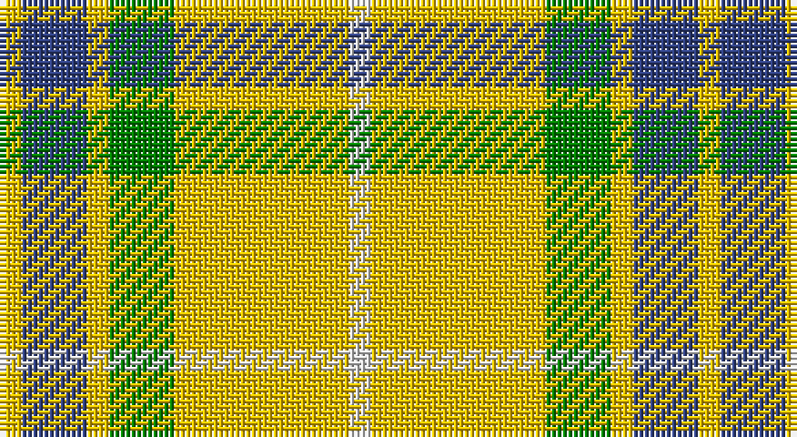

This page is one **sett** — a single exact thread-count. It belongs to the [tartan](/setts/w1ly8g3ly1db3ly1/)
(the same proportion at any scale), whose colour order is pattern [WYGYBY](/stripes/wygyby/).

Sourced from weddslist.  It is a [6 stripe tartan](/stripes/stripes6/).

Original link http://www.weddslist.com/cgi-bin/tartans/pg.pl?source=sts

## Thread count
Y/4 B12 Y4 G12 Y32 LN/4

One full sett is **128 threads**.

## Palette

Palette: <strong>Tartan Dictionary</strong> <small style="color:#888">(1 of 4 colours)</small>
<table><thead><tr><th>Colour</th><th>Threads</th><th>Shade</th><th>Base</th><th>OKLCh</th></tr></thead><tbody><tr><td>Y/</td><td style="text-align:right;font-variant-numeric:tabular-nums">4</td><td><code style="background-color:#F0C000;">#F0C000</code> <small style="color:#888">#F0C000</small></td><td>Y <code style="background-color:#F2BF00;">#F2BF00</code></td><td><small style="color:#888">oklch(82.7% 0.169 90.5)</small></td></tr><tr><td>B</td><td style="text-align:right;font-variant-numeric:tabular-nums">12</td><td><code style="background-color:#304080;">#304080</code> <small style="color:#888">#304080</small></td><td>B <code style="background-color:#2A418A;">#2A418A</code></td><td><small style="color:#888">oklch(39.4% 0.109 270.2)</small></td></tr><tr><td>Y</td><td style="text-align:right;font-variant-numeric:tabular-nums">4</td><td><code style="background-color:#F0C000;">#F0C000</code> <small style="color:#888">#F0C000</small></td><td>Y <code style="background-color:#F2BF00;">#F2BF00</code></td><td><small style="color:#888">oklch(82.7% 0.169 90.5)</small></td></tr><tr><td>G</td><td style="text-align:right;font-variant-numeric:tabular-nums">12</td><td><code style="background-color:#008000;">#008000</code> <small style="color:#888">#008000</small></td><td>G <code style="background-color:#006100;">#006100</code></td><td><small style="color:#888">oklch(52.0% 0.177 142.5)</small></td></tr><tr><td>Y</td><td style="text-align:right;font-variant-numeric:tabular-nums">32</td><td><code style="background-color:#F0C000;">#F0C000</code> <small style="color:#888">#F0C000</small></td><td>Y <code style="background-color:#F2BF00;">#F2BF00</code></td><td><small style="color:#888">oklch(82.7% 0.169 90.5)</small></td></tr><tr><td>LN/</td><td style="text-align:right;font-variant-numeric:tabular-nums">4</td><td><code style="background-color:#E0E0E0;">#E0E0E0</code> <small style="color:#888">#E0E0E0</small></td><td>W <code style="background-color:#F7F7F7;">#F7F7F7</code></td><td><small style="color:#888">oklch(90.7% 0.000 89.9)</small></td></tr></tbody></table>

# Sample pattern

## Nearest tartans

The nearest existing variants by ΔTartan distance, with this tartan at the top so the swatches line up against it.

ΔTartan

Tartan

Sett

—

<a href="/ttd/edit/#slug=w1ly8g3ly1db3ly1~x4">Fraser, Yellow</a> <a class="nn-out" href="/variants/s6/w1ly8g3ly1db3ly1~x4/" title="open its dictionary page">↗</a>

0.46

<a href="/ttd/edit/#slug=w1ly8dg3ly1db3ly1~x4&amp;base=w1ly8g3ly1db3ly1~x4">Fraser Yellow #2</a> <a class="nn-out" href="/variants/s6/w1ly8dg3ly1db3ly1~x4/" title="open its dictionary page">↗</a>

1.41

<a href="/ttd/edit/#slug=g10w7ly41k7~x2&amp;base=w1ly8g3ly1db3ly1~x4">Hogan (2014)</a> <a class="nn-out" href="/variants/s4/g10w7ly41k7~x2/" title="open its dictionary page">↗</a>

1.42

<a href="/ttd/edit/#slug=w5r3w26g20w3g8ly3~x2&amp;base=w1ly8g3ly1db3ly1~x4">MacPherson Dress Green (Dance)</a> <a class="nn-out" href="/variants/s7/w5r3w26g20w3g8ly3~x2/" title="open its dictionary page">↗</a>

1.50

<a href="/ttd/edit/#slug=do4g25lo10g3lo18r4~x2&amp;base=w1ly8g3ly1db3ly1~x4">Unidentfied (Ligioner Highland Games</a> <a class="nn-out" href="/variants/s6/do4g25lo10g3lo18r4~x2/" title="open its dictionary page">↗</a>

1.61

<a href="/ttd/edit/#slug=k5lyi2dy7ly18dy2w2~x4&amp;base=w1ly8g3ly1db3ly1~x4">Shepherd Piping (Personal)</a> <a class="nn-out" href="/variants/s6/k5lyi2dy7ly18dy2w2~x4/" title="open its dictionary page">↗</a>

1.63

<a href="/ttd/edit/#slug=k4r5k2ly21g8k2~x2&amp;base=w1ly8g3ly1db3ly1~x4">MacDuck (Corporate)</a> <a class="nn-out" href="/variants/s6/k4r5k2ly21g8k2~x2/" title="open its dictionary page">↗</a>

1.67

<a href="/ttd/edit/#slug=r2w2ly27g14ly2db14ly2~x2&amp;base=w1ly8g3ly1db3ly1~x4">Fraser, Yellow</a> <a class="nn-out" href="/variants/s7/r2w2ly27g14ly2db14ly2~x2/" title="open its dictionary page">↗</a>

1.67

<a href="/ttd/edit/#slug=lo5g7k1t1~x4&amp;base=w1ly8g3ly1db3ly1~x4">Wilson's, No 195</a> <a class="nn-out" href="/variants/s4/lo5g7k1t1~x4/" title="open its dictionary page">↗</a>

1.76

<a href="/ttd/edit/#slug=k5ly2dy7lyi18dy2w2~x4&amp;base=w1ly8g3ly1db3ly1~x4">Shepherd, Derek (Piping)</a> <a class="nn-out" href="/variants/s6/k5ly2dy7lyi18dy2w2~x4/" title="open its dictionary page">↗</a>

1.78

<a href="/ttd/edit/#slug=w12lo12w12k5lo45k5lb5lo10~x2&amp;base=w1ly8g3ly1db3ly1~x4">Tennessee Volunteer</a> <a class="nn-out" href="/variants/s8/w12lo12w12k5lo45k5lb5lo10~x2/" title="open its dictionary page">↗</a>

## Neighbour map

Every grey dot is one of 14360 variants placed by the first two principal components of the ΔTartan feature space (44% of its variance). Red is this tartan; blue dots are its nearest — click one to open its page.

<svg viewBox="0 0 640 380" role="img" style="max-width:100%;height:auto;border:1px solid #e0e0e0;border-radius:4px;display:block" xmlns="http://www.w3.org/2000/svg"><image href="/nn/cloud.v1.png" width="640" height="380"/><a href="/variants/s6/w1ly8dg3ly1db3ly1~x4/"><circle cx="271.1" cy="192.3" r="4" fill="#3465a4"><title>Fraser Yellow #2</title></circle></a><a href="/variants/s4/g10w7ly41k7~x2/"><circle cx="291.3" cy="213.7" r="4" fill="#3465a4"><title>Hogan (2014)</title></circle></a><a href="/variants/s7/w5r3w26g20w3g8ly3~x2/"><circle cx="244.8" cy="183.7" r="4" fill="#3465a4"><title>MacPherson Dress Green (Dance)</title></circle></a><a href="/variants/s6/do4g25lo10g3lo18r4~x2/"><circle cx="221.4" cy="206.0" r="4" fill="#3465a4"><title>Unidentfied (Ligioner Highland Games</title></circle></a><a href="/variants/s6/k5lyi2dy7ly18dy2w2~x4/"><circle cx="207.0" cy="162.7" r="4" fill="#3465a4"><title>Shepherd Piping (Personal)</title></circle></a><a href="/variants/s6/k4r5k2ly21g8k2~x2/"><circle cx="226.9" cy="172.7" r="4" fill="#3465a4"><title>MacDuck (Corporate)</title></circle></a><a href="/variants/s7/r2w2ly27g14ly2db14ly2~x2/"><circle cx="227.8" cy="143.9" r="4" fill="#3465a4"><title>Fraser, Yellow</title></circle></a><a href="/variants/s4/lo5g7k1t1~x4/"><circle cx="236.1" cy="235.8" r="4" fill="#3465a4"><title>Wilson's, No 195</title></circle></a><a href="/variants/s6/k5ly2dy7lyi18dy2w2~x4/"><circle cx="191.4" cy="151.5" r="4" fill="#3465a4"><title>Shepherd, Derek (Piping)</title></circle></a><a href="/variants/s8/w12lo12w12k5lo45k5lb5lo10~x2/"><circle cx="319.7" cy="165.6" r="4" fill="#3465a4"><title>Tennessee Volunteer</title></circle></a><circle cx="278.2" cy="194.4" r="5" fill="#c00000"/></svg>

ID: /variants/s6/w1ly8g3ly1db3ly1~x4/
