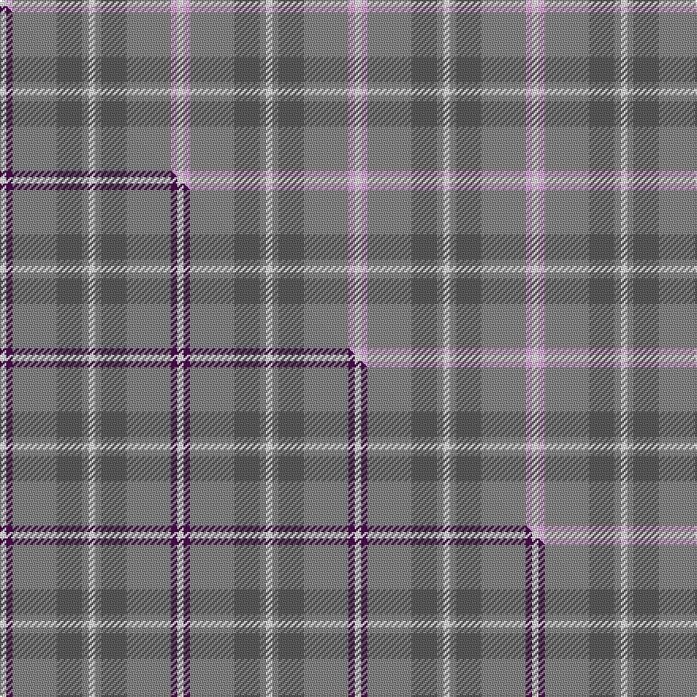

This is one **variant** — a specific cloth: this exact thread count and colourway, with its own
provenance below. It is one weaving of the [sett](/setts/w1o1n4o7lp1w1/) (the scale-free proportion — the
same cloth at any scale or shade), whose colour order is pattern [WRBRWW](/stripes/wrbrww/).

Part of the [Lochnagar](/tartans/l/lo/lochnagar-3/) tartan — the named design grouping this sett with its other cloths.

Sourced from tartans-authority.  It is a [6 stripe tartan](/stripes/stripes6/).

Original link [https://www.tartanregister.gov.uk/tartanDetails.aspx?ref=1771](https://www.tartanregister.gov.uk/tartanDetails.aspx?ref=1771)

Dataset <small>— provenance for this record, inherited from the source manifest</small>

<dl class="dataset-prov">
<dt>source</dt><dd><a href="/sources/tartans-authority/">Scottish Tartans Authority</a></dd>
<dt>data captured from</dt><dd><a href="https://github.com/thetartan/tartan-database/blob/master/data/tartans-authority/data.csv">https://github.com/thetartan/tartan-database/blob/master/data/tartans-authority/data.csv</a></dd>
<dt>data date</dt><dd>pre 1974 <small>(this record)</small></dd>
<dt>licence</dt><dd><a href="https://creativecommons.org/licenses/by-nc-nd/4.0/">CC BY-NC-ND 4.0</a></dd>
</dl>

Capture chain <small>— the hands this data passed through, oldest first; each capture carries its own licence</small>

<ol class="capture-chain">
<li><a href="https://www.tartansauthority.com/">Scottish Tartans Authority</a> <small>the heritage body's archive — its tartan-ferret record browser is retired (links repaired to the SRT, above)</small></li>
<li><a href="https://github.com/thetartan/tartan-database">thetartan/tartan-database</a> <small>2016-2017</small> · <a href="https://creativecommons.org/licenses/by-nc-nd/4.0/">CC BY-NC-ND 4.0</a> <small>Levko Kravets's frozen compilation — the capture we vendored, and where its CC licence text came from</small></li>
<li>this dictionary <small>captured 2026-06-10 · commit 5bf86c7566</small> <small>each re-capture is a git commit to data/sources</small></li>
</ol>

## Register references

External register numbers recorded for this tartan.

- Scottish Tartans Authority (ITI): 1771

## Thread count
W/4 LP4 O28 N16 O4 W/4

One full sett is **112 threads**.

## Palette
<table><thead><tr><th>Colour</th><th>Shade</th><th>OKLCh</th></tr></thead><tbody><tr><td>W</td><td><code style="background-color:#F7F7F7;">#F7F7F7</code> <small style="color:#888">#F7F7F7</small></td><td><small style="color:#888">oklch(97.6% 0.000 89.9)</small></td></tr><tr><td>N</td><td><code style="background-color:#5C5C5C;">#5C5C5C</code> <small style="color:#888">#5C5C5C</small></td><td><small style="color:#888">oklch(47.5% 0.000 89.9)</small></td></tr><tr><td>O</td><td><code style="background-color:#888888;">#888888</code> <small style="color:#888">#888888</small></td><td><small style="color:#888">oklch(62.7% 0.000 89.9)</small></td></tr><tr><td>LP</td><td><code style="background-color:#E4A6DB;">#E4A6DB</code> <small style="color:#888">#E4A6DB</small></td><td><small style="color:#888">oklch(80.0% 0.100 331.6)</small></td></tr></tbody></table>

# Sample pattern

## Compared to the master

This cloth is one sett of its design; the master sett (the exemplar the design is anchored on) is below for comparison.

Its **ΔTartan distance** from the master is **0.07** — the same measure the nearest-tartans table ranks by (0 is identical; a re-scale of the same cloth is near 0, a recolour or a different proportion further).

<figure class="master-compare" style="margin:0">

this sett
master sett ★

<figcaption style="color:#888;font-size:smaller">One weave of this sett against the <a href="/setts/w1dp1o7n4o1w1/">master sett ★</a>, split on the diagonal: a shared proportion runs seamlessly across it with only the shades shifting; a different proportion breaks on it.</figcaption>
</figure>

## Nearest tartan variants

The nearest existing variants by ΔTartan distance, with this cloth at the top so the swatches line up against it.

ΔTartan

Threads

Variant

Sett

—

112

<a href="/variants/s6/w1o1n4o7lp1w1~x4~o2500000-n1900000/">Lochnagar Plaid (District)</a>

<a href="/ttd/edit/#slug=w1dp1o7n4o1w1~x4~o2500000-n1900000&amp;base=w1o1n4o7lp1w1~x4~o2500000-n1900000" title="compare in the TTD">0.07</a>

112

<a href="/variants/s6/w1dp1o7n4o1w1~x4~o2500000-n1900000/">Lochnagar</a>

<a href="/ttd/edit/#slug=n2w2y7o14n2w2~x2~n1900000-o2500000&amp;base=w1o1n4o7lp1w1~x4~o2500000-n1900000" title="compare in the TTD">2.61</a>

108

<a href="/variants/s6/n2w2y7o14n2w2~x2~n1900000-o2500000/">Cairngorm</a>

<a href="/ttd/edit/#slug=lb30lr3lb3lr3lb12n30o3n5~x2~n1900000-o2500000&amp;base=w1o1n4o7lp1w1~x4~o2500000-n1900000" title="compare in the TTD">2.61</a>

286

<a href="/variants/s8/lb30lr3lb3lr3lb12n30o3n5~x2~n1900000-o2500000/">Dama Classic (Fashion)</a>

<a href="/ttd/edit/#slug=r3n20k2n20o20lb20r3~x2~n1900000-o2500000&amp;base=w1o1n4o7lp1w1~x4~o2500000-n1900000" title="compare in the TTD">2.88</a>

340

<a href="/variants/s7/r3n20k2n20o20lb20r3~x2~n1900000-o2500000/">Brodie Silver</a>

<a href="/ttd/edit/#slug=n10lb3o3r1g1~x10~n1900000-o2500000-g2408144&amp;base=w1o1n4o7lp1w1~x4~o2500000-n1900000" title="compare in the TTD">3.16</a>

250

<a href="/variants/s5/n10lb3o3r1g1~x10~n1900000-o2500000-g2408144/">Bagpipe Shop, The Corporate Tartan</a>

<a href="/ttd/edit/#slug=n10lb3o3r1g1~x10~n1900000-o2500000&amp;base=w1o1n4o7lp1w1~x4~o2500000-n1900000" title="compare in the TTD">3.27</a>

250

<a href="/variants/s5/n10lb3o3r1g1~x10~n1900000-o2500000/">Bagpipe Shop, The (Corporate)</a>

<a href="/ttd/edit/#slug=lb12g2lb2g2lb2o8b8o1~x2&amp;base=w1o1n4o7lp1w1~x4~o2500000-n1900000" title="compare in the TTD">3.40</a>

122

<a href="/variants/s8/lb12g2lb2g2lb2o8b8o1~x2/">Universal, Ancient</a>

<a href="/ttd/edit/#slug=lb24o9n23y3~x2~o2500000-n1900000&amp;base=w1o1n4o7lp1w1~x4~o2500000-n1900000" title="compare in the TTD">3.50</a>

182

<a href="/variants/s4/lb24o9n23y3~x2~o2500000-n1900000/">Porcelanosa</a>

<a href="/ttd/edit/#slug=lb60g9r7ly12g33ly33lb26&amp;base=w1o1n4o7lp1w1~x4~o2500000-n1900000" title="compare in the TTD">3.64</a>

274

<a href="/variants/s7/lb60g9r7ly12g33ly33lb26/">Supporter.com</a>

<a href="/ttd/edit/#slug=lb32o3lb3o3lb3o10g24dr3~x2&amp;base=w1o1n4o7lp1w1~x4~o2500000-n1900000" title="compare in the TTD">3.68</a>

254

<a href="/variants/s8/lb32o3lb3o3lb3o10g24dr3~x2/">Gammell (Personal)</a>

## Neighbour map

Every grey dot is one of 13656 variants placed by the first two principal components of the ΔTartan feature space (42% of its variance). Red is this tartan; blue dots are its nearest — click one to open its page. The map is a flat projection of a many-dimensional space — [how to read it](/posts/neighbourhood-maps/).

<svg viewBox="0 0 640 380" role="img" style="max-width:100%;height:auto;border:1px solid #e0e0e0;border-radius:4px;display:block" xmlns="http://www.w3.org/2000/svg"><image href="/nn/cloud.v1.png" width="640" height="380"/><a href="/variants/s6/w1dp1o7n4o1w1~x4~o2500000-n1900000/"><circle cx="325.8" cy="237.3" r="4" fill="#3465a4"><title>Lochnagar</title></circle></a><a href="/variants/s6/n2w2y7o14n2w2~x2~n1900000-o2500000/"><circle cx="326.8" cy="250.3" r="4" fill="#3465a4"><title>Cairngorm</title></circle></a><a href="/variants/s8/lb30lr3lb3lr3lb12n30o3n5~x2~n1900000-o2500000/"><circle cx="350.0" cy="210.0" r="4" fill="#3465a4"><title>Dama Classic (Fashion)</title></circle></a><a href="/variants/s7/r3n20k2n20o20lb20r3~x2~n1900000-o2500000/"><circle cx="247.2" cy="217.7" r="4" fill="#3465a4"><title>Brodie Silver</title></circle></a><a href="/variants/s5/n10lb3o3r1g1~x10~n1900000-o2500000-g2408144/"><circle cx="367.1" cy="227.8" r="4" fill="#3465a4"><title>Bagpipe Shop, The Corporate Tartan</title></circle></a><a href="/variants/s5/n10lb3o3r1g1~x10~n1900000-o2500000/"><circle cx="371.0" cy="229.2" r="4" fill="#3465a4"><title>Bagpipe Shop, The (Corporate)</title></circle></a><a href="/variants/s8/lb12g2lb2g2lb2o8b8o1~x2/"><circle cx="279.0" cy="218.5" r="4" fill="#3465a4"><title>Universal, Ancient</title></circle></a><a href="/variants/s4/lb24o9n23y3~x2~o2500000-n1900000/"><circle cx="296.7" cy="291.1" r="4" fill="#3465a4"><title>Porcelanosa</title></circle></a><a href="/variants/s7/lb60g9r7ly12g33ly33lb26/"><circle cx="292.7" cy="254.5" r="4" fill="#3465a4"><title>Supporter.com</title></circle></a><a href="/variants/s8/lb32o3lb3o3lb3o10g24dr3~x2/"><circle cx="296.4" cy="199.2" r="4" fill="#3465a4"><title>Gammell (Personal)</title></circle></a><circle cx="347.1" cy="245.4" r="5" fill="#c00000"/><text x="320" y="376" text-anchor="middle" font-size="11" fill="#999">ground</text><text x="11" y="190" text-anchor="middle" font-size="11" fill="#999" transform="rotate(-90 11 190)">complexity</text></svg>

ID: /variants/s6/w1o1n4o7lp1w1~x4~o2500000-n1900000/
