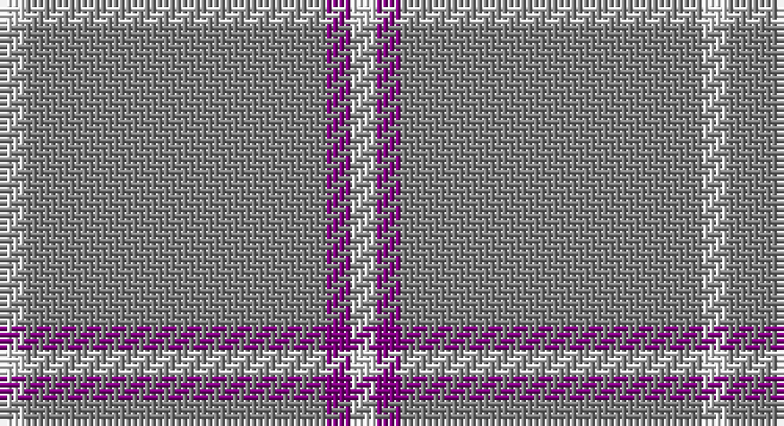

This page is one **sett** — a single exact thread-count. It belongs to the [tartan](/setts/w1y1y4y7p1w1/)
(the same proportion at any scale), whose colour order is pattern [WBGGGW](/stripes/wbgggw/).

Sourced from weddslist.  It is a [6 stripe tartan](/stripes/stripes6/).

Original link http://www.weddslist.com/cgi-bin/tartans/pg.pl?source=sts

## Thread count
LN/4 N4 N16 N28 P4 LN/4

One full sett is **112 threads**.

## Palette

Palette: <strong>Tartan Register</strong> <small style="color:#888">(2 of 3 colours)</small>
<table><thead><tr><th>Colour</th><th>Threads</th><th>Shade</th><th>Base</th><th>OKLCh</th></tr></thead><tbody><tr><td>LN/</td><td style="text-align:right;font-variant-numeric:tabular-nums">4</td><td><code style="background-color:#E0E0E0;">#E0E0E0</code> <small style="color:#888">#E0E0E0</small></td><td>W <code style="background-color:#F7F7F7;">#F7F7F7</code></td><td><small style="color:#888">oklch(90.7% 0.000 89.9)</small></td></tr><tr><td>N</td><td style="text-align:right;font-variant-numeric:tabular-nums">4</td><td><code style="background-color:#808080;">#808080</code> <small style="color:#888">#808080</small></td><td>G <code style="background-color:#006100;">#006100</code></td><td><small style="color:#888">oklch(60.0% 0.000 89.9)</small></td></tr><tr><td>N</td><td style="text-align:right;font-variant-numeric:tabular-nums">16</td><td><code style="background-color:#808080;">#808080</code> <small style="color:#888">#808080</small></td><td>G <code style="background-color:#006100;">#006100</code></td><td><small style="color:#888">oklch(60.0% 0.000 89.9)</small></td></tr><tr><td>N</td><td style="text-align:right;font-variant-numeric:tabular-nums">28</td><td><code style="background-color:#808080;">#808080</code> <small style="color:#888">#808080</small></td><td>G <code style="background-color:#006100;">#006100</code></td><td><small style="color:#888">oklch(60.0% 0.000 89.9)</small></td></tr><tr><td>P</td><td style="text-align:right;font-variant-numeric:tabular-nums">4</td><td><code style="background-color:#800080;">#800080</code> <small style="color:#888">#800080</small></td><td>B <code style="background-color:#2A418A;">#2A418A</code></td><td><small style="color:#888">oklch(42.1% 0.193 328.4)</small></td></tr><tr><td>LN/</td><td style="text-align:right;font-variant-numeric:tabular-nums">4</td><td><code style="background-color:#E0E0E0;">#E0E0E0</code> <small style="color:#888">#E0E0E0</small></td><td>W <code style="background-color:#F7F7F7;">#F7F7F7</code></td><td><small style="color:#888">oklch(90.7% 0.000 89.9)</small></td></tr></tbody></table>

# Sample pattern

## Nearest tartans

The nearest existing variants by ΔTartan distance, with this tartan at the top so the swatches line up against it.

ΔTartan

Tartan

Sett

—

<a href="/ttd/edit/#slug=w1y1y4y7p1w1~x4">Lochnagar</a> <a class="nn-out" href="/variants/s6/w1y1y4y7p1w1~x4/" title="open its dictionary page">↗</a>

1.51

<a href="/ttd/edit/#slug=db1lo9db2lo9r1~x4&amp;base=w1y1y4y7p1w1~x4">Brooks Brothers Tattersall Camel</a> <a class="nn-out" href="/variants/s5/db1lo9db2lo9r1~x4/" title="open its dictionary page">↗</a>

2.06

<a href="/ttd/edit/#slug=o60dg13o9oi8ly4~x2&amp;base=w1y1y4y7p1w1~x4">Ballantyne Personal Tartan</a> <a class="nn-out" href="/variants/s5/o60dg13o9oi8ly4~x2/" title="open its dictionary page">↗</a>

2.23

<a href="/ttd/edit/#slug=dy9t3dy6t3dy20ly2~x2&amp;base=w1y1y4y7p1w1~x4">Oman RAF, Sultanate of (Military)</a> <a class="nn-out" href="/variants/s6/dy9t3dy6t3dy20ly2~x2/" title="open its dictionary page">↗</a>

2.25

<a href="/ttd/edit/#slug=ly6b38k3b38ly6~x2&amp;base=w1y1y4y7p1w1~x4">The Poulain League</a> <a class="nn-out" href="/variants/s5/ly6b38k3b38ly6~x2/" title="open its dictionary page">↗</a>

2.31

<a href="/ttd/edit/#slug=db1o5db1o5db2w1~x4&amp;base=w1y1y4y7p1w1~x4">Tokharian</a> <a class="nn-out" href="/variants/s6/db1o5db1o5db2w1~x4/" title="open its dictionary page">↗</a>

2.33

<a href="/ttd/edit/#slug=dt72b6dt12b17w6~x2&amp;base=w1y1y4y7p1w1~x4">GulfMark</a> <a class="nn-out" href="/variants/s5/dt72b6dt12b17w6~x2/" title="open its dictionary page">↗</a>

2.34

<a href="/ttd/edit/#slug=ly5n1ly1n12r1~x8&amp;base=w1y1y4y7p1w1~x4">Ceredigion (Personal)</a> <a class="nn-out" href="/variants/s5/ly5n1ly1n12r1~x8/" title="open its dictionary page">↗</a>

2.43

<a href="/ttd/edit/#slug=db1lo5db1lo5db2w1~x4&amp;base=w1y1y4y7p1w1~x4">Tokharion</a> <a class="nn-out" href="/variants/s6/db1lo5db1lo5db2w1~x4/" title="open its dictionary page">↗</a>

2.46

<a href="/ttd/edit/#slug=m2g1m1g10w1~x4&amp;base=w1y1y4y7p1w1~x4">Welsh National District Tartan</a> <a class="nn-out" href="/variants/s5/m2g1m1g10w1~x4/" title="open its dictionary page">↗</a>

2.46

<a href="/ttd/edit/#slug=w50db7w7t7w18~x2&amp;base=w1y1y4y7p1w1~x4">Sephardim (Corporate)</a> <a class="nn-out" href="/variants/s5/w50db7w7t7w18~x2/" title="open its dictionary page">↗</a>

## Neighbour map

Every grey dot is one of 14360 variants placed by the first two principal components of the ΔTartan feature space (44% of its variance). Red is this tartan; blue dots are its nearest — click one to open its page.

<svg viewBox="0 0 640 380" role="img" style="max-width:100%;height:auto;border:1px solid #e0e0e0;border-radius:4px;display:block" xmlns="http://www.w3.org/2000/svg"><image href="/nn/cloud.v1.png" width="640" height="380"/><a href="/variants/s5/db1lo9db2lo9r1~x4/"><circle cx="533.4" cy="249.3" r="4" fill="#3465a4"><title>Brooks Brothers Tattersall Camel</title></circle></a><a href="/variants/s5/o60dg13o9oi8ly4~x2/"><circle cx="505.7" cy="212.7" r="4" fill="#3465a4"><title>Ballantyne Personal Tartan</title></circle></a><a href="/variants/s6/dy9t3dy6t3dy20ly2~x2/"><circle cx="557.9" cy="256.6" r="4" fill="#3465a4"><title>Oman RAF, Sultanate of (Military)</title></circle></a><a href="/variants/s5/ly6b38k3b38ly6~x2/"><circle cx="539.5" cy="226.2" r="4" fill="#3465a4"><title>The Poulain League</title></circle></a><a href="/variants/s6/db1o5db1o5db2w1~x4/"><circle cx="393.5" cy="276.7" r="4" fill="#3465a4"><title>Tokharian</title></circle></a><a href="/variants/s5/dt72b6dt12b17w6~x2/"><circle cx="511.4" cy="237.4" r="4" fill="#3465a4"><title>GulfMark</title></circle></a><a href="/variants/s5/ly5n1ly1n12r1~x8/"><circle cx="432.6" cy="219.4" r="4" fill="#3465a4"><title>Ceredigion (Personal)</title></circle></a><a href="/variants/s6/db1lo5db1lo5db2w1~x4/"><circle cx="359.6" cy="260.5" r="4" fill="#3465a4"><title>Tokharion</title></circle></a><a href="/variants/s5/m2g1m1g10w1~x4/"><circle cx="478.5" cy="228.8" r="4" fill="#3465a4"><title>Welsh National District Tartan</title></circle></a><a href="/variants/s5/w50db7w7t7w18~x2/"><circle cx="511.8" cy="228.8" r="4" fill="#3465a4"><title>Sephardim (Corporate)</title></circle></a><circle cx="523.9" cy="254.0" r="5" fill="#c00000"/></svg>

ID: /variants/s6/w1y1y4y7p1w1~x4/
