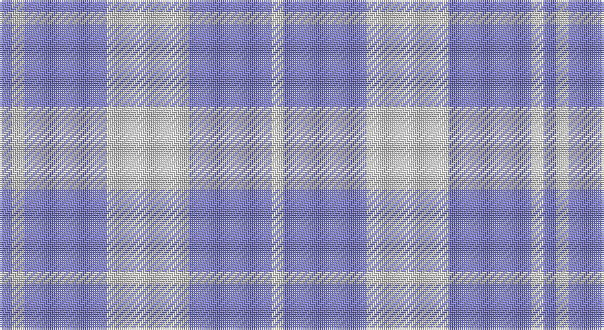

This page is one **sett** — a single exact thread-count. It belongs to the [tartan](/setts/w20b20w3b3/)
(the same proportion at any scale), whose colour order is pattern [BWBWBW](/stripes/bwbwbw/).

Sourced from weddslist.  It is a [6 stripe tartan](/stripes/stripes6/).

Original link http://www.weddslist.com/cgi-bin/tartans/pg.pl?source=sts

## Thread count
B/6 LN6 B40 LN40 B40 LN/6

One full sett is **264 threads**.

## Palette

Palette: <strong>Tartan Dictionary</strong> <small style="color:#888">(1 of 2 colours)</small>
<table><thead><tr><th>Colour</th><th>Threads</th><th>Shade</th><th>Base</th><th>OKLCh</th></tr></thead><tbody><tr><td>B/</td><td style="text-align:right;font-variant-numeric:tabular-nums">6</td><td><code style="background-color:#8080D0;">#8080D0</code> <small style="color:#888">#8080D0</small></td><td>B <code style="background-color:#2A418A;">#2A418A</code></td><td><small style="color:#888">oklch(63.4% 0.119 282.5)</small></td></tr><tr><td>LN</td><td style="text-align:right;font-variant-numeric:tabular-nums">6</td><td><code style="background-color:#E0E0E0;">#E0E0E0</code> <small style="color:#888">#E0E0E0</small></td><td>W <code style="background-color:#F7F7F7;">#F7F7F7</code></td><td><small style="color:#888">oklch(90.7% 0.000 89.9)</small></td></tr><tr><td>B</td><td style="text-align:right;font-variant-numeric:tabular-nums">40</td><td><code style="background-color:#8080D0;">#8080D0</code> <small style="color:#888">#8080D0</small></td><td>B <code style="background-color:#2A418A;">#2A418A</code></td><td><small style="color:#888">oklch(63.4% 0.119 282.5)</small></td></tr><tr><td>LN</td><td style="text-align:right;font-variant-numeric:tabular-nums">40</td><td><code style="background-color:#E0E0E0;">#E0E0E0</code> <small style="color:#888">#E0E0E0</small></td><td>W <code style="background-color:#F7F7F7;">#F7F7F7</code></td><td><small style="color:#888">oklch(90.7% 0.000 89.9)</small></td></tr><tr><td>B</td><td style="text-align:right;font-variant-numeric:tabular-nums">40</td><td><code style="background-color:#8080D0;">#8080D0</code> <small style="color:#888">#8080D0</small></td><td>B <code style="background-color:#2A418A;">#2A418A</code></td><td><small style="color:#888">oklch(63.4% 0.119 282.5)</small></td></tr><tr><td>LN/</td><td style="text-align:right;font-variant-numeric:tabular-nums">6</td><td><code style="background-color:#E0E0E0;">#E0E0E0</code> <small style="color:#888">#E0E0E0</small></td><td>W <code style="background-color:#F7F7F7;">#F7F7F7</code></td><td><small style="color:#888">oklch(90.7% 0.000 89.9)</small></td></tr></tbody></table>

# Sample pattern

## Nearest tartans

The nearest existing variants by ΔTartan distance, with this tartan at the top so the swatches line up against it.

ΔTartan

Tartan

Sett

—

<a href="/ttd/edit/#slug=w20b20w3b3~x2">Unidentified, Plaid Barbie's Moss</a> <a class="nn-out" href="/variants/s6/w20b20w3b3~x2/" title="open its dictionary page">↗</a>

1.79

<a href="/ttd/edit/#slug=w11t20lo3t8~x2&amp;base=w20b20w3b3~x2">Lucard, Stéphane (Personal)</a> <a class="nn-out" href="/variants/s4/w11t20lo3t8~x2/" title="open its dictionary page">↗</a>

1.99

<a href="/ttd/edit/#slug=t5w2t25w25t2w5~x2&amp;base=w20b20w3b3~x2">Erskine Blue Dress Clan Tartan</a> <a class="nn-out" href="/variants/s6/t5w2t25w25t2w5~x2/" title="open its dictionary page">↗</a>

2.01

<a href="/ttd/edit/#slug=w11t20ly3t8ly3t10~x2&amp;base=w20b20w3b3~x2">Lucard, Stphane (Personal))</a> <a class="nn-out" href="/variants/s6/w11t20ly3t8ly3t10~x2/" title="open its dictionary page">↗</a>

2.37

<a href="/ttd/edit/#slug=t2lb4w1lb4t6lb2t2~x4&amp;base=w20b20w3b3~x2">Langdons (Corporate)</a> <a class="nn-out" href="/variants/s7/t2lb4w1lb4t6lb2t2~x4/" title="open its dictionary page">↗</a>

2.43

<a href="/ttd/edit/#slug=b1lr4r1lr1lo1lr4b1~x12&amp;base=w20b20w3b3~x2">Justus Dress (Personal)</a> <a class="nn-out" href="/variants/s7/b1lr4r1lr1lo1lr4b1~x12/" title="open its dictionary page">↗</a>

2.46

<a href="/ttd/edit/#slug=b11lo2r1lo2r1~x4&amp;base=w20b20w3b3~x2">Carlisle Ancient</a> <a class="nn-out" href="/variants/s5/b11lo2r1lo2r1~x4/" title="open its dictionary page">↗</a>

2.49

<a href="/ttd/edit/#slug=o9b3o1b11o1~x6&amp;base=w20b20w3b3~x2">MacCallum High School</a> <a class="nn-out" href="/variants/s5/o9b3o1b11o1~x6/" title="open its dictionary page">↗</a>

2.50

<a href="/ttd/edit/#slug=o9db3o1db11o1~x6&amp;base=w20b20w3b3~x2">MacCallum High School Corporate Tartan</a> <a class="nn-out" href="/variants/s5/o9db3o1db11o1~x6/" title="open its dictionary page">↗</a>

2.50

<a href="/ttd/edit/#slug=lg6r1lg17db3lg3db8lg1~x2&amp;base=w20b20w3b3~x2">Dominion (Fashion)</a> <a class="nn-out" href="/variants/s7/lg6r1lg17db3lg3db8lg1~x2/" title="open its dictionary page">↗</a>

2.52

<a href="/ttd/edit/#slug=b1db5b5w1~x4&amp;base=w20b20w3b3~x2">Manx, Cornaa</a> <a class="nn-out" href="/variants/s4/b1db5b5w1~x4/" title="open its dictionary page">↗</a>

## Neighbour map

Every grey dot is one of 14360 variants placed by the first two principal components of the ΔTartan feature space (44% of its variance). Red is this tartan; blue dots are its nearest — click one to open its page.

<svg viewBox="0 0 640 380" role="img" style="max-width:100%;height:auto;border:1px solid #e0e0e0;border-radius:4px;display:block" xmlns="http://www.w3.org/2000/svg"><image href="/nn/cloud.v1.png" width="640" height="380"/><a href="/variants/s4/w11t20lo3t8~x2/"><circle cx="363.0" cy="277.7" r="4" fill="#3465a4"><title>Lucard, Stéphane (Personal)</title></circle></a><a href="/variants/s6/t5w2t25w25t2w5~x2/"><circle cx="364.4" cy="224.1" r="4" fill="#3465a4"><title>Erskine Blue Dress Clan Tartan</title></circle></a><a href="/variants/s6/w11t20ly3t8ly3t10~x2/"><circle cx="363.9" cy="258.2" r="4" fill="#3465a4"><title>Lucard, Stphane (Personal))</title></circle></a><a href="/variants/s7/t2lb4w1lb4t6lb2t2~x4/"><circle cx="259.0" cy="276.0" r="4" fill="#3465a4"><title>Langdons (Corporate)</title></circle></a><a href="/variants/s7/b1lr4r1lr1lo1lr4b1~x12/"><circle cx="342.3" cy="243.1" r="4" fill="#3465a4"><title>Justus Dress (Personal)</title></circle></a><a href="/variants/s5/b11lo2r1lo2r1~x4/"><circle cx="395.7" cy="210.1" r="4" fill="#3465a4"><title>Carlisle Ancient</title></circle></a><a href="/variants/s5/o9b3o1b11o1~x6/"><circle cx="445.1" cy="287.5" r="4" fill="#3465a4"><title>MacCallum High School</title></circle></a><a href="/variants/s5/o9db3o1db11o1~x6/"><circle cx="403.8" cy="265.5" r="4" fill="#3465a4"><title>MacCallum High School Corporate Tartan</title></circle></a><a href="/variants/s7/lg6r1lg17db3lg3db8lg1~x2/"><circle cx="452.9" cy="208.3" r="4" fill="#3465a4"><title>Dominion (Fashion)</title></circle></a><a href="/variants/s4/b1db5b5w1~x4/"><circle cx="294.6" cy="296.3" r="4" fill="#3465a4"><title>Manx, Cornaa</title></circle></a><circle cx="399.3" cy="270.7" r="5" fill="#c00000"/></svg>

ID: /variants/s6/w20b20w3b3~x2/
