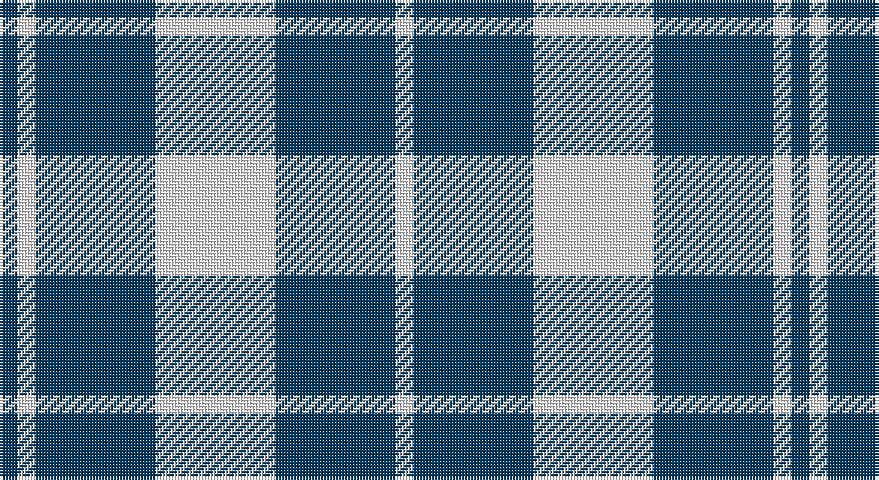

This page is one **sett** — a single exact thread-count. It belongs to the [tartan](/setts/w20dt20w3dt3/)
(the same proportion at any scale), whose colour order is pattern [BWBWBW](/stripes/bwbwbw/).

Part of the [Barbie's Moss](/tartans/barbie-s-moss/) tartan — the named design grouping this sett with its other cloths.

Sourced from register-of-tartans.  It is a [6 stripe tartan](/stripes/stripes6/).

Original link https://www.tartanregister.gov.uk/tartanDetails.aspx?ref=211

## Also known as

This cloth is also recorded under:

- Barbie's Moss Plaid

## Register references

External register numbers recorded for this tartan.

- Scottish Register of Tartans: [211](https://www.tartanregister.gov.uk/tartanDetails.aspx?ref=211)
- Scottish Tartans Authority (ITI): 630
- Scottish Tartans World Register: 630

## Thread count
DB/6 W6 DB40 W40 DB40 W/6

One full sett is **264 threads**.

## Palette

Palette: <strong>Tartan Register</strong>
<table><thead><tr><th>Colour</th><th>Threads</th><th>Shade</th><th>Base</th><th>OKLCh</th></tr></thead><tbody><tr><td>DB/</td><td style="text-align:right;font-variant-numeric:tabular-nums">6</td><td><code style="background-color:#003C64;">#003C64</code> <small style="color:#888">#003C64</small></td><td>B <code style="background-color:#2A418A;">#2A418A</code></td><td><small style="color:#888">oklch(34.5% 0.089 246.0)</small></td></tr><tr><td>W</td><td style="text-align:right;font-variant-numeric:tabular-nums">6</td><td><code style="background-color:#FCFCFC;">#FCFCFC</code> <small style="color:#888">#FCFCFC</small></td><td>W <code style="background-color:#F7F7F7;">#F7F7F7</code></td><td><small style="color:#888">oklch(99.1% 0.000 89.9)</small></td></tr><tr><td>DB</td><td style="text-align:right;font-variant-numeric:tabular-nums">40</td><td><code style="background-color:#003C64;">#003C64</code> <small style="color:#888">#003C64</small></td><td>B <code style="background-color:#2A418A;">#2A418A</code></td><td><small style="color:#888">oklch(34.5% 0.089 246.0)</small></td></tr><tr><td>W</td><td style="text-align:right;font-variant-numeric:tabular-nums">40</td><td><code style="background-color:#FCFCFC;">#FCFCFC</code> <small style="color:#888">#FCFCFC</small></td><td>W <code style="background-color:#F7F7F7;">#F7F7F7</code></td><td><small style="color:#888">oklch(99.1% 0.000 89.9)</small></td></tr><tr><td>DB</td><td style="text-align:right;font-variant-numeric:tabular-nums">40</td><td><code style="background-color:#003C64;">#003C64</code> <small style="color:#888">#003C64</small></td><td>B <code style="background-color:#2A418A;">#2A418A</code></td><td><small style="color:#888">oklch(34.5% 0.089 246.0)</small></td></tr><tr><td>W/</td><td style="text-align:right;font-variant-numeric:tabular-nums">6</td><td><code style="background-color:#FCFCFC;">#FCFCFC</code> <small style="color:#888">#FCFCFC</small></td><td>W <code style="background-color:#F7F7F7;">#F7F7F7</code></td><td><small style="color:#888">oklch(99.1% 0.000 89.9)</small></td></tr></tbody></table>

# Sample pattern

## Nearest tartans

The nearest existing variants by ΔTartan distance, with this tartan at the top so the swatches line up against it.

ΔTartan

Tartan

Sett

—

<a href="/ttd/edit/#slug=w20dt20w3dt3~x2">Barbie's Moss Plaid (Blue &amp; White)</a> <a class="nn-out" href="/variants/s6/w20dt20w3dt3~x2/" title="open its dictionary page">↗</a>

1.29

<a href="/ttd/edit/#slug=w2k1w6k6w2k1w1~x2&amp;base=w20dt20w3dt3~x2">Scott (Abbreviated)</a> <a class="nn-out" href="/variants/s7/w2k1w6k6w2k1w1~x2/" title="open its dictionary page">↗</a>

1.37

<a href="/ttd/edit/#slug=dt3w16dt4w3dt12w2~x3&amp;base=w20dt20w3dt3~x2">MacMugen</a> <a class="nn-out" href="/variants/s6/dt3w16dt4w3dt12w2~x3/" title="open its dictionary page">↗</a>

1.37

<a href="/ttd/edit/#slug=db1w1db5w5db1w1~x8&amp;base=w20dt20w3dt3~x2">Erskine Blanket</a> <a class="nn-out" href="/variants/s6/db1w1db5w5db1w1~x8/" title="open its dictionary page">↗</a>

1.47

<a href="/ttd/edit/#slug=db4w35db31w4~x2&amp;base=w20dt20w3dt3~x2">Lewis, Navy (Dance)</a> <a class="nn-out" href="/variants/s4/db4w35db31w4~x2/" title="open its dictionary page">↗</a>

1.51

<a href="/ttd/edit/#slug=w14k2w14k19w2~x2&amp;base=w20dt20w3dt3~x2">MacLeod Black &amp; White</a> <a class="nn-out" href="/variants/s5/w14k2w14k19w2~x2/" title="open its dictionary page">↗</a>

1.57

<a href="/ttd/edit/#slug=k1w3db2w4db8w1db1~x6&amp;base=w20dt20w3dt3~x2">Queen Margaret University (Corporate</a> <a class="nn-out" href="/variants/s7/k1w3db2w4db8w1db1~x6/" title="open its dictionary page">↗</a>

1.60

<a href="/ttd/edit/#slug=k2w1k8w8k1~x8&amp;base=w20dt20w3dt3~x2">Cairn (Marton Mills)</a> <a class="nn-out" href="/variants/s5/k2w1k8w8k1~x8/" title="open its dictionary page">↗</a>

1.60

<a href="/ttd/edit/#slug=lb5k4lb32k32lb5k4~x2&amp;base=w20dt20w3dt3~x2">Valley Forge (Artefact)</a> <a class="nn-out" href="/variants/s6/lb5k4lb32k32lb5k4~x2/" title="open its dictionary page">↗</a>

1.66

<a href="/variants/s4/dt23w4r4~x4/">Auchmaliddie Samkoma (Personal)</a>

1.69

<a href="/ttd/edit/#slug=w7db16w20db3w3ly3~x2&amp;base=w20dt20w3dt3~x2">Unidentified (Shirt)</a> <a class="nn-out" href="/variants/s6/w7db16w20db3w3ly3~x2/" title="open its dictionary page">↗</a>

## Neighbour map

Every grey dot is one of 14360 variants placed by the first two principal components of the ΔTartan feature space (44% of its variance). Red is this tartan; blue dots are its nearest — click one to open its page.

<svg viewBox="0 0 640 380" role="img" style="max-width:100%;height:auto;border:1px solid #e0e0e0;border-radius:4px;display:block" xmlns="http://www.w3.org/2000/svg"><image href="/nn/cloud.v1.png" width="640" height="380"/><a href="/variants/s7/w2k1w6k6w2k1w1~x2/"><circle cx="298.8" cy="232.3" r="4" fill="#3465a4"><title>Scott (Abbreviated)</title></circle></a><a href="/variants/s6/dt3w16dt4w3dt12w2~x3/"><circle cx="293.2" cy="227.3" r="4" fill="#3465a4"><title>MacMugen</title></circle></a><a href="/variants/s6/db1w1db5w5db1w1~x8/"><circle cx="279.9" cy="248.5" r="4" fill="#3465a4"><title>Erskine Blanket</title></circle></a><a href="/variants/s4/db4w35db31w4~x2/"><circle cx="306.3" cy="242.5" r="4" fill="#3465a4"><title>Lewis, Navy (Dance)</title></circle></a><a href="/variants/s5/w14k2w14k19w2~x2/"><circle cx="311.9" cy="234.8" r="4" fill="#3465a4"><title>MacLeod Black &amp; White</title></circle></a><a href="/variants/s7/k1w3db2w4db8w1db1~x6/"><circle cx="279.6" cy="209.8" r="4" fill="#3465a4"><title>Queen Margaret University (Corporate</title></circle></a><a href="/variants/s5/k2w1k8w8k1~x8/"><circle cx="311.7" cy="238.5" r="4" fill="#3465a4"><title>Cairn (Marton Mills)</title></circle></a><a href="/variants/s6/lb5k4lb32k32lb5k4~x2/"><circle cx="303.7" cy="220.3" r="4" fill="#3465a4"><title>Valley Forge (Artefact)</title></circle></a><a href="/variants/s4/dt23w4r4~x4/"><circle cx="337.2" cy="240.6" r="4" fill="#3465a4"><title>Auchmaliddie Samkoma (Personal)</title></circle></a><a href="/variants/s6/w7db16w20db3w3ly3~x2/"><circle cx="285.1" cy="219.6" r="4" fill="#3465a4"><title>Unidentified (Shirt)</title></circle></a><circle cx="324.3" cy="247.0" r="5" fill="#c00000"/></svg>

ID: /variants/s6/w20dt20w3dt3~x2/
