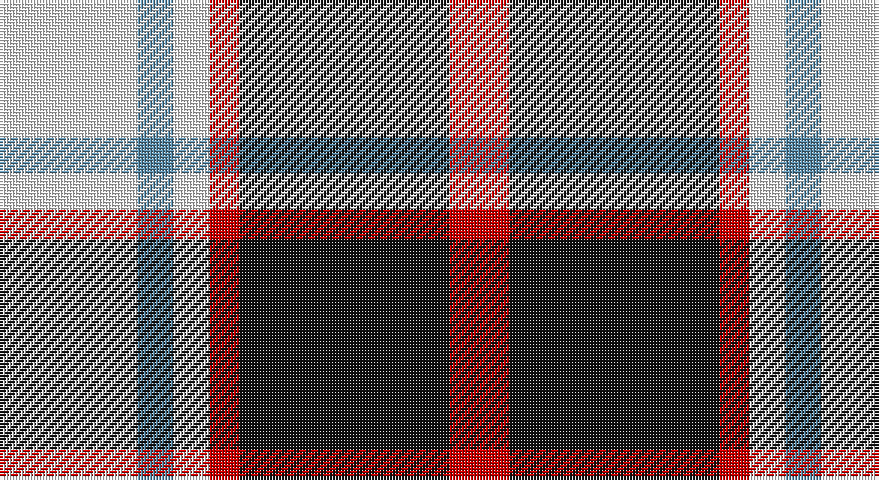

This page is one **sett** — a single exact thread-count. It belongs to the [tartan](/setts/w23t6w6r5k35r10/)
(the same proportion at any scale), whose colour order is pattern [RKRWBW](/stripes/rkrwbw/).

Sourced from register-of-tartans.  It is a [6 stripe tartan](/stripes/stripes6/).

Original link https://www.tartanregister.gov.uk/tartanDetails.aspx?ref=2938

## Also known as

This cloth is also recorded under:

- Meg Merrilees, Old

2 attestations — the source records this cloth was collapsed from (oldest owns this page)

<ul>
<li>01/01/1829 — Merrilees (register-of-tartans, <a href="https://www.tartanregister.gov.uk/tartanDetails.aspx?ref=2938">record</a>)</li>
<li>1829 — Meg Merrilees, Old (1828) (tartans-authority, <a href="http://www.tartansauthority.com/tartan-ferret/display/1602/">record</a>)</li>
</ul>

## Register references

External register numbers recorded for this tartan.

- Scottish Register of Tartans: [2938](https://www.tartanregister.gov.uk/tartanDetails.aspx?ref=2938)
- Scottish Tartans Authority (ITI): 1602
- Scottish Tartans World Register: 1602

## Thread count
W/46 B12 W12 R10 K70 R/20

One full sett is **274 threads**.

## Palette

Palette: <strong>Tartan Register</strong>
<table><thead><tr><th>Colour</th><th>Threads</th><th>Shade</th><th>Base</th><th>OKLCh</th></tr></thead><tbody><tr><td>W/</td><td style="text-align:right;font-variant-numeric:tabular-nums">46</td><td><code style="background-color:#F8F8F8;">#F8F8F8</code> <small style="color:#888">#F8F8F8</small></td><td>W <code style="background-color:#F7F7F7;">#F7F7F7</code></td><td><small style="color:#888">oklch(97.9% 0.000 89.9)</small></td></tr><tr><td>B</td><td style="text-align:right;font-variant-numeric:tabular-nums">12</td><td><code style="background-color:#5C8CA8;">#5C8CA8</code> <small style="color:#888">#5C8CA8</small></td><td>B <code style="background-color:#2A418A;">#2A418A</code></td><td><small style="color:#888">oklch(61.7% 0.067 235.0)</small></td></tr><tr><td>W</td><td style="text-align:right;font-variant-numeric:tabular-nums">12</td><td><code style="background-color:#F8F8F8;">#F8F8F8</code> <small style="color:#888">#F8F8F8</small></td><td>W <code style="background-color:#F7F7F7;">#F7F7F7</code></td><td><small style="color:#888">oklch(97.9% 0.000 89.9)</small></td></tr><tr><td>R</td><td style="text-align:right;font-variant-numeric:tabular-nums">10</td><td><code style="background-color:#C80000;">#C80000</code> <small style="color:#888">#C80000</small></td><td>R <code style="background-color:#CC0000;">#CC0000</code></td><td><small style="color:#888">oklch(52.3% 0.215 29.2)</small></td></tr><tr><td>K</td><td style="text-align:right;font-variant-numeric:tabular-nums">70</td><td><code style="background-color:#101010;">#101010</code> <small style="color:#888">#101010</small></td><td>K <code style="background-color:#000000;">#000000</code></td><td><small style="color:#888">oklch(17.3% 0.000 89.9)</small></td></tr><tr><td>R/</td><td style="text-align:right;font-variant-numeric:tabular-nums">20</td><td><code style="background-color:#C80000;">#C80000</code> <small style="color:#888">#C80000</small></td><td>R <code style="background-color:#CC0000;">#CC0000</code></td><td><small style="color:#888">oklch(52.3% 0.215 29.2)</small></td></tr></tbody></table>

# Sample pattern

## Nearest tartans

The nearest existing variants by ΔTartan distance, with this tartan at the top so the swatches line up against it.

ΔTartan

Tartan

Sett

—

<a href="/ttd/edit/#slug=w23t6w6r5k35r10~x2">Merrilees</a> <a class="nn-out" href="/variants/s6/w23t6w6r5k35r10~x2/" title="open its dictionary page">↗</a>

0.45

<a href="/ttd/edit/#slug=k23b6k6r5w35r10~x2&amp;base=w23t6w6r5k35r10~x2">Merrilees Dress (Dance)</a> <a class="nn-out" href="/variants/s6/k23b6k6r5w35r10~x2/" title="open its dictionary page">↗</a>

0.79

<a href="/ttd/edit/#slug=r1o6k1w3k3r1~x8&amp;base=w23t6w6r5k35r10~x2">Thompson Grey Dress</a> <a class="nn-out" href="/variants/s6/r1o6k1w3k3r1~x8/" title="open its dictionary page">↗</a>

0.83

<a href="/ttd/edit/#slug=r2o20k5w10k10r2~x2&amp;base=w23t6w6r5k35r10~x2">Thompson Grey Family Tartan</a> <a class="nn-out" href="/variants/s6/r2o20k5w10k10r2~x2/" title="open its dictionary page">↗</a>

0.85

<a href="/ttd/edit/#slug=r6k14r6dg14w27k4&amp;base=w23t6w6r5k35r10~x2">Fraser Dress</a> <a class="nn-out" href="/variants/s6/r6k14r6dg14w27k4/" title="open its dictionary page">↗</a>

0.89

<a href="/ttd/edit/#slug=r4o30k6w13k13w3~x2&amp;base=w23t6w6r5k35r10~x2">Thom(p)son camel</a> <a class="nn-out" href="/variants/s6/r4o30k6w13k13w3~x2/" title="open its dictionary page">↗</a>

0.89

<a href="/ttd/edit/#slug=r2y20k5w10k10r2~x2&amp;base=w23t6w6r5k35r10~x2">Thom(p)son, Grey</a> <a class="nn-out" href="/variants/s6/r2y20k5w10k10r2~x2/" title="open its dictionary page">↗</a>

0.90

<a href="/ttd/edit/#slug=r2lo20k5w10k10w2~x2&amp;base=w23t6w6r5k35r10~x2">Thompson Camel Clan Tartan</a> <a class="nn-out" href="/variants/s6/r2lo20k5w10k10w2~x2/" title="open its dictionary page">↗</a>

0.91

<a href="/ttd/edit/#slug=w3r27w16db27ly3~x2&amp;base=w23t6w6r5k35r10~x2">Common Ground (Dress)</a> <a class="nn-out" href="/variants/s5/w3r27w16db27ly3~x2/" title="open its dictionary page">↗</a>

0.97

<a href="/ttd/edit/#slug=r4lo30k6w13k13w3~x2&amp;base=w23t6w6r5k35r10~x2">Thomson Camel</a> <a class="nn-out" href="/variants/s6/r4lo30k6w13k13w3~x2/" title="open its dictionary page">↗</a>

0.98

<a href="/ttd/edit/#slug=w23db6w6r5k35r10~x2&amp;base=w23t6w6r5k35r10~x2">Meg, Merrilees</a> <a class="nn-out" href="/variants/s6/w23db6w6r5k35r10~x2/" title="open its dictionary page">↗</a>

## Neighbour map

Every grey dot is one of 14360 variants placed by the first two principal components of the ΔTartan feature space (44% of its variance). Red is this tartan; blue dots are its nearest — click one to open its page.

<svg viewBox="0 0 640 380" role="img" style="max-width:100%;height:auto;border:1px solid #e0e0e0;border-radius:4px;display:block" xmlns="http://www.w3.org/2000/svg"><image href="/nn/cloud.v1.png" width="640" height="380"/><a href="/variants/s6/k23b6k6r5w35r10~x2/"><circle cx="153.6" cy="191.5" r="4" fill="#3465a4"><title>Merrilees Dress (Dance)</title></circle></a><a href="/variants/s6/r1o6k1w3k3r1~x8/"><circle cx="144.2" cy="215.5" r="4" fill="#3465a4"><title>Thompson Grey Dress</title></circle></a><a href="/variants/s6/r2o20k5w10k10r2~x2/"><circle cx="173.9" cy="193.4" r="4" fill="#3465a4"><title>Thompson Grey Family Tartan</title></circle></a><a href="/variants/s6/r6k14r6dg14w27k4/"><circle cx="119.7" cy="209.0" r="4" fill="#3465a4"><title>Fraser Dress</title></circle></a><a href="/variants/s6/r4o30k6w13k13w3~x2/"><circle cx="184.3" cy="188.4" r="4" fill="#3465a4"><title>Thom(p)son camel</title></circle></a><a href="/variants/s6/r2y20k5w10k10r2~x2/"><circle cx="164.2" cy="191.7" r="4" fill="#3465a4"><title>Thom(p)son, Grey</title></circle></a><a href="/variants/s6/r2lo20k5w10k10w2~x2/"><circle cx="175.6" cy="191.0" r="4" fill="#3465a4"><title>Thompson Camel Clan Tartan</title></circle></a><a href="/variants/s5/w3r27w16db27ly3~x2/"><circle cx="148.8" cy="203.1" r="4" fill="#3465a4"><title>Common Ground (Dress)</title></circle></a><a href="/variants/s6/r4lo30k6w13k13w3~x2/"><circle cx="189.7" cy="187.9" r="4" fill="#3465a4"><title>Thomson Camel</title></circle></a><a href="/variants/s6/w23db6w6r5k35r10~x2/"><circle cx="158.2" cy="200.5" r="4" fill="#3465a4"><title>Meg, Merrilees</title></circle></a><circle cx="156.5" cy="194.7" r="5" fill="#c00000"/></svg>

ID: /variants/s6/w23t6w6r5k35r10~x2/
