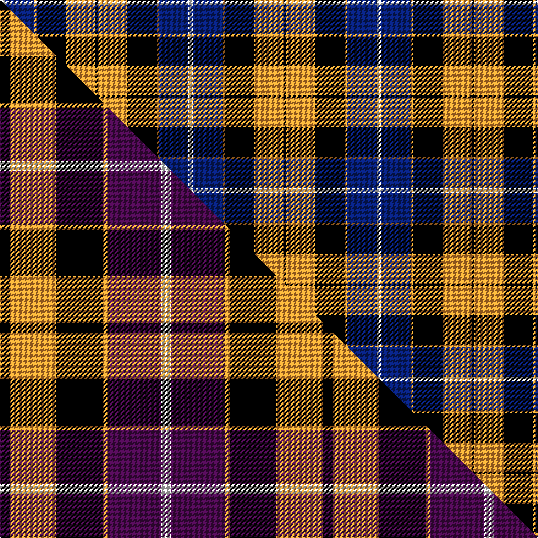

This page is one **sett** — a single exact thread-count. It belongs to the [tartan](/setts/w2db12lo1k12lo12k1/)
(the same proportion at any scale), whose colour order is pattern [KYKYBW](/stripes/kykybw/).

Part of the [Dutch](/tartans/dutch/) tartan — the named design grouping this sett with its other cloths.

Sourced from house-of-tartan.  It is a [6 stripe tartan](/stripes/stripes6/).

Original link http://www.house-of-tartan.scotland.net/house/TartanViewjs.asp?colr=Def&tnam=1134

## Provenance

Earliest known date: 1965 The late Sir Iain Moncrieffe of that Ilk, Albany Herald said, "It should be based on Mackay tartan because of the association with the Chiefs of the Clan Mackay. Baron Aeneas Mackay was Prime Minister of the Netherlands in 1889 and his great grandson Lord Reay, the present Chief, is also a Dutch Baron." The sett chosen was John Cargill's proposal of a simple colour change in respect of the two tartans, Dutch and Dutch Dress.

## Thread count
W/4 DB24 LO2 K24 LO24 K/2

One full sett is **154 threads**.

## Palette
<table><thead><tr><th>Colour</th><th>Shade</th><th>OKLCh</th></tr></thead><tbody><tr><td>DB</td><td><code style="background-color:#082077;">#082077</code> <small style="color:#888">#082077</small></td><td><small style="color:#888">oklch(30.0% 0.149 265.1)</small></td></tr><tr><td>K</td><td><code style="background-color:#000000;">#000000</code> <small style="color:#888">#000000</small></td><td><small style="color:#888">oklch(0.0% 0.000 0.0)</small></td></tr><tr><td>W</td><td><code style="background-color:#F7F7F7;">#F7F7F7</code> <small style="color:#888">#F7F7F7</small></td><td><small style="color:#888">oklch(97.6% 0.000 89.9)</small></td></tr><tr><td>LO</td><td><code style="background-color:#FF9C34;">#FF9C34</code> <small style="color:#888">#FF9C34</small></td><td><small style="color:#888">oklch(77.9% 0.161 61.8)</small></td></tr></tbody></table>

# Sample pattern

## Compared to the master

This cloth is one sett of its design; the master sett (the exemplar the design is anchored on) is below for comparison.

Its **ΔTartan distance** from the master is **0.86** — the same measure the nearest-tartans table ranks by (0 is identical; a re-scale of the same cloth is near 0, a recolour or a different proportion further).

<figure class="master-compare" style="margin:0">

this sett
master sett ★

<figcaption style="color:#888;font-size:smaller">One weave of this sett against the <a href="/setts/k4lo19k19lo2dp22w4/">master sett ★</a>, split on the diagonal: a shared proportion runs seamlessly across it with only the shades shifting; a different proportion breaks on it.</figcaption>
</figure>

## Nearest variants

The nearest existing variants by ΔTartan distance, with this cloth at the top so the swatches line up against it.

ΔTartan

Threads

Variant

Sett

—

154

<a href="/variants/s6/w2db12lo1k12lo12k1~x2/">Dutch District Tartan</a>

<a href="/ttd/edit/#slug=k4lo19k19lo2dp22w4~x2&amp;base=w2db12lo1k12lo12k1~x2" title="compare in the TTD">1.30</a>

264

<a href="/variants/s6/k4lo19k19lo2dp22w4~x2/">Dutch</a>

<a href="/ttd/edit/#slug=k4o19k19o2dp22w4~x2&amp;base=w2db12lo1k12lo12k1~x2" title="compare in the TTD">1.30</a>

264

<a href="/variants/s6/k4o19k19o2dp22w4~x2/">Dutch (District)</a>

<a href="/ttd/edit/#slug=k4lo2k13lo1w8t13lo2t4~x2&amp;base=w2db12lo1k12lo12k1~x2" title="compare in the TTD">2.26</a>

172

<a href="/variants/s8/k4lo2k13lo1w8t13lo2t4~x2/">Bannockbane Blue #1</a>

<a href="/ttd/edit/#slug=r3n27k6lo13k14r3~x2&amp;base=w2db12lo1k12lo12k1~x2" title="compare in the TTD">2.77</a>

252

<a href="/variants/s6/r3n27k6lo13k14r3~x2/">Thompson/Thomson/MacTavish special grey</a>

## Neighbour map

Every grey dot is one of 13620 variants placed by the first two principal components of the ΔTartan feature space (42% of its variance). Red is this tartan; blue dots are its nearest — click one to open its page.

<svg viewBox="0 0 640 380" role="img" style="max-width:100%;height:auto;border:1px solid #e0e0e0;border-radius:4px;display:block" xmlns="http://www.w3.org/2000/svg"><image href="/nn/cloud.v1.png" width="640" height="380"/><a href="/variants/s6/k4lo19k19lo2dp22w4~x2/"><circle cx="136.4" cy="194.3" r="4" fill="#3465a4"><title>Dutch</title></circle></a><a href="/variants/s6/k4o19k19o2dp22w4~x2/"><circle cx="142.0" cy="192.3" r="4" fill="#3465a4"><title>Dutch (District)</title></circle></a><a href="/variants/s8/k4lo2k13lo1w8t13lo2t4~x2/"><circle cx="138.0" cy="177.1" r="4" fill="#3465a4"><title>Bannockbane Blue #1</title></circle></a><a href="/variants/s6/r3n27k6lo13k14r3~x2/"><circle cx="158.3" cy="194.8" r="4" fill="#3465a4"><title>Thompson/Thomson/MacTavish special grey</title></circle></a><circle cx="141.0" cy="186.7" r="5" fill="#c00000"/><text x="320" y="376" text-anchor="middle" font-size="11" fill="#999">ground</text><text x="11" y="190" text-anchor="middle" font-size="11" fill="#999" transform="rotate(-90 11 190)">complexity</text></svg>

ID: /variants/s6/w2db12lo1k12lo12k1~x2/
