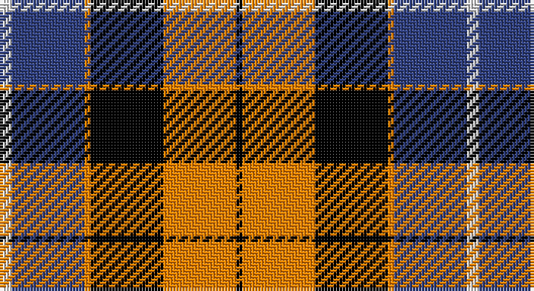

This page is one **sett** — a single exact thread-count. It belongs to the [tartan](/setts/w2db12lo1k12lo12k1/)
(the same proportion at any scale), whose colour order is pattern [KYKYBW](/stripes/kykybw/).

Part of the [Dutch](/tartans/dutch/) tartan — the named design grouping this sett with its other cloths.

Sourced from weddslist.  It is a [6 stripe tartan](/stripes/stripes6/).

Original link http://www.weddslist.com/cgi-bin/tartans/pg.pl?source=sts

## Provenance

Earliest known date: 1965 The late Sir Iain Moncrieffe of that Ilk, Albany Herald said, "It should be based on Mackay tartan because of the association with the Chiefs of the Clan Mackay. Baron Aeneas Mackay was Prime Minister of the Netherlands in 1889 and his great grandson Lord Reay, the present Chief, is also a Dutch Baron." The sett chosen was John Cargill's proposal of a simple colour change in respect of the two tartans, Dutch and Dutch Dress.

2 attestations — the source records this cloth was collapsed from (oldest owns this page)

<ul>
<li>undated — Dutch (weddslist, <a href="http://www.weddslist.com/cgi-bin/tartans/pg.pl?source=sts">record</a>)</li>
<li>undated — Dutch District Tartan (house-of-tartan, <a href="http://www.house-of-tartan.scotland.net/house/TartanViewjs.asp?colr=Def&tnam=1134">record</a>)</li>
</ul>

## Thread count
LN/4 B24 O2 K24 O24 K/2

One full sett is **154 threads**.

## Palette

Palette: <strong>Tartan Register</strong> <small style="color:#888">(2 of 4 colours)</small>
<table><thead><tr><th>Colour</th><th>Threads</th><th>Shade</th><th>Base</th><th>OKLCh</th></tr></thead><tbody><tr><td>LN/</td><td style="text-align:right;font-variant-numeric:tabular-nums">4</td><td><code style="background-color:#E0E0E0;">#E0E0E0</code> <small style="color:#888">#E0E0E0</small></td><td>W <code style="background-color:#F7F7F7;">#F7F7F7</code></td><td><small style="color:#888">oklch(90.7% 0.000 89.9)</small></td></tr><tr><td>B</td><td style="text-align:right;font-variant-numeric:tabular-nums">24</td><td><code style="background-color:#304080;">#304080</code> <small style="color:#888">#304080</small></td><td>B <code style="background-color:#2A418A;">#2A418A</code></td><td><small style="color:#888">oklch(39.4% 0.109 270.2)</small></td></tr><tr><td>O</td><td style="text-align:right;font-variant-numeric:tabular-nums">2</td><td><code style="background-color:#FF8500;">#FF8500</code> <small style="color:#888">#FF8500</small></td><td>Y <code style="background-color:#F2BF00;">#F2BF00</code></td><td><small style="color:#888">oklch(74.0% 0.183 55.1)</small></td></tr><tr><td>K</td><td style="text-align:right;font-variant-numeric:tabular-nums">24</td><td><code style="background-color:#000000;">#000000</code> <small style="color:#888">#000000</small></td><td>K <code style="background-color:#000000;">#000000</code></td><td><small style="color:#888">oklch(0.0% 0.000 0.0)</small></td></tr><tr><td>O</td><td style="text-align:right;font-variant-numeric:tabular-nums">24</td><td><code style="background-color:#FF8500;">#FF8500</code> <small style="color:#888">#FF8500</small></td><td>Y <code style="background-color:#F2BF00;">#F2BF00</code></td><td><small style="color:#888">oklch(74.0% 0.183 55.1)</small></td></tr><tr><td>K/</td><td style="text-align:right;font-variant-numeric:tabular-nums">2</td><td><code style="background-color:#000000;">#000000</code> <small style="color:#888">#000000</small></td><td>K <code style="background-color:#000000;">#000000</code></td><td><small style="color:#888">oklch(0.0% 0.000 0.0)</small></td></tr></tbody></table>

# Sample pattern

## Compared to the master

This cloth is one sett of its design; the master sett (the exemplar the design is anchored on) is below for comparison.

<figure style="margin:0"><figcaption style="color:#888;font-size:smaller">this sett</figcaption></figure>
<figure style="margin:0"><figcaption style="color:#888;font-size:smaller"><a href="/setts/k4o19k19o2dp22w4/">master sett →</a></figcaption></figure>

## Nearest tartans

The nearest existing variants by ΔTartan distance, with this tartan at the top so the swatches line up against it.

ΔTartan

Tartan

Sett

—

<a href="/ttd/edit/#slug=w2db12lo1k12lo12k1~x2">Dutch</a> <a class="nn-out" href="/variants/s6/w2db12lo1k12lo12k1~x2/" title="open its dictionary page">↗</a>

0.84

<a href="/ttd/edit/#slug=k4o19k19o2dp22w4~x2&amp;base=w2db12lo1k12lo12k1~x2">Dutch</a> <a class="nn-out" href="/variants/s6/k4o19k19o2dp22w4~x2/" title="open its dictionary page">↗</a>

1.02

<a href="/ttd/edit/#slug=r2y20k5w10k10r2~x2&amp;base=w2db12lo1k12lo12k1~x2">Thom(p)son, Grey</a> <a class="nn-out" href="/variants/s6/r2y20k5w10k10r2~x2/" title="open its dictionary page">↗</a>

1.07

<a href="/ttd/edit/#slug=r4o30k6w13k13w3~x2&amp;base=w2db12lo1k12lo12k1~x2">Thom(p)son camel</a> <a class="nn-out" href="/variants/s6/r4o30k6w13k13w3~x2/" title="open its dictionary page">↗</a>

1.11

<a href="/ttd/edit/#slug=w23db6w6r5k35r10~x2&amp;base=w2db12lo1k12lo12k1~x2">Meg, Merrilees</a> <a class="nn-out" href="/variants/s6/w23db6w6r5k35r10~x2/" title="open its dictionary page">↗</a>

1.12

<a href="/ttd/edit/#slug=ly6g3ly3g22k23p23k4~x2&amp;base=w2db12lo1k12lo12k1~x2">Gordon of Esslemont</a> <a class="nn-out" href="/variants/s7/ly6g3ly3g22k23p23k4~x2/" title="open its dictionary page">↗</a>

1.12

<a href="/ttd/edit/#slug=dt8w22dt5w4k24r6k2r6~x2&amp;base=w2db12lo1k12lo12k1~x2">Unidentified (ex Tony Murray)</a> <a class="nn-out" href="/variants/s8/dt8w22dt5w4k24r6k2r6~x2/" title="open its dictionary page">↗</a>

1.13

<a href="/ttd/edit/#slug=p3k1p8k6g8k1w2~x2&amp;base=w2db12lo1k12lo12k1~x2">Baillie</a> <a class="nn-out" href="/variants/s7/p3k1p8k6g8k1w2~x2/" title="open its dictionary page">↗</a>

1.15

<a href="/ttd/edit/#slug=r2k28y5w12y14r2~x2&amp;base=w2db12lo1k12lo12k1~x2">Callaway</a> <a class="nn-out" href="/variants/s6/r2k28y5w12y14r2~x2/" title="open its dictionary page">↗</a>

1.16

<a href="/ttd/edit/#slug=lb5o34k24o4r24o4~x2&amp;base=w2db12lo1k12lo12k1~x2">Wcwm 759-3</a> <a class="nn-out" href="/variants/s6/lb5o34k24o4r24o4~x2/" title="open its dictionary page">↗</a>

1.19

<a href="/ttd/edit/#slug=k3g17w2k18p17g3~x2&amp;base=w2db12lo1k12lo12k1~x2">Wilson's, No 76</a> <a class="nn-out" href="/variants/s6/k3g17w2k18p17g3~x2/" title="open its dictionary page">↗</a>

## Neighbour map

Every grey dot is one of 14360 variants placed by the first two principal components of the ΔTartan feature space (44% of its variance). Red is this tartan; blue dots are its nearest — click one to open its page.

<svg viewBox="0 0 640 380" role="img" style="max-width:100%;height:auto;border:1px solid #e0e0e0;border-radius:4px;display:block" xmlns="http://www.w3.org/2000/svg"><image href="/nn/cloud.v1.png" width="640" height="380"/><a href="/variants/s6/k4o19k19o2dp22w4~x2/"><circle cx="152.2" cy="198.5" r="4" fill="#3465a4"><title>Dutch</title></circle></a><a href="/variants/s6/r2y20k5w10k10r2~x2/"><circle cx="164.2" cy="191.7" r="4" fill="#3465a4"><title>Thom(p)son, Grey</title></circle></a><a href="/variants/s6/r4o30k6w13k13w3~x2/"><circle cx="184.3" cy="188.4" r="4" fill="#3465a4"><title>Thom(p)son camel</title></circle></a><a href="/variants/s6/w23db6w6r5k35r10~x2/"><circle cx="158.2" cy="200.5" r="4" fill="#3465a4"><title>Meg, Merrilees</title></circle></a><a href="/variants/s7/ly6g3ly3g22k23p23k4~x2/"><circle cx="122.0" cy="203.0" r="4" fill="#3465a4"><title>Gordon of Esslemont</title></circle></a><a href="/variants/s8/dt8w22dt5w4k24r6k2r6~x2/"><circle cx="139.6" cy="165.6" r="4" fill="#3465a4"><title>Unidentified (ex Tony Murray)</title></circle></a><a href="/variants/s7/p3k1p8k6g8k1w2~x2/"><circle cx="147.8" cy="208.6" r="4" fill="#3465a4"><title>Baillie</title></circle></a><a href="/variants/s6/r2k28y5w12y14r2~x2/"><circle cx="204.7" cy="176.4" r="4" fill="#3465a4"><title>Callaway</title></circle></a><a href="/variants/s6/lb5o34k24o4r24o4~x2/"><circle cx="190.3" cy="203.2" r="4" fill="#3465a4"><title>Wcwm 759-3</title></circle></a><a href="/variants/s6/k3g17w2k18p17g3~x2/"><circle cx="154.6" cy="213.6" r="4" fill="#3465a4"><title>Wilson's, No 76</title></circle></a><circle cx="152.1" cy="183.6" r="5" fill="#c00000"/></svg>

ID: /variants/s6/w2db12lo1k12lo12k1~x2/
