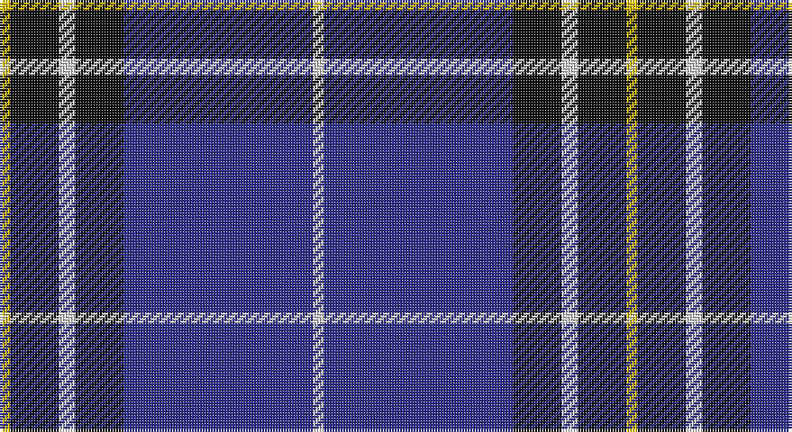

This page is one **sett** — a single exact thread-count. It belongs to the [tartan](/setts/w2db35k9w3k9ly2/)
(the same proportion at any scale), whose colour order is pattern [WBKWKY](/stripes/wbkwky/).

Sourced from tartans-authority.  It is a [6 stripe tartan](/stripes/stripes6/).

Original link http://www.tartansauthority.com/tartan-ferret/display/7910/

## Register references

External register numbers recorded for this tartan.

- Scottish Register of Tartans: [7910](https://www.tartanregister.gov.uk/tartanDetails?ref=7910)
- Scottish Tartans Authority (ITI): 7910

## Thread count
Y/4 K18 LN6 K18 DB70 LN/4

One full sett is **232 threads**.

## Palette

Palette: <strong>Tartan Register</strong> <small style="color:#888">(3 of 4 colours)</small>
<table><thead><tr><th>Colour</th><th>Threads</th><th>Shade</th><th>Base</th><th>OKLCh</th></tr></thead><tbody><tr><td>Y/</td><td style="text-align:right;font-variant-numeric:tabular-nums">4</td><td><code style="background-color:#E8C000;">#E8C000</code> <small style="color:#888">#E8C000</small></td><td>Y <code style="background-color:#F2BF00;">#F2BF00</code></td><td><small style="color:#888">oklch(81.9% 0.168 93.7)</small></td></tr><tr><td>K</td><td style="text-align:right;font-variant-numeric:tabular-nums">18</td><td><code style="background-color:#101010;">#101010</code> <small style="color:#888">#101010</small></td><td>K <code style="background-color:#000000;">#000000</code></td><td><small style="color:#888">oklch(17.3% 0.000 89.9)</small></td></tr><tr><td>LN</td><td style="text-align:right;font-variant-numeric:tabular-nums">6</td><td><code style="background-color:#E0E0E0;">#E0E0E0</code> <small style="color:#888">#E0E0E0</small></td><td>W <code style="background-color:#F7F7F7;">#F7F7F7</code></td><td><small style="color:#888">oklch(90.7% 0.000 89.9)</small></td></tr><tr><td>K</td><td style="text-align:right;font-variant-numeric:tabular-nums">18</td><td><code style="background-color:#101010;">#101010</code> <small style="color:#888">#101010</small></td><td>K <code style="background-color:#000000;">#000000</code></td><td><small style="color:#888">oklch(17.3% 0.000 89.9)</small></td></tr><tr><td>DB</td><td style="text-align:right;font-variant-numeric:tabular-nums">70</td><td><code style="background-color:#30308C;">#30308C</code> <small style="color:#888">#30308C</small></td><td>B <code style="background-color:#2A418A;">#2A418A</code></td><td><small style="color:#888">oklch(37.2% 0.148 276.4)</small></td></tr><tr><td>LN/</td><td style="text-align:right;font-variant-numeric:tabular-nums">4</td><td><code style="background-color:#E0E0E0;">#E0E0E0</code> <small style="color:#888">#E0E0E0</small></td><td>W <code style="background-color:#F7F7F7;">#F7F7F7</code></td><td><small style="color:#888">oklch(90.7% 0.000 89.9)</small></td></tr></tbody></table>

# Sample pattern

## Nearest tartans

The nearest existing variants by ΔTartan distance, with this tartan at the top so the swatches line up against it.

ΔTartan

Tartan

Sett

—

<a href="/ttd/edit/#slug=w2db35k9w3k9ly2~x2">Hannah (Personal)</a> <a class="nn-out" href="/variants/s6/w2db35k9w3k9ly2~x2/" title="open its dictionary page">↗</a>

0.69

<a href="/ttd/edit/#slug=k1ly2k3n12k18w1~x2&amp;base=w2db35k9w3k9ly2~x2">Jon's Theme</a> <a class="nn-out" href="/variants/s6/k1ly2k3n12k18w1~x2/" title="open its dictionary page">↗</a>

0.77

<a href="/ttd/edit/#slug=db42r2y16r2db6r2y8lo3~x2&amp;base=w2db35k9w3k9ly2~x2">Prince George's Police Pipe Band</a> <a class="nn-out" href="/variants/s8/db42r2y16r2db6r2y8lo3~x2/" title="open its dictionary page">↗</a>

0.97

<a href="/variants/s6/ly8k3b40ki12k3ly3~x2/">Wolverine Corporate Tartan</a>

1.05

<a href="/ttd/edit/#slug=lo8w3db40k12w3lo3~x2&amp;base=w2db35k9w3k9ly2~x2">Wolverines (Corporate)</a> <a class="nn-out" href="/variants/s6/lo8w3db40k12w3lo3~x2/" title="open its dictionary page">↗</a>

1.06

<a href="/ttd/edit/#slug=k3db30k8w8k2r3~x2&amp;base=w2db35k9w3k9ly2~x2">Hydro-Electric</a> <a class="nn-out" href="/variants/s6/k3db30k8w8k2r3~x2/" title="open its dictionary page">↗</a>

1.07

<a href="/ttd/edit/#slug=r10db15g2db2w1db1w1~x4&amp;base=w2db35k9w3k9ly2~x2">Ikelman #4 (Personal)</a> <a class="nn-out" href="/variants/s7/r10db15g2db2w1db1w1~x4/" title="open its dictionary page">↗</a>

1.16

<a href="/ttd/edit/#slug=db7r3db26t2db2t26ly4~x2&amp;base=w2db35k9w3k9ly2~x2">Int. Police Association (Official)</a> <a class="nn-out" href="/variants/s7/db7r3db26t2db2t26ly4~x2/" title="open its dictionary page">↗</a>

1.18

<a href="/ttd/edit/#slug=w2db15r3g3r3db1~x8&amp;base=w2db35k9w3k9ly2~x2">Lothian Buses (Corporate?)</a> <a class="nn-out" href="/variants/s6/w2db15r3g3r3db1~x8/" title="open its dictionary page">↗</a>

1.18

<a href="/ttd/edit/#slug=k1lo2k3db12k18w1~x2&amp;base=w2db35k9w3k9ly2~x2">Jon's Theme (Fashion)</a> <a class="nn-out" href="/variants/s6/k1lo2k3db12k18w1~x2/" title="open its dictionary page">↗</a>

1.22

<a href="/ttd/edit/#slug=k30b40ly3b5w2b6~x2&amp;base=w2db35k9w3k9ly2~x2">Micron</a> <a class="nn-out" href="/variants/s6/k30b40ly3b5w2b6~x2/" title="open its dictionary page">↗</a>

## Neighbour map

Every grey dot is one of 14360 variants placed by the first two principal components of the ΔTartan feature space (44% of its variance). Red is this tartan; blue dots are its nearest — click one to open its page.

<svg viewBox="0 0 640 380" role="img" style="max-width:100%;height:auto;border:1px solid #e0e0e0;border-radius:4px;display:block" xmlns="http://www.w3.org/2000/svg"><image href="/nn/cloud.v1.png" width="640" height="380"/><a href="/variants/s6/k1ly2k3n12k18w1~x2/"><circle cx="366.0" cy="187.5" r="4" fill="#3465a4"><title>Jon's Theme</title></circle></a><a href="/variants/s8/db42r2y16r2db6r2y8lo3~x2/"><circle cx="365.1" cy="146.9" r="4" fill="#3465a4"><title>Prince George's Police Pipe Band</title></circle></a><a href="/variants/s6/ly8k3b40ki12k3ly3~x2/"><circle cx="314.0" cy="181.3" r="4" fill="#3465a4"><title>Wolverine Corporate Tartan</title></circle></a><a href="/variants/s6/lo8w3db40k12w3lo3~x2/"><circle cx="306.2" cy="167.4" r="4" fill="#3465a4"><title>Wolverines (Corporate)</title></circle></a><a href="/variants/s6/k3db30k8w8k2r3~x2/"><circle cx="291.1" cy="168.8" r="4" fill="#3465a4"><title>Hydro-Electric</title></circle></a><a href="/variants/s7/r10db15g2db2w1db1w1~x4/"><circle cx="339.6" cy="170.6" r="4" fill="#3465a4"><title>Ikelman #4 (Personal)</title></circle></a><a href="/variants/s7/db7r3db26t2db2t26ly4~x2/"><circle cx="288.1" cy="180.6" r="4" fill="#3465a4"><title>Int. Police Association (Official)</title></circle></a><a href="/variants/s6/w2db15r3g3r3db1~x8/"><circle cx="341.2" cy="177.4" r="4" fill="#3465a4"><title>Lothian Buses (Corporate?)</title></circle></a><a href="/variants/s6/k1lo2k3db12k18w1~x2/"><circle cx="373.9" cy="194.9" r="4" fill="#3465a4"><title>Jon's Theme (Fashion)</title></circle></a><a href="/variants/s6/k30b40ly3b5w2b6~x2/"><circle cx="354.9" cy="175.7" r="4" fill="#3465a4"><title>Micron</title></circle></a><circle cx="349.3" cy="172.4" r="5" fill="#c00000"/></svg>

ID: /variants/s6/w2db35k9w3k9ly2~x2/
