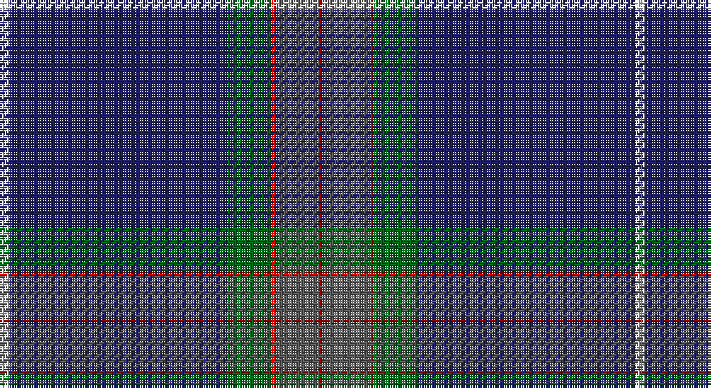

This page is one **sett** — a single exact thread-count. It belongs to the [tartan](/setts/w2db45g9r1n9ri1/)
(the same proportion at any scale), whose colour order is pattern [RBRGBW](/stripes/rbrgbw/).

Part of the [Wilton](/tartans/wilton/) tartan — the named design grouping this sett with its other cloths.

Sourced from tartans-authority.  It is a [6 stripe tartan](/stripes/stripes6/).

Original link http://www.tartansauthority.com/tartan-ferret/display/4069/

## Register references

External register numbers recorded for this tartan.

- Scottish Tartans Authority (ITI): 4069

## Thread count
LN/4 DB90 G18 R2 N18 DR/2

One full sett is **262 threads**.

## Palette

Palette: <strong>Tartan Register</strong> <small style="color:#888">(5 of 6 colours)</small>
<table><thead><tr><th>Colour</th><th>Threads</th><th>Shade</th><th>Base</th><th>OKLCh</th></tr></thead><tbody><tr><td>LN/</td><td style="text-align:right;font-variant-numeric:tabular-nums">4</td><td><code style="background-color:#E0E0E0;">#E0E0E0</code> <small style="color:#888">#E0E0E0</small></td><td>W <code style="background-color:#F7F7F7;">#F7F7F7</code></td><td><small style="color:#888">oklch(90.7% 0.000 89.9)</small></td></tr><tr><td>DB</td><td style="text-align:right;font-variant-numeric:tabular-nums">90</td><td><code style="background-color:#202060;">#202060</code> <small style="color:#888">#202060</small></td><td>B <code style="background-color:#2A418A;">#2A418A</code></td><td><small style="color:#888">oklch(28.9% 0.111 276.9)</small></td></tr><tr><td>G</td><td style="text-align:right;font-variant-numeric:tabular-nums">18</td><td><code style="background-color:#006818;">#006818</code> <small style="color:#888">#006818</small></td><td>G <code style="background-color:#006100;">#006100</code></td><td><small style="color:#888">oklch(45.0% 0.142 145.0)</small></td></tr><tr><td>R</td><td style="text-align:right;font-variant-numeric:tabular-nums">2</td><td><code style="background-color:#C80000;">#C80000</code> <small style="color:#888">#C80000</small></td><td>R <code style="background-color:#CC0000;">#CC0000</code></td><td><small style="color:#888">oklch(52.3% 0.215 29.2)</small></td></tr><tr><td>N</td><td style="text-align:right;font-variant-numeric:tabular-nums">18</td><td><code style="background-color:#5C5C5C;">#5C5C5C</code> <small style="color:#888">#5C5C5C</small></td><td>B <code style="background-color:#2A418A;">#2A418A</code></td><td><small style="color:#888">oklch(47.5% 0.000 89.9)</small></td></tr><tr><td>DR/</td><td style="text-align:right;font-variant-numeric:tabular-nums">2</td><td><code style="background-color:#880000;">#880000</code> <small style="color:#888">#880000</small></td><td>R <code style="background-color:#CC0000;">#CC0000</code></td><td><small style="color:#888">oklch(39.4% 0.162 29.2)</small></td></tr></tbody></table>

# Sample pattern

## Compared to the master

This cloth is one sett of its design; the master sett (the exemplar the design is anchored on) is below for comparison.

<figure style="margin:0"><figcaption style="color:#888;font-size:smaller">this sett</figcaption></figure>
<figure style="margin:0"><figcaption style="color:#888;font-size:smaller"><a href="/setts/n9r1g9db19w2db19g9r1n9ri1/">master sett →</a></figcaption></figure>

## Nearest tartans

The nearest existing variants by ΔTartan distance, with this tartan at the top so the swatches line up against it.

ΔTartan

Tartan

Sett

—

<a href="/ttd/edit/#slug=w2db45g9r1n9ri1~x2">Wilton (Name)</a> <a class="nn-out" href="/variants/s6/w2db45g9r1n9ri1~x2/" title="open its dictionary page">↗</a>

0.63

<a href="/ttd/edit/#slug=g20r10ly2db100w1y10&amp;base=w2db45g9r1n9ri1~x2">Ravetta (Name)</a> <a class="nn-out" href="/variants/s6/g20r10ly2db100w1y10/" title="open its dictionary page">↗</a>

0.72

<a href="/ttd/edit/#slug=db67w1lo6r5dg25db3k5~x2&amp;base=w2db45g9r1n9ri1~x2">Guide Dogs (Corporate)</a> <a class="nn-out" href="/variants/s7/db67w1lo6r5dg25db3k5~x2/" title="open its dictionary page">↗</a>

1.08

<a href="/ttd/edit/#slug=n15k55w1dp5r2ly1~x2&amp;base=w2db45g9r1n9ri1~x2">Venters (Edinburgh)</a> <a class="nn-out" href="/variants/s6/n15k55w1dp5r2ly1~x2/" title="open its dictionary page">↗</a>

1.27

<a href="/ttd/edit/#slug=g5w1r5k5db43r1~x2&amp;base=w2db45g9r1n9ri1~x2">Michael (John) (Personal)</a> <a class="nn-out" href="/variants/s6/g5w1r5k5db43r1~x2/" title="open its dictionary page">↗</a>

1.35

<a href="/ttd/edit/#slug=r2db61k13w2o20lo2~x2&amp;base=w2db45g9r1n9ri1~x2">Lloyd of Astargus</a> <a class="nn-out" href="/variants/s6/r2db61k13w2o20lo2~x2/" title="open its dictionary page">↗</a>

1.35

<a href="/ttd/edit/#slug=db46lyi1ly3dg13lyi1r7g3lyi1~x2&amp;base=w2db45g9r1n9ri1~x2">Victorian Highland Pipe Band Assoc</a> <a class="nn-out" href="/variants/s8/db46lyi1ly3dg13lyi1r7g3lyi1~x2/" title="open its dictionary page">↗</a>

1.41

<a href="/ttd/edit/#slug=r2w1r5g5lo1g10db40ly2~x2&amp;base=w2db45g9r1n9ri1~x2">St. Andrew Quebec City (Corporate)</a> <a class="nn-out" href="/variants/s8/r2w1r5g5lo1g10db40ly2~x2/" title="open its dictionary page">↗</a>

1.43

<a href="/ttd/edit/#slug=db36k10dg3r3dg6k1ly2~x2&amp;base=w2db45g9r1n9ri1~x2">MacLaurin of Brioch</a> <a class="nn-out" href="/variants/s7/db36k10dg3r3dg6k1ly2~x2/" title="open its dictionary page">↗</a>

1.51

<a href="/ttd/edit/#slug=g4k1dt9k1g3k1db27r1db27w1r3~x2&amp;base=w2db45g9r1n9ri1~x2">HMS Neptune (Military)</a> <a class="nn-out" href="/variants/s11/g4k1dt9k1g3k1db27r1db27w1r3~x2/" title="open its dictionary page">↗</a>

1.52

<a href="/ttd/edit/#slug=g3db16k3dp2k45r1k2lo3~x2&amp;base=w2db45g9r1n9ri1~x2">Cumnock (District)</a> <a class="nn-out" href="/variants/s8/g3db16k3dp2k45r1k2lo3~x2/" title="open its dictionary page">↗</a>

## Neighbour map

Every grey dot is one of 14360 variants placed by the first two principal components of the ΔTartan feature space (44% of its variance). Red is this tartan; blue dots are its nearest — click one to open its page.

<svg viewBox="0 0 640 380" role="img" style="max-width:100%;height:auto;border:1px solid #e0e0e0;border-radius:4px;display:block" xmlns="http://www.w3.org/2000/svg"><image href="/nn/cloud.v1.png" width="640" height="380"/><a href="/variants/s6/g20r10ly2db100w1y10/"><circle cx="469.7" cy="109.2" r="4" fill="#3465a4"><title>Ravetta (Name)</title></circle></a><a href="/variants/s7/db67w1lo6r5dg25db3k5~x2/"><circle cx="430.4" cy="113.5" r="4" fill="#3465a4"><title>Guide Dogs (Corporate)</title></circle></a><a href="/variants/s6/n15k55w1dp5r2ly1~x2/"><circle cx="502.9" cy="129.5" r="4" fill="#3465a4"><title>Venters (Edinburgh)</title></circle></a><a href="/variants/s6/g5w1r5k5db43r1~x2/"><circle cx="503.9" cy="129.8" r="4" fill="#3465a4"><title>Michael (John) (Personal)</title></circle></a><a href="/variants/s6/r2db61k13w2o20lo2~x2/"><circle cx="370.8" cy="125.8" r="4" fill="#3465a4"><title>Lloyd of Astargus</title></circle></a><a href="/variants/s8/db46lyi1ly3dg13lyi1r7g3lyi1~x2/"><circle cx="390.7" cy="88.4" r="4" fill="#3465a4"><title>Victorian Highland Pipe Band Assoc</title></circle></a><a href="/variants/s8/r2w1r5g5lo1g10db40ly2~x2/"><circle cx="380.5" cy="89.1" r="4" fill="#3465a4"><title>St. Andrew Quebec City (Corporate)</title></circle></a><a href="/variants/s7/db36k10dg3r3dg6k1ly2~x2/"><circle cx="393.4" cy="136.4" r="4" fill="#3465a4"><title>MacLaurin of Brioch</title></circle></a><a href="/variants/s11/g4k1dt9k1g3k1db27r1db27w1r3~x2/"><circle cx="430.7" cy="116.0" r="4" fill="#3465a4"><title>HMS Neptune (Military)</title></circle></a><a href="/variants/s8/g3db16k3dp2k45r1k2lo3~x2/"><circle cx="438.3" cy="96.2" r="4" fill="#3465a4"><title>Cumnock (District)</title></circle></a><circle cx="453.9" cy="121.7" r="5" fill="#c00000"/></svg>

ID: /variants/s6/w2db45g9r1n9ri1~x2/
