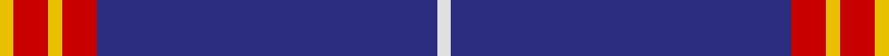
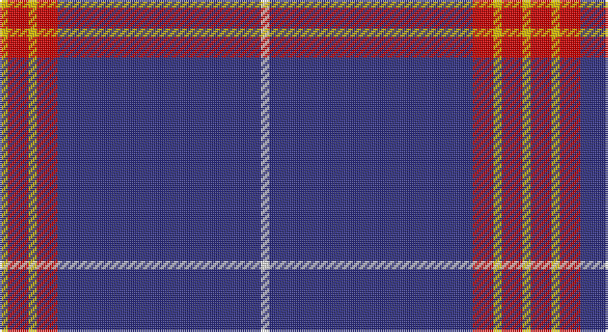

This page is one **sett** — a single exact thread-count. It belongs to the [tartan](/setts/w2db49r5ly2r5ly2/)
(the same proportion at any scale), whose colour order is pattern [WBRYRY](/stripes/wbryry/).

Sourced from tartans-authority.  It is a [6 stripe tartan](/stripes/stripes6/).

Original link http://www.tartansauthority.com/tartan-ferret/display/7133/

2 attestations — the source records this cloth was collapsed from (oldest owns this page)

<ul>
<li>Dec 2001 — Balmer (Personal) (tartans-authority, <a href="http://www.tartansauthority.com/tartan-ferret/display/7133/">record</a>)</li>
<li>undated — Balmer (Personal) (register-of-tartans, <a href="https://www.tartanregister.gov.uk/tartanDetails.aspx?ref=5437">record</a>)</li>
</ul>

## Register references

External register numbers recorded for this tartan.

- Scottish Register of Tartans: [5437](https://www.tartanregister.gov.uk/tartanDetails.aspx?ref=5437)
- Scottish Tartans Authority (ITI): 7133
- Scottish Tartans World Register: 3040

## Thread count
Y/4 R10 Y4 R10 DB98 LN/4

One full sett is **252 threads**.

## Palette

Palette: <strong>Tartan Register</strong>
<table><thead><tr><th>Colour</th><th>Threads</th><th>Shade</th><th>Base</th><th>OKLCh</th></tr></thead><tbody><tr><td>Y/</td><td style="text-align:right;font-variant-numeric:tabular-nums">4</td><td><code style="background-color:#E8C000;">#E8C000</code> <small style="color:#888">#E8C000</small></td><td>Y <code style="background-color:#F2BF00;">#F2BF00</code></td><td><small style="color:#888">oklch(81.9% 0.168 93.7)</small></td></tr><tr><td>R</td><td style="text-align:right;font-variant-numeric:tabular-nums">10</td><td><code style="background-color:#C80000;">#C80000</code> <small style="color:#888">#C80000</small></td><td>R <code style="background-color:#CC0000;">#CC0000</code></td><td><small style="color:#888">oklch(52.3% 0.215 29.2)</small></td></tr><tr><td>Y</td><td style="text-align:right;font-variant-numeric:tabular-nums">4</td><td><code style="background-color:#E8C000;">#E8C000</code> <small style="color:#888">#E8C000</small></td><td>Y <code style="background-color:#F2BF00;">#F2BF00</code></td><td><small style="color:#888">oklch(81.9% 0.168 93.7)</small></td></tr><tr><td>R</td><td style="text-align:right;font-variant-numeric:tabular-nums">10</td><td><code style="background-color:#C80000;">#C80000</code> <small style="color:#888">#C80000</small></td><td>R <code style="background-color:#CC0000;">#CC0000</code></td><td><small style="color:#888">oklch(52.3% 0.215 29.2)</small></td></tr><tr><td>DB</td><td style="text-align:right;font-variant-numeric:tabular-nums">98</td><td><code style="background-color:#2C2C80;">#2C2C80</code> <small style="color:#888">#2C2C80</small></td><td>B <code style="background-color:#2A418A;">#2A418A</code></td><td><small style="color:#888">oklch(35.0% 0.138 276.6)</small></td></tr><tr><td>LN/</td><td style="text-align:right;font-variant-numeric:tabular-nums">4</td><td><code style="background-color:#E0E0E0;">#E0E0E0</code> <small style="color:#888">#E0E0E0</small></td><td>W <code style="background-color:#F7F7F7;">#F7F7F7</code></td><td><small style="color:#888">oklch(90.7% 0.000 89.9)</small></td></tr></tbody></table>

# Sample pattern

## Nearest tartans

The nearest existing variants by ΔTartan distance, with this tartan at the top so the swatches line up against it.

ΔTartan

Tartan

Sett

—

<a href="/ttd/edit/#slug=w2db49r5ly2r5ly2~x2">Balmer (Personal)</a> <a class="nn-out" href="/variants/s6/w2db49r5ly2r5ly2~x2/" title="open its dictionary page">↗</a>

1.26

<a href="/ttd/edit/#slug=b7db5w6db5r7db2b2db70w2&amp;base=w2db49r5ly2r5ly2~x2">United States (Corporate)</a> <a class="nn-out" href="/variants/s9/b7db5w6db5r7db2b2db70w2/" title="open its dictionary page">↗</a>

1.34

<a href="/ttd/edit/#slug=db62w2db4w5db6ly2r8ly3w4~x2&amp;base=w2db49r5ly2r5ly2~x2">George, Stuart (Personal)</a> <a class="nn-out" href="/variants/s9/db62w2db4w5db6ly2r8ly3w4~x2/" title="open its dictionary page">↗</a>

1.37

<a href="/ttd/edit/#slug=db28dr3w1dr3db4w2dp1w5~x4&amp;base=w2db49r5ly2r5ly2~x2">Baker Family Tartan</a> <a class="nn-out" href="/variants/s8/db28dr3w1dr3db4w2dp1w5~x4/" title="open its dictionary page">↗</a>

1.38

<a href="/ttd/edit/#slug=db63lo3w3db8lo3db3w3db3r14db9lo3~x2&amp;base=w2db49r5ly2r5ly2~x2">Ottawa Fire Service (Corporate)</a> <a class="nn-out" href="/variants/s11/db63lo3w3db8lo3db3w3db3r14db9lo3~x2/" title="open its dictionary page">↗</a>

1.41

<a href="/ttd/edit/#slug=db62w2db4w5db6lo2r8lo3w4~x2&amp;base=w2db49r5ly2r5ly2~x2">George, Stuart (Personal)</a> <a class="nn-out" href="/variants/s9/db62w2db4w5db6lo2r8lo3w4~x2/" title="open its dictionary page">↗</a>

1.41

<a href="/ttd/edit/#slug=db26lb6g1r1w2~x2&amp;base=w2db49r5ly2r5ly2~x2">Special Air Service</a> <a class="nn-out" href="/variants/s5/db26lb6g1r1w2~x2/" title="open its dictionary page">↗</a>

1.41

<a href="/ttd/edit/#slug=db122r11w4r15ly4db6ly4db30&amp;base=w2db49r5ly2r5ly2~x2">Inverness, Duke of York</a> <a class="nn-out" href="/variants/s8/db122r11w4r15ly4db6ly4db30/" title="open its dictionary page">↗</a>

1.43

<a href="/ttd/edit/#slug=db80r7w1r7ly20db15~x2&amp;base=w2db49r5ly2r5ly2~x2">Auchtermuchty Tartan Army (Corp)</a> <a class="nn-out" href="/variants/s6/db80r7w1r7ly20db15~x2/" title="open its dictionary page">↗</a>

1.45

<a href="/ttd/edit/#slug=ly2db66r16w2r1w1~x2&amp;base=w2db49r5ly2r5ly2~x2">Coogan (Personal)</a> <a class="nn-out" href="/variants/s6/ly2db66r16w2r1w1~x2/" title="open its dictionary page">↗</a>

1.46

<a href="/ttd/edit/#slug=db28o3w1o3db4w2p1w5~x4&amp;base=w2db49r5ly2r5ly2~x2">Baker</a> <a class="nn-out" href="/variants/s8/db28o3w1o3db4w2p1w5~x4/" title="open its dictionary page">↗</a>

## Neighbour map

Every grey dot is one of 14360 variants placed by the first two principal components of the ΔTartan feature space (44% of its variance). Red is this tartan; blue dots are its nearest — click one to open its page.

<svg viewBox="0 0 640 380" role="img" style="max-width:100%;height:auto;border:1px solid #e0e0e0;border-radius:4px;display:block" xmlns="http://www.w3.org/2000/svg"><image href="/nn/cloud.v1.png" width="640" height="380"/><a href="/variants/s9/b7db5w6db5r7db2b2db70w2/"><circle cx="524.5" cy="107.9" r="4" fill="#3465a4"><title>United States (Corporate)</title></circle></a><a href="/variants/s9/db62w2db4w5db6ly2r8ly3w4~x2/"><circle cx="481.5" cy="101.2" r="4" fill="#3465a4"><title>George, Stuart (Personal)</title></circle></a><a href="/variants/s8/db28dr3w1dr3db4w2dp1w5~x4/"><circle cx="427.3" cy="122.7" r="4" fill="#3465a4"><title>Baker Family Tartan</title></circle></a><a href="/variants/s11/db63lo3w3db8lo3db3w3db3r14db9lo3~x2/"><circle cx="481.7" cy="119.6" r="4" fill="#3465a4"><title>Ottawa Fire Service (Corporate)</title></circle></a><a href="/variants/s9/db62w2db4w5db6lo2r8lo3w4~x2/"><circle cx="483.1" cy="102.7" r="4" fill="#3465a4"><title>George, Stuart (Personal)</title></circle></a><a href="/variants/s5/db26lb6g1r1w2~x2/"><circle cx="438.9" cy="137.6" r="4" fill="#3465a4"><title>Special Air Service</title></circle></a><a href="/variants/s8/db122r11w4r15ly4db6ly4db30/"><circle cx="575.0" cy="137.8" r="4" fill="#3465a4"><title>Inverness, Duke of York</title></circle></a><a href="/variants/s6/db80r7w1r7ly20db15~x2/"><circle cx="485.8" cy="125.4" r="4" fill="#3465a4"><title>Auchtermuchty Tartan Army (Corp)</title></circle></a><a href="/variants/s6/ly2db66r16w2r1w1~x2/"><circle cx="541.5" cy="123.2" r="4" fill="#3465a4"><title>Coogan (Personal)</title></circle></a><a href="/variants/s8/db28o3w1o3db4w2p1w5~x4/"><circle cx="434.7" cy="125.4" r="4" fill="#3465a4"><title>Baker</title></circle></a><circle cx="507.6" cy="140.8" r="5" fill="#c00000"/></svg>

ID: /variants/s6/w2db49r5ly2r5ly2~x2/
