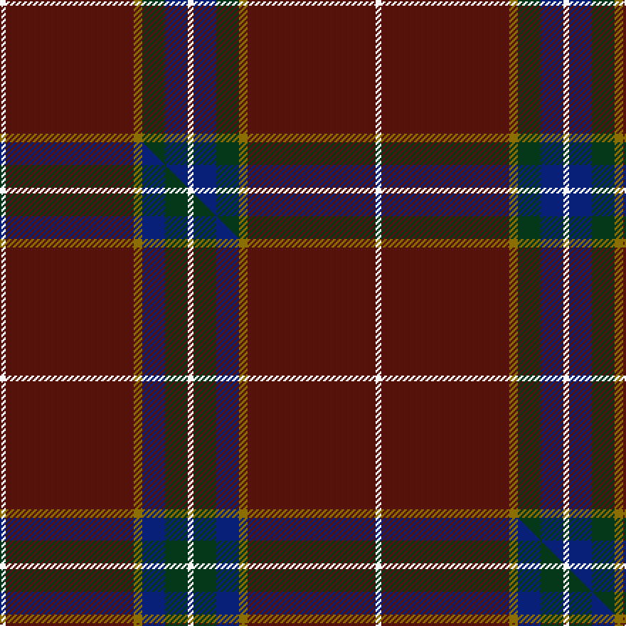

This is one **variant** — a specific cloth: this exact thread count and colourway, with its own
provenance below. It is one weaving of the [sett](/tartans/g/gl/glencross-2/) (the scale-free proportion — the
same cloth at any scale or shade), whose colour order is pattern [WBGGBW](/stripes/wbggbw/).

Part of the [Glencross](/tartans/g/gl/glencross-2/) tartan — the named design grouping this sett with its other cloths.

Sourced from tartans-authority.  It is a [6 stripe tartan](/stripes/stripes6/).

Original link <code>http://www.tartansauthority.com/tartan-ferret/display/10843/</code> — retired · [Internet Archive copy](https://web.archive.org/web/*/http://www.tartansauthority.com/tartan-ferret/display/10843/*)

Dataset <small>— provenance for this record, inherited from the source manifest</small>

<dl class="dataset-prov">
<dt>source</dt><dd><a href="/sources/tartans-authority/">Scottish Tartans Authority</a></dd>
<dt>data captured from</dt><dd><a href="https://github.com/thetartan/tartan-database/blob/master/data/tartans-authority/data.csv">https://github.com/thetartan/tartan-database/blob/master/data/tartans-authority/data.csv</a></dd>
<dt>data date</dt><dd>2013 <small>(this record)</small></dd>
<dt>licence</dt><dd><a href="https://creativecommons.org/licenses/by-nc-nd/4.0/">CC BY-NC-ND 4.0</a></dd>
</dl>

Capture chain <small>— the hands this data passed through, oldest first; each capture carries its own licence</small>

<ol class="capture-chain">
<li><a href="https://www.tartansauthority.com/">Scottish Tartans Authority</a> <small>the heritage body’s archive — its tartan-ferret record browser is retired; dead record links are shown unlinked, with an Internet Archive copy (ITI numbers are not SRT references)</small></li>
<li><a href="https://github.com/thetartan/tartan-database">thetartan/tartan-database</a> <small>2016-2017</small> · <a href="https://creativecommons.org/licenses/by-nc-nd/4.0/">CC BY-NC-ND 4.0</a> <small>Levko Kravets's frozen compilation — the capture we vendored, and where its CC licence text came from</small></li>
<li>this dictionary <small>captured 2026-06-10 · commit 5bf86c7566</small> <small>each re-capture is a git commit to data/sources</small></li>
</ol>

## Register references

External register numbers recorded for this tartan.

- Scottish Register of Tartans: [10843](https://www.tartanregister.gov.uk/tartanDetails?ref=10843)
- Scottish Tartans Authority (ITI): 10843

## Thread count
W/4 DR90 Y6 DG16 DB16 W/4

One full sett is **264 threads**.

## Palette
<table><thead><tr><th>Colour</th><th>Shade</th><th>OKLCh</th></tr></thead><tbody><tr><td>DB</td><td><code style="background-color:#082077;">#082077</code> <small style="color:#888">#082077</small></td><td><small style="color:#888">oklch(30.0% 0.149 265.1)</small></td></tr><tr><td>DG</td><td><code style="background-color:#053819;">#053819</code> <small style="color:#888">#053819</small></td><td><small style="color:#888">oklch(30.0% 0.075 151.3)</small></td></tr><tr><td>DR</td><td><code style="background-color:#55120C;">#55120C</code> <small style="color:#888">#55120C</small></td><td><small style="color:#888">oklch(30.0% 0.099 29.3)</small></td></tr><tr><td>W</td><td><code style="background-color:#F7F7F7;">#F7F7F7</code> <small style="color:#888">#F7F7F7</small></td><td><small style="color:#888">oklch(97.6% 0.000 89.9)</small></td></tr><tr><td>Y</td><td><code style="background-color:#8B6E00;">#8B6E00</code> <small style="color:#888">#8B6E00</small></td><td><small style="color:#888">oklch(55.1% 0.113 90.4)</small></td></tr></tbody></table>

# Sample pattern

## Compared to the master

This cloth is one sett of its design; the master sett (the exemplar the design is anchored on) is below for comparison.

Its **ΔTartan distance** from the master is **0.60** — the same measure the nearest-tartans table ranks by (0 is identical; a re-scale of the same cloth is near 0, a recolour or a different proportion further).

<figure class="master-compare" style="margin:0">

this sett
master sett ★

<figcaption style="color:#888;font-size:smaller">One weave of this sett against the <a href="/setts/w2dr45y3db8dg8w2/">master sett ★</a>, split on the diagonal: a shared proportion runs seamlessly across it with only the shades shifting; a different proportion breaks on it.</figcaption>
</figure>

## Nearest tartan variants

The nearest existing variants by ΔTartan distance, with this cloth at the top so the swatches line up against it.

ΔTartan

Threads

Variant

Sett

—

264

<a href="/variants/s6/w2dr45y3dg8db8w2~x2/">Glencross (Moniaive) (Personal)</a>

<a href="/ttd/edit/#slug=w2dr45y3db8dg8w2~x2&amp;base=w2dr45y3dg8db8w2~x2" title="compare in the TTD">0.60</a>

264

<a href="/variants/s6/w2dr45y3db8dg8w2~x2/">Glencross (Moniaive) (Personal)</a>

<a href="/ttd/edit/#slug=w8r6ly2dg34db3~x2&amp;base=w2dr45y3dg8db8w2~x2" title="compare in the TTD">1.09</a>

190

<a href="/variants/s5/w8r6ly2dg34db3~x2/">Milling-Kristensen (Personal)</a>

<a href="/ttd/edit/#slug=dr62ly7g7r3w3db13w3r5~x2&amp;base=w2dr45y3dg8db8w2~x2" title="compare in the TTD">1.09</a>

278

<a href="/variants/s8/dr62ly7g7r3w3db13w3r5~x2/">Legion of Frontiersmen</a>

<a href="/ttd/edit/#slug=dy62y7g7r3w3db13w3r5~x2&amp;base=w2dr45y3dg8db8w2~x2" title="compare in the TTD">1.50</a>

278

<a href="/variants/s8/dy62y7g7r3w3db13w3r5~x2/">Legion of Frontiersmen</a>

<a href="/ttd/edit/#slug=lp6w2lp1db6n30lb1r3~x2&amp;base=w2dr45y3dg8db8w2~x2" title="compare in the TTD">1.80</a>

178

<a href="/variants/s7/lp6w2lp1db6n30lb1r3~x2/">Kuehle (Personal)</a>

<a href="/ttd/edit/#slug=dr35w3dr8y2dg11~x2&amp;base=w2dr45y3dg8db8w2~x2" title="compare in the TTD">1.94</a>

144

<a href="/variants/s5/dr35w3dr8y2dg11~x2/">Highlands of Wyomissing (Corporate)</a>

<a href="/ttd/edit/#slug=n47w6r24w3db5y3~x2&amp;base=w2dr45y3dg8db8w2~x2" title="compare in the TTD">1.98</a>

252

<a href="/variants/s6/n47w6r24w3db5y3~x2/">Duminiak (Trevose, Pennsylvania)</a>

<a href="/ttd/edit/#slug=n47w6r24w3db5ly3~x2&amp;base=w2dr45y3dg8db8w2~x2" title="compare in the TTD">1.98</a>

252

<a href="/variants/s6/n47w6r24w3db5ly3~x2/">Duminiak (Personal)</a>

<a href="/ttd/edit/#slug=dr40t8dr1w2~x4&amp;base=w2dr45y3dg8db8w2~x2" title="compare in the TTD">2.11</a>

240

<a href="/variants/s4/dr40t8dr1w2~x4/">Lyon College (Corporate)</a>

<a href="/ttd/edit/#slug=dg20dr1ly1dr1w1dg1dr1w1b5~x4&amp;base=w2dr45y3dg8db8w2~x2" title="compare in the TTD">2.62</a>

156

<a href="/variants/s9/dg20dr1ly1dr1w1dg1dr1w1b5~x4/">Scotts Valley</a>

## Neighbour map

Every grey dot is one of 13662 variants placed by the first two principal components of the ΔTartan feature space (42% of its variance). Red is this tartan; blue dots are its nearest — click one to open its page. The map is a flat projection of a many-dimensional space — [how to read it](/posts/neighbourhood-maps/).

<svg viewBox="0 0 640 380" role="img" style="max-width:100%;height:auto;border:1px solid #e0e0e0;border-radius:4px;display:block" xmlns="http://www.w3.org/2000/svg"><image href="/nn/cloud.v1.png" width="640" height="380"/><a href="/variants/s6/w2dr45y3db8dg8w2~x2/"><circle cx="448.1" cy="152.4" r="4" fill="#3465a4"><title>Glencross (Moniaive) (Personal)</title></circle></a><a href="/variants/s5/w8r6ly2dg34db3~x2/"><circle cx="340.2" cy="159.5" r="4" fill="#3465a4"><title>Milling-Kristensen (Personal)</title></circle></a><a href="/variants/s8/dr62ly7g7r3w3db13w3r5~x2/"><circle cx="324.7" cy="98.4" r="4" fill="#3465a4"><title>Legion of Frontiersmen</title></circle></a><a href="/variants/s8/dy62y7g7r3w3db13w3r5~x2/"><circle cx="338.1" cy="108.5" r="4" fill="#3465a4"><title>Legion of Frontiersmen</title></circle></a><a href="/variants/s7/lp6w2lp1db6n30lb1r3~x2/"><circle cx="387.1" cy="117.4" r="4" fill="#3465a4"><title>Kuehle (Personal)</title></circle></a><a href="/variants/s5/dr35w3dr8y2dg11~x2/"><circle cx="456.5" cy="165.5" r="4" fill="#3465a4"><title>Highlands of Wyomissing (Corporate)</title></circle></a><a href="/variants/s6/n47w6r24w3db5y3~x2/"><circle cx="337.8" cy="174.2" r="4" fill="#3465a4"><title>Duminiak (Trevose, Pennsylvania)</title></circle></a><a href="/variants/s6/n47w6r24w3db5ly3~x2/"><circle cx="331.0" cy="171.9" r="4" fill="#3465a4"><title>Duminiak (Personal)</title></circle></a><a href="/variants/s4/dr40t8dr1w2~x4/"><circle cx="551.2" cy="165.6" r="4" fill="#3465a4"><title>Lyon College (Corporate)</title></circle></a><a href="/variants/s9/dg20dr1ly1dr1w1dg1dr1w1b5~x4/"><circle cx="412.5" cy="126.4" r="4" fill="#3465a4"><title>Scotts Valley</title></circle></a><circle cx="445.4" cy="150.6" r="5" fill="#c00000"/><text x="320" y="376" text-anchor="middle" font-size="11" fill="#999">ground</text><text x="11" y="190" text-anchor="middle" font-size="11" fill="#999" transform="rotate(-90 11 190)">complexity</text></svg>

ID: /variants/s6/w2dr45y3dg8db8w2~x2/
