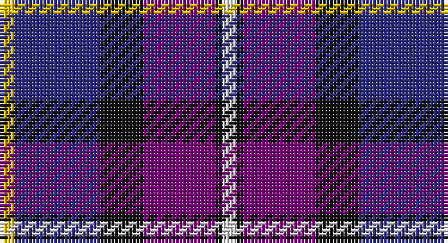

This page is one **sett** — a single exact thread-count. It belongs to the [tartan](/setts/w2k1dp10k6db12ly2/)
(the same proportion at any scale), whose colour order is pattern [WKBKBY](/stripes/wkbkby/).

Part of the [Soroptimist International](/tartans/soroptimist-international/) tartan — the named design grouping this sett with its other cloths.

Sourced from house-of-tartan.  It is a [6 stripe tartan](/stripes/stripes6/).

Original link http://www.house-of-tartan.scotland.net/house/TartanViewjs.asp?colr=Def&tnam=3097

## Provenance

Earliest known date: 2002 Non-repeating sett. Launched at the Federation of Great Britain & Ireland Conference in 2002 during the Presidency of Lynn Dunning. The design and the colours have been chosen carefully to symbolise the purple heather of the mountains and hills of Scotland together with the blue and gold of Soroptimist International woven together with the white hand of Peace.

## Thread count
Y/4 DB24 K12 P20 K2 LN/4

One full sett is **124 threads**.

## Palette

Palette: <strong>Tartan Register</strong>
<table><thead><tr><th>Colour</th><th>Threads</th><th>Shade</th><th>Base</th><th>OKLCh</th></tr></thead><tbody><tr><td>Y/</td><td style="text-align:right;font-variant-numeric:tabular-nums">4</td><td><code style="background-color:#E8C000;">#E8C000</code> <small style="color:#888">#E8C000</small></td><td>Y <code style="background-color:#F2BF00;">#F2BF00</code></td><td><small style="color:#888">oklch(81.9% 0.168 93.7)</small></td></tr><tr><td>DB</td><td style="text-align:right;font-variant-numeric:tabular-nums">24</td><td><code style="background-color:#2C2C80;">#2C2C80</code> <small style="color:#888">#2C2C80</small></td><td>B <code style="background-color:#2A418A;">#2A418A</code></td><td><small style="color:#888">oklch(35.0% 0.138 276.6)</small></td></tr><tr><td>K</td><td style="text-align:right;font-variant-numeric:tabular-nums">12</td><td><code style="background-color:#101010;">#101010</code> <small style="color:#888">#101010</small></td><td>K <code style="background-color:#000000;">#000000</code></td><td><small style="color:#888">oklch(17.3% 0.000 89.9)</small></td></tr><tr><td>P</td><td style="text-align:right;font-variant-numeric:tabular-nums">20</td><td><code style="background-color:#780078;">#780078</code> <small style="color:#888">#780078</small></td><td>B <code style="background-color:#2A418A;">#2A418A</code></td><td><small style="color:#888">oklch(40.2% 0.185 328.4)</small></td></tr><tr><td>K</td><td style="text-align:right;font-variant-numeric:tabular-nums">2</td><td><code style="background-color:#101010;">#101010</code> <small style="color:#888">#101010</small></td><td>K <code style="background-color:#000000;">#000000</code></td><td><small style="color:#888">oklch(17.3% 0.000 89.9)</small></td></tr><tr><td>LN/</td><td style="text-align:right;font-variant-numeric:tabular-nums">4</td><td><code style="background-color:#E0E0E0;">#E0E0E0</code> <small style="color:#888">#E0E0E0</small></td><td>W <code style="background-color:#F7F7F7;">#F7F7F7</code></td><td><small style="color:#888">oklch(90.7% 0.000 89.9)</small></td></tr></tbody></table>

# Sample pattern

## Compared to the master

This cloth is one sett of its design; the master sett (the exemplar the design is anchored on) is below for comparison.

<figure style="margin:0"><figcaption style="color:#888;font-size:smaller">this sett</figcaption></figure>
<figure style="margin:0"><figcaption style="color:#888;font-size:smaller"><a href="/setts/b12lo2b12k6m10k1w2k1m10k6/">master sett →</a></figcaption></figure>

## Nearest tartans

The nearest existing variants by ΔTartan distance, with this tartan at the top so the swatches line up against it.

ΔTartan

Tartan

Sett

—

<a href="/ttd/edit/#slug=w2k1dp10k6db12ly2~x2">Soroptimist International Corporate Tartan</a> <a class="nn-out" href="/variants/s6/w2k1dp10k6db12ly2~x2/" title="open its dictionary page">↗</a>

0.80

<a href="/ttd/edit/#slug=w2db15y2dbi20r9w2~x2&amp;base=w2k1dp10k6db12ly2~x2">The Open Championship</a> <a class="nn-out" href="/variants/s6/w2db15y2dbi20r9w2~x2/" title="open its dictionary page">↗</a>

1.11

<a href="/ttd/edit/#slug=lb2db20n2dt15r9lb2~x2&amp;base=w2k1dp10k6db12ly2~x2">Open Championship (1998)</a> <a class="nn-out" href="/variants/s6/lb2db20n2dt15r9lb2~x2/" title="open its dictionary page">↗</a>

1.26

<a href="/ttd/edit/#slug=ly5db24k8dbi18ly6dy3&amp;base=w2k1dp10k6db12ly2~x2">Cala Homes (Corporate)</a> <a class="nn-out" href="/variants/s6/ly5db24k8dbi18ly6dy3/" title="open its dictionary page">↗</a>

1.27

<a href="/ttd/edit/#slug=db31t4db6k19r20ly4~x2&amp;base=w2k1dp10k6db12ly2~x2">Fife (McGill)</a> <a class="nn-out" href="/variants/s6/db31t4db6k19r20ly4~x2/" title="open its dictionary page">↗</a>

1.29

<a href="/ttd/edit/#slug=k15db2r15b6bi1~x2&amp;base=w2k1dp10k6db12ly2~x2">O2 (Corporate)</a> <a class="nn-out" href="/variants/s5/k15db2r15b6bi1~x2/" title="open its dictionary page">↗</a>

1.30

<a href="/ttd/edit/#slug=w5db6r18k8b5k4db27w3~x2&amp;base=w2k1dp10k6db12ly2~x2">Clinton (Personal)</a> <a class="nn-out" href="/variants/s8/w5db6r18k8b5k4db27w3~x2/" title="open its dictionary page">↗</a>

1.31

<a href="/ttd/edit/#slug=lo2k2dbi14db4k5r2lo5r1~x4&amp;base=w2k1dp10k6db12ly2~x2">Lovell (2014)</a> <a class="nn-out" href="/variants/s8/lo2k2dbi14db4k5r2lo5r1~x4/" title="open its dictionary page">↗</a>

1.33

<a href="/ttd/edit/#slug=r6db3dp24w2k23y23k2y6~x2&amp;base=w2k1dp10k6db12ly2~x2">Culloden Grey</a> <a class="nn-out" href="/variants/s8/r6db3dp24w2k23y23k2y6~x2/" title="open its dictionary page">↗</a>

1.35

<a href="/ttd/edit/#slug=dp10db10g10w1ly1~x6&amp;base=w2k1dp10k6db12ly2~x2">Edelstein (Personal)</a> <a class="nn-out" href="/variants/s5/dp10db10g10w1ly1~x6/" title="open its dictionary page">↗</a>

1.42

<a href="/ttd/edit/#slug=w4db24ly2dbi24t5db4ly4~x2&amp;base=w2k1dp10k6db12ly2~x2">Mina Perhonen Japanese Corporate Tartan</a> <a class="nn-out" href="/variants/s7/w4db24ly2dbi24t5db4ly4~x2/" title="open its dictionary page">↗</a>

## Neighbour map

Every grey dot is one of 14360 variants placed by the first two principal components of the ΔTartan feature space (44% of its variance). Red is this tartan; blue dots are its nearest — click one to open its page.

<svg viewBox="0 0 640 380" role="img" style="max-width:100%;height:auto;border:1px solid #e0e0e0;border-radius:4px;display:block" xmlns="http://www.w3.org/2000/svg"><image href="/nn/cloud.v1.png" width="640" height="380"/><a href="/variants/s6/w2db15y2dbi20r9w2~x2/"><circle cx="176.8" cy="189.4" r="4" fill="#3465a4"><title>The Open Championship</title></circle></a><a href="/variants/s6/lb2db20n2dt15r9lb2~x2/"><circle cx="205.1" cy="204.7" r="4" fill="#3465a4"><title>Open Championship (1998)</title></circle></a><a href="/variants/s6/ly5db24k8dbi18ly6dy3/"><circle cx="142.7" cy="212.9" r="4" fill="#3465a4"><title>Cala Homes (Corporate)</title></circle></a><a href="/variants/s6/db31t4db6k19r20ly4~x2/"><circle cx="188.2" cy="210.2" r="4" fill="#3465a4"><title>Fife (McGill)</title></circle></a><a href="/variants/s5/k15db2r15b6bi1~x2/"><circle cx="198.2" cy="182.0" r="4" fill="#3465a4"><title>O2 (Corporate)</title></circle></a><a href="/variants/s8/w5db6r18k8b5k4db27w3~x2/"><circle cx="172.1" cy="171.1" r="4" fill="#3465a4"><title>Clinton (Personal)</title></circle></a><a href="/variants/s8/lo2k2dbi14db4k5r2lo5r1~x4/"><circle cx="166.5" cy="158.8" r="4" fill="#3465a4"><title>Lovell (2014)</title></circle></a><a href="/variants/s8/r6db3dp24w2k23y23k2y6~x2/"><circle cx="138.1" cy="152.9" r="4" fill="#3465a4"><title>Culloden Grey</title></circle></a><a href="/variants/s5/dp10db10g10w1ly1~x6/"><circle cx="162.0" cy="221.8" r="4" fill="#3465a4"><title>Edelstein (Personal)</title></circle></a><a href="/variants/s7/w4db24ly2dbi24t5db4ly4~x2/"><circle cx="212.6" cy="177.3" r="4" fill="#3465a4"><title>Mina Perhonen Japanese Corporate Tartan</title></circle></a><circle cx="169.9" cy="190.1" r="5" fill="#c00000"/></svg>

ID: /variants/s6/w2k1dp10k6db12ly2~x2/
