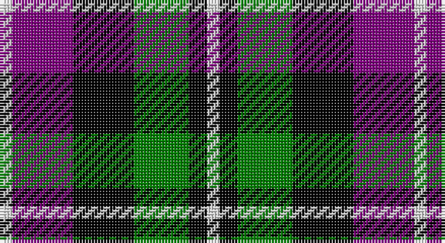

This page is one **sett** — a single exact thread-count. It belongs to the [tartan](/setts/w2p10k10g9k3w2/)
(the same proportion at any scale), whose colour order is pattern [WBKGKW](/stripes/wbkgkw/).

Sourced from weddslist.  It is a [6 stripe tartan](/stripes/stripes6/).

Original link http://www.weddslist.com/cgi-bin/tartans/pg.pl?source=sts

## Thread count
LN/4 P20 K20 G18 K6 LN/4

One full sett is **136 threads**.

## Palette

Palette: <strong>Tartan Register</strong> <small style="color:#888">(2 of 4 colours)</small>
<table><thead><tr><th>Colour</th><th>Threads</th><th>Shade</th><th>Base</th><th>OKLCh</th></tr></thead><tbody><tr><td>LN/</td><td style="text-align:right;font-variant-numeric:tabular-nums">4</td><td><code style="background-color:#E0E0E0;">#E0E0E0</code> <small style="color:#888">#E0E0E0</small></td><td>W <code style="background-color:#F7F7F7;">#F7F7F7</code></td><td><small style="color:#888">oklch(90.7% 0.000 89.9)</small></td></tr><tr><td>P</td><td style="text-align:right;font-variant-numeric:tabular-nums">20</td><td><code style="background-color:#800080;">#800080</code> <small style="color:#888">#800080</small></td><td>B <code style="background-color:#2A418A;">#2A418A</code></td><td><small style="color:#888">oklch(42.1% 0.193 328.4)</small></td></tr><tr><td>K</td><td style="text-align:right;font-variant-numeric:tabular-nums">20</td><td><code style="background-color:#000000;">#000000</code> <small style="color:#888">#000000</small></td><td>K <code style="background-color:#000000;">#000000</code></td><td><small style="color:#888">oklch(0.0% 0.000 0.0)</small></td></tr><tr><td>G</td><td style="text-align:right;font-variant-numeric:tabular-nums">18</td><td><code style="background-color:#008000;">#008000</code> <small style="color:#888">#008000</small></td><td>G <code style="background-color:#006100;">#006100</code></td><td><small style="color:#888">oklch(52.0% 0.177 142.5)</small></td></tr><tr><td>K</td><td style="text-align:right;font-variant-numeric:tabular-nums">6</td><td><code style="background-color:#000000;">#000000</code> <small style="color:#888">#000000</small></td><td>K <code style="background-color:#000000;">#000000</code></td><td><small style="color:#888">oklch(0.0% 0.000 0.0)</small></td></tr><tr><td>LN/</td><td style="text-align:right;font-variant-numeric:tabular-nums">4</td><td><code style="background-color:#E0E0E0;">#E0E0E0</code> <small style="color:#888">#E0E0E0</small></td><td>W <code style="background-color:#F7F7F7;">#F7F7F7</code></td><td><small style="color:#888">oklch(90.7% 0.000 89.9)</small></td></tr></tbody></table>

# Sample pattern

## Nearest tartans

The nearest existing variants by ΔTartan distance, with this tartan at the top so the swatches line up against it.

ΔTartan

Tartan

Sett

—

<a href="/ttd/edit/#slug=w2p10k10g9k3w2~x2">MacNeil 2</a> <a class="nn-out" href="/variants/s6/w2p10k10g9k3w2~x2/" title="open its dictionary page">↗</a>

0.71

<a href="/ttd/edit/#slug=k2g10t2k9p8g2~x2&amp;base=w2p10k10g9k3w2~x2">Lennie</a> <a class="nn-out" href="/variants/s6/k2g10t2k9p8g2~x2/" title="open its dictionary page">↗</a>

0.96

<a href="/ttd/edit/#slug=p3k1p8k6g8k1w2~x2&amp;base=w2p10k10g9k3w2~x2">Baillie</a> <a class="nn-out" href="/variants/s7/p3k1p8k6g8k1w2~x2/" title="open its dictionary page">↗</a>

1.05

<a href="/ttd/edit/#slug=p11t2k10g10ly2~x2&amp;base=w2p10k10g9k3w2~x2">Wilson's, No 217</a> <a class="nn-out" href="/variants/s5/p11t2k10g10ly2~x2/" title="open its dictionary page">↗</a>

1.07

<a href="/ttd/edit/#slug=k2g8db2k9p7k2~x2&amp;base=w2p10k10g9k3w2~x2">Campbell, Sir Walter Scott</a> <a class="nn-out" href="/variants/s6/k2g8db2k9p7k2~x2/" title="open its dictionary page">↗</a>

1.11

<a href="/ttd/edit/#slug=t3g12k14t11r3t3~x2&amp;base=w2p10k10g9k3w2~x2">Wellington, or Waterloo</a> <a class="nn-out" href="/variants/s6/t3g12k14t11r3t3~x2/" title="open its dictionary page">↗</a>

1.12

<a href="/ttd/edit/#slug=k3r1g5k3w1p3~x2&amp;base=w2p10k10g9k3w2~x2">Wilson's, No 194</a> <a class="nn-out" href="/variants/s6/k3r1g5k3w1p3~x2/" title="open its dictionary page">↗</a>

1.13

<a href="/ttd/edit/#slug=ly6g3ly3g22k23p23k4~x2&amp;base=w2p10k10g9k3w2~x2">Gordon of Esslemont</a> <a class="nn-out" href="/variants/s7/ly6g3ly3g22k23p23k4~x2/" title="open its dictionary page">↗</a>

1.13

<a href="/ttd/edit/#slug=k3g17w2k18p17g3~x2&amp;base=w2p10k10g9k3w2~x2">Wilson's, No 76</a> <a class="nn-out" href="/variants/s6/k3g17w2k18p17g3~x2/" title="open its dictionary page">↗</a>

1.17

<a href="/ttd/edit/#slug=k3g17ly2k18p17g3~x2&amp;base=w2p10k10g9k3w2~x2">Wilson's, No 100</a> <a class="nn-out" href="/variants/s6/k3g17ly2k18p17g3~x2/" title="open its dictionary page">↗</a>

1.19

<a href="/ttd/edit/#slug=db5k1g1k1r3k1~x4&amp;base=w2p10k10g9k3w2~x2">Clerk</a> <a class="nn-out" href="/variants/s6/db5k1g1k1r3k1~x4/" title="open its dictionary page">↗</a>

## Neighbour map

Every grey dot is one of 14360 variants placed by the first two principal components of the ΔTartan feature space (44% of its variance). Red is this tartan; blue dots are its nearest — click one to open its page.

<svg viewBox="0 0 640 380" role="img" style="max-width:100%;height:auto;border:1px solid #e0e0e0;border-radius:4px;display:block" xmlns="http://www.w3.org/2000/svg"><image href="/nn/cloud.v1.png" width="640" height="380"/><a href="/variants/s6/k2g10t2k9p8g2~x2/"><circle cx="126.9" cy="245.7" r="4" fill="#3465a4"><title>Lennie</title></circle></a><a href="/variants/s7/p3k1p8k6g8k1w2~x2/"><circle cx="147.8" cy="208.6" r="4" fill="#3465a4"><title>Baillie</title></circle></a><a href="/variants/s5/p11t2k10g10ly2~x2/"><circle cx="79.7" cy="233.8" r="4" fill="#3465a4"><title>Wilson's, No 217</title></circle></a><a href="/variants/s6/k2g8db2k9p7k2~x2/"><circle cx="152.0" cy="257.1" r="4" fill="#3465a4"><title>Campbell, Sir Walter Scott</title></circle></a><a href="/variants/s6/t3g12k14t11r3t3~x2/"><circle cx="115.5" cy="249.6" r="4" fill="#3465a4"><title>Wellington, or Waterloo</title></circle></a><a href="/variants/s6/k3r1g5k3w1p3~x2/"><circle cx="84.7" cy="239.0" r="4" fill="#3465a4"><title>Wilson's, No 194</title></circle></a><a href="/variants/s7/ly6g3ly3g22k23p23k4~x2/"><circle cx="122.0" cy="203.0" r="4" fill="#3465a4"><title>Gordon of Esslemont</title></circle></a><a href="/variants/s6/k3g17w2k18p17g3~x2/"><circle cx="154.6" cy="213.6" r="4" fill="#3465a4"><title>Wilson's, No 76</title></circle></a><a href="/variants/s6/k3g17ly2k18p17g3~x2/"><circle cx="155.6" cy="214.0" r="4" fill="#3465a4"><title>Wilson's, No 100</title></circle></a><a href="/variants/s6/db5k1g1k1r3k1~x4/"><circle cx="172.1" cy="234.5" r="4" fill="#3465a4"><title>Clerk</title></circle></a><circle cx="106.7" cy="239.6" r="5" fill="#c00000"/></svg>

ID: /variants/s6/w2p10k10g9k3w2~x2/
