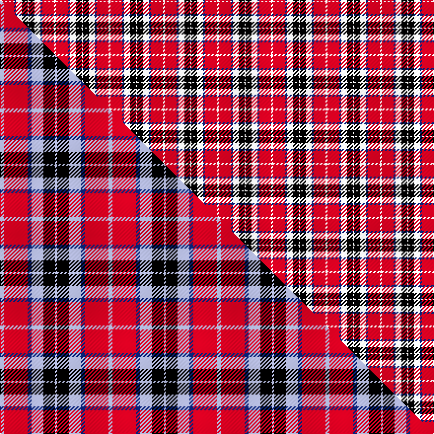

This page is one **sett** — a single exact thread-count. It belongs to the [tartan](/setts/w2r12db2w6k6w1/)
(the same proportion at any scale), whose colour order is pattern [WKWBRW](/stripes/wkwbrw/).

Part of the [MacTavish](/tartans/mactavish/) tartan — the named design grouping this sett with its other cloths.

Sourced from weddslist.  It is a [6 stripe tartan](/stripes/stripes6/).

Original link http://www.weddslist.com/cgi-bin/tartans/pg.pl?source=rb

## Thread count
W/2 R12 DB2 W6 K6 W/1

One full sett is **55 threads**.

## Palette
<table><thead><tr><th>Colour</th><th>Shade</th><th>OKLCh</th></tr></thead><tbody><tr><td>DB</td><td><code style="background-color:#082077;">#082077</code> <small style="color:#888">#082077</small></td><td><small style="color:#888">oklch(30.0% 0.149 265.1)</small></td></tr><tr><td>K</td><td><code style="background-color:#000000;">#000000</code> <small style="color:#888">#000000</small></td><td><small style="color:#888">oklch(0.0% 0.000 0.0)</small></td></tr><tr><td>W</td><td><code style="background-color:#F7F7F7;">#F7F7F7</code> <small style="color:#888">#F7F7F7</small></td><td><small style="color:#888">oklch(97.6% 0.000 89.9)</small></td></tr><tr><td>R</td><td><code style="background-color:#D60020;">#D60020</code> <small style="color:#888">#D60020</small></td><td><small style="color:#888">oklch(55.2% 0.224 25.5)</small></td></tr></tbody></table>

# Sample pattern

## Compared to the master

This cloth is one sett of its design; the master sett (the exemplar the design is anchored on) is below for comparison.

Its **ΔTartan distance** from the master is **0.58** — the same measure the nearest-tartans table ranks by (0 is identical; a re-scale of the same cloth is near 0, a recolour or a different proportion further).

<figure class="master-compare" style="margin:0">

this sett
master sett ★

<figcaption style="color:#888;font-size:smaller">One weave of this sett against the <a href="/setts/lb2r12db2lb6k6lb1/">master sett ★</a>, split on the diagonal: a shared proportion runs seamlessly across it with only the shades shifting; a different proportion breaks on it.</figcaption>
</figure>

## Nearest tartan variants

The nearest existing variants by ΔTartan distance, with this cloth at the top so the swatches line up against it.

ΔTartan

Threads

Variant

Sett

—

55

<a href="/variants/s6/w2r12db2w6k6w1/">MacTavish</a>

<a href="/ttd/edit/#slug=r15g3w2k10w5~x2&amp;base=w2r12db2w6k6w1" title="compare in the TTD">2.04</a>

100

<a href="/variants/s5/r15g3w2k10w5~x2/">SAL Cubiska Stenen</a>

<a href="/ttd/edit/#slug=r6w3r37k16w16g4~x2&amp;base=w2r12db2w6k6w1" title="compare in the TTD">2.11</a>

308

<a href="/variants/s6/r6w3r37k16w16g4~x2/">Nesbit, Rose</a>

<a href="/ttd/edit/#slug=w8k4w54db18r6db8r49w6&amp;base=w2r12db2w6k6w1" title="compare in the TTD">2.84</a>

292

<a href="/variants/s8/w8k4w54db18r6db8r49w6/">Merida Dance</a>

<a href="/ttd/edit/#slug=dr24lb4k4g4w13k2~x4&amp;base=w2r12db2w6k6w1" title="compare in the TTD">2.85</a>

304

<a href="/variants/s6/dr24lb4k4g4w13k2~x4/">Rose White Dress</a>

<a href="/ttd/edit/#slug=r32db6k6g6w18k3&amp;base=w2r12db2w6k6w1" title="compare in the TTD">2.86</a>

107

<a href="/variants/s6/r32db6k6g6w18k3/">Rose, White dress</a>

<a href="/ttd/edit/#slug=k3r11db3w1db3w1~x4&amp;base=w2r12db2w6k6w1" title="compare in the TTD">2.87</a>

160

<a href="/variants/s6/k3r11db3w1db3w1~x4/">Suntan (Masai Shuka) (District?)</a>

<a href="/ttd/edit/#slug=w5dr34k22dr4lb24dr4~x2&amp;base=w2r12db2w6k6w1" title="compare in the TTD">2.99</a>

354

<a href="/variants/s6/w5dr34k22dr4lb24dr4~x2/">Wcwm 759-2</a>

## Neighbour map

Every grey dot is one of 13620 variants placed by the first two principal components of the ΔTartan feature space (42% of its variance). Red is this tartan; blue dots are its nearest — click one to open its page.

<svg viewBox="0 0 640 380" role="img" style="max-width:100%;height:auto;border:1px solid #e0e0e0;border-radius:4px;display:block" xmlns="http://www.w3.org/2000/svg"><image href="/nn/cloud.v1.png" width="640" height="380"/><a href="/variants/s5/r15g3w2k10w5~x2/"><circle cx="164.0" cy="216.4" r="4" fill="#3465a4"><title>SAL Cubiska Stenen</title></circle></a><a href="/variants/s6/r6w3r37k16w16g4~x2/"><circle cx="228.7" cy="165.8" r="4" fill="#3465a4"><title>Nesbit, Rose</title></circle></a><a href="/variants/s8/w8k4w54db18r6db8r49w6/"><circle cx="220.4" cy="156.2" r="4" fill="#3465a4"><title>Merida Dance</title></circle></a><a href="/variants/s6/dr24lb4k4g4w13k2~x4/"><circle cx="176.8" cy="157.9" r="4" fill="#3465a4"><title>Rose White Dress</title></circle></a><a href="/variants/s6/r32db6k6g6w18k3/"><circle cx="160.7" cy="161.0" r="4" fill="#3465a4"><title>Rose, White dress</title></circle></a><a href="/variants/s6/k3r11db3w1db3w1~x4/"><circle cx="226.4" cy="167.1" r="4" fill="#3465a4"><title>Suntan (Masai Shuka) (District?)</title></circle></a><a href="/variants/s6/w5dr34k22dr4lb24dr4~x2/"><circle cx="181.3" cy="199.8" r="4" fill="#3465a4"><title>Wcwm 759-2</title></circle></a><circle cx="178.0" cy="185.1" r="5" fill="#c00000"/><text x="320" y="376" text-anchor="middle" font-size="11" fill="#999">ground</text><text x="11" y="190" text-anchor="middle" font-size="11" fill="#999" transform="rotate(-90 11 190)">complexity</text></svg>

ID: /variants/s6/w2r12db2w6k6w1/
