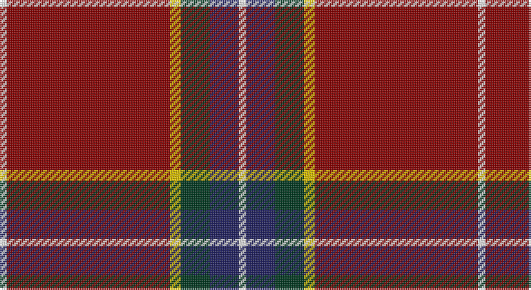

This page is one **sett** — a single exact thread-count. It belongs to the [tartan](/setts/w2r45ly3dg8db8w2/)
(the same proportion at any scale), whose colour order is pattern [WBGYRW](/stripes/wbgyrw/).

Part of the [Glencross](/tartans/glencross/) tartan — the named design grouping this sett with its other cloths.

Sourced from tartans-authority.  It is a [6 stripe tartan](/stripes/stripes6/).

Original link http://www.tartansauthority.com/tartan-ferret/display/10843/

## Also known as

This cloth is also recorded under:

- Glencross,

## Register references

External register numbers recorded for this tartan.

- Scottish Register of Tartans: [10843](https://www.tartanregister.gov.uk/tartanDetails?ref=10843)
- Scottish Tartans Authority (ITI): 10843

## Thread count
W/4 DR90 Y6 DG16 DB16 W/4

One full sett is **264 threads**.

## Palette

Palette: <strong>Tartan Register</strong>
<table><thead><tr><th>Colour</th><th>Threads</th><th>Shade</th><th>Base</th><th>OKLCh</th></tr></thead><tbody><tr><td>W/</td><td style="text-align:right;font-variant-numeric:tabular-nums">4</td><td><code style="background-color:#FCFCFC;">#FCFCFC</code> <small style="color:#888">#FCFCFC</small></td><td>W <code style="background-color:#F7F7F7;">#F7F7F7</code></td><td><small style="color:#888">oklch(99.1% 0.000 89.9)</small></td></tr><tr><td>DR</td><td style="text-align:right;font-variant-numeric:tabular-nums">90</td><td><code style="background-color:#880000;">#880000</code> <small style="color:#888">#880000</small></td><td>R <code style="background-color:#CC0000;">#CC0000</code></td><td><small style="color:#888">oklch(39.4% 0.162 29.2)</small></td></tr><tr><td>Y</td><td style="text-align:right;font-variant-numeric:tabular-nums">6</td><td><code style="background-color:#E8C000;">#E8C000</code> <small style="color:#888">#E8C000</small></td><td>Y <code style="background-color:#F2BF00;">#F2BF00</code></td><td><small style="color:#888">oklch(81.9% 0.168 93.7)</small></td></tr><tr><td>DG</td><td style="text-align:right;font-variant-numeric:tabular-nums">16</td><td><code style="background-color:#003820;">#003820</code> <small style="color:#888">#003820</small></td><td>G <code style="background-color:#006100;">#006100</code></td><td><small style="color:#888">oklch(30.0% 0.070 158.3)</small></td></tr><tr><td>DB</td><td style="text-align:right;font-variant-numeric:tabular-nums">16</td><td><code style="background-color:#202060;">#202060</code> <small style="color:#888">#202060</small></td><td>B <code style="background-color:#2A418A;">#2A418A</code></td><td><small style="color:#888">oklch(28.9% 0.111 276.9)</small></td></tr><tr><td>W/</td><td style="text-align:right;font-variant-numeric:tabular-nums">4</td><td><code style="background-color:#FCFCFC;">#FCFCFC</code> <small style="color:#888">#FCFCFC</small></td><td>W <code style="background-color:#F7F7F7;">#F7F7F7</code></td><td><small style="color:#888">oklch(99.1% 0.000 89.9)</small></td></tr></tbody></table>

# Sample pattern

## Compared to the master

This cloth is one sett of its design; the master sett (the exemplar the design is anchored on) is below for comparison.

<figure style="margin:0"><figcaption style="color:#888;font-size:smaller">this sett</figcaption></figure>
<figure style="margin:0"><figcaption style="color:#888;font-size:smaller"><a href="/setts/o3dgi13dt13lo2dg34w3/">master sett →</a></figcaption></figure>

## Nearest tartans

The nearest existing variants by ΔTartan distance, with this tartan at the top so the swatches line up against it.

ΔTartan

Tartan

Sett

—

<a href="/ttd/edit/#slug=w2r45ly3dg8db8w2~x2">Glencross (Moniaive) (Personal)</a> <a class="nn-out" href="/variants/s6/w2r45ly3dg8db8w2~x2/" title="open its dictionary page">↗</a>

1.10

<a href="/ttd/edit/#slug=r155lb16k34db48r18ly6r9&amp;base=w2r45ly3dg8db8w2~x2">Solberg-Wormald (Personal)</a> <a class="nn-out" href="/variants/s7/r155lb16k34db48r18ly6r9/" title="open its dictionary page">↗</a>

1.11

<a href="/ttd/edit/#slug=w2o45lo3dt8dg8w2~x2&amp;base=w2r45ly3dg8db8w2~x2">Glencross (Moniaive) (Personal)</a> <a class="nn-out" href="/variants/s6/w2o45lo3dt8dg8w2~x2/" title="open its dictionary page">↗</a>

1.30

<a href="/ttd/edit/#slug=r40k3r2db12r2g2r2g2ly3~x2&amp;base=w2r45ly3dg8db8w2~x2">Oliver, dress</a> <a class="nn-out" href="/variants/s9/r40k3r2db12r2g2r2g2ly3~x2/" title="open its dictionary page">↗</a>

1.34

<a href="/ttd/edit/#slug=r23k1g9r3db1lr1r1~x4&amp;base=w2r45ly3dg8db8w2~x2">Perthshire Clayquhat District Tartan</a> <a class="nn-out" href="/variants/s7/r23k1g9r3db1lr1r1~x4/" title="open its dictionary page">↗</a>

1.37

<a href="/ttd/edit/#slug=r36lb1db3ly1dg16r8db3lb5&amp;base=w2r45ly3dg8db8w2~x2">Drummond of Perth</a> <a class="nn-out" href="/variants/s8/r36lb1db3ly1dg16r8db3lb5/" title="open its dictionary page">↗</a>

1.38

<a href="/ttd/edit/#slug=r12dg6k1dg2k1dg1k6r24lr2~x2&amp;base=w2r45ly3dg8db8w2~x2">Stuart of Bute</a> <a class="nn-out" href="/variants/s9/r12dg6k1dg2k1dg1k6r24lr2~x2/" title="open its dictionary page">↗</a>

1.42

<a href="/ttd/edit/#slug=r23db2r1o2r1db2r4db10k2lo2~x2&amp;base=w2r45ly3dg8db8w2~x2">Chang-Miller (Personal)</a> <a class="nn-out" href="/variants/s10/r23db2r1o2r1db2r4db10k2lo2~x2/" title="open its dictionary page">↗</a>

1.43

<a href="/ttd/edit/#slug=r33w1k3w1g13r7k3p3w1~x2&amp;base=w2r45ly3dg8db8w2~x2">Leach, Leech, Leitch, dress</a> <a class="nn-out" href="/variants/s9/r33w1k3w1g13r7k3p3w1~x2/" title="open its dictionary page">↗</a>

1.43

<a href="/ttd/edit/#slug=dg2r26db4r2k4r2dg8r4k1r1w2~x2&amp;base=w2r45ly3dg8db8w2~x2">Stewart/Stuart of Rothesay (Sobieski)</a> <a class="nn-out" href="/variants/s11/dg2r26db4r2k4r2dg8r4k1r1w2~x2/" title="open its dictionary page">↗</a>

1.44

<a href="/ttd/edit/#slug=r18k1ly3k1lr1r3k2r2lr2~x4&amp;base=w2r45ly3dg8db8w2~x2">Anthony Plaid Red</a> <a class="nn-out" href="/variants/s9/r18k1ly3k1lr1r3k2r2lr2~x4/" title="open its dictionary page">↗</a>

## Neighbour map

Every grey dot is one of 14360 variants placed by the first two principal components of the ΔTartan feature space (44% of its variance). Red is this tartan; blue dots are its nearest — click one to open its page.

<svg viewBox="0 0 640 380" role="img" style="max-width:100%;height:auto;border:1px solid #e0e0e0;border-radius:4px;display:block" xmlns="http://www.w3.org/2000/svg"><image href="/nn/cloud.v1.png" width="640" height="380"/><a href="/variants/s7/r155lb16k34db48r18ly6r9/"><circle cx="381.1" cy="111.2" r="4" fill="#3465a4"><title>Solberg-Wormald (Personal)</title></circle></a><a href="/variants/s6/w2o45lo3dt8dg8w2~x2/"><circle cx="436.2" cy="145.3" r="4" fill="#3465a4"><title>Glencross (Moniaive) (Personal)</title></circle></a><a href="/variants/s9/r40k3r2db12r2g2r2g2ly3~x2/"><circle cx="430.4" cy="98.6" r="4" fill="#3465a4"><title>Oliver, dress</title></circle></a><a href="/variants/s7/r23k1g9r3db1lr1r1~x4/"><circle cx="463.2" cy="121.0" r="4" fill="#3465a4"><title>Perthshire Clayquhat District Tartan</title></circle></a><a href="/variants/s8/r36lb1db3ly1dg16r8db3lb5/"><circle cx="371.7" cy="93.8" r="4" fill="#3465a4"><title>Drummond of Perth</title></circle></a><a href="/variants/s9/r12dg6k1dg2k1dg1k6r24lr2~x2/"><circle cx="412.8" cy="130.0" r="4" fill="#3465a4"><title>Stuart of Bute</title></circle></a><a href="/variants/s10/r23db2r1o2r1db2r4db10k2lo2~x2/"><circle cx="369.0" cy="106.7" r="4" fill="#3465a4"><title>Chang-Miller (Personal)</title></circle></a><a href="/variants/s9/r33w1k3w1g13r7k3p3w1~x2/"><circle cx="373.7" cy="81.9" r="4" fill="#3465a4"><title>Leach, Leech, Leitch, dress</title></circle></a><a href="/variants/s11/dg2r26db4r2k4r2dg8r4k1r1w2~x2/"><circle cx="378.3" cy="87.9" r="4" fill="#3465a4"><title>Stewart/Stuart of Rothesay (Sobieski)</title></circle></a><a href="/variants/s9/r18k1ly3k1lr1r3k2r2lr2~x4/"><circle cx="440.9" cy="126.3" r="4" fill="#3465a4"><title>Anthony Plaid Red</title></circle></a><circle cx="410.1" cy="125.7" r="5" fill="#c00000"/></svg>

ID: /variants/s6/w2r45ly3dg8db8w2~x2/
