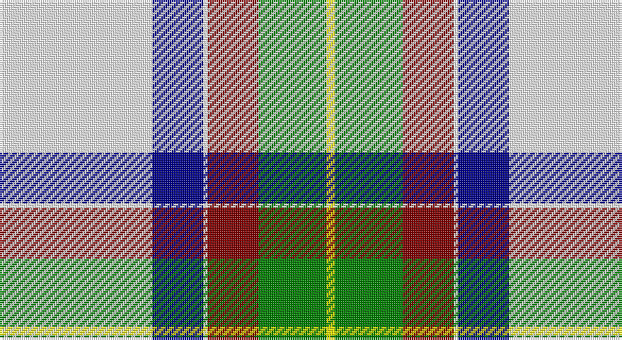

This page is one **sett** — a single exact thread-count. It belongs to the [tartan](/setts/w36db12w1r12g16ly2/)
(the same proportion at any scale), whose colour order is pattern [WBWRGY](/stripes/wbwrgy/).

Sourced from register-of-tartans.  It is a [6 stripe tartan](/stripes/stripes6/).

Original link https://www.tartanregister.gov.uk/tartanDetails.aspx?ref=10081

## Register references

External register numbers recorded for this tartan.

- Scottish Register of Tartans: [10081](https://www.tartanregister.gov.uk/tartanDetails.aspx?ref=10081)

## Thread count
W/72 DB24 W2 DR24 G32 Y/4

One full sett is **240 threads**.

## Palette

Palette: <strong>Tartan Register</strong> <small style="color:#888">(2 of 5 colours)</small>
<table><thead><tr><th>Colour</th><th>Threads</th><th>Shade</th><th>Base</th><th>OKLCh</th></tr></thead><tbody><tr><td>W/</td><td style="text-align:right;font-variant-numeric:tabular-nums">72</td><td><code style="background-color:#FFFFFF;">#FFFFFF</code> <small style="color:#888">#FFFFFF</small></td><td>W <code style="background-color:#F7F7F7;">#F7F7F7</code></td><td><small style="color:#888">oklch(100.0% 0.000 89.9)</small></td></tr><tr><td>DB</td><td style="text-align:right;font-variant-numeric:tabular-nums">24</td><td><code style="background-color:#00008B;">#00008B</code> <small style="color:#888">#00008B</small></td><td>B <code style="background-color:#2A418A;">#2A418A</code></td><td><small style="color:#888">oklch(28.8% 0.199 264.1)</small></td></tr><tr><td>W</td><td style="text-align:right;font-variant-numeric:tabular-nums">2</td><td><code style="background-color:#FFFFFF;">#FFFFFF</code> <small style="color:#888">#FFFFFF</small></td><td>W <code style="background-color:#F7F7F7;">#F7F7F7</code></td><td><small style="color:#888">oklch(100.0% 0.000 89.9)</small></td></tr><tr><td>DR</td><td style="text-align:right;font-variant-numeric:tabular-nums">24</td><td><code style="background-color:#800000;">#800000</code> <small style="color:#888">#800000</small></td><td>R <code style="background-color:#CC0000;">#CC0000</code></td><td><small style="color:#888">oklch(37.7% 0.155 29.2)</small></td></tr><tr><td>G</td><td style="text-align:right;font-variant-numeric:tabular-nums">32</td><td><code style="background-color:#008000;">#008000</code> <small style="color:#888">#008000</small></td><td>G <code style="background-color:#006100;">#006100</code></td><td><small style="color:#888">oklch(52.0% 0.177 142.5)</small></td></tr><tr><td>Y/</td><td style="text-align:right;font-variant-numeric:tabular-nums">4</td><td><code style="background-color:#FFFF00;">#FFFF00</code> <small style="color:#888">#FFFF00</small></td><td>Y <code style="background-color:#F2BF00;">#F2BF00</code></td><td><small style="color:#888">oklch(96.8% 0.211 109.8)</small></td></tr></tbody></table>

# Sample pattern

## Nearest tartans

The nearest existing variants by ΔTartan distance, with this tartan at the top so the swatches line up against it.

ΔTartan

Tartan

Sett

—

<a href="/ttd/edit/#slug=w36db12w1r12g16ly2~x2">MacNappy Tartan</a> <a class="nn-out" href="/variants/s6/w36db12w1r12g16ly2~x2/" title="open its dictionary page">↗</a>

0.89

<a href="/ttd/edit/#slug=t5k1w30dp15w8g30w8dp2~x2&amp;base=w36db12w1r12g16ly2~x2">Shaw, Miss Rebecca (Personal)</a> <a class="nn-out" href="/variants/s8/t5k1w30dp15w8g30w8dp2~x2/" title="open its dictionary page">↗</a>

1.33

<a href="/ttd/edit/#slug=w50gi15db10r2db10g8ly3~x2&amp;base=w36db12w1r12g16ly2~x2">Nimah, Carissa &amp; Bassem (Personal)</a> <a class="nn-out" href="/variants/s7/w50gi15db10r2db10g8ly3~x2/" title="open its dictionary page">↗</a>

1.52

<a href="/ttd/edit/#slug=dg4dr14dg14o6dr1w30dg2dr1~x2&amp;base=w36db12w1r12g16ly2~x2">British Columbia #2</a> <a class="nn-out" href="/variants/s8/dg4dr14dg14o6dr1w30dg2dr1~x2/" title="open its dictionary page">↗</a>

1.55

<a href="/ttd/edit/#slug=db2w14p4ly1g8db2~x2&amp;base=w36db12w1r12g16ly2~x2">Manx Laxey, dress green</a> <a class="nn-out" href="/variants/s6/db2w14p4ly1g8db2~x2/" title="open its dictionary page">↗</a>

1.55

<a href="/ttd/edit/#slug=y3g32y36o12k2w68g3k2~x2&amp;base=w36db12w1r12g16ly2~x2">Kintail Dress</a> <a class="nn-out" href="/variants/s8/y3g32y36o12k2w68g3k2~x2/" title="open its dictionary page">↗</a>

1.56

<a href="/ttd/edit/#slug=g18w55o19g20w2g20k5&amp;base=w36db12w1r12g16ly2~x2">Michigan State University</a> <a class="nn-out" href="/variants/s7/g18w55o19g20w2g20k5/" title="open its dictionary page">↗</a>

1.57

<a href="/ttd/edit/#slug=db4w1db2w18g3w1r9ly4~x4&amp;base=w36db12w1r12g16ly2~x2">Manitoba Dress (1958) (District)</a> <a class="nn-out" href="/variants/s8/db4w1db2w18g3w1r9ly4~x4/" title="open its dictionary page">↗</a>

1.58

<a href="/ttd/edit/#slug=w36lt12w1r12g16ly2~x2&amp;base=w36db12w1r12g16ly2~x2">MacNappy</a> <a class="nn-out" href="/variants/s6/w36lt12w1r12g16ly2~x2/" title="open its dictionary page">↗</a>

1.59

<a href="/ttd/edit/#slug=w14dp4ly1g8db2~x2&amp;base=w36db12w1r12g16ly2~x2">Manx Laxey Dress Green</a> <a class="nn-out" href="/variants/s5/w14dp4ly1g8db2~x2/" title="open its dictionary page">↗</a>

1.60

<a href="/ttd/edit/#slug=w8g5dp10t24w30g2lp2~x2&amp;base=w36db12w1r12g16ly2~x2">Shiel, Purple V2 (Dance)</a> <a class="nn-out" href="/variants/s7/w8g5dp10t24w30g2lp2~x2/" title="open its dictionary page">↗</a>

## Neighbour map

Every grey dot is one of 14360 variants placed by the first two principal components of the ΔTartan feature space (44% of its variance). Red is this tartan; blue dots are its nearest — click one to open its page.

<svg viewBox="0 0 640 380" role="img" style="max-width:100%;height:auto;border:1px solid #e0e0e0;border-radius:4px;display:block" xmlns="http://www.w3.org/2000/svg"><image href="/nn/cloud.v1.png" width="640" height="380"/><a href="/variants/s8/t5k1w30dp15w8g30w8dp2~x2/"><circle cx="212.7" cy="108.9" r="4" fill="#3465a4"><title>Shaw, Miss Rebecca (Personal)</title></circle></a><a href="/variants/s7/w50gi15db10r2db10g8ly3~x2/"><circle cx="218.1" cy="90.2" r="4" fill="#3465a4"><title>Nimah, Carissa &amp; Bassem (Personal)</title></circle></a><a href="/variants/s8/dg4dr14dg14o6dr1w30dg2dr1~x2/"><circle cx="214.5" cy="111.5" r="4" fill="#3465a4"><title>British Columbia #2</title></circle></a><a href="/variants/s6/db2w14p4ly1g8db2~x2/"><circle cx="186.5" cy="153.0" r="4" fill="#3465a4"><title>Manx Laxey, dress green</title></circle></a><a href="/variants/s8/y3g32y36o12k2w68g3k2~x2/"><circle cx="226.6" cy="96.4" r="4" fill="#3465a4"><title>Kintail Dress</title></circle></a><a href="/variants/s7/g18w55o19g20w2g20k5/"><circle cx="218.0" cy="145.6" r="4" fill="#3465a4"><title>Michigan State University</title></circle></a><a href="/variants/s8/db4w1db2w18g3w1r9ly4~x4/"><circle cx="211.6" cy="115.2" r="4" fill="#3465a4"><title>Manitoba Dress (1958) (District)</title></circle></a><a href="/variants/s6/w36lt12w1r12g16ly2~x2/"><circle cx="250.2" cy="126.5" r="4" fill="#3465a4"><title>MacNappy</title></circle></a><a href="/variants/s5/w14dp4ly1g8db2~x2/"><circle cx="203.4" cy="164.9" r="4" fill="#3465a4"><title>Manx Laxey Dress Green</title></circle></a><a href="/variants/s7/w8g5dp10t24w30g2lp2~x2/"><circle cx="207.7" cy="145.1" r="4" fill="#3465a4"><title>Shiel, Purple V2 (Dance)</title></circle></a><circle cx="209.9" cy="110.3" r="5" fill="#c00000"/></svg>

ID: /variants/s6/w36db12w1r12g16ly2~x2/
