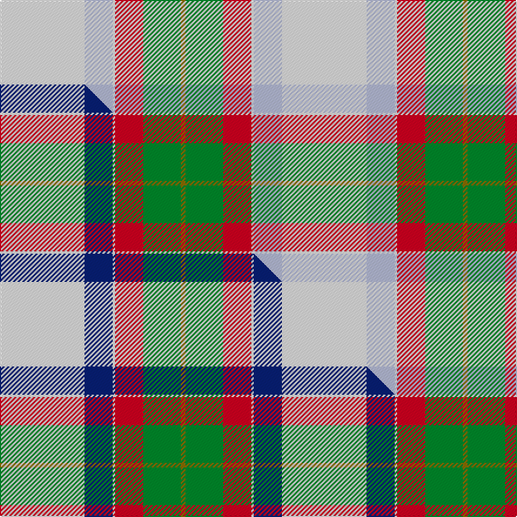

This page is one **sett** — a single exact thread-count. It belongs to the [tartan](/setts/w36lb12w1r12g16y2/)
(the same proportion at any scale), whose colour order is pattern [GGRWWW](/stripes/ggrwww/).

Part of the [MacNappy](/tartans/macnappy/) tartan — the named design grouping this sett with its other cloths.

Sourced from tartans-authority.  It is a [6 stripe tartan](/stripes/stripes6/).

Original link [https://www.tartanregister.gov.uk/tartanDetails.aspx?ref=10081](https://www.tartanregister.gov.uk/tartanDetails.aspx?ref=10081)

Dataset <small>— provenance for this record, inherited from the source manifest</small>

<dl class="dataset-prov">
<dt>source</dt><dd><a href="/sources/tartans-authority/">Scottish Tartans Authority</a></dd>
<dt>data captured from</dt><dd><a href="https://github.com/thetartan/tartan-database/blob/master/data/tartans-authority/data.csv">https://github.com/thetartan/tartan-database/blob/master/data/tartans-authority/data.csv</a></dd>
<dt>data date</dt><dd>21st Sept. 2009 <small>(this record)</small></dd>
<dt>licence</dt><dd><a href="https://creativecommons.org/licenses/by-nc-nd/4.0/">CC BY-NC-ND 4.0</a></dd>
</dl>

Capture chain <small>— the hands this data passed through, oldest first; each capture carries its own licence</small>

<ol class="capture-chain">
<li><a href="https://www.tartansauthority.com/">Scottish Tartans Authority</a> <small>the heritage body's archive — its tartan-ferret record browser is retired (links repaired to the SRT, above)</small></li>
<li><a href="https://github.com/thetartan/tartan-database">thetartan/tartan-database</a> <small>2016-2017</small> · <a href="https://creativecommons.org/licenses/by-nc-nd/4.0/">CC BY-NC-ND 4.0</a> <small>Levko Kravets's frozen compilation — the capture we vendored, and where its CC licence text came from</small></li>
<li>this dictionary <small>captured 2026-06-10 · commit 5bf86c7566</small> <small>each re-capture is a git commit to data/sources</small></li>
</ol>

## Register references

External register numbers recorded for this tartan.

- Scottish Register of Tartans: [10081](https://www.tartanregister.gov.uk/tartanDetails?ref=10081)
- Scottish Tartans Authority (ITI): 10081

## Thread count
W/72 LB24 W2 R24 G32 Y/4

One full sett is **240 threads**.

## Palette
<table><thead><tr><th>Colour</th><th>Shade</th><th>OKLCh</th></tr></thead><tbody><tr><td>LB</td><td><code style="background-color:#B5BBDE;">#B5BBDE</code> <small style="color:#888">#B5BBDE</small></td><td><small style="color:#888">oklch(79.9% 0.050 277.6)</small></td></tr><tr><td>G</td><td><code style="background-color:#008B2A;">#008B2A</code> <small style="color:#888">#008B2A</small></td><td><small style="color:#888">oklch(55.4% 0.170 145.9)</small></td></tr><tr><td>W</td><td><code style="background-color:#F7F7F7;">#F7F7F7</code> <small style="color:#888">#F7F7F7</small></td><td><small style="color:#888">oklch(97.6% 0.000 89.9)</small></td></tr><tr><td>R</td><td><code style="background-color:#D60020;">#D60020</code> <small style="color:#888">#D60020</small></td><td><small style="color:#888">oklch(55.2% 0.224 25.5)</small></td></tr><tr><td>Y</td><td><code style="background-color:#8B6E00;">#8B6E00</code> <small style="color:#888">#8B6E00</small></td><td><small style="color:#888">oklch(55.1% 0.113 90.4)</small></td></tr></tbody></table>

# Sample pattern

## Compared to the master

This cloth is one sett of its design; the master sett (the exemplar the design is anchored on) is below for comparison.

Its **ΔTartan distance** from the master is **0.13** — the same measure the nearest-tartans table ranks by (0 is identical; a re-scale of the same cloth is near 0, a recolour or a different proportion further).

<figure class="master-compare" style="margin:0">

this sett
master sett ★

<figcaption style="color:#888;font-size:smaller">One weave of this sett against the <a href="/setts/w36db12w1r12g16y2/">master sett ★</a>, split on the diagonal: a shared proportion runs seamlessly across it with only the shades shifting; a different proportion breaks on it.</figcaption>
</figure>

## Nearest tartan variants

The nearest existing variants by ΔTartan distance, with this cloth at the top so the swatches line up against it.

ΔTartan

Threads

Variant

Sett

—

240

<a href="/variants/s6/w36lb12w1r12g16y2~x2/">MacNappy</a>

<a href="/ttd/edit/#slug=w36db12w1r12g16y2~x2&amp;base=w36lb12w1r12g16y2~x2" title="compare in the TTD">0.13</a>

240

<a href="/variants/s6/w36db12w1r12g16y2~x2/">MacNappy Tartan</a>

<a href="/ttd/edit/#slug=db4w2db1w36g21y4~x2&amp;base=w36lb12w1r12g16y2~x2" title="compare in the TTD">2.02</a>

256

<a href="/variants/s6/db4w2db1w36g21y4~x2/">Skye, Green (Dance)</a>

<a href="/ttd/edit/#slug=lb52y2n24dr3dy26n4~x2&amp;base=w36lb12w1r12g16y2~x2" title="compare in the TTD">2.44</a>

332

<a href="/variants/s6/lb52y2n24dr3dy26n4~x2/">Outlander #1</a>

<a href="/ttd/edit/#slug=w8lb30g5w3db8r5&amp;base=w36lb12w1r12g16y2~x2" title="compare in the TTD">2.69</a>

105

<a href="/variants/s6/w8lb30g5w3db8r5/">Roseberry</a>

<a href="/ttd/edit/#slug=y3k1g12r7lb25k1w3~x2&amp;base=w36lb12w1r12g16y2~x2" title="compare in the TTD">2.81</a>

196

<a href="/variants/s7/y3k1g12r7lb25k1w3~x2/">Caskie</a>

<a href="/ttd/edit/#slug=r31g19lg27b1w1lo1~x2&amp;base=w36lb12w1r12g16y2~x2" title="compare in the TTD">2.83</a>

256

<a href="/variants/s6/r31g19lg27b1w1lo1~x2/">Glencross, (Solway) (Personal)</a>

<a href="/ttd/edit/#slug=db4w1db2w18g3w1r9y4~x4&amp;base=w36lb12w1r12g16y2~x2" title="compare in the TTD">2.94</a>

304

<a href="/variants/s8/db4w1db2w18g3w1r9y4~x4/">Manitoba Dress (1958) (District)</a>

<a href="/ttd/edit/#slug=lb8w16g18r2y4r1lb4~x2&amp;base=w36lb12w1r12g16y2~x2" title="compare in the TTD">3.11</a>

188

<a href="/variants/s7/lb8w16g18r2y4r1lb4~x2/">Lake Ainslie Heritage</a>

<a href="/ttd/edit/#slug=lb5k1w30dp15w8g30w8dp2~x2&amp;base=w36lb12w1r12g16y2~x2" title="compare in the TTD">3.21</a>

382

<a href="/variants/s8/lb5k1w30dp15w8g30w8dp2~x2/">Shaw, Miss Rebecca (Personal)</a>

<a href="/ttd/edit/#slug=w8b5lb10o24w30b2dg2~x2&amp;base=w36lb12w1r12g16y2~x2" title="compare in the TTD">3.35</a>

304

<a href="/variants/s7/w8b5lb10o24w30b2dg2~x2/">Shiel Magenta</a>

## Neighbour map

Every grey dot is one of 13621 variants placed by the first two principal components of the ΔTartan feature space (42% of its variance). Red is this tartan; blue dots are its nearest — click one to open its page.

<svg viewBox="0 0 640 380" role="img" style="max-width:100%;height:auto;border:1px solid #e0e0e0;border-radius:4px;display:block" xmlns="http://www.w3.org/2000/svg"><image href="/nn/cloud.v1.png" width="640" height="380"/><a href="/variants/s6/w36db12w1r12g16y2~x2/"><circle cx="232.5" cy="142.1" r="4" fill="#3465a4"><title>MacNappy Tartan</title></circle></a><a href="/variants/s6/db4w2db1w36g21y4~x2/"><circle cx="356.1" cy="156.4" r="4" fill="#3465a4"><title>Skye, Green (Dance)</title></circle></a><a href="/variants/s6/lb52y2n24dr3dy26n4~x2/"><circle cx="300.3" cy="173.1" r="4" fill="#3465a4"><title>Outlander #1</title></circle></a><a href="/variants/s6/w8lb30g5w3db8r5/"><circle cx="246.9" cy="195.5" r="4" fill="#3465a4"><title>Roseberry</title></circle></a><a href="/variants/s7/y3k1g12r7lb25k1w3~x2/"><circle cx="227.1" cy="116.9" r="4" fill="#3465a4"><title>Caskie</title></circle></a><a href="/variants/s6/r31g19lg27b1w1lo1~x2/"><circle cx="242.7" cy="143.1" r="4" fill="#3465a4"><title>Glencross, (Solway) (Personal)</title></circle></a><a href="/variants/s8/db4w1db2w18g3w1r9y4~x4/"><circle cx="220.0" cy="143.0" r="4" fill="#3465a4"><title>Manitoba Dress (1958) (District)</title></circle></a><a href="/variants/s7/lb8w16g18r2y4r1lb4~x2/"><circle cx="188.0" cy="184.7" r="4" fill="#3465a4"><title>Lake Ainslie Heritage</title></circle></a><a href="/variants/s8/lb5k1w30dp15w8g30w8dp2~x2/"><circle cx="218.8" cy="133.4" r="4" fill="#3465a4"><title>Shaw, Miss Rebecca (Personal)</title></circle></a><a href="/variants/s7/w8b5lb10o24w30b2dg2~x2/"><circle cx="252.6" cy="183.6" r="4" fill="#3465a4"><title>Shiel Magenta</title></circle></a><circle cx="262.1" cy="152.3" r="5" fill="#c00000"/><text x="320" y="376" text-anchor="middle" font-size="11" fill="#999">ground</text><text x="11" y="190" text-anchor="middle" font-size="11" fill="#999" transform="rotate(-90 11 190)">complexity</text></svg>

ID: /variants/s6/w36lb12w1r12g16y2~x2/
