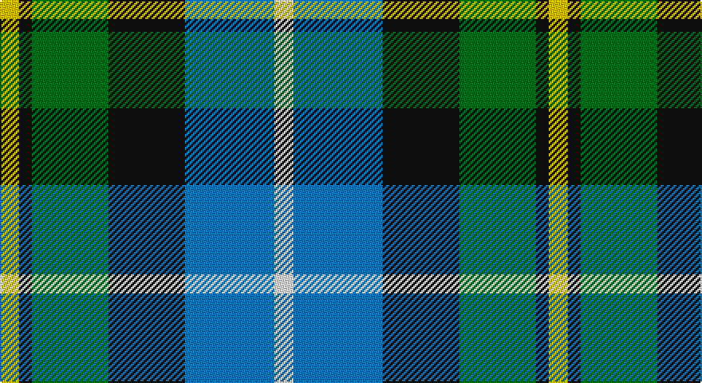

This page is one **sett** — a single exact thread-count. It belongs to the [tartan](/setts/w3b14k12g12k2ly3/)
(the same proportion at any scale), whose colour order is pattern [WBKGKY](/stripes/wbkgky/).

Part of the [Macneil of Barra](/tartans/macneil-of-barra/) tartan — the named design grouping this sett with its other cloths.

Sourced from tartans-authority.  It is a [6 stripe tartan](/stripes/stripes6/).

Original link http://www.tartansauthority.com/tartan-ferret/display/1767/

## Also known as

This cloth is also recorded under:

- MacNeil of Barra

## Register references

External register numbers recorded for this tartan.

- Scottish Tartans Authority (ITI): 1767

## Thread count
Y/12 K8 G48 K48 B56 W/12

One full sett is **344 threads**.

## Palette

Palette: <strong>Tartan Register</strong>
<table><thead><tr><th>Colour</th><th>Threads</th><th>Shade</th><th>Base</th><th>OKLCh</th></tr></thead><tbody><tr><td>Y/</td><td style="text-align:right;font-variant-numeric:tabular-nums">12</td><td><code style="background-color:#E8C000;">#E8C000</code> <small style="color:#888">#E8C000</small></td><td>Y <code style="background-color:#F2BF00;">#F2BF00</code></td><td><small style="color:#888">oklch(81.9% 0.168 93.7)</small></td></tr><tr><td>K</td><td style="text-align:right;font-variant-numeric:tabular-nums">8</td><td><code style="background-color:#101010;">#101010</code> <small style="color:#888">#101010</small></td><td>K <code style="background-color:#000000;">#000000</code></td><td><small style="color:#888">oklch(17.3% 0.000 89.9)</small></td></tr><tr><td>G</td><td style="text-align:right;font-variant-numeric:tabular-nums">48</td><td><code style="background-color:#006818;">#006818</code> <small style="color:#888">#006818</small></td><td>G <code style="background-color:#006100;">#006100</code></td><td><small style="color:#888">oklch(45.0% 0.142 145.0)</small></td></tr><tr><td>K</td><td style="text-align:right;font-variant-numeric:tabular-nums">48</td><td><code style="background-color:#101010;">#101010</code> <small style="color:#888">#101010</small></td><td>K <code style="background-color:#000000;">#000000</code></td><td><small style="color:#888">oklch(17.3% 0.000 89.9)</small></td></tr><tr><td>B</td><td style="text-align:right;font-variant-numeric:tabular-nums">56</td><td><code style="background-color:#1474B4;">#1474B4</code> <small style="color:#888">#1474B4</small></td><td>B <code style="background-color:#2A418A;">#2A418A</code></td><td><small style="color:#888">oklch(54.0% 0.129 245.1)</small></td></tr><tr><td>W/</td><td style="text-align:right;font-variant-numeric:tabular-nums">12</td><td><code style="background-color:#FCFCFC;">#FCFCFC</code> <small style="color:#888">#FCFCFC</small></td><td>W <code style="background-color:#F7F7F7;">#F7F7F7</code></td><td><small style="color:#888">oklch(99.1% 0.000 89.9)</small></td></tr></tbody></table>

# Sample pattern

## Compared to the master

This cloth is one sett of its design; the master sett (the exemplar the design is anchored on) is below for comparison.

<figure style="margin:0"><figcaption style="color:#888;font-size:smaller">this sett</figcaption></figure>
<figure style="margin:0"><figcaption style="color:#888;font-size:smaller"><a href="/setts/w1r2b16k14g15k3ly1/">master sett →</a></figcaption></figure>

## Nearest tartans

The nearest existing variants by ΔTartan distance, with this tartan at the top so the swatches line up against it.

ΔTartan

Tartan

Sett

—

<a href="/ttd/edit/#slug=w3b14k12g12k2ly3~x4">MacNeil of Barra (Clan)</a> <a class="nn-out" href="/variants/s6/w3b14k12g12k2ly3~x4/" title="open its dictionary page">↗</a>

0.79

<a href="/ttd/edit/#slug=r1db6k3g6w1~x4&amp;base=w3b14k12g12k2ly3~x4">Davidson</a> <a class="nn-out" href="/variants/s5/r1db6k3g6w1~x4/" title="open its dictionary page">↗</a>

0.89

<a href="/ttd/edit/#slug=r2db10k5g12w2~x2&amp;base=w3b14k12g12k2ly3~x4">Davidson of Tulloch</a> <a class="nn-out" href="/variants/s5/r2db10k5g12w2~x2/" title="open its dictionary page">↗</a>

0.91

<a href="/ttd/edit/#slug=w3db14k12g12k2ly3~x2&amp;base=w3b14k12g12k2ly3~x4">MacNeil 6</a> <a class="nn-out" href="/variants/s6/w3db14k12g12k2ly3~x2/" title="open its dictionary page">↗</a>

0.92

<a href="/ttd/edit/#slug=r2g8w1k8b8k1b1~x6&amp;base=w3b14k12g12k2ly3~x4">Colquhoun #2</a> <a class="nn-out" href="/variants/s7/r2g8w1k8b8k1b1~x6/" title="open its dictionary page">↗</a>

1.04

<a href="/ttd/edit/#slug=lr4g17k17db17r3db3~x2&amp;base=w3b14k12g12k2ly3~x4">Royal Highland</a> <a class="nn-out" href="/variants/s6/lr4g17k17db17r3db3~x2/" title="open its dictionary page">↗</a>

1.06

<a href="/variants/s7/k7db11ki3db11dy11g22db3~x2/">Scottish Odyssey Commemorative Tartan</a>

1.07

<a href="/ttd/edit/#slug=k6b2db12g8r5k2g3~x4&amp;base=w3b14k12g12k2ly3~x4">Cooke</a> <a class="nn-out" href="/variants/s7/k6b2db12g8r5k2g3~x4/" title="open its dictionary page">↗</a>

1.07

<a href="/ttd/edit/#slug=db1r1db6k6g6w1~x2&amp;base=w3b14k12g12k2ly3~x4">Wellington</a> <a class="nn-out" href="/variants/s6/db1r1db6k6g6w1~x2/" title="open its dictionary page">↗</a>

1.08

<a href="/ttd/edit/#slug=b2g6ly1k6db6k1db1~x2&amp;base=w3b14k12g12k2ly3~x4">Hogarth, of Firhill</a> <a class="nn-out" href="/variants/s7/b2g6ly1k6db6k1db1~x2/" title="open its dictionary page">↗</a>

1.10

<a href="/ttd/edit/#slug=g17ly2k14r2db9r2db10~x2&amp;base=w3b14k12g12k2ly3~x4">MacDonald, (Flora.. )</a> <a class="nn-out" href="/variants/s7/g17ly2k14r2db9r2db10~x2/" title="open its dictionary page">↗</a>

## Neighbour map

Every grey dot is one of 14360 variants placed by the first two principal components of the ΔTartan feature space (44% of its variance). Red is this tartan; blue dots are its nearest — click one to open its page.

<svg viewBox="0 0 640 380" role="img" style="max-width:100%;height:auto;border:1px solid #e0e0e0;border-radius:4px;display:block" xmlns="http://www.w3.org/2000/svg"><image href="/nn/cloud.v1.png" width="640" height="380"/><a href="/variants/s5/r1db6k3g6w1~x4/"><circle cx="111.0" cy="231.0" r="4" fill="#3465a4"><title>Davidson</title></circle></a><a href="/variants/s5/r2db10k5g12w2~x2/"><circle cx="119.2" cy="226.1" r="4" fill="#3465a4"><title>Davidson of Tulloch</title></circle></a><a href="/variants/s6/w3db14k12g12k2ly3~x2/"><circle cx="77.8" cy="213.5" r="4" fill="#3465a4"><title>MacNeil 6</title></circle></a><a href="/variants/s7/r2g8w1k8b8k1b1~x6/"><circle cx="125.0" cy="199.6" r="4" fill="#3465a4"><title>Colquhoun #2</title></circle></a><a href="/variants/s6/lr4g17k17db17r3db3~x2/"><circle cx="93.3" cy="225.4" r="4" fill="#3465a4"><title>Royal Highland</title></circle></a><a href="/variants/s7/k7db11ki3db11dy11g22db3~x2/"><circle cx="127.8" cy="225.1" r="4" fill="#3465a4"><title>Scottish Odyssey Commemorative Tartan</title></circle></a><a href="/variants/s7/k6b2db12g8r5k2g3~x4/"><circle cx="81.6" cy="220.6" r="4" fill="#3465a4"><title>Cooke</title></circle></a><a href="/variants/s6/db1r1db6k6g6w1~x2/"><circle cx="101.8" cy="218.5" r="4" fill="#3465a4"><title>Wellington</title></circle></a><a href="/variants/s7/b2g6ly1k6db6k1db1~x2/"><circle cx="83.1" cy="211.2" r="4" fill="#3465a4"><title>Hogarth, of Firhill</title></circle></a><a href="/variants/s7/g17ly2k14r2db9r2db10~x2/"><circle cx="116.5" cy="200.3" r="4" fill="#3465a4"><title>MacDonald, (Flora.. )</title></circle></a><circle cx="86.3" cy="216.7" r="5" fill="#c00000"/></svg>

ID: /variants/s6/w3b14k12g12k2ly3~x4/
