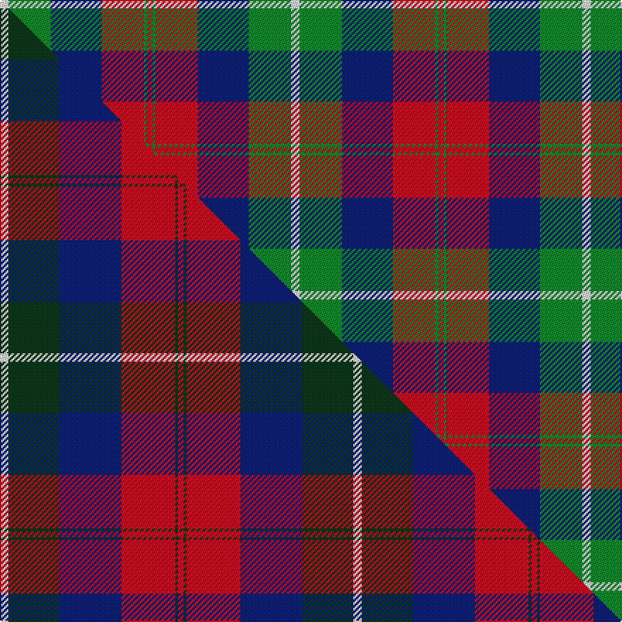

This is one **variant** — a specific cloth: this exact thread count and colourway, with its own
provenance below. It is one weaving of the [sett](/setts/w3g15db18r15g1r2/) (the scale-free proportion — the
same cloth at any scale or shade), whose colour order is pattern [RGRBGW](/stripes/rgrbgw/).

Part of the [Nibley](/tartans/n/ni/nibley/) tartan — the named design grouping this sett with its other cloths.

Sourced from weddslist.  It is a [6 stripe tartan](/stripes/stripes6/).

Original link [http://www.weddslist.com/cgi-bin/tartans/pg.pl?source=sts](http://www.weddslist.com/cgi-bin/tartans/pg.pl?source=sts)

Dataset <small>— provenance for this record, inherited from the source manifest</small>

<dl class="dataset-prov">
<dt>source</dt><dd><a href="/sources/weddslist/">Weddslist</a></dd>
<dt>data captured from</dt><dd><a href="https://github.com/thetartan/tartan-database/blob/master/data/weddslist/data.csv">https://github.com/thetartan/tartan-database/blob/master/data/weddslist/data.csv</a></dd>
<dt>data date</dt><dd>2016-11-17 <small>(dataset default)</small></dd>
<dt>licence</dt><dd><a href="https://creativecommons.org/licenses/by-nc-nd/4.0/">CC BY-NC-ND 4.0</a></dd>
</dl>

Capture chain <small>— the hands this data passed through, oldest first; each capture carries its own licence</small>

<ol class="capture-chain">
<li><a href="https://www.weddslist.com/tartans/">Weddslist</a> <small>the living privately compiled reference</small></li>
<li><a href="https://github.com/thetartan/tartan-database">thetartan/tartan-database</a> <small>2016-2017</small> · <a href="https://creativecommons.org/licenses/by-nc-nd/4.0/">CC BY-NC-ND 4.0</a> <small>Levko Kravets's frozen compilation — the capture we vendored, and where its CC licence text came from</small></li>
<li>this dictionary <small>captured 2026-06-10 · commit 5bf86c7566</small> <small>each re-capture is a git commit to data/sources</small></li>
</ol>

## Thread count
W/6 G30 DB36 R30 G2 R/4

One full sett is **206 threads**.

## Palette
<table><thead><tr><th>Colour</th><th>Shade</th><th>OKLCh</th></tr></thead><tbody><tr><td>DB</td><td><code style="background-color:#082077;">#082077</code> <small style="color:#888">#082077</small></td><td><small style="color:#888">oklch(30.0% 0.149 265.1)</small></td></tr><tr><td>G</td><td><code style="background-color:#008B2A;">#008B2A</code> <small style="color:#888">#008B2A</small></td><td><small style="color:#888">oklch(55.4% 0.170 145.9)</small></td></tr><tr><td>W</td><td><code style="background-color:#F7F7F7;">#F7F7F7</code> <small style="color:#888">#F7F7F7</small></td><td><small style="color:#888">oklch(97.6% 0.000 89.9)</small></td></tr><tr><td>R</td><td><code style="background-color:#D60020;">#D60020</code> <small style="color:#888">#D60020</small></td><td><small style="color:#888">oklch(55.2% 0.224 25.5)</small></td></tr></tbody></table>

# Sample pattern

## Compared to the master

This cloth is one sett of its design; the master sett (the exemplar the design is anchored on) is below for comparison.

Its **ΔTartan distance** from the master is **0.33** — the same measure the nearest-tartans table ranks by (0 is identical; a re-scale of the same cloth is near 0, a recolour or a different proportion further).

<figure class="master-compare" style="margin:0">

this sett
master sett ★

<figcaption style="color:#888;font-size:smaller">One weave of this sett against the <a href="/setts/w3dg18db22r19dg1r2/">master sett ★</a>, split on the diagonal: a shared proportion runs seamlessly across it with only the shades shifting; a different proportion breaks on it.</figcaption>
</figure>

## Nearest tartan variants

The nearest existing variants by ΔTartan distance, with this cloth at the top so the swatches line up against it.

ΔTartan

Threads

Variant

Sett

—

206

<a href="/variants/s6/w3g15db18r15g1r2~x2/">Nibley</a>

<a href="/ttd/edit/#slug=w3dg18db22r19dg1r2~x2&amp;base=w3g15db18r15g1r2~x2" title="compare in the TTD">0.33</a>

250

<a href="/variants/s6/w3dg18db22r19dg1r2~x2/">Nibley (Personal)</a>

<a href="/ttd/edit/#slug=w3g15db18r30g1r2~x2&amp;base=w3g15db18r15g1r2~x2" title="compare in the TTD">0.59</a>

266

<a href="/variants/s6/w3g15db18r30g1r2~x2/">Ruthven Clan Tartan</a>

<a href="/ttd/edit/#slug=w6g15db18r30g2r4~x2&amp;base=w3g15db18r15g1r2~x2" title="compare in the TTD">0.70</a>

280

<a href="/variants/s6/w6g15db18r30g2r4~x2/">Ruthven (V.S.)</a>

<a href="/ttd/edit/#slug=ri4db36r35g2r2g8w4~x2~ri2607041-r2109032&amp;base=w3g15db18r15g1r2~x2" title="compare in the TTD">1.27</a>

348

<a href="/variants/s7/ri4db36r35g2r2g8w4~x2~ri2607041-r2109032/">Cherry, John S. (Personal)</a>

<a href="/ttd/edit/#slug=lo1db14r28g14r1g14lo1~x2&amp;base=w3g15db18r15g1r2~x2" title="compare in the TTD">1.55</a>

288

<a href="/variants/s7/lo1db14r28g14r1g14lo1~x2/">Abernethy (Colerain USA) (Personal)</a>

<a href="/ttd/edit/#slug=w3g15db18r30db1r2~x2&amp;base=w3g15db18r15g1r2~x2" title="compare in the TTD">1.57</a>

266

<a href="/variants/s6/w3g15db18r30db1r2~x2/">Ruthven</a>

<a href="/ttd/edit/#slug=r10dbi6g24db24r6y3~dbi1406275-db1004274&amp;base=w3g15db18r15g1r2~x2" title="compare in the TTD">1.96</a>

133

<a href="/variants/s6/r10dbi6g24db24r6y3~dbi1406275-db1004274/">Canine All Dogs (Fashion)</a>

<a href="/ttd/edit/#slug=r12t18k1r4k1g6k2~x2&amp;base=w3g15db18r15g1r2~x2" title="compare in the TTD">1.97</a>

148

<a href="/variants/s7/r12t18k1r4k1g6k2~x2/">Confederate</a>

<a href="/ttd/edit/#slug=r12n3g5db16y2g2~x2~n1604274-db0805267&amp;base=w3g15db18r15g1r2~x2" title="compare in the TTD">1.98</a>

132

<a href="/variants/s6/r12dbi3g5db16y2g2~x2~dbi1604274-db0805267/">Dunbog, Primary School</a>

<a href="/ttd/edit/#slug=r5t3g24db24r4y2~x2~t2405244-db1406275&amp;base=w3g15db18r15g1r2~x2" title="compare in the TTD">1.99</a>

234

<a href="/variants/s6/r5t3g24db24r4y2~x2~t2405244-db1406275/">Canine All Dogs</a>

## Neighbour map

Every grey dot is one of 13621 variants placed by the first two principal components of the ΔTartan feature space (42% of its variance). Red is this tartan; blue dots are its nearest — click one to open its page. The map is a flat projection of a many-dimensional space — [how to read it](/posts/neighbourhood-maps/).

<svg viewBox="0 0 640 380" role="img" style="max-width:100%;height:auto;border:1px solid #e0e0e0;border-radius:4px;display:block" xmlns="http://www.w3.org/2000/svg"><image href="/nn/cloud.v1.png" width="640" height="380"/><a href="/variants/s6/w3dg18db22r19dg1r2~x2/"><circle cx="224.3" cy="184.0" r="4" fill="#3465a4"><title>Nibley (Personal)</title></circle></a><a href="/variants/s6/w3g15db18r30g1r2~x2/"><circle cx="284.2" cy="158.9" r="4" fill="#3465a4"><title>Ruthven Clan Tartan</title></circle></a><a href="/variants/s6/w6g15db18r30g2r4~x2/"><circle cx="238.2" cy="195.0" r="4" fill="#3465a4"><title>Ruthven (V.S.)</title></circle></a><a href="/variants/s7/ri4db36r35g2r2g8w4~x2~ri2607041-r2109032/"><circle cx="242.3" cy="145.7" r="4" fill="#3465a4"><title>Cherry, John S. (Personal)</title></circle></a><a href="/variants/s7/lo1db14r28g14r1g14lo1~x2/"><circle cx="268.6" cy="165.8" r="4" fill="#3465a4"><title>Abernethy (Colerain USA) (Personal)</title></circle></a><a href="/variants/s6/w3g15db18r30db1r2~x2/"><circle cx="287.7" cy="160.7" r="4" fill="#3465a4"><title>Ruthven</title></circle></a><a href="/variants/s6/r10dbi6g24db24r6y3~dbi1406275-db1004274/"><circle cx="163.3" cy="226.7" r="4" fill="#3465a4"><title>Canine All Dogs (Fashion)</title></circle></a><a href="/variants/s7/r12t18k1r4k1g6k2~x2/"><circle cx="224.0" cy="160.1" r="4" fill="#3465a4"><title>Confederate</title></circle></a><a href="/variants/s6/r12dbi3g5db16y2g2~x2~dbi1604274-db0805267/"><circle cx="180.9" cy="206.1" r="4" fill="#3465a4"><title>Dunbog, Primary School</title></circle></a><a href="/variants/s6/r5t3g24db24r4y2~x2~t2405244-db1406275/"><circle cx="236.4" cy="196.7" r="4" fill="#3465a4"><title>Canine All Dogs</title></circle></a><circle cx="200.2" cy="194.2" r="5" fill="#c00000"/><text x="320" y="376" text-anchor="middle" font-size="11" fill="#999">ground</text><text x="11" y="190" text-anchor="middle" font-size="11" fill="#999" transform="rotate(-90 11 190)">complexity</text></svg>

ID: /variants/s6/w3g15db18r15g1r2~x2/
