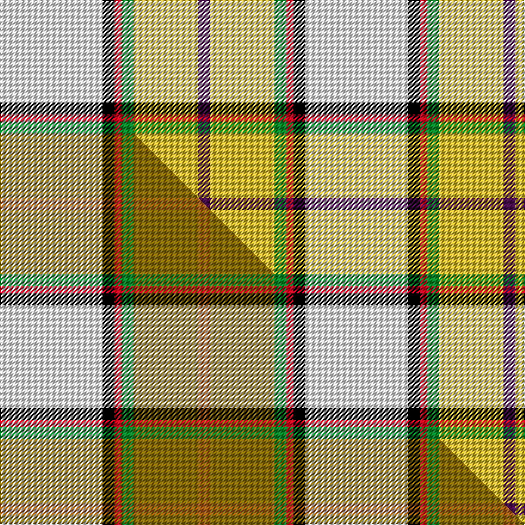

This is one **variant** — a specific cloth: this exact thread count and colourway, with its own
provenance below. It is one weaving of the [sett](/setts/w43k5r3g5ly27dp5/) (the scale-free proportion — the
same cloth at any scale or shade), whose colour order is pattern [BYGRKW](/stripes/bygrkw/).

Part of the [Reekie, Charlene](/tartans/r/re/reekie-charlene/) tartan — the named design grouping this sett with its other cloths.

Sourced from tartans-authority.  It is a [6 stripe tartan](/stripes/stripes6/).

Original link [https://www.tartanregister.gov.uk/tartanDetails.aspx?ref=10701](https://www.tartanregister.gov.uk/tartanDetails.aspx?ref=10701)

Dataset <small>— provenance for this record, inherited from the source manifest</small>

<dl class="dataset-prov">
<dt>source</dt><dd><a href="/sources/tartans-authority/">Scottish Tartans Authority</a></dd>
<dt>data captured from</dt><dd><a href="https://github.com/thetartan/tartan-database/blob/master/data/tartans-authority/data.csv">https://github.com/thetartan/tartan-database/blob/master/data/tartans-authority/data.csv</a></dd>
<dt>data date</dt><dd>09/09/2012 <small>(this record)</small></dd>
<dt>licence</dt><dd><a href="https://creativecommons.org/licenses/by-nc-nd/4.0/">CC BY-NC-ND 4.0</a></dd>
</dl>

Capture chain <small>— the hands this data passed through, oldest first; each capture carries its own licence</small>

<ol class="capture-chain">
<li><a href="https://www.tartansauthority.com/">Scottish Tartans Authority</a> <small>the heritage body's archive — its tartan-ferret record browser is retired (links repaired to the SRT, above)</small></li>
<li><a href="https://github.com/thetartan/tartan-database">thetartan/tartan-database</a> <small>2016-2017</small> · <a href="https://creativecommons.org/licenses/by-nc-nd/4.0/">CC BY-NC-ND 4.0</a> <small>Levko Kravets's frozen compilation — the capture we vendored, and where its CC licence text came from</small></li>
<li>this dictionary <small>captured 2026-06-10 · commit 5bf86c7566</small> <small>each re-capture is a git commit to data/sources</small></li>
</ol>

## Register references

External register numbers recorded for this tartan.

- Scottish Register of Tartans: [10701](https://www.tartanregister.gov.uk/tartanDetails?ref=10701)
- Scottish Tartans Authority (ITI): 10701

## Thread count
W/86 K10 R6 G10 LY54 DP/10

One full sett is **256 threads**.

## Palette
<table><thead><tr><th>Colour</th><th>Shade</th><th>OKLCh</th></tr></thead><tbody><tr><td>G</td><td><code style="background-color:#008B2A;">#008B2A</code> <small style="color:#888">#008B2A</small></td><td><small style="color:#888">oklch(55.4% 0.170 145.9)</small></td></tr><tr><td>K</td><td><code style="background-color:#000000;">#000000</code> <small style="color:#888">#000000</small></td><td><small style="color:#888">oklch(0.0% 0.000 0.0)</small></td></tr><tr><td>W</td><td><code style="background-color:#F7F7F7;">#F7F7F7</code> <small style="color:#888">#F7F7F7</small></td><td><small style="color:#888">oklch(97.6% 0.000 89.9)</small></td></tr><tr><td>DP</td><td><code style="background-color:#4B0B4F;">#4B0B4F</code> <small style="color:#888">#4B0B4F</small></td><td><small style="color:#888">oklch(30.1% 0.125 325.4)</small></td></tr><tr><td>R</td><td><code style="background-color:#D60020;">#D60020</code> <small style="color:#888">#D60020</small></td><td><small style="color:#888">oklch(55.2% 0.224 25.5)</small></td></tr><tr><td>LY</td><td><code style="background-color:#DCBC32;">#DCBC32</code> <small style="color:#888">#DCBC32</small></td><td><small style="color:#888">oklch(80.0% 0.150 95.2)</small></td></tr></tbody></table>

# Sample pattern

## Compared to the master

This cloth is one sett of its design; the master sett (the exemplar the design is anchored on) is below for comparison.

Its **ΔTartan distance** from the master is **0.40** — the same measure the nearest-tartans table ranks by (0 is identical; a re-scale of the same cloth is near 0, a recolour or a different proportion further).

<figure class="master-compare" style="margin:0">

this sett
master sett ★

<figcaption style="color:#888;font-size:smaller">One weave of this sett against the <a href="/setts/w43k5r3g5y27o5/">master sett ★</a>, split on the diagonal: a shared proportion runs seamlessly across it with only the shades shifting; a different proportion breaks on it.</figcaption>
</figure>

## Nearest tartan variants

The nearest existing variants by ΔTartan distance, with this cloth at the top so the swatches line up against it.

ΔTartan

Threads

Variant

Sett

—

256

<a href="/variants/s6/w43k5r3g5ly27dp5~x2/">Reekie, Charlene (Personal)</a>

<a href="/ttd/edit/#slug=w43k5r3g5y27o5~x2&amp;base=w43k5r3g5ly27dp5~x2" title="compare in the TTD">0.40</a>

256

<a href="/variants/s6/w43k5r3g5y27o5~x2/">Reekie, Charlene</a>

<a href="/ttd/edit/#slug=k5w2y36lb47r3~x2&amp;base=w43k5r3g5ly27dp5~x2" title="compare in the TTD">2.33</a>

356

<a href="/variants/s5/k5w2y36lb47r3~x2/">Oliver Dress Pink</a>

<a href="/ttd/edit/#slug=w18k1db4g4dp10lo2~x4&amp;base=w43k5r3g5ly27dp5~x2" title="compare in the TTD">2.47</a>

232

<a href="/variants/s6/w18k1db4g4dp10lo2~x4/">Edgar-Feyen</a>

<a href="/ttd/edit/#slug=y3k1g12r7lb25k1w3~x2&amp;base=w43k5r3g5ly27dp5~x2" title="compare in the TTD">2.65</a>

196

<a href="/variants/s7/y3k1g12r7lb25k1w3~x2/">Caskie</a>

<a href="/ttd/edit/#slug=y2r1lb16k5dp2w11dp1~x4&amp;base=w43k5r3g5ly27dp5~x2" title="compare in the TTD">2.73</a>

292

<a href="/variants/s7/y2r1lb16k5dp2w11dp1~x4/">Dignan</a>

<a href="/ttd/edit/#slug=k3r24lb16w11y1g3~x2&amp;base=w43k5r3g5ly27dp5~x2" title="compare in the TTD">3.01</a>

220

<a href="/variants/s6/k3r24lb16w11y1g3~x2/">Bro-sant-Malou</a>

<a href="/ttd/edit/#slug=k4lb4k2lb4k2lb22ly27y2r3~x2&amp;base=w43k5r3g5ly27dp5~x2" title="compare in the TTD">3.24</a>

266

<a href="/variants/s9/k4lb4k2lb4k2lb22ly27y2r3~x2/">Falkirk</a>

<a href="/ttd/edit/#slug=k3w29o9lb19k3~x2&amp;base=w43k5r3g5ly27dp5~x2" title="compare in the TTD">3.25</a>

240

<a href="/variants/s5/k3w29o9lb19k3~x2/">Islander Dress</a>

<a href="/ttd/edit/#slug=g9k2r4g14w3lp3w23g5y3~x2&amp;base=w43k5r3g5ly27dp5~x2" title="compare in the TTD">3.25</a>

240

<a href="/variants/s9/g9k2r4g14w3lp3w23g5y3~x2/">Taylor Dress Family Tartan</a>

<a href="/ttd/edit/#slug=lo13g8k5lb3w2r1~x4~lb3203246&amp;base=w43k5r3g5ly27dp5~x2" title="compare in the TTD">3.43</a>

200

<a href="/variants/s6/lo13g8k5lb3w2r1~x4~lb3203246/">Ball Hunting</a>

## Neighbour map

Every grey dot is one of 13621 variants placed by the first two principal components of the ΔTartan feature space (42% of its variance). Red is this tartan; blue dots are its nearest — click one to open its page.

<svg viewBox="0 0 640 380" role="img" style="max-width:100%;height:auto;border:1px solid #e0e0e0;border-radius:4px;display:block" xmlns="http://www.w3.org/2000/svg"><image href="/nn/cloud.v1.png" width="640" height="380"/><a href="/variants/s6/w43k5r3g5y27o5~x2/"><circle cx="195.3" cy="135.5" r="4" fill="#3465a4"><title>Reekie, Charlene</title></circle></a><a href="/variants/s5/k5w2y36lb47r3~x2/"><circle cx="291.6" cy="148.0" r="4" fill="#3465a4"><title>Oliver Dress Pink</title></circle></a><a href="/variants/s6/w18k1db4g4dp10lo2~x4/"><circle cx="167.3" cy="135.9" r="4" fill="#3465a4"><title>Edgar-Feyen</title></circle></a><a href="/variants/s7/y3k1g12r7lb25k1w3~x2/"><circle cx="227.1" cy="116.8" r="4" fill="#3465a4"><title>Caskie</title></circle></a><a href="/variants/s7/y2r1lb16k5dp2w11dp1~x4/"><circle cx="153.9" cy="130.7" r="4" fill="#3465a4"><title>Dignan</title></circle></a><a href="/variants/s6/k3r24lb16w11y1g3~x2/"><circle cx="177.4" cy="128.8" r="4" fill="#3465a4"><title>Bro-sant-Malou</title></circle></a><a href="/variants/s9/k4lb4k2lb4k2lb22ly27y2r3~x2/"><circle cx="197.2" cy="129.8" r="4" fill="#3465a4"><title>Falkirk</title></circle></a><a href="/variants/s5/k3w29o9lb19k3~x2/"><circle cx="192.2" cy="202.1" r="4" fill="#3465a4"><title>Islander Dress</title></circle></a><a href="/variants/s9/g9k2r4g14w3lp3w23g5y3~x2/"><circle cx="155.5" cy="145.7" r="4" fill="#3465a4"><title>Taylor Dress Family Tartan</title></circle></a><a href="/variants/s6/lo13g8k5lb3w2r1~x4~lb3203246/"><circle cx="121.9" cy="161.9" r="4" fill="#3465a4"><title>Ball Hunting</title></circle></a><circle cx="196.7" cy="137.2" r="5" fill="#c00000"/><text x="320" y="376" text-anchor="middle" font-size="11" fill="#999">ground</text><text x="11" y="190" text-anchor="middle" font-size="11" fill="#999" transform="rotate(-90 11 190)">complexity</text></svg>

ID: /variants/s6/w43k5r3g5ly27dp5~x2/
