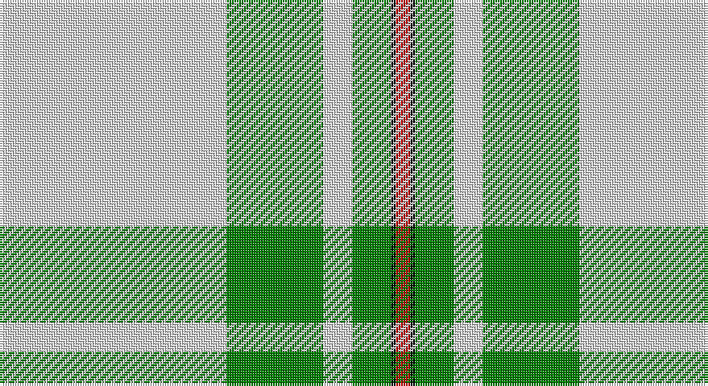

This page is one **sett** — a single exact thread-count. It belongs to the [tartan](/setts/w47g20w6g8k1r3/)
(the same proportion at any scale), whose colour order is pattern [RKGWGW](/stripes/rkgwgw/).

Part of the [MacGregor Dress](/tartans/macgregor-dress/) tartan — the named design grouping this sett with its other cloths.

Sourced from weddslist.  It is a [6 stripe tartan](/stripes/stripes6/).

Original link http://www.weddslist.com/cgi-bin/tartans/pg.pl?source=sts

## Provenance

Earliest known date: pre 1992 A dancers tartan.

## Also known as

This cloth is also recorded under:

- MacGregor
- MacGregor Dress Green
- MacGregor, Green

2 attestations — the source records this cloth was collapsed from (oldest owns this page)

<ul>
<li>undated — MacGregor, Green (weddslist, <a href="http://www.weddslist.com/cgi-bin/tartans/pg.pl?source=sts">record</a>)</li>
<li>undated — MacGregor Dress Green Clan Tartan (house-of-tartan, <a href="http://www.house-of-tartan.scotland.net/house/TartanViewjs.asp?colr=Def&tnam=1577">record</a>)</li>
</ul>

## Thread count
LN/94 G40 LN12 G16 K2 R/6

One full sett is **240 threads**.

## Palette

Palette: <strong>Tartan Register</strong> <small style="color:#888">(2 of 4 colours)</small>
<table><thead><tr><th>Colour</th><th>Threads</th><th>Shade</th><th>Base</th><th>OKLCh</th></tr></thead><tbody><tr><td>LN/</td><td style="text-align:right;font-variant-numeric:tabular-nums">94</td><td><code style="background-color:#E0E0E0;">#E0E0E0</code> <small style="color:#888">#E0E0E0</small></td><td>W <code style="background-color:#F7F7F7;">#F7F7F7</code></td><td><small style="color:#888">oklch(90.7% 0.000 89.9)</small></td></tr><tr><td>G</td><td style="text-align:right;font-variant-numeric:tabular-nums">40</td><td><code style="background-color:#008000;">#008000</code> <small style="color:#888">#008000</small></td><td>G <code style="background-color:#006100;">#006100</code></td><td><small style="color:#888">oklch(52.0% 0.177 142.5)</small></td></tr><tr><td>LN</td><td style="text-align:right;font-variant-numeric:tabular-nums">12</td><td><code style="background-color:#E0E0E0;">#E0E0E0</code> <small style="color:#888">#E0E0E0</small></td><td>W <code style="background-color:#F7F7F7;">#F7F7F7</code></td><td><small style="color:#888">oklch(90.7% 0.000 89.9)</small></td></tr><tr><td>G</td><td style="text-align:right;font-variant-numeric:tabular-nums">16</td><td><code style="background-color:#008000;">#008000</code> <small style="color:#888">#008000</small></td><td>G <code style="background-color:#006100;">#006100</code></td><td><small style="color:#888">oklch(52.0% 0.177 142.5)</small></td></tr><tr><td>K</td><td style="text-align:right;font-variant-numeric:tabular-nums">2</td><td><code style="background-color:#000000;">#000000</code> <small style="color:#888">#000000</small></td><td>K <code style="background-color:#000000;">#000000</code></td><td><small style="color:#888">oklch(0.0% 0.000 0.0)</small></td></tr><tr><td>R/</td><td style="text-align:right;font-variant-numeric:tabular-nums">6</td><td><code style="background-color:#C00000;">#C00000</code> <small style="color:#888">#C00000</small></td><td>R <code style="background-color:#CC0000;">#CC0000</code></td><td><small style="color:#888">oklch(50.7% 0.208 29.2)</small></td></tr></tbody></table>

# Sample pattern

## Compared to the master

This cloth is one sett of its design; the master sett (the exemplar the design is anchored on) is below for comparison.

<figure style="margin:0"><figcaption style="color:#888;font-size:smaller">this sett</figcaption></figure>
<figure style="margin:0"><figcaption style="color:#888;font-size:smaller"><a href="/setts/w52dg22w6dg8k1r3/">master sett →</a></figcaption></figure>

## Nearest tartans

The nearest existing variants by ΔTartan distance, with this tartan at the top so the swatches line up against it.

ΔTartan

Tartan

Sett

—

<a href="/ttd/edit/#slug=w47g20w6g8k1r3~x2">MacGregor, Green</a> <a class="nn-out" href="/variants/s6/w47g20w6g8k1r3~x2/" title="open its dictionary page">↗</a>

0.66

<a href="/ttd/edit/#slug=w52g22w6g8k1r3~x2&amp;base=w47g20w6g8k1r3~x2">MacGregor - 1975 (Dance, Green)</a> <a class="nn-out" href="/variants/s6/w52g22w6g8k1r3~x2/" title="open its dictionary page">↗</a>

0.71

<a href="/ttd/edit/#slug=w44dg18w6dg11dt1o4~x2&amp;base=w47g20w6g8k1r3~x2">Westfalia Dress (Corporate)</a> <a class="nn-out" href="/variants/s6/w44dg18w6dg11dt1o4~x2/" title="open its dictionary page">↗</a>

0.86

<a href="/ttd/edit/#slug=w52dg22w6dg8k1r3~x2&amp;base=w47g20w6g8k1r3~x2">MacGregor Dress Green (Dance)</a> <a class="nn-out" href="/variants/s6/w52dg22w6dg8k1r3~x2/" title="open its dictionary page">↗</a>

1.05

<a href="/ttd/edit/#slug=n4w2n1w36g21ly4~x2&amp;base=w47g20w6g8k1r3~x2">Skye, Green (Dance)</a> <a class="nn-out" href="/variants/s6/n4w2n1w36g21ly4~x2/" title="open its dictionary page">↗</a>

1.35

<a href="/ttd/edit/#slug=dg44w18dg6w11dt1o4~x2&amp;base=w47g20w6g8k1r3~x2">Westfalia (Corporate)</a> <a class="nn-out" href="/variants/s6/dg44w18dg6w11dt1o4~x2/" title="open its dictionary page">↗</a>

1.83

<a href="/ttd/edit/#slug=w54k7r7lo6ly4r1~x2&amp;base=w47g20w6g8k1r3~x2">Young, Christina</a> <a class="nn-out" href="/variants/s6/w54k7r7lo6ly4r1~x2/" title="open its dictionary page">↗</a>

1.97

<a href="/ttd/edit/#slug=w40ly4o10w8db4o4db4o4g1~x2&amp;base=w47g20w6g8k1r3~x2">Boucherville Formal District Tartan</a> <a class="nn-out" href="/variants/s9/w40ly4o10w8db4o4db4o4g1~x2/" title="open its dictionary page">↗</a>

1.97

<a href="/ttd/edit/#slug=r2w2k2w28k8w9k1ly2~x2&amp;base=w47g20w6g8k1r3~x2">Summer Spirit (Fashion)</a> <a class="nn-out" href="/variants/s8/r2w2k2w28k8w9k1ly2~x2/" title="open its dictionary page">↗</a>

1.98

<a href="/ttd/edit/#slug=g42ly1w2ly1g5dg12w32g4~x2&amp;base=w47g20w6g8k1r3~x2">Longniddry Green Error (Dance)</a> <a class="nn-out" href="/variants/s8/g42ly1w2ly1g5dg12w32g4~x2/" title="open its dictionary page">↗</a>

2.01

<a href="/ttd/edit/#slug=w50k1r12w1g12r13w1r2~x2&amp;base=w47g20w6g8k1r3~x2">Unidentified, Blanket</a> <a class="nn-out" href="/variants/s8/w50k1r12w1g12r13w1r2~x2/" title="open its dictionary page">↗</a>

## Neighbour map

Every grey dot is one of 14360 variants placed by the first two principal components of the ΔTartan feature space (44% of its variance). Red is this tartan; blue dots are its nearest — click one to open its page.

<svg viewBox="0 0 640 380" role="img" style="max-width:100%;height:auto;border:1px solid #e0e0e0;border-radius:4px;display:block" xmlns="http://www.w3.org/2000/svg"><image href="/nn/cloud.v1.png" width="640" height="380"/><a href="/variants/s6/w52g22w6g8k1r3~x2/"><circle cx="387.1" cy="102.3" r="4" fill="#3465a4"><title>MacGregor - 1975 (Dance, Green)</title></circle></a><a href="/variants/s6/w44dg18w6dg11dt1o4~x2/"><circle cx="357.9" cy="115.8" r="4" fill="#3465a4"><title>Westfalia Dress (Corporate)</title></circle></a><a href="/variants/s6/w52dg22w6dg8k1r3~x2/"><circle cx="383.3" cy="100.8" r="4" fill="#3465a4"><title>MacGregor Dress Green (Dance)</title></circle></a><a href="/variants/s6/n4w2n1w36g21ly4~x2/"><circle cx="335.6" cy="121.2" r="4" fill="#3465a4"><title>Skye, Green (Dance)</title></circle></a><a href="/variants/s6/dg44w18dg6w11dt1o4~x2/"><circle cx="361.5" cy="127.7" r="4" fill="#3465a4"><title>Westfalia (Corporate)</title></circle></a><a href="/variants/s6/w54k7r7lo6ly4r1~x2/"><circle cx="414.3" cy="72.0" r="4" fill="#3465a4"><title>Young, Christina</title></circle></a><a href="/variants/s9/w40ly4o10w8db4o4db4o4g1~x2/"><circle cx="363.2" cy="81.6" r="4" fill="#3465a4"><title>Boucherville Formal District Tartan</title></circle></a><a href="/variants/s8/r2w2k2w28k8w9k1ly2~x2/"><circle cx="412.5" cy="97.2" r="4" fill="#3465a4"><title>Summer Spirit (Fashion)</title></circle></a><a href="/variants/s8/g42ly1w2ly1g5dg12w32g4~x2/"><circle cx="302.8" cy="103.9" r="4" fill="#3465a4"><title>Longniddry Green Error (Dance)</title></circle></a><a href="/variants/s8/w50k1r12w1g12r13w1r2~x2/"><circle cx="362.4" cy="76.7" r="4" fill="#3465a4"><title>Unidentified, Blanket</title></circle></a><circle cx="395.1" cy="116.2" r="5" fill="#c00000"/></svg>

ID: /variants/s6/w47g20w6g8k1r3~x2/
